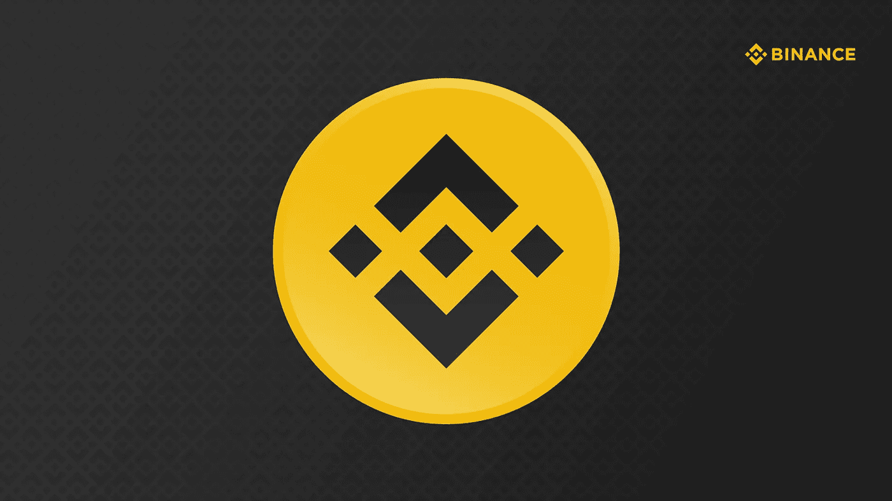
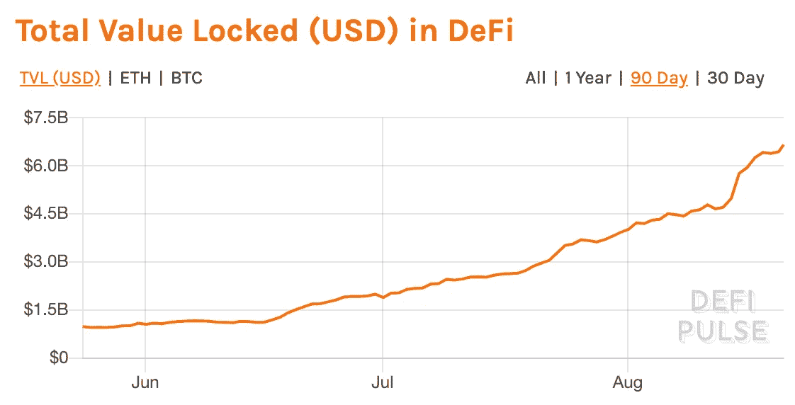
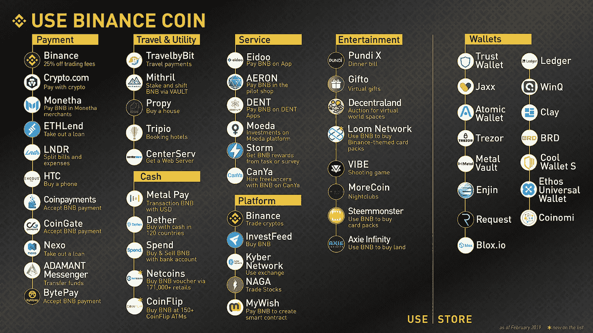

# 为什么币安硬币是最被低估的硬币

> 原文：<https://medium.datadriveninvestor.com/why-binance-coin-is-the-most-undervalued-de-fi-token-34b4d2634541?source=collection_archive---------2----------------------->

如果 2017 年是 ICO 年——尽管加密货币熊市广泛存在——近年来的特点是分散金融令牌的兴起。

新代币承诺通过引导从当前的集中系统到真正分散的替代系统的**范式转变，彻底改革金融部门。 **De-Fi** apps 正在努力再造一个**金融** **系统**，它是**不可信的**、**去中心化的**、以及**任何人都能访问的**。由于其固有的特点，区块链技术本身就是实现这一目标的完美工具。**

通常情况下，术语 *De-Fi* 指的是**建立在以太坊基础上的数字资产、智能合约和去中心化应用(DApps)。**

最初，**以太坊**作为世界上最受欢迎的**可编程** **区块链**与区块链的其他项目区分开来。*图灵完全编程语言*允许以太坊支持**智能合约**的创建:当它们遵循编码的指令时，可以自动结算和管理自己的合约。因此，开发人员能够在所谓的**分散应用程序(DApps)上创建、存储和管理数字资产。**

 [## 稳定币会危及比特币在加密领域的地位吗？数据驱动的投资者

### Stablecoin 是一种加密货币，主要用于维持稳定的市场价值。它可以通过…

www.datadriveninvestor.com](https://www.datadriveninvestor.com/2020/06/08/can-a-stablecoin-jeopardize-the-position-of-bitcoin-in-the-crypto-space/) 

随之而来的是，从那以后大多数的 **ICOs** 和 De- **Fi** 代币都是在**以太坊**上**开发**的。以*以太坊*为基础的和制造商 DAO、Sunthetix 和 Compound 是迄今为止最知名的去伪代币的例子，它们在价值锁定方面迅速增长，并成为去伪领域的**领跑者**。通过不同的机制，他们允许用户通过锁定他们持有的加密货币来获得贷款。所有这些都是在不需要中央机构的情况下完成的，保证了更高的回报、更低的交易对手风险以及更好的资本和抵押品分配。

截至今日，**65 亿美元被锁定在 De-Fi 代币中，其中大部分是知名项目，如*制作人道*(占总额的 21%，即 14 亿美元)和 *Synthetix* (约 9 亿美元)——**均基于以太坊**。**

**目前，**以太坊**由于其功能和特点，事实上是大多数 De-Fi 项目选择的基础设施。尽管如此，竞争优势是以太正在被有趣的现实慢慢赶上，这些现实正在努力在这个空间中找到自己的位置。一个这样的现实是币安。曾经只是一个交易所的东西，如今正变成一个包罗万象的海怪，它的触角很快将伸向区块链空间的每一个领域。**

****

**Defi Pulse — [https://defipulse.com/](https://defipulse.com/)**

# **退市失败者:币安硬币**

****币安币(BNB)** 是币安生态系统中使用的货币，是全球交易量最高的加密货币交易所。它最初成立于 2017 年 7 月，在不到 4 个月的时间里成为排名第一的交易所。**

**最初，BNB 的角色是在平台上支付交易费用。为了鼓励用户购买它们，他们将获得与 BNB 支付费用的 25%折扣。**

**最终，币安继续扩张，变得不仅仅是一个中央加密货币交易所。**如今，币安还包括:****

1.  **币安学院:关于区块链和加密货币的教育；**
2.  **币安经纪人:交易的终端解决方案:**
3.  **币安慈善会；**
4.  **币安云:企业交换解决方案；**
5.  **币安 DEX:数字资产的分散交易所；**
6.  **币安实验室:区块链项目的孵化器:**
7.  **币安发射台:推出代币的平台；**
8.  **币安研究:关于区块链空间发展的分析和报告；**
9.  **信任钱包:一种加密货币钱包。**

**随着币安生态系统的不断发展，这将反映出 BNB 令牌未来更广泛的应用。**

# **为什么 BNB 可以被认为是一个反法西斯的象征？**

**就在最近，在币安生态系统引入去中心化甲骨文之后，币安首席执行官 **CZ** 在推特上挑战 BNB 不是去中心化令牌的说法:**

**8 月 20 日，币安推出了 [BNB De-Fi staking](https://www.binance.com/en/support/articles/32f889b8dacd42e28dc16d035ad8f35e) ，允许用户押注他们的 BNB 代币，以获得高达 25%的年化收益。**

**根据**卡瓦实验室的说法，**一个去伪存真项目:**

> ****所有流通 BNB 的 1%现在锁定在去 Fi，** 挑战 BNB 不是去 Fi 令牌的传统叙事。**

**批评来自于这样一个事实:BNB 是一个由中央加密货币交易所创造的代币，违背了去中心化的原则。**

**然而，CZ 一直直言不讳地表达他对加密货币行业未来发展的看法，因为他不认为集中式交易所是必不可少的:**

> **今天，大多数用户仍然选择集中式交换，因为处理电子邮件和密码以及获得客户支持比备份自己的密钥容易得多，如果丢失了就麻烦了。我确实认为，从图中可以看出，如果我们能够让安全备份变得更加简单和可用，我认为 DEX 将会是未来的发展方向。因此，我们将继续投资于 DEX，并组建多个项目。目前，从用户数量来看，集中式交易所更受欢迎，我们只想提供人们使用的产品。"**

**与此同时，他并不认为币安仅仅是一个加密货币交易所，而是如其名称所示，是金融领域的**范式转变**。目前，BNB 仍然是一个集中交易所的象征，但当前和未来的发展正在为一个更分散的架构和 BNB 更广泛的作用铺平道路。**

****综上所述，BNB 可以被认为是一个非正统的象征，因为:****

1.  **它被用于引入**分散** **贷款**和**入股**，类似于其他 De-Fi 项目，如创客道或大院；**
2.  ****供应量**相对**封顶**和币安季刊**烧掉** BNB 代币，视交易活跃度而定，直到总供应量的 50%才会烧掉(2 亿)；**
3.  **基于 BNB 的去伪存真产品可以**高度** **普及**，因为它们可以利用**交易所的现有用户基础**；**
4.  **虽然其他去伪存真的公司有一个真正具体的价值主张，BNB 令牌的性质和币安生态系统内的动态发展允许提供广泛的不同服务；**
5.  **币安虚拟机允许**执行智能合约，**类似以太坊；**
6.  **币安开发的伙伴关系生态系统也意味着 BNB 令牌被其他项目接受，如下图所示。**

****

**Binance.com — Use cases for BNB (Updated February 2019)**

## **结论**

**去伪存真是一个新领域，因此区块链空间正在冒险进入未知领域。大多数开创性的项目可能会失败，因为与该领域的新颖性相关的困难——就像任何其他技术一样。**

**虽然以太坊被广泛认为是推出代币和建设 De-Fi 项目的最友好的建筑，但**币安正在慢慢赶上。****

**成立于 2017 年的中国小型交易所如今已经是区块链的庞然大物，堪比加密货币的**【谷歌】** **(邪恶感较小)。凭借全球影响力和已经提供的广泛服务，币安将自己定位为这个领域的关键角色。他们有一个正常运行的产品，拥有其他交易所中最大的用户群，以及必要的技术和金融框架来利用他们的代币发行、管理和结算金融产品。****

**BNB 的赌注只是第一步，还会有更多，将 BNB 定位为一个有趣的虚拟现实，值得密切关注。**

****访问专家视图—** [**订阅 DDI 英特尔**](https://datadriveninvestor.com/ddi-intel)**