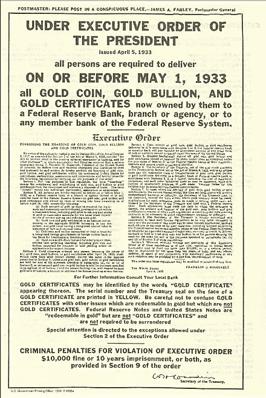

# 为什么比特币可能在未来几年被禁止或定罪

> 原文：<https://medium.datadriveninvestor.com/why-bitcoin-could-be-banned-or-criminalized-in-the-coming-years-278b46b9fe86?source=collection_archive---------0----------------------->

## 新系统

## 货币体系的变化可能会成为密码迷的一个大问题

Photo by [Kev Seto](https://unsplash.com/@kevseto?utm_source=unsplash&utm_medium=referral&utm_content=creditCopyText) on [Unsplash](https://unsplash.com/s/photos/escape?utm_source=unsplash&utm_medium=referral&utm_content=creditCopyText)

任何美国人都不知道从 1934 年到 1974 年在美国拥有黄金是非法的。美国正处于始于 1929 年的大萧条的深渊，政府和银行需要支撑其金融稳健性。黄金被国有化了。1933 年 4 月 5 日，罗斯福*(见下面的剪报)*发布了第 6102 号行政命令，要求美国人以每盎司 20.67 美元的价格报告并上交他们的金条、证书和硬币。美国人被允许携带黄金首饰，以及价值不超过 100 美元的黄金。那些试图秘密藏匿大量黄金而逍遥法外的人遭到了起诉。

我提出这一点是为了提醒你我们正在打交道的政府，以及他们在困难时期采取的行动。如你所知，2020 年我们已经进入了第二次大萧条。

现在历史课结束了，让我们讨论一下眼前的问题。下面我提供了我的案例，来说明为什么我认为比特币和加密技术在未来几年可能会被禁止，或者至少被禁止使用。

我完全理解比特币运行在一个全球性的、去中心化的系统上，只要互联网正常运行，就没有任何政府或个人能够控制它。

## 央行的观点

对于所有被追踪的数据来说，今天的经济对美联储银行来说可能是一个黑匣子。他们投入资金，并希望它像他们预期的那样运作，但没有确定性。他们的言论和行动表明，尽管他们可以对市场产生积极影响，但他们实际上对提振我们生活和工作的实体经济无能为力。美联储必须依靠银行放贷，但除了信誉最好的银行，没有人在借钱。

全球金融体系正在发生巨大变化。这些变化是为了现代化和效率，最终是为了让央行和政府更好地洞察和控制经济。

美联储通过控制通货膨胀来减少政府债务。然而，美联储近年来在刺激经济通胀方面遇到了很大困难，这在很大程度上是由于技术和自动化的自然通缩效应。

在我们更好地理解*美联储在做什么*以及*他们为什么要做*之前，很难想象禁止加密会成为现实。这正是我下面要解释的。

## 工具用完了

重要的是要明白，美联储已经退出了传统工具(利率、银行准备金要求)，而 QE(量化宽松)已经是一种试图刺激经济的实验性方法。

联邦基金利率已经是 0%。

*商业银行准备金要求——他们必须持有多少现金来支持贷款——在疫情之后已经不复存在；他们处于零。*

2008 年危机后，美联储使用 QE 取得了令人质疑的成功，现在又在 2020 年进行了数十亿美元的公开市场操作*以试图支撑股票市场。除此之外，还有直接刺激，它们是当前框架内的**淘汰工具**。*

## CBDC 来了

在地平线上，我们有 CBDC——中央银行数字货币，这将是美联储修补经济的一个很有前途的新工具。

在这里，我将只涉及 CBDC 的重要的、可应用的方面，但是你可以阅读我的其他文章来获得关于 CBDC 的更详细的信息。

你需要了解的关于以美联储为基础的 CBDC 的能力归结为**数据**和**控制**。拥有大量数据是经济学家的梦想，美联储拥有这些数据意味着经济对他们来说不再是一个黑匣子。

CBDC 让美联储能够看到详细的支出(和储蓄)数据。这意味着他们可以鸟瞰经济的哪些领域正在遭受损失，哪些领域表现良好。

经济的一个方面逃脱了美联储的控制，那就是货币流通速度。这一点意义重大，我将在下面详细解释。

## 经济增长

当我们谈论 GDP 增长或萎缩时，我们谈论的是衡量美国经济增长的主要指标。对于我们这些公民消费者来说，你需要理解的是什么有助于增长，什么没有。

**花钱** —购买产品和服务有助于增长。

不管是在银行里还是在银行外，存钱都无助于成长，尽管它会让你成为一个负责任的人。

**贷款**和**新增债务**促进经济增长。

偿还债务无助于经济增长。事实上，这比储蓄更糟糕，因为债务偿还抵消了那部分货币供应，这直接与美联储努力追求的通货膨胀背道而驰。

既然你已经从央行和经济学家的角度理解了自己在经济中的角色，那么让我们来看看 CBDC 承诺给美联储提供什么，这是我们应该真正关心的问题。

## 更多控制

CBDC 将是一个“闭环”系统，就像今天其他形式的全数字货币和等价物一样。例如，你可以用某家公司的加油卡来支付油费，从而获得折扣；你可能已经收到了只能用于特定项目的信用卡“积分”,或者有限制日期和其他限制的航空里程。在这样的闭环货币体系中，有着巨大的控制力。

至于 CBDC 将会实现什么，我认为一开始没什么好质疑的。毕竟，即使现金仍然可用，他们也需要消费者使用它，因此可能会向我们提供激励措施，比如获得利息，或者用 CBDC 支付的折扣。

然而，这将是一个过渡；最终目标是摆脱实物现金，让每个人都锁定国家数字货币。

CBDC 将是一种可编程的货币，因此在嵌入货币本身的规则方面更加灵活。正如我提到的，美联储没有对货币流通速度施加影响。货币流通速度就是货币转手的频率。举例来说，当你存钱时，它停止转手，但他们希望你花钱，他们可能希望你把钱花在某些需要增长的经济领域。

国际货币基金组织、国际清算银行、多家美联储银行(按城市)以及许多对政府和银行业有影响力的机构在关于 CBDC 的多份白皮书和研究论文中讨论了以下控制措施:

*   使用现金的折扣；
*   对“不合理的高”储蓄设置上限；
*   CBDC 基金的到期日；
*   限制 CBDC 的消费；
*   负利率。

就比特币和加密货币的未来而言，后两者尤其值得注意。

负利率听起来确实如此。你们中的一些人可能太年轻了，但一些读者会记得不久前你的银行会支付你存款的 5%，10%或更多。时代变了，今天你能获得 0.75%就很幸运了——实际上你可能只能获得 0.01%。

但情况可能会更糟。在欧洲央行已经实行负利率的德国和其他欧洲国家，消费者正在用他们的各种储蓄工具*支付*钱，这确实很能说明整体经济的可感知稳定性。这将降临到美国。

至少自 2015 年*以来，围绕美国央行将利率降至零以下的能力，已经有了大量的讨论和文献。国际货币基金组织有一整篇论文致力于这个“零下限”，其中“附录 A”为银行提供了一个从实物现金过渡到其他方式的可能路线图。*

以下是前国际货币基金组织首席经济学家、现就职于哈佛大学的肯·罗格夫(Ken Rogoff)的一段话:

> “然而，拿走现金，或者让囤积的成本足够高，央行就可以自由地将利率推至严重衰退所需的负区间。”

如果美联储可以让你数字钱包里的数字 CBDC 货币过期，如果他们可以对你的账户设置最大储蓄限额，如果你的钱将由于负利率而慢慢腐烂——这使你向银行支付保持你的钱“安全”的“特权”——*他们肯定会开始控制货币流通速度*，这是他们**强烈**想要做的。

## 替代方法

那又怎样？我只是不会用 CBDC，我会用好的美元来代替。那会工作得很好——直到你不能。阻止实际负利率的主要障碍是实物现金的存在。

美联储和政府可以告诉我们，转移到 CBDC 将是更快的刺激，可能是未来的 UBI(普遍基本收入),但我可以告诉你，最重要的主题和压倒性的重点是将利率降到零以下作为刺激通胀的工具。这是 CBDC 的首要目标。

## 输入加密

现在，在长期全球经济愿景的背景下，我们可以开始看到并欣赏加密货币的美丽和威胁。全球 80%的央行都在致力于自己的 CBDC。

加密货币提供了系统的一种方式。即使发明比特币的目的不是为了威胁某个国家的货币主权，但它肯定会成为一种威胁——如果不是这样，那么它就没有按照预期发挥作用。

毕竟，如果没有更多的实物现金，并且你厌倦了银行由于负利率而从你的账户中取钱，试图控制你花在什么地方，以及你需要花多快，比特币和其他加密货币似乎是逃离这种专横控制的唯一合乎逻辑的选择。

> 这才是比特币与国家发生碰撞的点。

## 比特币、黄金和逃离

这将不是匿名的问题。如今对 crypto 的监管将确保交易所至少知道你是谁，你在做什么。

这将是一个事实，就像 1934 年美国公民的黄金被拿走一样，他们希望每个人都在这个系统中，尤其是在经济困难时期。如果美国经济的情况没有突然大幅改善，如果通胀对美联储来说仍然难以捉摸，我们正在走向 1934 年式的时刻。

黄金和比特币都很特殊，因为它们没有交易对手风险。假设你随身带着实物黄金，假设你有一个单独的加密钱包，那么你就有效地免受了金融危机的影响。

当时，黄金的价格是每盎司 20.67 美元，所以普通人也能买得起。今天一盎司黄金的价格接近 2000 美元，即使你可以购买更少的数量，也不难认为今天的比特币甚至比 1934 年前的黄金更容易获得。你可以在网上数千家交易所中的任何一家购买价值几美元的比特币，如果你持有自己的私钥，世界上就不会有资产负债表包含与你的资产相反的负债。

记住，CBDC 有能力控制用它能买到什么。如果你曾经试图用信用卡购买任何加密货币，你已经知道会发生什么；交易被拒绝。**事情有代码，就是这么简单。**政府可能会允许我们愉快地继续使用加密货币，直到我们发现 CBDC 不在加密交易所工作的那一天。

我假设在央行和政府中有比我更聪明的人，但我真的希望我没有给他们任何想法，因为我确信他们已经考虑清楚了。

## 不管喜不喜欢，我们都是一伙的

将来，当你得到刺激、UBI 或其他每月津贴时，他们会希望你花掉它。他们 *不能允许发生的一件事*就是你可以简单地购买一些比特币或其他加密货币，摆脱他们所有繁琐的规则。总的来说，这就是为什么我个人认为他们会试图禁止加密货币，或者至少在 CBDC 制定规则，防止购买、交换或出售加密资产。**他们会阻止你使用一种不可触及的、替代性的储值方式——即使是暂时的。**

像加密资产国有化这样的事情不是不可能的，因为特勤局和国税局已经与比特币基地合作，交易所已经掌握了你的加密钱包密钥。无论这些资产是否会被国有化、没收或以其他方式禁止，我相信它们的未来都是个问题。

我的希望是，如果我们失去了现金的自由，我们不会对国家的力量或者国家数字货币的能力一无所知。从今天的消费者角度来看，它似乎正在成为一个更欢迎加密的环境，然而与此同时，司法部(DOJ)最近在 10 月份发布的加密框架包含了对这种替代货币系统的某种程度的敌意。

我知道上面有一些假设——我们将搬到 above 现金会消失。这些规则将被强加于 CBDC，这些规则将抑制储蓄，甚至侵犯我们在如何和何时消费方面的自由。我只能告诉你，我研究 CBDC，研究货币和银行体系已经很多年了。

由于我们可能正在接近当前法定货币体系的终结，我强烈认为所有这些事情都将到来——我认为其中一些将比你准备好的更快地开始出现。

希望我是错的。

要了解当今世界发生的更多变化，请查看以下文章:

 [## 美国需要的革命

### 这是对意识的呼唤，在此之后，我们必须找到可行的方法来建立这种意识。但是我们甚至不能…

link.medium.com](https://link.medium.com/kDU0QaLn8cb)  [## 你准备好应对实时通胀了吗？

### 美联储的下一步行动是直接从你的钱包里拿钱

medium.com](https://medium.com/datadriveninvestor/are-you-ready-for-real-time-inflation-aba9f62e9d6)  [## 世界已经厌倦了美国的金融控制

### 在下一次布雷顿森林会议上，我们没有保证

medium.com](https://medium.com/datadriveninvestor/the-world-has-grown-weary-of-us-financial-control-7c909f48987a)  [## 人们不明白监管加密意味着什么吗？

### 你将失去匿名权——句号。

medium.com](https://medium.com/swlh/do-people-not-understand-what-regulating-crypto-will-mean-efaa4c4955e9)