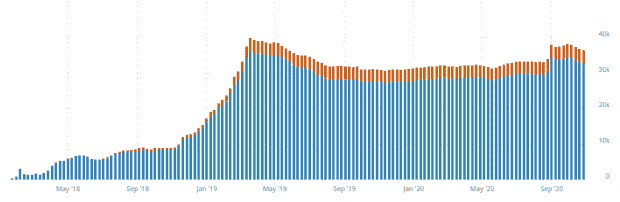

# 比特币为何称霸排行榜？

> 原文：<https://medium.datadriveninvestor.com/why-bitcoin-dominates-the-charts-18ca80fc36fe?source=collection_archive---------7----------------------->

数字是伟大的东西:它们让世界变得可测量、可计算。因此，我们今天向密码市场展示了我们能找到的最激动人心的数字和图表。

我们必须谈论的第一个数字，自然是价格。最后，我们谈谈钱。价格的通用指标是总市值。

The total market capitalization of all cryptocurrencies according to Coinmarketcap

市值是一个来自股票市场的术语。它的意思是股价乘以股价，计算出所有股票加在一起的价值。加密的总市值加上所有已知加密货币的市值，作为整个加密市场价值的指标。

市值现在经历了一个牛市，已飙升至近 4000 亿美元，为 2018 年春季以来的最高水平。在过去的七天里，人们的幻想破灭了，价格开始横向波动。然而，抱怨这一点就是在高层次上抱怨。不是吗？

仔细观察会发现这个数字背后的更多东西。因为对于比特币来说，它根本没有横向移动:迄今为止仍然是最重要的加密货币的路线进一步上升，并触及 1.4 万美元的门槛。

The Bitcoin price since 2013 according to Coinmarketcap.com

这是耸人听闻的，因为它在 2018 年 1 月最后一次如此之高。最终，在 2017 年 12 月到 2018 年 1 月中旬之间只出现过一次短暂的插曲，当时比特币价格比今天高。如果这个时间段持续到今天，只有在这个时间段投资的人才会亏损。

比特币或多或少已经悄无声息地达到了历史新高。

# 比特币顶级 Altcoin 翻牌

但如果在整个市场都在横盘整理的时候，比特币没有横盘整理而是向上，那就说明了这一点！顶级加密货币的历程给出了一幅相当清晰的画面:

The Top 14 Coins: Everything deep red except Bitcoin. After Coinmarketcap.

比特币上涨，而所有其他加密货币——实际上除了稳定币之外——在过去七天里明显下跌。它冲向备用硬币，因此根本不是横向的，而是向下的。

 [## 比特币与替代硬币——为什么投资组合中大多数人更喜欢 BTC

### 比特币比所有 Altcoins 都有明显优势。

medium.com](https://medium.com/datadriveninvestor/bitcoin-about-altcoins-why-most-prefer-btc-in-the-portfolio-b879bf585b5e) 

这自然会影响优势指标——只要你认真对待它。主导指标衡量比特币的市值占总市值的百分比。在过去的七天里，这一数值从 62%上升到不到 65%。从图表上看，这并无恶意，但这几乎是一周以来市场的一次结构性转变。

比特币优势指数。这条线看起来无害，但在一周内从 62.2%上升到几乎 65%。Source 同样 Coinmarketcap。我们在其他数字中也能看到这个比例吗？

# 交易和闪电

如果从日交易笔数来看，比特币似乎排在以太坊、Ripple、比特币 SV 之后。这些比率在过去几个月中保持相对稳定。

The number of transactions of different cryptocurrencies does not show that Bitcoin is by far the most important. Source: [BitInfoCharts.com](http://BitInfoCharts.com)

对于比特币，最大交易次数受到大约 1.5 兆字节的块大小限制。任何超出这个范围的东西都应该通过“第二层”，比如闪电网络。然而，现在我们几乎没有证据表明比特币已经形成规模。但至少照明网络在过去几周终于有所增长:

据比特币视觉报道，点亮节点数量创下新纪录。然而，增长看起来并不完全是有机的。
节点数量增加，通道数量也随之增加:

闪电通道的数量最近也大幅增加。来源也比特币视觉效果。

…还有容量，比特币和美元的容量都创下新高。

比特币中的照明网络容量在经历了自 2019 年 4 月以来的长期下降后，最近终于达到了历史新高。以美元计算，容量早已达到历史新高——来源:比特币视觉。

但是人们并没有得到闪电网络被广泛使用的印象。至少没有达到应有的程度。因为闪电是一个大黑匣子，当然，检查它是困难的。但是我们有一个有价值的指标表明闪电还没有减轻区块链的负担。

# 漫长的等待时间和高昂的费用

MemPool 在过去的两周里膨胀得很厉害。我们所说的 MemPool 是指比特币网络节点保存在内存中的未经确认的交易，直到它们最终成为一个块。

如果 Lightning 可以满足事务的需求，那么 MemPool 中就不会出现拥塞。但这是毫无疑问的。有时，超过 120，000 个事务在 MemPool 中等待，即使在周末，这种情况也无法恢复，这是比较少见的。

The MemPool during the last two weeks, represented by the number of unconfirmed transactions. On Helloween, the MemPool peaked around 140,000 transactions, but even the weekend did not bring complete relaxation. Source: Jochen Hoenicke’s MemPool Visualization

对用户来说，这意味着付费压力明显增加。这在以兆字节为单位的内存池显示中可以看得最清楚:只有大约 1-1.5 兆字节进入下一个块。因此，在截屏上，一个人必须为一个合理的可预测和快速的确认支付大约每字节 35 Satoshi。对于轻松的交易来说，大约是 80 美分。如果您不小心合并了几个输入，您很容易就会得到更多的输入。如果你运气不好，不得不在昨天下午毫不犹豫地进行交易，你很快就会发现自己支付了 10 欧元的费用。

The MemPool in Megabytes during the last 24 hours. The colored layers show the paid fees. Those who intend to get into the uppermost megabyte had to pay a good 300 Satoshi fees per byte yesterday, but only a good 40 today. Source: Jochen Hoenicke’s MemPool queue.

完整的 MemPool 表明了这一点:比特币无法满足更大的交易需求，市场不会为此转向替代硬币或闪电网络，而是接受高费用和长时间的等待。

进一步的数字证实了这一点。

# 支付量和谷歌趋势

一个可能比交易数量更有意义的数字是以美元发送的价值。然而，这里应该小心，因为很难也不可能正确地计算变化。

The values sent in US dollars: Everything except Bitcoin is hardly noticeable anymore. Source also BitInfoCharts.com.

如果图表是正确的，尽管交易数量较低，比特币仍遥遥领先于竞争对手。所有其他的加在一起相当于通过比特币发送的数值的舍入。

情况类似于使用的唯一地址的数量，其中一些被用作用户数量的指标。同样，必须提到的是，这些数字相当不可靠。例如，像比特币这样的 UTXO 系统通常为每笔交易使用一个新地址，而以太坊则使用通常重复使用的帐户。

BTC, BSV, and ETH's active interests: Bitcoin seems to have the broadest user base despite the fewest transactions. But the numbers can also be deceptive … Source: BitInfoCharts.com.

尽管数字模糊不清，但比特币在价格和使用方面的主导地位似乎没有被打破。谷歌用搜索查询的趋势提供了另一个例子:

谷歌的趋势清楚地表明:无论是其他加密货币还是技术术语区块链，都远没有比特币那么受欢迎。但是最令人惊讶的事情并不是你到处搜索比特币，却找不到以太坊、系绳或 XRP。而不是趋势仍然处于相当低的水平:价格已经接近历史最高水平，但公众的兴趣仍然很小。当公共利益觉醒时会发生什么？

总的来说，相当有限:谷歌在过去五年中对比特币的搜索查询。

[https://medium . com/the-capital/bit coin-attack-on-USD-and-EUR-Google-lists-BTC-on-place-1-76 BF 0 AC 67 de](https://medium.com/the-capital/bitcoin-attack-on-usd-and-eur-google-lists-btc-on-place-1-76bf0ac67de)

顺便提一下，这里的领先者主要是发展中国家，尤其是非洲国家。似乎目前第三世界比第一世界对比特币更感兴趣。

略有上升，但没有爆炸:谷歌搜索查询比特币。
尽管比特币表现如此强劲，但我们仍然在一些图表中抛出了其他硬币的图片。

与替代币的交易:几乎无关或无关
下图显示了比特币现金(BCH)、莱特币(LTC)、Dash(达什)、Zcash (ZEC)、Dogecoin(多格)和 Monero (XMR)的交易数量

For once out of pure interest: The number of transactions without ETH, BTC, XRP, and BSV: Litecoin has recently taken the lead, Dogecoin remains strong, while BCH and Dash struggle in vain for importance. Moneron has seen a small rise but remains weak, while Zcash is almost meaningless. Bitcoin Gold, on the other hand, shows what true insignificance looks like. Source: BitInfoCharts.com

截至 9 月底，玩笑硬币 Dogecoin 的交易量最大。这应该很能说明其他硬币的微薄意义，尽管他们尽了最大努力，这些硬币还是没能超过 Dogecoin。9 月底 Litecoin 腾飞，很可能是因为一款 Onchain 游戏。

然而，大多数其他硬币停滞在低到浅的水平上。只有 Monero 有轻微的逆风，但仍然很弱。但没有 Zcash 弱，当然也没有比特币黄金弱，比特币黄金显然除了 Miner 之外没有用户。

# DeFi 的三种模型

我们还将通过 DefiPulse 的屏幕截图来了解 DeFi 现象，该截图显示了前 10 大 DeFi:

# DeFiPulse 后的 10 大 DeFis

UniSwap、Maker 和 WBTC 理所当然地排在前三位。这表明了 DeFi 的重要之处:首先是从硬币(UniSwap)的变化，其次是从美元(Maker)和比特币(WBTC)到以太坊的映射。

只有到那时，智能合约才会出现，让你可以在以太坊区块链上投资美元、以太盈利或比特币:通过在 Compound 和 Aave 贷款，通过与 Curve、earning 或 Harvest 进行交换。反过来，Synthetix 和 RenVM 使得将额外的资产引入以太坊区块链成为可能。

 [## 为什么 Defi 和 Uniswap 的宣传没有停止

### 看看我们的新平台:https://thecapital.io/

medium.com](https://medium.com/the-capital/why-defi-and-uniswap-hype-dont-let-up-7346eb509014) 

因此，DeFi 找到了三种应用模式的形状。未来是否会有更多的公司加入，或者是否会有一次整合，为各个部门的创新打开空间，这将是一件有趣的事情。

# 矿工投票支持比特币现金叉

最后，我们来看看比特币现金(BCH)。下图显示了矿工为即将到来的分叉投票通过的最后 1000 个区块:

The last 1000 blocks in Bitcoin Cash: Miners of the red blocks signal support for BCHN, those of the orange blocks for ABC. The result is apparent. Source: Coin.Dance

如你所见，比特币 ABC 已经失去了社区的爱和矿工的信任。如果用积木投票不是一场闹剧——绝望的比特币 ABC 支持者正在蔓延——那一定是为了 ABC。

我在每月一期的 [**简讯中分享了更多私密的想法，你可以在这里**](https://mailchi.mp/bf8f8e8ed697/keep-in-touch-with-lukas) 查看。请在评论中告诉我，并在各种社交媒体平台上加入我:

[**推特**](https://twitter.com/WiesfleckerL)●[**insta gram**](https://www.instagram.com/lukaswiesflecker/)●[**脸书**](https://www.facebook.com/lukaswiesfleckerr)●[**Snapchat**](https://www.snapchat.com/add/luggooo)**●[**LinkedIn**](https://www.linkedin.com/in/lukas-wiesflecker-1b11251a5/)**

**无论你做什么，都要带着爱和激情去做！**