# 比特币的工作原理

> 原文：<https://medium.datadriveninvestor.com/why-bitcoin-works-3b2a06d5952b?source=collection_archive---------4----------------------->

# **第一部分:解释比特币**

## *比特币为什么有效，为什么可信*

比特币正在发挥作用并取得进展，越来越多的人想知道为什么这个没有首席执行官、董事会或员工的名为比特币的东西能够如此繁荣。

然而，当有人对比特币的工作原理做出解释时，这种解释往往只包括“比特币之所以能工作，是因为我们可以信任数学和软件”之类的话。有时解释中还会提到“区块链”。在我看来，这种解释对比特币越来越多的受众没有任何好处。原因如下。

比特币的突破在于设计了一个系统，利用“经济激励”不断鼓励人们去做某些事情，而不是其他事情。基于这一解释，比特币之所以有效，是因为尽管社会上有各种不同的偏好和观点，但我们都渴望创造财富，而不是毁灭财富。这种普遍的人类偏好让比特币发挥了作用。

 [## 5 行业转型区块链应用|数据驱动投资者

### 除非你一直生活在岩石下，否则我相信你现在已经听说过区块链了。而区块链…

www.datadriveninvestor.com](https://www.datadriveninvestor.com/2019/02/13/5-real-world-blockchain-applications/) 

一个只提到“数学和软件”或“区块链”的解释忽略了这些因素:(1)对比特币的成功更为重要；和(2)将使更广泛的受众了解比特币为什么有效，为什么可以信任它。

这些基本要素也更容易引起任何人的共鸣，无论他们的年龄、性别或教育水平如何。这一点很重要，因为比特币的存在和成功影响着每个人的财务状况，并将在未来几十年继续发挥作用。

我仍然想写更多的文章，解释为什么比特币影响并将继续影响每个人的财务福祉，但目前我们需要承认的是，随着比特币的成功和完全货币化，那些较早理解和采用它的人将比那些较晚采用它的人更好。出于这些原因，我非常热衷于确保每个人都有平等的机会理解比特币为什么有效以及为什么它可以被信任。

这篇文章描述了经济激励如何以及为什么影响人们去做比特币系统希望他们做的事情，以及这是如何让比特币发挥作用的。我希望它可以用来向任何人介绍比特币工作的主要原因，以及为什么它可以被信任。

*Bitcoin is for everyone and it will have an impact on everyone.*

## *一些重要原则的回顾*

在继续之前，重要的是回顾一些重要的原则，这些原则提供了理解比特币系统各种事情所需的思维模式。

首先，我们需要将比特币视为货币，并认识到这样一个事实，即只有当其他人从你这里接受比特币，以换取他们的商品、服务或他们持有的另一种货币时，比特币才能给你带来某种东西。因此，我们依赖他人的决定和行动。出于这些原因，我们希望与其他人认为最好的钱趋同，而不是在这个问题上有自己的反向观点。

第二，人们使用某种东西作为货币，因为这种货币表明它有能力履行货币的职能。对于像比特币这样的早期货币，商品必须首先能够起到价值储存的作用。这意味着持有人必须能够在市场上出售它，并收回与持有人获得或收到它时相同或不太相似的价值。你可以在我的文章[“比特币的下一步是什么:2019 年及以后”](https://medium.com/datadriveninvestor/whats-next-for-bitcoin-2019-and-beyond-5202bafa62dc)中了解更多关于货币的功能以及商品如何实现所有这些功能的信息

货币作为价值储存手段的能力源于它具有好货币的属性。这些属性是持久性、便携性、可替代性、可验证性、可分性、稀缺性、历史悠久和抵制审查的能力。你可以在我的文章“[比特币就像黄金，但它更优越](https://medium.com/datadriveninvestor/bitcoin-is-like-gold-but-its-superior-675977c83746)”中了解更多关于这些属性以及它们如何与比特币相关的信息。此外，Vijay Boyapati 的文章“[看好比特币](https://medium.com/@vijayboyapati/the-bullish-case-for-bitcoin-6ecc8bdecc1)”对这些货币属性进行了精彩的解释。

对了，让我们开始一段通过网络追踪一笔比特币交易的旅程。在每一步，我们都将讨论“经济激励”如何让比特币系统发挥作用。我还将包括一些其他关于比特币的有趣信息和故事，这些信息和故事有助于解释一个概念。

# **第二部分:比特币系统和经济激励**

## *数据的分散记录*

比特币系统为比特币地址之间发生的每一笔比特币交易生成一个有序的数字分类账。从有序的分类账中，我们获得了哪个比特币地址拥有哪个比特币(或一个比特币的一部分)的记录。这些地址由个人或机构创建和控制。

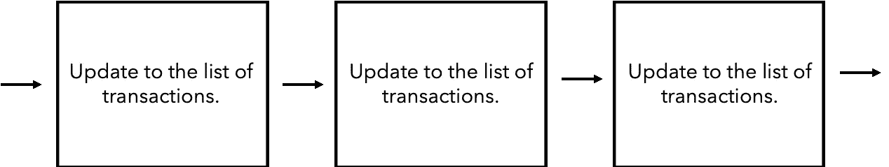

*A representation of the sequentially ordered digital ledger of bitcoin transactions between Bitcoin addresses. Each block of new transactions updates the list of unspent outputs (user balances).*

与当前由中央银行和零售银行管理和控制的金融系统不同，比特币系统没有为任何特定机构或个人提供更新和维护账本的专属权利。

相反，比特币让世界上任何地方的任何人都可以更新账本并保持其有效性，而无需获得许可。信息以分散和无权限的方式记录和保存在分类账中。

第 2 部分描述了分散的和无许可的方式，在分类账中记录比特币所有权的变化。第三部分将基于这些想法，为“数学和软件”或“区块链”解释无法回答的问题提供答案。

*第一步—用户交易:*

比特币用户在消费、发送或传输比特币时产生交易。智能手机应用程序或计算机软件在系统中传送交易细节(即，付款人、收款人、金额等)时启动交易。)给系统中的同行(运行比特币软件的其他人)。大多数情况下，这种交流是通过互联网进行的(但也可以通过无线电传输进行)。

## *交易必须记入比特币总账*

为了将特定比特币的所有权从一个比特币地址转移到另一个比特币地址(即从一个人或组织转移到另一个人或组织)，交易必须记录在比特币分类账中。就像任何其他形式的货币一样，所有权的变化必须记录在“总账”中，以便正确的人有权在未来使用比特币，并且该人的财产权可以得到承认和执行。

中央银行和零售银行控制和管理谁拥有法定货币(我们今天使用的货币，通过政府法令成为法定货币)的账簿。就比特币而言，任何人都可以更新和维护账本的副本，世界各地的电脑上都存储着账本的许多副本。运行比特币软件并存储和更新比特币分类账的副本被称为“运行比特币完整节点”。

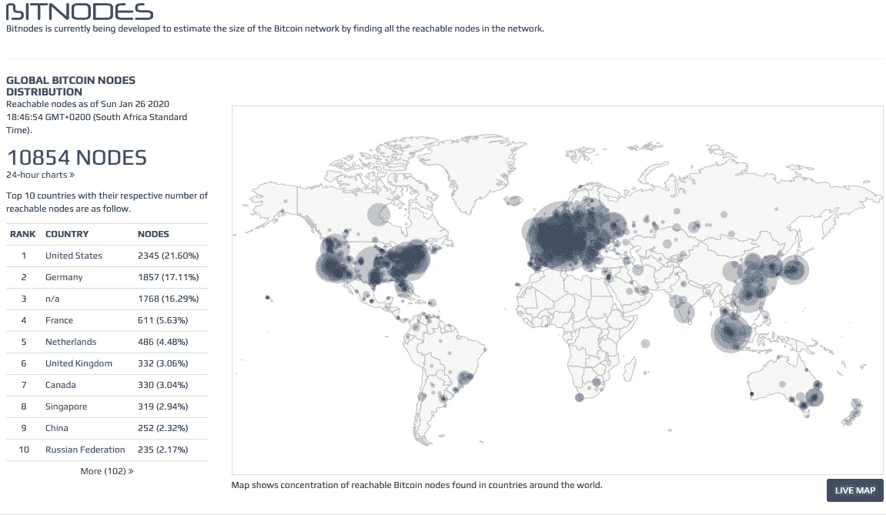

*The map shows the concentration of reachable Bitcoin nodes found in countries around the world. It is important to note that 10854 is the number of ‘listening’ Bitcoin nodes. Due to the fact that these nodes are open to connection, they are more visible. The number of full nodes around the world that are storing and updating a copy of the Bitcoin ledger is closer to 100 000\. Source:* [*https://bitnodes.earn.com*](https://bitnodes.earn.com)

完整节点对如何用新交易更新其比特币分类账副本执行相同的规则集。这些规则被称为“共识规则”通过执行相同的规则集，所有节点彼此保持同步，并就分类账的状态保持一致，因此谁拥有哪个比特币。

## *全节点运营商受到经济激励，以确保比特币发挥作用*

完整节点由以比特币储存财富和/或使用比特币(比特币分类账的原生货币)进行交易的人运营和控制。由于这些人或组织使用比特币，他们在经济上受到激励，以确保比特币继续成为好货币。这是因为，只有比特币保持良好的价值，它才会受到社会其他成员的重视，因此能够发挥价值储存的功能。下面的例子说明了这种经济激励。

如果偏离系统预定的发行时间表(设定数量的新比特币进入流通的时间)，那么人们可以合理地质疑比特币的稀缺能力(这是价值和良好货币储存的一个属性)，因此人们可能不太可能将财富储存在比特币中。

或者，如果人们被允许双倍花费比特币(使用相同的硬币进行多次支付，这将使商品或服务的供应商赔钱)，那么人们也会质疑比特币执行货币功能的能力，因此他们会减少比特币中的财富。

如果由于比特币是劣币，以比特币储存的财富减少，比特币的价格(购买力)就会下降，比特币投资者(以比特币储存财富的人)就会变得不那么富有。当然，全节点运营商(以比特币储存财富)不希望这种情况发生。此外，全球也有数百万人拥有比特币，却没有运行完整的节点。这些人也不希望比特币成为劣币，尽管他们没有运营一个完整的节点，但他们表达的偏好和经济意义会影响完整节点运营商执行共识规则。

因此，完全节点运营商在经济上受到激励，以确保比特币发挥作用，从而使系统的原生货币比特币继续保持价值并储存价值。特别是，完全节点确保只清算和结算有效的(而不是欺诈性的)交易，并且比特币继续具有耐久性、便携性、可替代性、可验证性、可分性、稀缺性、不断增长的既定历史和抵抗审查的能力等重要的货币属性。

另一方面，尽管完全节点在经济上受到激励，以确保不会出错，但它们也受到激励，以确保事情按照人们期望的那样发生。

考虑到这一点，你可以理解，如果满足共识规则，完整节点将毫无疑问地将新的交易块添加到它们的比特币分类账副本中，从而清算和结算有效交易，更新哪个地址拥有哪个比特币的注册表，并最终使比特币用户能够享受他们的财产权。

*By enforcing the consensus rules together, full node operators act as the custodians of Bitcoin.*

*步骤 2——采矿者努力生产合格区块，并为此产生成本:*

最重要的共识规则是，一旦完整节点收到需要解决的特定数学难题的正确答案，它们将仅使用一批新交易来更新它们的分类帐副本。这个数学难题的正确答案被称为“功的证明”。

这一共识规则的实施对比特币的工作方式和原因有很大影响。本节介绍了它的影响，第 3 部分基于这些原则更详细地描述了经济激励及其效果。

为了提供完整节点所需的工作证明，比特币网络的参与者，即所谓的“矿工”，使用计算机硬件来解决简单的数学难题。一个正确的答案(“工作证明”)具有将一批新交易转换成可以添加到比特币分类账中的数据块的效果。

正确的答案(“工作证明”)对于挖掘器来说计算起来困难且昂贵，但是一旦找到答案，对于完整节点来说验证它实际上是正确答案是非常容易且廉价的。

完整节点然后使用符合条件的数据块来更新它们的分类账副本(向比特币区块链添加新的数据块)。平均而言，每 10 分钟至少有一名矿工将解决数学难题，产生一个合格的区块。

## *采矿者在经济上被鼓励生产合格区块*

重要的是，矿工用来产生工作证明的计算机硬件是特定于应用的，即，它不能用于任何其他经济目的，并且这些计算机在产生工作证明的过程中会消耗电力。因此，生产合格区块涉及资本投资和运营支出。

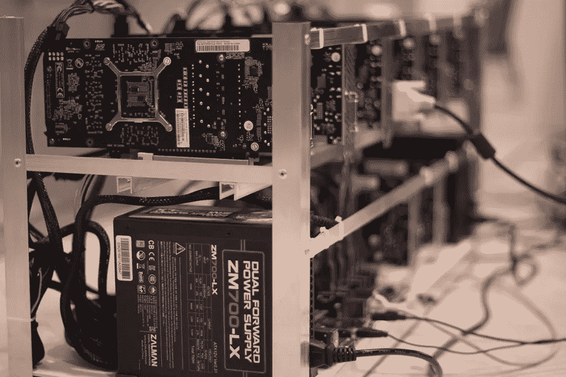

*Producing proof of work requires application specific hardware and the burning of electricity.*

像世界上的其他事情一样，人们不会无缘无故地产生这些经济成本。同样的现实也适用于此。

矿工只进行投资并产生持续的成本，因为他们可以预期收到比特币，这些比特币是完整节点奖励给产生有效数据块的矿工(或矿池)的，这些数据块可以将新交易添加到分类账中。

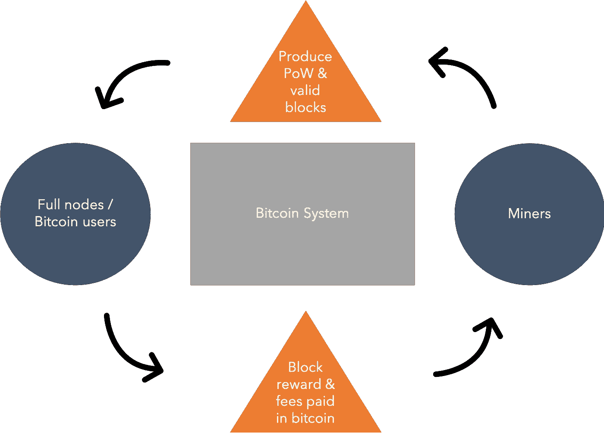

*Miners create value for full nodes / Bitcoin users by performing the computational work that has the effect of converting a batch of new transactions into a block of data that can be added to the Bitcoin blockchain. Full nodes / users pay for the value created by rewarding the miner with newly created bitcoin and paying them transaction fees.*

作为生产合格区块的激励，完整节点允许成功的矿工创建并在新区块中包括一个额外的交易，该交易将新“铸造”的比特币贷记到矿工控制的地址。这一奖励目前是每新块 12.5 新比特币。新比特币就是这样进入比特币系统流通的。

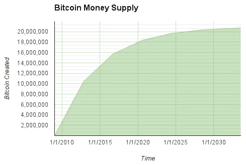

*At present, 12.5 new bitcoin enters the system every 10 minutes through the reward to the miner who produces a valid block and proof of work for that block. In May 2020 this amount will reduce from 12.5 to 6.25\. This is referred to as the ‘Bitcoin halving’. The halving happens every 4 years and will continue to happen until all 21 million bitcoin have entered circulation by 2140.*

此外，如果新区块中包含的任何交易支付交易费，那么矿工也可以将该金额的比特币归于他们选择的地址。交易费是比特币的消费者/发送者自行支付的款项，用于激励矿工将你的特定交易优先于其他也需要清算和结算的用户交易。

这种生产符合条件的区块以接收新创建的比特币的计算工作被称为“比特币采矿”，因为与传统采矿涉及从地壳中采集贵金属的工作和支出类似，接收新创建的比特币涉及昂贵的计算工作以接收新创建的比特币和以比特币支付的交易费。

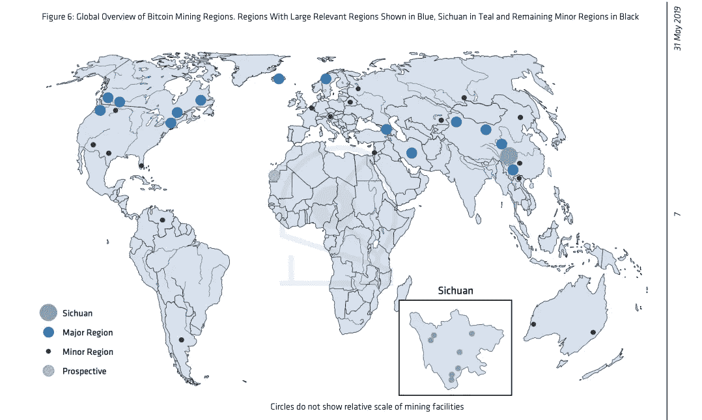

*Global overview of the geographic location of bitcoin mining operations. Miners are always looking for the cheapest electricity. Source: CoinShares Research, the Bitcoin Mining Network* [*June 2019 update*](https://coinsharesgroup.com/assets/resources/Research/bitcoin-mining-network-june-2019-fidelity-foreword.pdf)*.*

*步骤 3 —完整节点将合格的新交易块添加到其分类账副本中:*

我所描述的一步一步的过程是由生成事务的用户发起的(上面的步骤 1)。然后，挖掘器将这个事务和其他事务一起包含在一个符合共识规则的块中(上面的步骤 2)。一旦挖掘器解决了产生工作证明的数学难题，它就将合格的块分配给它所连接的完整节点(本节中描述的步骤 3)。

在从挖掘器接收到块时，完整节点开始验证工作证明，并且它们还将检查该块以及该块中的事务是否符合其他共识规则。其他一些规则是:

*   正在使用的比特币是否存在于分类账的前一个区块中？
*   是所有者在消费比特币，还是有人试图伪造交易？
*   比特币不是已经花完了吗？
*   挥金如土的人拥有的比特币至少和他们现在试图消费的一样多吗？
*   矿工是否奖励了自己正确数量的新比特币？

如果块和块中的交易符合共识规则，则完整节点会将其添加到它们的分类帐副本中，并且它们还会将其传递到网络中的对等节点，以便这些其他完整节点也可以验证块并相应地更新它们的分类帐副本。

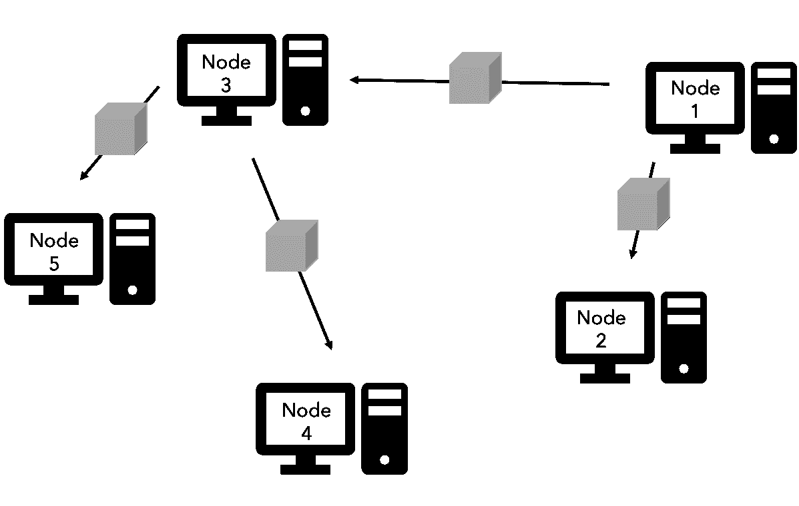

*By way of example, node 1 receives a block from a miner that it is connected to and it immediately sets about validating it. If valid, the block is passed on to other nodes that it is connected to. Blocks are passed through the peer to peer network from one full node to another much like how news would pass from one person to another.*

然而，如果该块不是一个有效的块，那么完整的节点将丢弃它，并且它们将等待另一个挖掘器向它们提交另一个块。如上所述，所有采矿者都有生产有效区块的经济动机，因此另一个采矿者提交有效区块只是时间问题。

## *密码术和区块链数据结构使得验证成为可能*

比特币使用加密哈希、非对称密钥加密、数字签名和区块链数据结构，使得全节点的独立验证成为可能。当对比特币工作原理的解释包括提及“数学”和/或“软件”和/或“区块链”时，这就是所指的内容。

加密哈希–

加密哈希在比特币的很多地方都有使用。这些领域包括:数字签名；创建交易，将数据块添加到分类账中，并将这些数据块“链接”在一起。

加密哈希函数可转换任何形式的数字数据(文件、照片、文本等)。)转换成称为加密散列的唯一文本串。

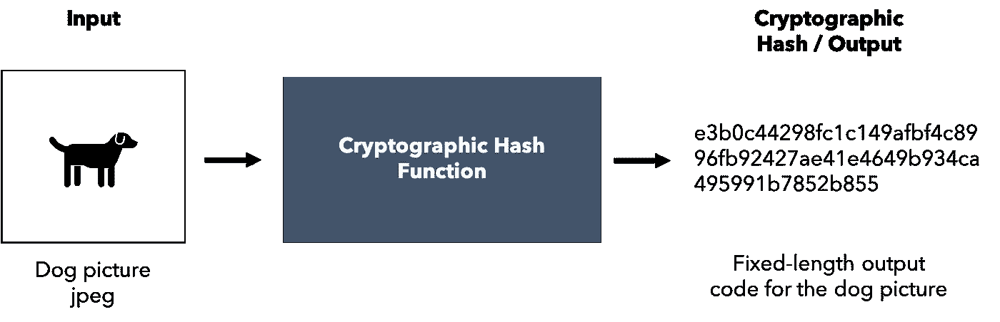

*In the same way that human beings each have unique fingerprints, digital data (which could be a file, photo, text etc.) has a unique Cryptographic Hash. Hash Functions only operate one way so if you want to find the input for a given output Hash, you need to guess and check every possible input. This is essentially what miners do to produce proof of work.*

相同的数字数据将生成相同的加密哈希，但是如果您稍微更改数据，哈希将会以一种无法预测的方式完全改变。此外，找到提供相同输出散列的两个不同输入(数字数据)的机会，就百分比而言，等于 1 个原子相对于宇宙中所有其他原子所占据的空间量。

非对称密钥和数字签名–

流通中的每一个比特币或比特币的一部分都被加密链接到一个公钥。公钥本身是由加密哈希函数使用私钥作为输入数据生成的。加密链接的私钥是保密的，用于加密消费或发送与公钥链接的比特币的交易。交易数据的加密被称为交易的数字签名。

使用已知的公钥，完全节点解密数字签名，并且如果解密产生伴随数字签名的相同交易细节，则完全节点可以确信:

*   交易是由拥有比特币的个人/实体产生的；和
*   交易细节在以下时间段内未被篡改:(1)相关比特币的所有者创建交易的时间和；(2)交易明细到达全节点。

因此，私钥充当生成类似于密码(数字签名)的工具，完整节点在允许特定交易被清算和结算之前需要该密码(包含在添加到其比特币分类账副本的块中)。

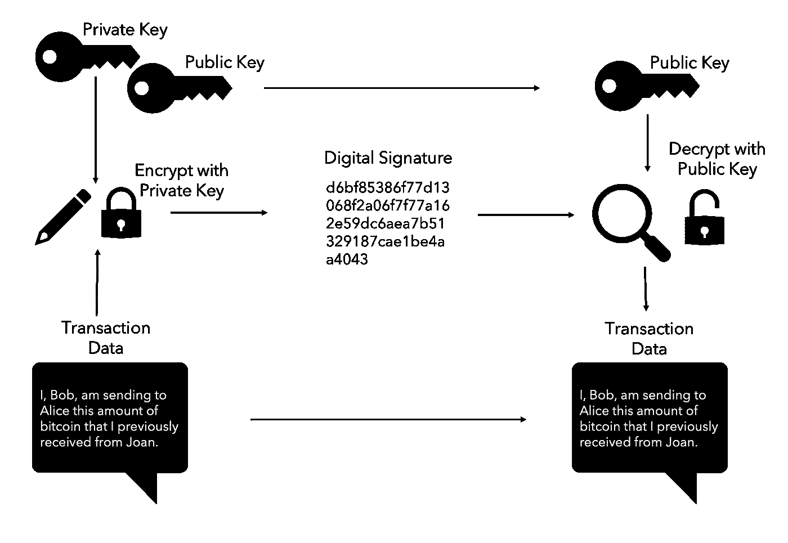

*A Private Key is kept secret and is used to encrypt the transaction spending or sending the bitcoin linked in the ledger to the Public Key. The spender/sender produces a Digital Signature (encryption) by inputting the Private Key and transaction details into a Hash Function. Full nodes then decrypt the Digital Signature using the Hash Function and Public Key. Only if the output of the decryption matches the details of the transaction will full nodes accept the transaction as valid.*

区块链数据结构–

为了能够始终验证给定交易的数字签名是否有效，完整节点需要拥有(加密链接到)流通中的每个比特币(或比特币的一部分)的公钥的记录。这就是区块链数据结构的用处。

作为实施共识规则的一部分，完整节点要求挖掘器将新的有效事务分组到数据块中，并以密码方式将该块链接(使用密码散列函数)到链中的前一个有效块。前一个块本身也加密链接到它前面的块，依此类推。通过这种方式，创建了数据块(事务数据)的“链”，因此得名“区块链”。

区块链数据结构的主要优点是，如果先前记录的信息(历史交易数据)被更改/篡改，它会立即突出显示。

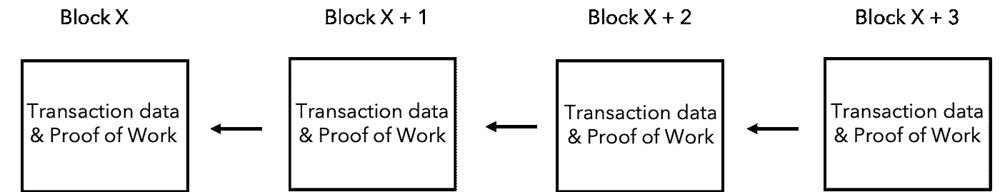

*The blocks of the ledger are ‘chained’ together because the Hash of the data in the previous block is included in the subsequent block in the chain. Any change to the data in a prior block will announce itself because the chain will be broken.*

由于完全节点可以依赖于先前块中的数据的真实性(因为对先前约定的状态的任何改变将立即宣布其本身)，所以它们能够独立地实施上面标题为“步骤 3:完全节点将新交易的合格块添加到它们的分类帐副本”下的要点中列出的共识规则。

但是，您应该注意，区块链数据结构本身并不能使数据不可变(不可更改)并因此值得信任。比特币区块链中数据的不变性是比特币去中心化和强大经济激励的结果。

不要被科技淹没-

正如第一部分所述，所有这些技术，即“数学和软件”和/或“区块链”，都不是本文的重点，因为单靠它们不可能让比特币像现在这样繁荣。如果有人在解释比特币的工作原理时反复强调这些技术，那么告诉他们停止，因为这些技术实际上已经存在很久了。链表可以追溯到 20 世纪 50 年代，公钥加密出现在 20 世纪 70 年代，工作证明来自 20 世纪 90 年代。仅此一点就应该有助于人们理解这些并不是比特币的特殊之处。

但是我离题了…回到经济激励，有趣的信息和帮助我们遵循这些原则的故事。

## *难度调整共识规则保护发行进度和稀缺性*

平均每 10 分钟就有一笔新交易进入一个区块，又有一个新的区块被添加到分类账中。

这种时间安排并不会随着多少计算能力(采矿设备)在求解方程(产生工作证明)而改变太多，因为作为实施共识规则的一部分，在每 2016 个区块之后，完整节点实际上调整方程的难度，使其变得更难或更容易，以便如果在接下来的 2016 个区块(约 2 周)中开采比特币的计算能力保持不变，那么平均每 10 分钟就会有一个矿工产生工作证明。这种每 2016 块的调整被称为‘难度调整’。

因此，比特币的预定发行时间表和稀缺性是由以下事实保证的:( 1)矿工只能以完整节点允许的速度解决数学问题；(2)矿工奖励是全节点允许新比特币进入系统的唯一方式；以及(3)满节点不允许矿工奖励自己比预定发行计划中提供的更多的比特币。

我们当然可以预期，任何货币价值的上升都会导致更多的资源被用于生产这种货币，从而增加其供应量。然而，由于比特币中的难度调整，随着比特币的价值上升以及生产比特币的动机增加，全节点继续强制执行难度调整，以确保不能生产比预定发行计划中提供的更多的比特币。天才！

# **第 3 部分—一些重要问题的可靠答案**

*问题 1——是什么让完整的节点保持一致？*

全节点运营商在比特币体系中是否权力过大？如果他们是比特币账本的保管人，那么是什么阻止了一小组节点无视难度调整规则或无视预定的发行时间表呢？

答案是‘没有’！一开始，人们应该知道，实际上没有什么可以阻止任何人这样做！比特币是开源软件，因此任何人都可以在任何阶段修改软件并发布给其他人使用。然而，重要的是，有没有人这样做其实并不重要。原因如下。

## *记住重要原则*

为了理解阻碍因素是什么，有必要重复一些关键原则。

第一个原则是，比特币是一种货币，只有当其他人用他们的商品、服务或其他货币从你这里接受比特币时，比特币才能给你带来某种东西。因此，与他人的想法趋同，而不是创造和使用他人不重视的东西，符合任何人的最佳利益。

其次，人们看重货币是因为它耐用、便携、可替代、可验证、可分割、稀缺、有悠久的历史并能抵御审查。

在下一节中，我将使用实际例子来:(1)说明这些原则；以及(ii)解释比特币全节点运营商如何以及为什么被激励保持排队。

## *完全节点运营商在经济上受到激励，以执行既定的共识规则*

让我们假设一组节点开始开发和维护一个新的分类账，其中包括每个区块中的矿工奖励，该奖励超过比特币预定的发行时间表中提供的奖励。更好的是，让我们假设账本的矿工奖励低于比特币的矿工奖励。理论上，这种较少的回报会使这个分类账的本地货币比比特币更稀缺，对吗？从表面上看，是的，但实际上不是。让我解释一下。

尽管这种分类账的流通单位较少(供应更为稀缺)，但比特币与既定共识的决裂要求我们提出一些重要问题:

*   这个新的发行时间表将来会保持不变吗？它已经改变了一次，为什么它不会再次改变？从预先确定的发行时间表(已达成共识)发生变化(无论大小)这一事实本身就意味着，在未来的任何阶段，新分类账的规则都可能发生进一步的变化。举例来说，现在可以想象会有其他的决定来从根本上增加奖励(这会稀释现有供应的价值并影响稀缺性)。
*   这个新网络会平等地对待所有用户，还是会偏袒创建它的人？
*   考虑到上面提到的不确定性，这个网络会以全节点运营商的形式获得足够的支持吗？如果不能，网络是否能够抵制任何审查网络交易的企图，以及什么能够阻止任何人从所有者/用户那里夺取或没收分类帐的货币。

当人们用本国货币创建新的分类账时，这些只是变得重要的一些问题。

总之，我们现在无法确定地预测这种新分类账及其本国货币的未来，也无法保证我们的产权会得到执行。在这种情况下，用这个分类账的本币来储存财富是不明智的。

不要误会我的意思，创作者仍然可以自由地使用这个新的分类帐。我想指出的是，由于上面解释的原因，其他用户很少(如果有的话)会追随，这意味着分类账的本地货币不会像比特币那样有价值(具有同等的购买力)。

因此，如果比特币全节点运营商与其他节点保持同步并执行比特币共识规则，他们会得到更好的服务。他们在经济上受到激励这样做。

## *比特币现金和天秤的教训*

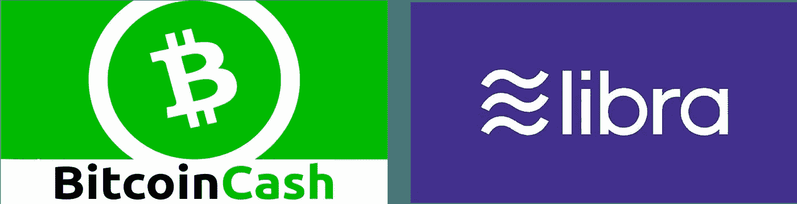

这里有几个例子来说明这些原则在现实生活中是如何发挥作用的。

2017 年 8 月 1 日，在第 478 559 个比特币块时，某些完整节点采用了一套不同的共识规则，使其新块与现有的比特币块不兼容。主要变化是允许在每个块中包含更多的交易数据，并从代码中删除隔离见证。在没有深入细节的情况下，他们的想法是，这些变化将很容易实现单位时间内更多的交易，这是比特币发展为货币和点对点网络时所需要的。

尽管一小部分完整节点采用了这一变化，但大多数人没有这样做，因为他们认为这些变化对比特币的货币属性没有好处。特别是，大多数全节点运营商认为，拥有更多数据的块将使普通人更难运行比特币全节点。

这不是大多数用户想要的结果，因为他们认为，如果要保持去中心化，比特币需要很多人在很多不同的地方运行完整的节点。只有比特币去中心化，网络才有能力抵抗审查，原生货币比特币才有抵抗审查的重要货币属性。

事实上，就在最近，我们获得了更多证据，证明如果有任何资金将用于政府、央行和现有金融体系的其他监管机构，那么它应该能够抵御这些强大机构的审查。如果法定货币的替代品完全货币化，这些机构将损失惨重，因此，在这一点上，它们不经抗争就交出控制权的可能性极小。

我提到的最近的审查是天秤座面临的巨大审查和压力(天秤座是脸书通过天秤座协会提出的一种数字货币)。如果你在过去的 6 个月里没有跟进，你可以在这里阅读文章[，在这里](https://www.theverge.com/2019/10/23/20929313/mark-zuckerberg-hearing-congress-libra-calibra-facebook-maxine-waters)阅读[。来自世界各地的政治家的一些更有趣的引语(也包含在文章中)是:](https://www.politico.eu/article/france-and-germany-pledge-to-fight-facebooks-libra/)

*   2019 年 10 月 23 日，美国众议院金融服务委员会(US House Committee on Financial Services)主席玛克辛沃特斯(Maxine Waters)表示:“鉴于我概述的所有这些问题，并考虑到该公司的规模和业务范围，我们应该很清楚为什么对你建立一种挑战美元的全球数字货币的计划感到严重关切。”。
*   法国和德国在 2019 年 9 月 13 日赫尔辛基欧元区财长会议上发表的联合声明称:“我们认为，没有任何私人实体可以声称拥有货币权力，这是国家主权所固有的。”。

考虑到这种反弹，有人可能会说，不能保证 Libra 会以目前的形式推出。

比特币现金呢？好吧，大多数人只是不重视这个分类帐的本地货币。在撰写本文时，比特币现金中存储的财富只有比特币中存储的财富的 4%左右(以每种货币的市值表示)。对于比特币现金来说，这是一个严重的下降，直到 2017 年 8 月 1 日，比特币的分类账都是一样的。

相对于比特币，比特币现金作为价值储存手段的糟糕表现清楚地表明，节点运营商在经济上受到激励，与其他节点保持同步，并执行比特币共识规则。

*问题 2——矿工能破坏比特币吗？*

第 2 部分描述了矿工如何将一批新交易转换为可以添加到比特币分类账的区块，并解释说，他们执行这项工作是因为他们收到了新创建的比特币和以比特币支付的交易费，作为这样做的报酬。

鉴于矿商可以通过在分类账中添加新的区块来自行清算和结算交易，是什么阻止了矿商开发两种不同的区块链，一种版本支付给某人，另一种版本实际上推翻了这种支付？换句话说，是什么阻止了矿工“双倍消费”他们的比特币？

像比特币中的大多数东西一样，经济激励鼓励人们做一件事而不是另一件事。

## *双消费攻击*

在比特币系统中，某个特定矿工在任何其他矿工之前出示工作证明的可能性，平均而言，等于该矿工拥有的计算能力与当时挖掘比特币的所有计算能力相比的百分比。

因此，如果矿工在那一刻控制了挖掘比特币的 1%的计算能力，那么他/她平均有 1%的机会成为拥有计算机的人，在那 10 分钟的窗口中先于任何人产生工作证明。

然而，矿工也有可能运气好，在短时间内连续出示几份有效的工作证明。

## *模拟双花费攻击*

如果我们模拟一个双花费攻击，它将如下发展。Miner 已经花费了比特币(“交易 1”)，将该交易释放到网络，并且现在已经产生了包含不同交易(“交易 2”)的另一个块，该不同交易实际上推翻了交易 1。

对于试图在交易 2 上加倍花费的矿工来说，问题是所有其他矿工将同时工作来扩展包括交易 1 的分类帐。请记住，由于他们能够接收新“铸造”的比特币和以比特币支付的交易费用，其他矿工随时都有动力出示工作证明，其效果是将一批新交易转换为可以添加到比特币分类账的区块。

因此，试图加倍花费的矿工将不得不继续走运，以便能够以与所有其他矿工扩展包括交易 1 的版本相同的速度扩展分类帐的第二版本。

由于在足够长的时间内，将会有显著更多的计算能力用于扩展包括交易 1 的分类账版本，这与重力定律非常相似，平均定律将会生效，并且该分类账版本将会变得比包括交易 2 的版本更长(具有更多的交易历史)。

完整节点最终将完全忽略包含交易 2 的更短版本的分类账，因为正如本文所解释的，它们在经济上受到激励，以确保比特币仍然是好货币，并且只有有效的交易才被清算和结算。

出于这些原因，当出售用比特币支付的贵重商品时，建议等待 4-6 个区块建立在包含您交易的区块之上，因为在这段时间之后，某人成功双倍消费(通过重组区块链)的可能性越来越小(最终几乎不可能)。

## *比特币需要 50%以上的矿工诚实挖矿*

如上所述，单个挖掘者或者甚至更小的挖掘者组在短期内成功进行双重花费的机会等于他们在该时刻相对于系统中的所有计算能力所控制的计算能力的量。然而，由于需要重做和赶上的工作证明的数量，即使有超过 50%的计算能力，矿工试图从链中更远的区块中清算和结算的交易中双倍花费比特币，也几乎没有成功的机会。

虽然这在短期内是可能的，但只要超过 50%的所有矿业力量都在努力扩展一个诚实的分类账版本，那么任何其他版本都将最终落后(交易历史较少)，并在系统中变得无足轻重。

由于这种可能性不利于成功的双重支出，所有矿工在经济上受到激励，努力为包含有效交易的有效区块提供工作证明。只有这样做，他们才有机会获得新创造的比特币和以比特币支付的交易费用，这些费用将在未来继续存在。

这一点很重要，因为只有当矿工的奖励和交易费用被写入一个持续到未来的账本时，矿工才有权获得其他人珍视的比特币。只有这样，矿商才能支付运营成本(包括电费)或盈利。

## *矿工不想“搬起石头砸自己的脚”*

此外，如果为了争论的缘故，一群矿工用双倍花费攻击成功，这些矿工实际上对他们自己的伤害会比他们得分更多。这是因为成功的双重消费会让比特币系统受到质疑，本土货币比特币可能不再受到社会的重视。对比特币的需求减少将降低比特币的购买力，这反过来会破坏矿工以比特币储蓄/持有的财富，还会使他们特定应用的采矿设备变得毫无价值。

由于这些经济激励措施以及人们想要创造财富而不是破坏财富的事实，我们可以预计大多数矿工将继续正确采矿。反过来，这将有助于确保比特币系统继续按照预期运行。

# **关闭**

我希望这篇文章有助于大家思考让比特币发挥作用的经济激励。

就我个人而言，我不能仅仅因为比特币使用数学和软件就相信它，我也怀疑许多其他人能否仅仅因为这一点就相信比特币。

相反，我相信我们所有人都被创造财富而不是毁灭财富的愿望团结在一起，这种普遍的人类偏好将确保大多数网络参与者会做某些事情而不是其他事情。

这就是比特币起作用的原因。

# **鸣谢**

如果你想更深入地了解比特币的工作原理，卡勒·罗森鲍姆的书《[寻找比特币](https://www.manning.com/books/grokking-bitcoin)》是一个很好的资源。特别是，这本书将帮助你了解密码学，以及这项技术如何用于比特币。在这篇文章中，我还没有详细地讨论过这些方面，所以如果你想更进一步，或者想让你的理解更上一层楼，这本书适合你阅读和学习。

***免责声明:*** *对未来事件的评论、观点、意见和任何预测反映引用作者的观点，不一定反映其雇主或为同一雇主工作的其他专业人士的观点，不保证未来事件或结果，也无意提供财务规划、投资或法律建议。*