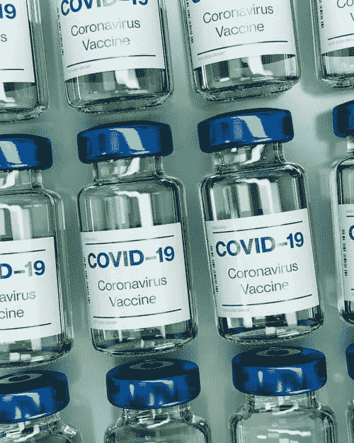
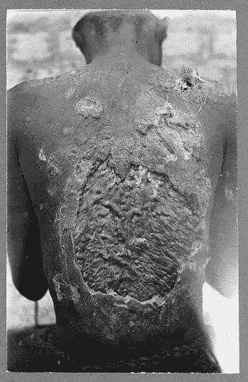

# 为什么黑人对接种疫苗犹豫不决

> 原文：<https://medium.datadriveninvestor.com/why-black-people-are-hesitant-to-take-the-vaccine-76ccf5d63f69?source=collection_archive---------4----------------------->

## 你会相信政府吗？

Photo by Daniel Schuldi on Unsplash

我不是反吸血鬼。我和我的孩子们都已经接种了所有的疫苗(腮腺炎、麻疹、乙型肝炎、破伤风等)。我认识到新冠肺炎的严重性，需要一种疫苗来恢复这个国家的任何正常感。有些人，包括许多黑人，对即将出现的疫苗心存疑虑，他们的恐惧是可以理解的。

美国政府和有色人种疫苗接种的历史是可悲的，远远超出了塔斯基吉研究的范围，许多人听说过该研究，但不知道政府的行为有多么令人发指。从 1932 年到 1972 年，美国公共卫生局开始了一项关于梅毒的研究，他们拒绝给一群黑人男性注射疫苗，以观察会发生什么，他们中的许多人并不知道自己患有这种疾病。他们不仅拒绝治疗，看着他们受苦和死亡。他们什么也没说，什么也没做，因为这些人将疾病传染给了他们的家人和其他人，常常导致他们的死亡。1972 年,[的告密者彼得·巴克斯顿向《华盛顿星报》透露了这个实验后,](https://whistleblower.org/uncategorized/whistleblower-peter-buxtun-and-the-tuskegee-syphilis-study/),塔斯基吉研究变得相对知名。你很少听说这不是这个政府类型的第一次也不是最后一次研究。

1943 年，在印第安纳州特雷霍特的联邦惩教所，政府给 241 名男性注射了淋病，以便研究其治疗效果。这些人获得了 100 美元，一份奖状，以及一封在假释委员会听证会档案中的信。几个月后，这项研究于 1944 年结束，因为给男性阴茎注射被证明是不可靠的疾病传播方式。没有关于印第安纳州的种族构成的信息，与塔斯基吉的黑人相反；人们不禁想知道？

 [## 瞄准新冠肺炎不平衡的免疫反应|数据驱动的投资者

### 过多的组胺或前列腺素 D2 信号传导或过少的干扰素信号传导导致严重…

www.datadriveninvestor.com](https://www.datadriveninvestor.com/2020/10/22/targeting-the-imbalanced-immune-response-in-covid-19/) 

2011 年 9 月，一份题为“伦理上不可能”的危地马拉 1946 年至 1948 年性病研究报告发布。以下摘自序言:

> 2010 年 10 月 1 日，巴拉克·奥巴马总统打电话给危地马拉总统阿尔瓦罗·科洛姆，就 1946 年至 1948 年期间美国支持在危地马拉进行的医学研究向危地马拉人民道歉。一些研究涉及未经患者同意故意感染性病患者。受试者暴露于梅毒、淋病和软下疳，包括囚犯、来自军队几个部分的士兵、国营精神病医院的病人和商业性工作者。持续到 1953 年的不涉及故意暴露感染的血清学实验也在这些群体中进行，对象是来自国立学校、孤儿院和几个农村城镇的儿童。奥巴马总统对这项研究表示“深感遗憾”，并申明美国政府“坚定不移地致力于确保今天进行的所有人类医学研究符合保护人类受试者的严格标准”。

虽然美国表示“深感遗憾”，但它后来宣布对在美国境外进行的这些试验不负责任。危地马拉人无权获得塔斯基吉实验的其余参与者和继承人获得的 1000 万美元。他们没有拿到特雷霍特囚犯拿到的 100 美元。美利坚合众国说危地马拉人没有任何权利。雷吉·沃尔顿法官说，他是在遵循联邦法律，但对这项研究深感不安。他敦促政府帮助受影响的人。

> 这场诉讼根本不是纠正这些错误的合适途径
> 
> 代表危地马拉人的律师现在正在寻求对涉案私营公司的赔偿，2019 年 1 月，一家联邦法院宣布洛克菲勒基金会、约翰·霍普金斯医院和相关实体以及百时美施贵宝公司是这项研究的“推动力”。几位医生为约翰霍普金斯工作，并得到洛克菲勒基金会的支持。百时美施贵宝为接受治疗的一小部分人提供药物。约翰·霍普金斯的律师在回应 10 亿美元的诉讼时说，
> 
> *“约翰·霍普金斯对受可悲的 20 世纪 40 年代梅毒研究影响的个人和家庭表示深切同情，该研究由美国政府资助并在危地马拉进行。我们尊重法律程序，我们将继续大力为诉讼辩护。”*

洛克菲勒基金会的一名发言人表示，该诉讼没有法律依据，他们在该研究的资助、管理或设计中没有任何角色。Bristol-Myer 当时没有发表评论。

美国军方对寻找梅毒的治疗方法很感兴趣，在塔斯基吉实验开始时，梅毒还没有治愈的方法。他们估计，多达 350，000 名士兵可能在海外战争和国内战争中感染梅毒。政府中有人认为感染目标人群的囚犯(种族未定)、贫穷的黑人和危地马拉的棕色人种是没问题的。政府羞愧地与塔斯基吉幸存者达成了和解。他们不关心他们感染的危地马拉人，大多数人没有接受治疗。针对私企的审判在 discovery 中，不知道会透露什么信息。希望预留的 10 亿美元是赔偿的下限，而不是上限。

除了政府虐待黑人和棕色人种的历史。尚未获得批准的疫苗是由一个政府和一个即将成为前总统的人推动的，他在新冠肺炎的每一步都向我们撒谎。在翘曲速度操作下，采取捷径来确定药物的有效性和安全性。人们担心制药公司是否会利用病毒和对疫苗的巨大需求来追求利润而不是安全，就像一些人在多家公司达成和解的阿片类药物过度处方中所做的那样。

今天我和一个我爱的人聊天，他告诉我，

“我不打疫苗，你也不打。”

暂且不论我是否接受这样的订单，这种担忧是真实的。一旦清楚新冠肺炎对少数民族和老年人的影响不成比例，现任政府的兴趣似乎直接转向让美国人重返工作岗位，而不是制定阻止扩散的方法。目前尚不清楚疫苗上市后谁将首先获得。这似乎不是一个没有道理的恐惧，政府将再次在那些它最不重视的人身上进行实验，而这些问题正在被解决。最后，我可能会接种疫苗，但我也不会排在第一位。

## 获得专家视图— [订阅 DDI 英特尔](https://datadriveninvestor.com/ddi-intel)