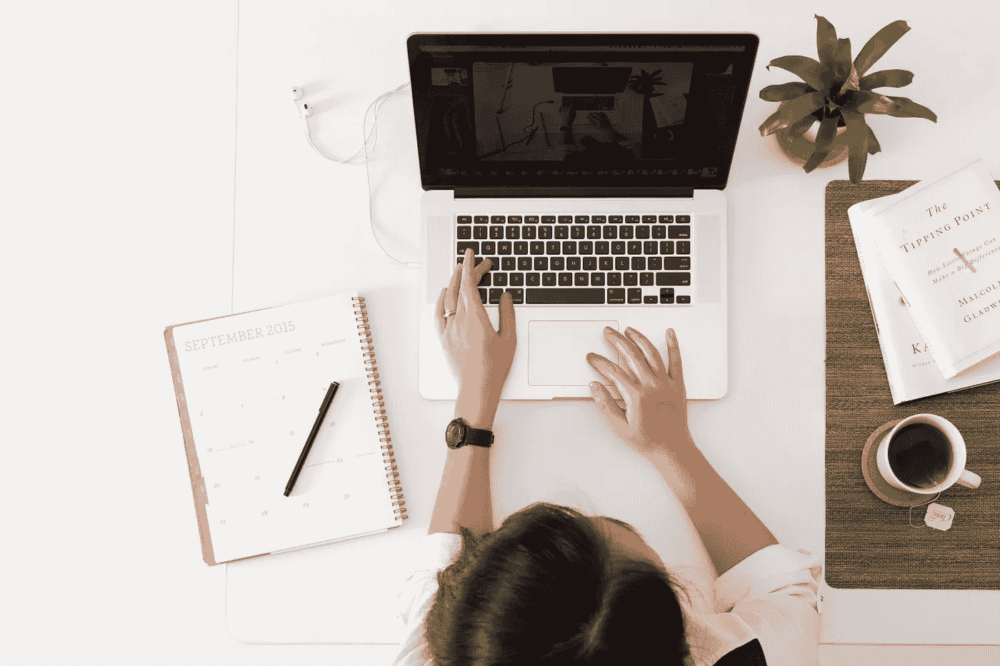

# 为什么企业主应该不断学习新事物

> 原文：<https://medium.datadriveninvestor.com/why-business-owners-should-constantly-learn-new-things-4638505e81eb?source=collection_archive---------22----------------------->

*如果你不学习，你就不是在为你的企业服务*

Image by Avel Chuklanov on Unsplash

像 Medium 这样的网站上有很多空间致力于经营企业的艺术——或者提供建议，或者分享这个领域的个人经验。

如果你已经在这里了，那是件好事。这意味着你可能乐于学习新的商业知识，以及如何成功。

我在这里提供的是两者的混合:建议与个人经历交织在一起。我会解释为什么我的生意本该失败，但却没有。这是因为我把学习放在首位。

# **商业**

先来个介绍。实际上，我经营着几家公司，但出于本文的目的，我想把重点放在[伦敦 t 台](http://www.londonrunway.co.uk)上。这是一本我在 2017 年创办的时尚杂志，今天仍在和一个小团队一起运营。

众所周知，杂志业现在岌岌可危。历史悠久的印刷出版物要么只有数字化，要么永远关门大吉。新的头衔，无论多么有前途，都时不时地出现。

在这种情况下，我们没有退缩。事实上，我们在 2018 年推出了数字产品，同时推出了印刷产品。

从一开始，我们就犯了很多错误。然而，我们总是设法去适应和生存。如果没有不断的学习，我们不可能做到这一点。

# **案例研究:摄影研究**

我的背景是摄影和文案。事实上，我拥有摄影学位，但任何获得过艺术类学位的人可能会告诉你，它们的价值和印刷它们的纸张差不多。

在我完成学习后，我学到了 99%的摄影知识。

这来自许多不同的来源。我有实践经验，这帮助我形成了自己的风格，并学会了每次出现问题时如何应对。在片场有很多疯狂的谷歌搜索，告诉模特休息一下，而我试图找出为什么我的相机不能像预期的那样工作。

2008 年开始读学位，2011 年读完。从那时起，我就没有停止过学习，即使是在与歌手和乐队、演员和代理模特、时尚品牌和组织合作之后。

今年夏天，我花时间向专家们学习了[摄影大师](http://mastersof.photography)提供的 4 门课程。聚焦于乔尔·梅耶罗威茨、艾伯特·沃森、大卫·亚罗和史蒂文·麦柯里提供的课程，每个课程都提供了他们如何拍摄最具标志性的照片以及更一般的建议和经验。

我可能已经当了十多年的摄影师，但这并不意味着我没有什么要学的了。Joel Meyerowitz 重新点燃了对街头摄影的遗忘已久的热情，并向我展示了如何克服在我之前的努力中占主导地位的紧张恐惧。史蒂文·麦柯里解释了这位传奇的阿富汗女孩背后的过程，证明了任何人——只要他们愿意投入工作——都可以有同样成功的镜头。至于看艾伯特·沃森在工作室工作，那是一个启示。受他在课程中所教授内容的启发，我立即出去拍摄了一篇社论。

其结果是我们最受欢迎的社论之一。

对于下一期，我鼓励我的摄影团队出去拍一些街拍照片，作为一个画廊。我从这门课中学到的东西一直留在我的脑海里，并将继续影响我的工作。没有什么比向真正的大师学习更能让你更上一层楼了。

# **案例分析:平面设计**

来自视觉艺术背景并不意味着我对平面设计一无所知。事实上，我完全不知道。我大概能不假思索地说出三种字体，当我试图为我的学位展做一张海报时，它看起来单调乏味。

那么，当你的新兴企业需要一名平面设计师时，你会怎么做呢？你有两个选择:要么雇一个，要么成为一个。

我没有足够的钱去雇一个。

你可以通过两种方式投资一家初创企业。它们是金钱和时间。我没有第一个，所以我不得不花第二个。

[Canva](http://www.canva.com) 是一个免费的在线图形设计应用，它还包括一个关于字体配对、配色方案、位置等等的课程库。我经历了每一课，尝试了我学到的一切。

我的下一步是让自己成为社交媒体的平面设计师。当时没有多少人这样做，所以由于价格低廉(三种设计 5 美元)，我很快就接到了很多订单。这是一次很好的学习练习——让自己陷入困境，与需要快速周转工作的付费客户打交道。

我在那里也犯了很多错误。可以理解的是，我的一些客户对此并不感兴趣。但是有些人喜欢我的作品。渐渐地，随着时间的推移，快乐的顾客成了大多数。我仍然时不时地在那里工作——不是因为报酬很高(事实并非如此)，而是为了保持我的技能。

当我每次都获得五星评论时，我知道我拥有我需要的技能。我自己完成了《伦敦时装秀》的第一期——文字、图像和设计。这远远不是我们最好的成绩。但这是一个开始的地方。

现在我身边有一个不断壮大的团队，我不会拍每一篇社论，也不会设计每一页。但重要的是:作为企业的所有者，*我知道如何做我的企业需要的一切事情*。

平面设计师生病了？没问题。文章没有在截止日期前交上来，现在我们有一个空白要填补？我能做到。一个客户想要为他们的专题定制一个编辑镜头？我会站出来。

因此，我经营的不仅是一艘严谨的船，还是一艘可自我维持的船。我一个人要花大半个月的时间才能完成一期杂志吗？当然——但是我可以做。总之，在经济不确定的情况下，当你下个月可能无法支付工资的时候——能够自己做这一切比被迫永远关闭你的企业要好得多。