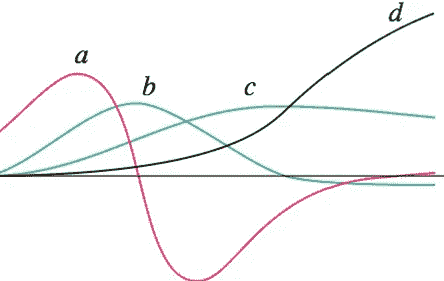
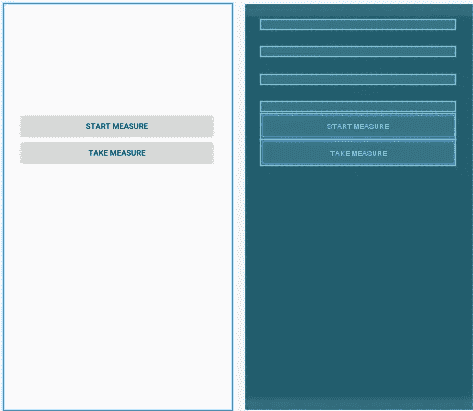
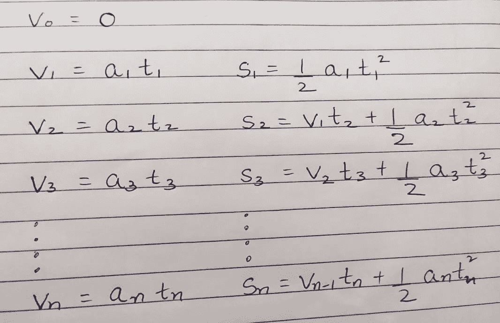
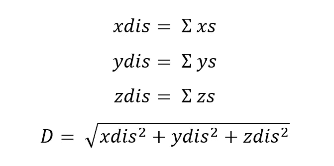
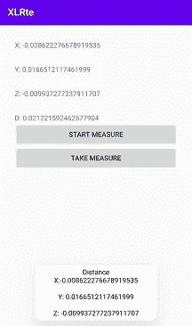
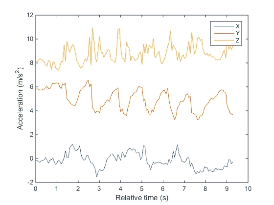
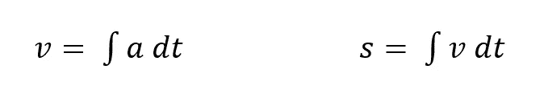
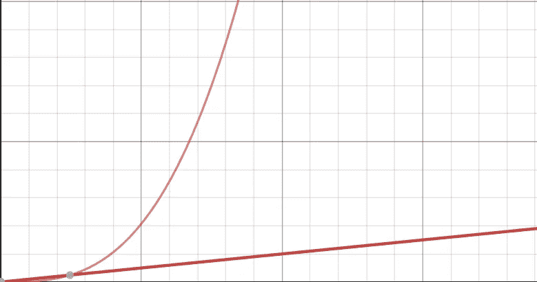

# 为什么我们不能使用 Android 的加速器数据来测量距离

> 原文：<https://medium.datadriveninvestor.com/why-cant-we-use-accelerator-data-to-measure-distances-using-android-74601c5588e6?source=collection_archive---------2----------------------->

当事情没有按计划进行时会发生什么…



Image Generated From Graphing Calculator

所以我有一个想法，设计一个 android 应用程序来测量长度，只需将你的手机放在两边，并使用加速度值来计算位移。**简单的运动学！！**


于是我打开 Android Studio，开始在 *activity_main.xml* 中设置 GUI

```
*<?***xml version="1.0" encoding="utf-8"***?>* <**LinearLayout xmlns:android="http://schemas.android.com/apk/res/android"
    xmlns:app="http://schemas.android.com/apk/res-auto"
    xmlns:tools="http://schemas.android.com/tools"
    android:layout_width="match_parent"
    android:layout_height="match_parent"
    android:orientation="vertical"
    android:padding="30sp"
    tools:context=".MainActivity"**>

    <**TextView
        android:layout_width="match_parent"
        android:layout_height="wrap_content"
        android:id="@+id/xVal"**/>
    <**TextView
        android:layout_width="match_parent"
        android:layout_height="wrap_content"
        android:id="@+id/yVal"
        android:layout_marginTop="30sp"**/>
    <**TextView
        android:layout_width="match_parent"
        android:layout_height="wrap_content"
        android:id="@+id/zVal"
        android:layout_marginTop="30sp"**/>
    <**TextView
        android:layout_width="match_parent"
        android:layout_height="wrap_content"
        android:id="@+id/dVal"
        android:layout_marginTop="30sp"**/>

    <**Button
        android:id="@+id/start"
        android:layout_width="match_parent"
        android:layout_height="wrap_content"
        android:text="Start Measure"** />

    <**Button
        android:id="@+id/clear"
        android:layout_width="match_parent"
        android:layout_height="wrap_content"
        android:text="Take Measure"** />

</**LinearLayout**>
```



The GUI

然后回到 Kotlin 代码，首先定义了加速度计传感器。

```
**val** sensorManager = getSystemService(Context.*SENSOR_SERVICE*) **as** SensorManager
**val** acclerometer: Sensor? = sensorManager.getDefaultSensor(Sensor.*TYPE_LINEAR_ACCELERATION*)

sensorManager.registerListener(**this**,acclerometer, SensorManager.*SENSOR_DELAY_NORMAL*)
```

之后，我定义了 onSensorChanged 函数并编写了动力学代码。首先，用加速度计采集数据，并计算速度。



```
**override fun** onSensorChanged(event: SensorEvent?) {
    **if** (event != **null**) {
        Log.d(**TAG**, **"on Sensor Change X: "** + event.**values**[0] + **" Y: "** + event.**values**[1] + **" Z: "** + event.**values**[2])

        **if** (**flag**==1) {
            **var** t= ((SystemClock.elapsedRealtimeNanos()) - **t1**).toDouble()
            **t1** = SystemClock.elapsedRealtimeNanos()
            t= t/1000000000

            **xs**.add(((**xvel**.*takeLast*(1)).get(0) * t).toDouble() + (0.5 * (event.**values**[0].toDouble())  * t * t).toDouble())
            **ys**.add(((**yvel**.*takeLast*(1)).get(0) * t).toDouble() + (0.5 * (event.**values**[1].toDouble())  * t * t).toDouble())
            **zs**.add(((**zvel**.*takeLast*(1)).get(0) * t).toDouble() + (0.5 * (event.**values**[2].toDouble())  * t * t).toDouble()) **xvel**.add((0.5 * (event.**values**[0].toDouble()) * a).toDouble())
            **yvel**.add((0.5 * (event.**values**[1].toDouble()) * a).toDouble())
            **zvel**.add((0.5 * (event.**values**[2].toDouble()) * a).toDouble())
}
```

接下来，我计算了所有小位移矢量的和。然后计算出位移的大小。



我终于有了工作申请。我拿去测试了。



测试时，它很好，看起来一切正常，但它…

## 就是不起作用

它给出了不正确的措施。虽然我很沮丧，但我更困惑的是为什么它会给出随机阅读。我检查了代码中的错误。我寻找更多的答案和改进。

本质上，android 手机中的加速度计噪音非常大。



另外，位移是加速度的二重积分。如果积分产生漂移，二重积分产生可怕的漂移。



当噪音被整合时会产生巨大的差异。**其急矣！**



Double Integral for small noise

## **其他技术如何工作**

用于游戏和 AR/VR 的技术被称为传感器融合，它使用加速度计、陀螺仪和磁力计的数据。有些人在加速度计上使用高通滤波器。

为了测量步数，使用计步器算法，它识别每一步并计算它。

当事情没有按计划发展时会发生什么，一个人必须这样公布，其他人不会做出同样的假设和错误。