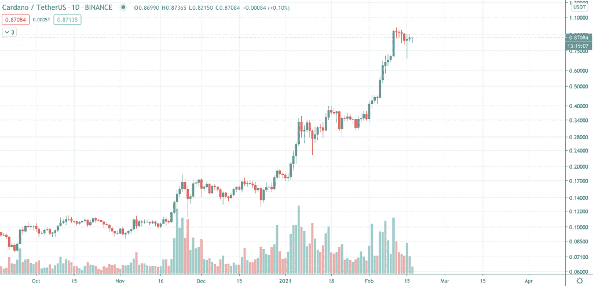
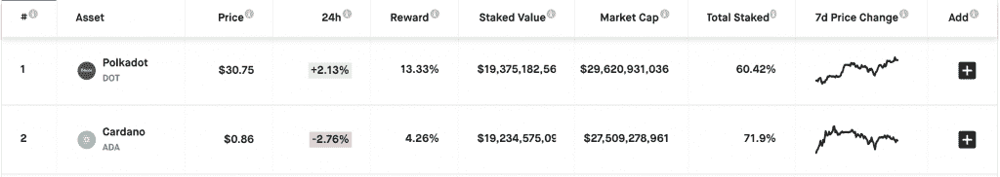
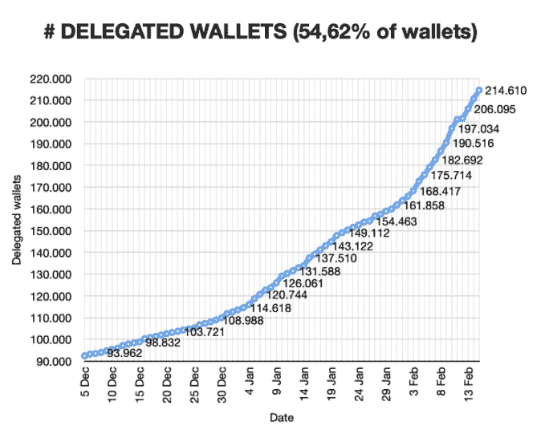
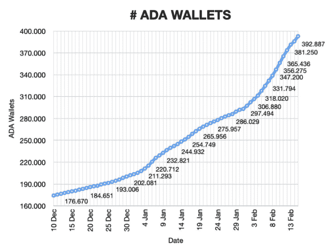
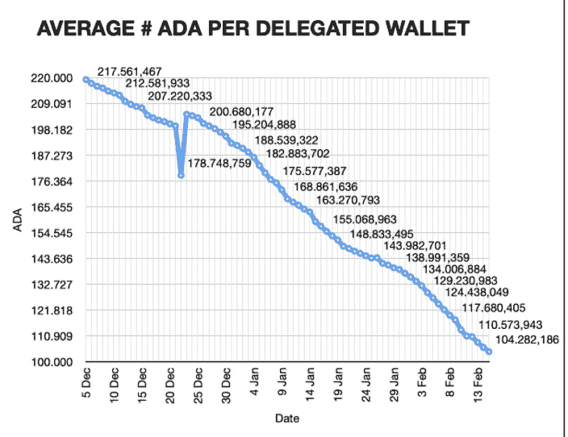

# 为什么卡尔达诺比以往更加分散

> 原文：<https://medium.datadriveninvestor.com/why-cardano-is-more-decentralized-than-ever-before-3ebe8622ccb8?source=collection_archive---------7----------------------->

72%的 ADA 已经计时

同时，智能合同中 ADA 总流通量的 71.9%被记录。此外，正如最新数据所支持的，Cardano 仍然被认为是市场上最分散的区块链网络之一。

卡达诺区块链网站上 ADA 数量的显著增加伴随着加入卡达诺生态系统的新用户数量的显著增加。与此同时，ADA 的价格正直奔 1 美元大关。

今年早些时候，Cardano 已经设法以本地加密货币的形式超过了 Polkadot。然而，对许多人来说同样重要的是，卡尔达诺是最分散的网络之一。让我们用一些数据来支持这两种说法。

 [## 卡尔达诺预测 2021:阿达的球场潜力如何？

### 在我们的 2021 年卡尔达诺预测中，我们来看看 ADA 的机会和风险。

medium.com](https://medium.com/coinmonks/cardano-forecast-2021-what-is-adas-course-potential-ab7da525b948) 

# 卡尔达诺的基本面显示出一种去中心化的趋势

Cardano 占总流通 ADA 供应量的近 71.9%，远远领先于 Polkadot，占 dot 的 60.61%。然而，60.61%的流通点令牌以美元计算的价值略高于 71.9%的 ADA 令牌。

此外，来自 Cardano 数据聚合器 AdaPools 的最新数据显示，超过 54%的 ADA 钱包已将其代币委托给赌注池。这意味着目前有 214，610 个 ADA 钱包参与了 Cardano 网络的赌注。

委派钱包数量的增加伴随着网络上 ADA 钱包总数的增加。根据 AdaPools 和 AdaStat 的数据，目前有 392，887 个 ADA 钱包。这比 1 月 14 日的 244，932 个钱包增加了 60%。即使钱包数量不一定说明参与人数，但仍然说明有更多不同的人在拿着 ADA。

另一个表明 Cardano 网络快速去中心化的重要指标是每个授权钱包中 ADA 的平均数量。如下图所示，每个委派钱包的平均 ADA 数量有所减少。这强烈表明，包括散户投资者在内的更多参与者持有 Cardano 的一部分，并反对本地加密货币的集中化。

上面的数据显示，在过去 30 天中，委派钱包中的 ADA 平均数量下降了 38.24%。

# 总之，这意味着

*   现在 3/4 的 ADA 代币都在卡达诺区块链上计时，
*   超过一半的钱包参与了赌博，
*   网络中委托钱包的数量显著增加
    ,同时，
*   代币在这些钱包中的分布正增加。

这些对卡尔达诺来说无疑是健康和有希望的发展。

我在每月的[时事通讯中分享了更多私密的想法，你可以在这里查看](https://mailchi.mp/bf8f8e8ed697/keep-in-touch-with-lukas)。请在评论中告诉我，并在各种社交媒体平台上加入我:

[推特](https://twitter.com/WiesfleckerL) ● [Instagram](https://www.instagram.com/lukaswiesflecker/) ● [脸书](https://www.facebook.com/lukaswiesfleckerr)●[Snapchat](https://www.snapchat.com/add/luggooo)●[LinkedIn](https://www.linkedin.com/in/lukas-wiesflecker-1b11251a5/)

无论你做什么，都要带着爱和激情去做！