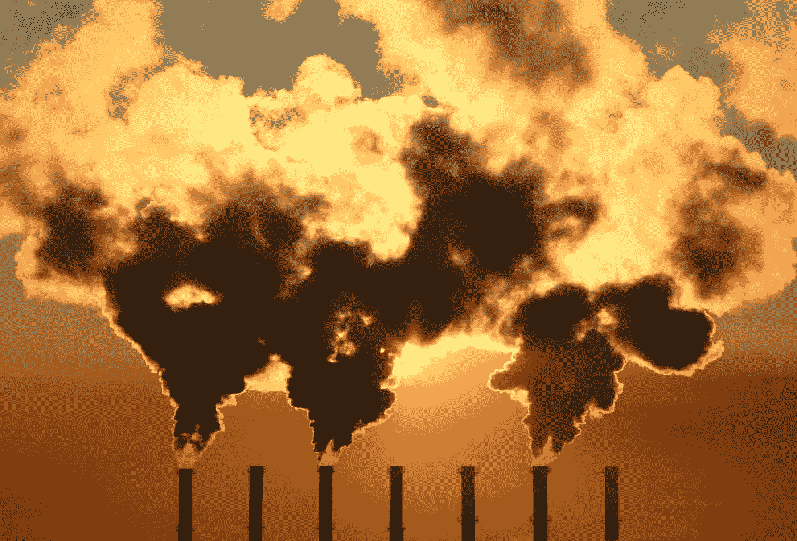

# 为什么新冠肺炎对环境很好，但对经济却很糟糕

> 原文：<https://medium.datadriveninvestor.com/why-corvid-19-is-great-for-the-environment-but-terrible-for-the-economy-13893af63943?source=collection_archive---------3----------------------->

## 展示了为什么对气候危机无所作为

[Nikita Golovanov](https://www.freeimages.com/photographer/kit1578-40619)

新冠肺炎的爆发是一生一次的事件，导致中国和意大利等国家进入封锁状态，以限制疾病的传播。全球经济因这些严厉的措施而遭受痛苦。股票市场[暴跌](https://www.independent.co.uk/news/world/americas/coronavirus-stock-market-oil-dow-jones-shares-wall-street-today-latest-a9387636.html)，一场[全球衰退](https://www.washingtonpost.com/business/2020/03/14/recession-economy-coronavirus-jobs/)看起来很有可能。经济放缓对经济来说可能是灾难性的，但对环境来说却是好事。

中国的工业已经关闭，导致空气质量明显改善。自 2008-2009 年金融危机以来，我们对新冠肺炎的反应可能会首次导致二氧化碳排放量的减少。我们赖以生存的环境正从我们对它的虐待中得到些许喘息。

## **一切照旧的局面来得太快了**

中国人民正在呼吸更清洁的空气，二氧化碳排放量可能会在短期内减少，但情况远非理想。我们迅速应对病毒造成的威胁符合每个人的利益。业务越早恢复正常越好。但是，一切照旧将导致二氧化碳排放水平的上升。有效应对病毒爆发将重新点燃经济引擎，导致更大的问题。

 [## 气候变化、ESG 和对更好数据的追求|数据驱动的投资者

### 在地球上许多地方经历了另一个令人难以置信的炎热夏季后，来自 S&P 的最新发现…

www.datadriveninvestor.com](https://www.datadriveninvestor.com/2018/08/24/climate-change-esg-and-the-quest-for-better-data/) 

新冠肺炎的爆发凸显了我们的经济和环境之间的不健康关系。环境破坏是经济产出的直接结果。

这就是我们面临的困境。

经济学家、政治家和许多企业(本质上是在我们当前的做事方式中拥有既得利益的任何人)认为经济是一切的中心。

但是我们经济的基本功能是支持社会，而不是相反。毕竟没有社会就没有经济。反过来，没有支持生命的环境，就没有人类，也就没有社会。这些看起来都很简单，但是我们表现得好像世界是围绕着我们转的。

当前的危机暴露了一个关键问题。更重要的是，我们的经济支撑着社会，还是环境支撑着社会、经济和地球上所有的生命？

答案似乎是显而易见的，但每天的事情并不那么清楚。

## 处于危险边缘的经济

新冠肺炎已经显示了我们的经济对一切照旧的变化是多么的无弹性。由于旅行受限，航空公司可能会受到特别严重的打击。 [Flybe](https://www.theguardian.com/business/2020/mar/05/flybe-collapses-two-months-after-government-announces-rescue) 已经倒闭，英国航空公司是[为生存而战的众多航空公司之一。](https://www.theguardian.com/business/2020/mar/13/ba-says-jobs-will-go-as-airline-industry-faces-crisis-worse-than-9-11-coronavirus)

诚然，新冠肺炎带来了无法预见的前所未有的变化。但疫情最令人担忧的方面是我们的经济对外部变化的脆弱性。无数的企业正处于危险的边缘，不断地在生存和崩溃之间徘徊。

对威胁一切照旧的外部风险几乎没有抵御能力，这表明了一个更大的问题。必须保持一切照旧，以保持我们的经济运转。这里的问题是我们的经济正在导致环境破坏，导致整个人类生活在刀刃上。真是棘手。

许多企业抓住刀刃不放，这有助于解释为什么他们缺乏应对气候危机的热情。企业害怕变化，因为任何变化都会威胁到它们的生存。在这种情况下，抵制变革是可以理解的。

那么经济和环境哪个更重要呢？那取决于你的观点。对于一个依赖于保持现状的企业来说，经济更重要。没有现在的经济，就没有生意。

这可能看起来非常短暂，但这就是我们生活的现实。

## **气候危机感觉不像是一场危机**

对新冠肺炎事件的反应凸显了我们面对威胁时可以多么迅速地做出反应和做出改变。总的来说，除了在卫生纸问题上的争吵，其他事情都非常合作。随着国家被封锁，旅游被限制，运动日程被搁置，这感觉像是一场危机。我们的反应与威胁相符。

气候危机很可能威胁到地球上的所有生命，但日复一日，它并不像是一场危机。我们可以继续生活，不会对我们的行为产生负面影响。

这就是气候危机的终极问题。它不像致命病毒那样让人感到紧急。如果问题感觉不像问题，有什么动力去改变什么呢？

新冠肺炎的影响凸显了为什么人们对做出真正的改变来解决气候危机漠不关心。改变经济结构可能会让经营处于危险边缘的企业面临倒闭的风险。应对气候危机的切实解决方案直接威胁到我们现在的行事方式。但在经济和环境之间做出选择时，只能有一个赢家。经济优先于生活本身的基础，这是对我们这个时代的一种嘲弄。

如果你认为新冠肺炎造成的损害很糟糕(而且很可能变得更糟)，气候变化的影响将是毁灭性的。这场危机将使整个世界变得面目全非。这些变化将是不可逆转的。我们不能像防止致命病毒传播一样“逆转”气候变化。一旦气候危机真的像一场危机，再做出反应就太晚了。

我们有两个选择。优先考虑我们支持社会的经济系统，或者支持生命的环境。对我们生存至关重要的环境。经济可以被重新设计，与它赖以生存的环境相协调。

我们做出的决定将决定人类的进程，前所未有。

【transformatise.com[*阅读原文，订阅更多文章*](http://www.transformatise.com/)