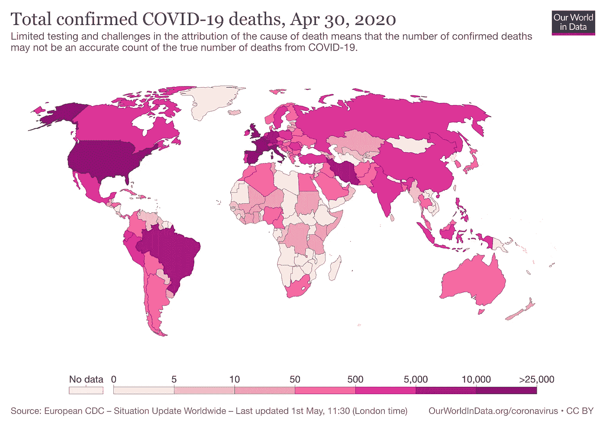
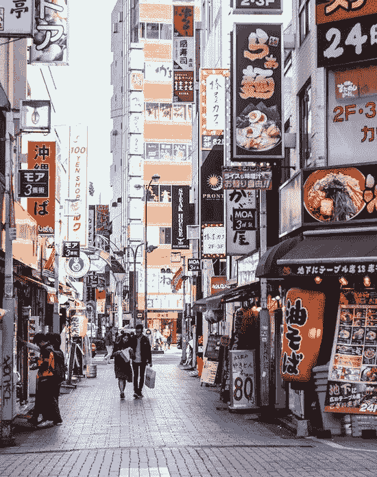
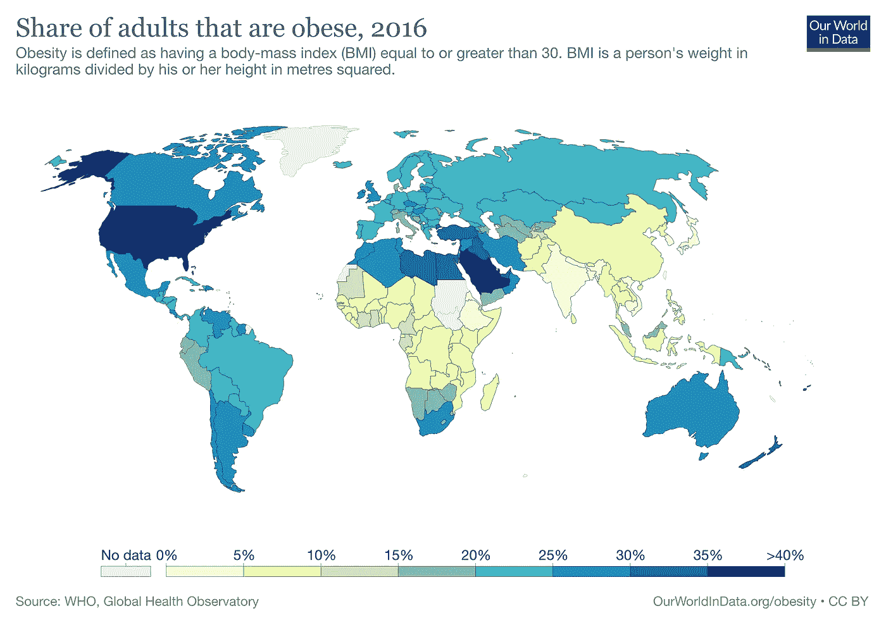
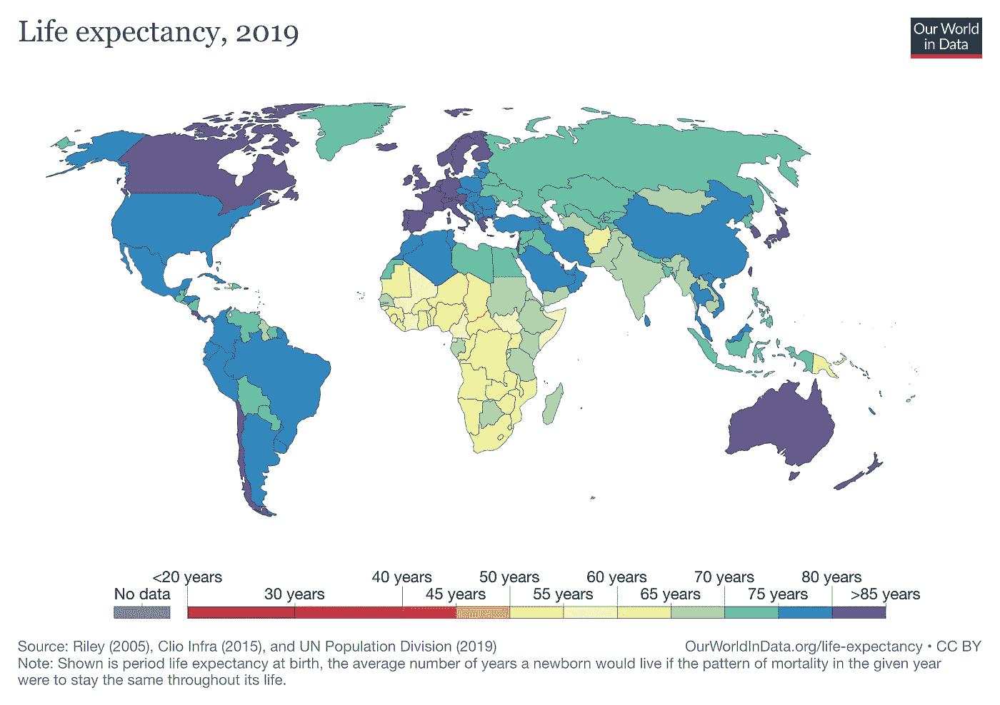
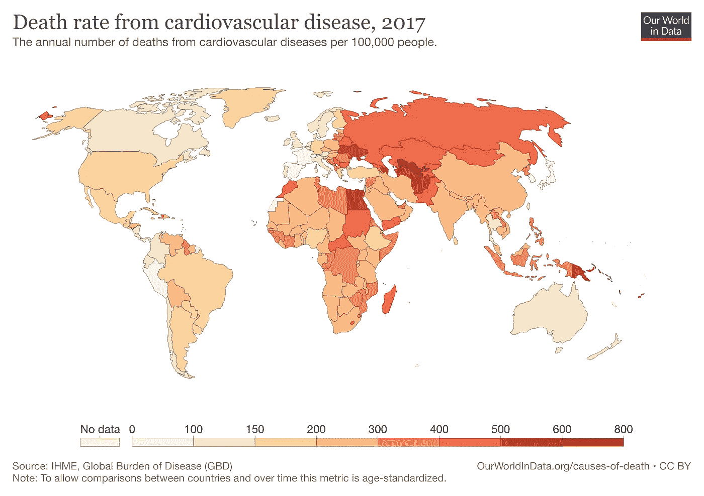
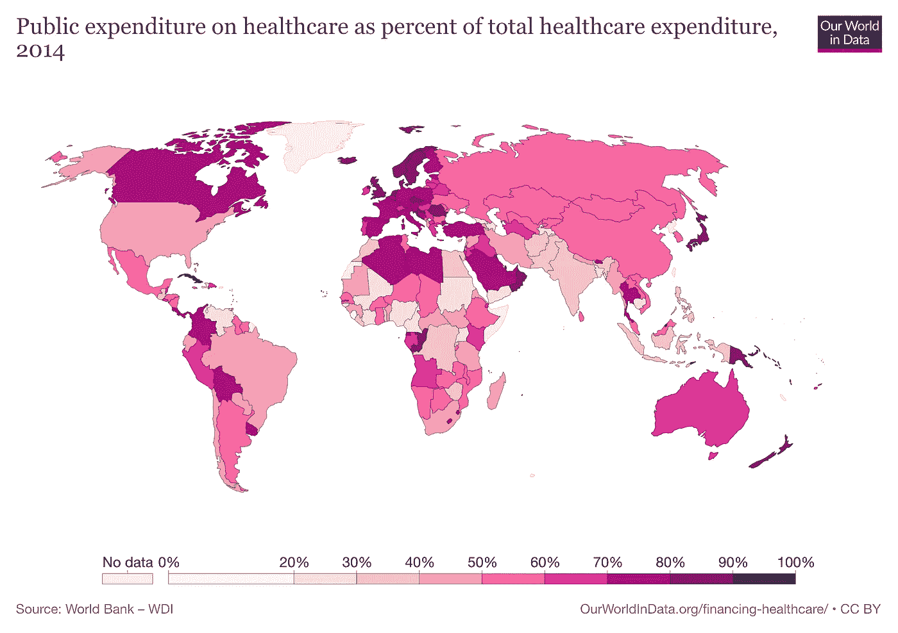
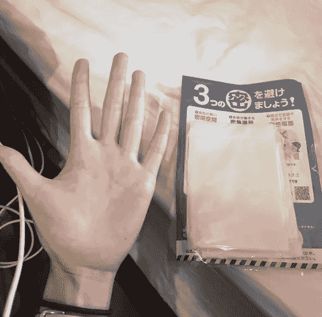
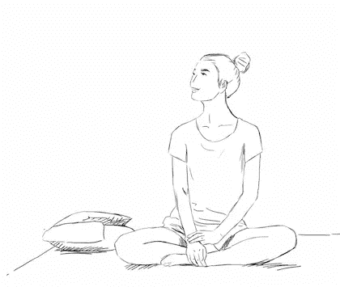

# 为什么新冠肺炎对西方世界的打击如此之大

> 原文：<https://medium.datadriveninvestor.com/why-covid-19-hit-the-western-world-so-much-harder-8b8c3ade4055?source=collection_archive---------3----------------------->

## 一个关于为什么日本仍然是局外人的理论

我想先声明我绝不是健康专家或疾病专家，但是日本正在发生一些非常奇怪的事情。尽管没有封锁——日本的日常活动保持相对正常——而且关闭边境和宣布紧急状态的时间较晚，但日本的新冠肺炎感染率和死亡人数与其他国家相比要低得多。截至 2020 年 5 月 2 日，美国已出现超过 100 万例病例和 65，000+例死亡，而日本的死亡人数已被控制在 500 例以下。

如果这是一个不同的亚洲国家，这将是有意义的——台湾和新加坡在启动接触者追踪和锁定方面堪称典范，韩国也是如此。在最初的疫情爆发后，中国也能够抑制它们的数量，因为中国政府能够迅速灌输严格的法规，以确保其公民遵守封锁规则。

**但是日本呢？**尽管宣布进入紧急状态，但留在室内的公告并不强制执行，只是法律上的一个强烈建议。餐馆和酒吧仍然营业，还有发廊、健身房和一些服装店——世界上大部分地区不得不放弃的小奢侈品。几乎没有检测和接触者追踪的努力，事实上，截至 2020 年 4 月 21 日，《每日新闻》的一项民意调查发现，只有 18%的日本人因冠状病毒而停止工作([《每日新闻》](https://mainichi.jp/english/articles/20200421/p2g/00m/0na/083000c))。但是，尽管常态和缺乏社会距离，日本似乎做得相对不错。

 [## 冠状病毒；惊慌失措；字里行间的 z |数据驱动的投资者

### 围绕冠状病毒的话题；更准确地说，新冠肺炎几乎占据了整个新闻预报的头条…

www.datadriveninvestor.com](https://www.datadriveninvestor.com/2020/03/23/coronavirus-a-to-panic-z-between-the-lines/) 

关于原因有几种理论，比如日本药物 Avigan 是有效的( [Japan Times](https://www.japantimes.co.jp/news/2020/04/23/national/abe-avigan-coronavirus-treatment/#.XqxAbhMzbs0) )或者更现实地说，日本缺乏测试是抑制实际报告病例数量的原因([《华尔街日报》](https://www.wsj.com/articles/japan-bucking-consensus-says-limited-coronavirus-testing-is-enough-11585758630)， [BBC](https://www.bbc.com/news/world-asia-52466834) )。但如果一切真的分崩离析，我们肯定会看到除了阳性检测结果以外的其他方面的失败证据:过度拥挤的医院和停尸房，人们目睹家人或邻居在家中默默地死去，或者医生积极地站出来说话。如果情况非常糟糕，日本不可能隐瞒事实，但距离首例确诊病例已经过去了几个月。

Photo by [bantersnaps](https://unsplash.com/@bantersnaps?utm_source=unsplash&utm_medium=referral&utm_content=creditCopyText) on [Unsplash](https://unsplash.com/s/photos/tokyo?utm_source=unsplash&utm_medium=referral&utm_content=creditCopyText)

这让我困惑，但我认为日本的预防性医疗保健提供了线索。

我已经推迟写这篇文章很长时间了，因为它是有争议的，而且没有足够的研究来证明我的理论。我也不是专家，也不想传播不正确的信息——但我们开始看到政府应对疾病的有效性方面的重要差异，没有比现在更好的时机进行讨论了。

首先，与其他发达高收入国家相比，日本的肥胖率和心血管疾病死亡率低得多，而长寿率却高得多。截至 2016 年，不到 5%的日本成年人被诊断患有肥胖症，而超过 35%的美国人的身体质量指数等于或大于 30，欧洲大部分地区在 20-30%的范围内( [Ritchie，h .，& Roser，M. (2017)](https://ourworldindata.org/obesity) )。

日本人的预期寿命也是世界上最高的，为 85 岁( [Roser，m .、Ortiz-Ospina，e .、& Ritchie，H. (2013)](https://ourworldindata.org/life-expectancy) )，与西方国家相比，日本人的心血管疾病死亡率较低( [Ritchie，h .、& Roser，m .(2018)](https://ourworldindata.org/causes-of-death))——2017 年，日本的心血管疾病死亡率为每 10 万人中有 79 人，而美国为每 10 万人中有 79 人在意大利，这些数字约为每 10 万人 113 人，在联合王国为每 10 万人 122 人。

初步调查结果显示，那些患有心脏病、严重肥胖和免疫系统较弱等潜在健康问题的人已经有患新冠肺炎疾病的风险。(2020) )。

这些较低的慢性病发病率和令人印象深刻的长寿模式可能部分归功于日本强大的全民医疗体系。其公民能够定期支付体检费用、必要的药品，并获得推荐的疫苗。政府当局每年在学校、工作场所和当地社区进行大规模健康检查( [Ikeda，N. & et al. (2011)](https://www-sciencedirect-com.ezproxy.wesleyan.edu/science/article/pii/S0140673611610556) )。如果你看看医疗支出，2014 年日本政府支付了总支出的大约 85%，而美国的公共覆盖率不到一半——这意味着，如果你的社会经济地位较低，你就很难支付美国的基本医疗费用，而日本的负担要低得多。

我相信，日本能够避免新冠肺炎带来的灾难，很大程度上依赖于日本的预防性医疗措施。日本有一个高效的学校系统，从小就提倡良好的饮食习惯和体育教育，以及一种基于适度饮食和大量蔬菜和鱼类膳食的文化。日本医疗保健的整体质量非常好，因此从全国范围来看，日本公民相对健康，能够保持更强的免疫系统。

当然，有许多混杂因素，如种族、性别、城市规划和地理可能会影响其传播，或缺乏。事实上，我并不是说日本政府在应对病毒方面做得很好，考虑到他们刚刚在全国范围内花了大约 5 亿美元实施“每户两个口罩”政策( [Osaki，T. (2020 年 4 月 2 日)](https://www.japantimes.co.jp/news/2020/04/02/national/abe-two-masks-social-media/#.XqwrTRMzbs0))，口罩太小，不能完全适合一个人的脸，而我的五口之家只收到两个——浪费的钱本可以作为贷款提供给小企业或为陷入困境的家庭提供救济。

The masks distributed by the Japanese government — My hand for size reference. Photo by Kaki Okumura.

我担心在减缓传播方面缺乏严肃性和宽松的社会距离准则的影响。日本的反应是正确的吗？允许日常常态是明智的还是严重不负责任的？我不知道。

但在这些理论和现有信息中，我得出的结论是，日本做得对的地方在于它在冠状病毒占领世界之前的投资——投资于一个强大的全民医疗体系，鼓励在学校、工作场所和当地社区进行定期体检，并为社会创造一个安全和清洁的环境。尽管缺乏严格的法规和有效的对策，这些预防性医疗保健措施似乎正在保护这个国家免受破坏。

Photo by [Jacob Plumb](https://unsplash.com/@jacobplumb?utm_source=unsplash&utm_medium=referral&utm_content=creditCopyText) on [Unsplash](https://unsplash.com/s/photos/japan-school?utm_source=unsplash&utm_medium=referral&utm_content=creditCopyText)

然而，这仍然只是一个理论。接下来的几周和几个月可能会讲述一个完全不同的故事，现在下结论还为时过早。但无可争议的是，这种病毒向世界暴露了其脆弱和破碎的系统——在这个世界上，大型食品工业使其人民生病，制药公司从慢性疾病中获利，医院人手不足。太可怕了。

但是我不想以一个悲观的基调结束。事实上，我相信我们会通过对预防性保健和健康教育的更强有力的支持，使我们国家的公民永远健康。即使在隔离区，我们也看到越来越多的人在家烹饪营养餐，对增强免疫系统感兴趣，找到锻炼的方法，获得更多的睡眠。在疫情的初始压力平复后，公民将要求更好的医疗保健，政府将开始投资于这些预防性医疗保健系统，因为它们认识到薄弱的系统可能带来的经济损失。我看到了希望，事情会变得更好。

Illustration by Kaki Okumura

所以现在要吃好，动好，睡足，记得联系你爱的人。我祈祷我们能尽快度过这个难关，并希望你读到这篇文章时无论身在何处都平安健康。

如果你有任何评论、问题或未探索的想法想要分享，我洗耳恭听——请随时联系 **kokumura@kakikata.space** ！

— — — — — — — — — — — — — — — — — — — — — — — — — — — — — — —

**作品引用**:

*   疾病控制中心。(2020 年 5 月 1 日)。*冠状病毒疾病 2019(新冠肺炎)*。疾病控制和预防中心。[https://www . CDC . gov/coronavirus/2019-ncov/need-extra-preventions/groups-at-high-risk . html](https://www.cdc.gov/coronavirus/2019-ncov/need-extra-precautions/groups-at-higher-risk.html)
*   *冠状病毒更新(直播):新冠肺炎病毒疫情 3395507 例和 239346 例死亡——世界计量*。(未注明)。2020 年 5 月 2 日检索，来自[https://www.worldometers.info/coronavirus/](https://www.worldometers.info/coronavirus/)
*   De Clercq，G. (2020 年 4 月 8 日)。法国首席流行病学家说，肥胖是新冠肺炎的主要风险因素。*路透社*。[https://www . Reuters . com/article/us-health-coronavirus-France-confinement-iduskbn 21 q 0s 7](https://www.reuters.com/article/us-health-coronavirus-france-confinement-idUSKBN21Q0S7)
*   德沃夏克，p .和稻田，M. (2020 年 4 月 2 日)。日本违背共识，称有限的冠状病毒检测就足够了。*华尔街日报在线*。[https://www . wsj . com/articles/Japan-bucking-consensus-says-limited-coronavirus-testing-is-ough-11585758630](https://www.wsj.com/articles/japan-bucking-consensus-says-limited-coronavirus-testing-is-enough-11585758630)
*   Ikeda，n .，Saito，e .，Kondo，n .，Inoue，m .，Ikeda，s .，Satoh，t .，Wada，k .，Stickley，a .，Katanoda，k .，Mizoue，t .，noda，m .，Iso，h .，Fujino，y .，Sobue，t .，Tsugane，s .，Naghavi，m .，Ezzati，m .，和 Shibuya，K. (2011 年)。是什么使日本人口健康？*柳叶刀*， *378* (9796)，1094–1105。
*   莱特，j .，菲利普斯，m .，霍奇曼，s .，斯特林，s .，约翰逊，d .，弗朗索瓦，f .，和斯塔切尔，A. (2020)。60 岁以下患者的肥胖是新冠肺炎医院入院的一个危险因素。*临床传染病:美国传染病学会的官方出版物*。[https://doi.org/10.1093/cid/ciaa415](https://doi.org/10.1093/cid/ciaa415)
*   由于新冠肺炎的影响，只有 18%的日本人停止了工作。(未注明)。每日一号。2020 年 5 月 1 日检索，来自[https://Mainichi . jp/English/articles/2020 04 21/p2g/00m/0na/083000 c](https://mainichi.jp/english/articles/20200421/p2g/00m/0na/083000c)
*   t . osaki(2020 年 4 月 2 日)。 *Abenomask？日本首相的“每户两个口罩”政策在社交媒体上催生了迷因|日本时报*。日本时报。[https://www . Japan times . co . jp/news/2020/04/02/national/Abe-two-masks-social-media/](https://www.japantimes.co.jp/news/2020/04/02/national/abe-two-masks-social-media/)
*   h .里奇和 m .罗瑟(2017 年)。肥胖。*数据中的我们的世界*。[https://ourworldindata.org/obesity](https://ourworldindata.org/obesity)
*   h .里奇和 m .罗瑟(2018)。死亡原因。*数据中的我们的世界*。[https://ourworldindata.org/causes-of-death](https://ourworldindata.org/causes-of-death)
*   Roser，e . Ortiz-OS pina 和 h . Ritchie(2013 年)。预期寿命。*我们的数据世界*。https://ourworldindata.org/life-expectancy
*   Roser，m .，Ritchie，h .，Ortiz-Ospina，e .，& Hasell，J. (2020)。冠状病毒疫情(新冠肺炎)。*数据中的我们的世界*。[https://ourworldindata.org/coronavirus](https://ourworldindata.org/coronavirus)
*   日本时报。(2020 年 4 月 23 日)。尽管专家敦促要谨慎，安倍还是吹捧阿维甘为新冠肺炎疗法。日本时报。[https://www . Japan times . co . jp/news/2020/04/23/national/Abe-avigan-coronavirus-treatment/](https://www.japantimes.co.jp/news/2020/04/23/national/abe-avigan-coronavirus-treatment/)
*   温菲尔德-海斯河(2020 年 4 月 30 日)。为什么日本的冠状病毒检测很少？ *BBC* 。[https://www.bbc.com/news/world-asia-52466834](https://www.bbc.com/news/world-asia-52466834)