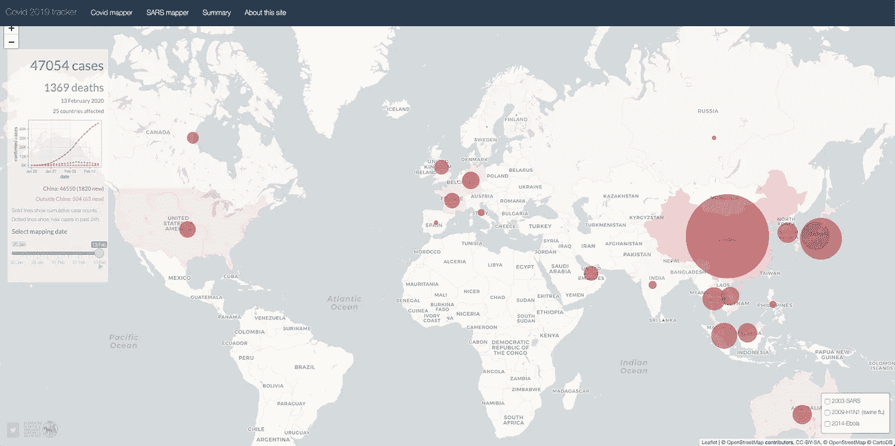

# 为什么新冠肺炎让强大的现场资产管理变得更加重要

> 原文：<https://medium.datadriveninvestor.com/why-covid-19-makes-strong-field-asset-management-even-more-critical-f80a6cdf5f54?source=collection_archive---------18----------------------->

Image captured from [https://vac-lshtm.shinyapps.io/](https://vac-lshtm.shinyapps.io/)

那么，一种可能成为全球疫情的新型冠状病毒与管理医疗器械和供应制造商现场库存的可见性有什么关系呢？似乎有点牵强。

*还是这样？*

正如[美国之音](https://www.voanews.com/)最近报道的那样，[冠状病毒很有可能会扰乱医疗设备供应链](https://www.voanews.com/science-health/coronavirus-outbreak/coronavirus-may-reduce-us-farm-exports-disrupt-medical-supplies)，这在很大程度上是因为该行业严重依赖中国制造业；这包括药品、设备和电子元件等。许多公司手头只有 1-3 个月的库存，供应链的任何收缩都可能对整个价值链造成灾难性的影响。

好吧。但这与已经流通的油田资产有什么关系呢？

在过去的几年里，我和我的团队花了大量的时间来了解资产离开设备制造商仓库后的流动方式。我们发现，几乎所有与我们交谈过的公司——从小初创公司到主要行业参与者——都有一个共同点，那就是他们对自己在该领域的资产几乎一无所知。他们所拥有的可见性，并不被认为是完全(或完全)可靠的。也就是说，从产品离开仓库到制造商收到一份使用表格来说明消耗，这基本上是一个黑洞。(夸张？不完全是。)

“我有一个电子表格，它告诉我我的设备应该放在哪里，”一位销售副总裁告诉我。“但我可以 99%肯定地告诉你，这至少有 75%是错的。”

 [## 医疗保健的未来正在被一场大型技术入侵所塑造|数据驱动型投资者

### 过去十年，全球经济的所有部门都经历了大规模的数字颠覆，而卫生部门现在…

www.datadriveninvestor.com](https://www.datadriveninvestor.com/2018/11/02/the-future-of-healthcare-is-being-shaped-by-a-big-tech-invasion/) 

那么，这和新冠肺炎到底有什么关系？事实证明，很有可能。一种新病毒的出现已经感染了数万人，杀死了数百人，导致边境关闭、企业关门和旅行禁止，其明显的副产品是中断(并威胁瘫痪)了许多供应链。具体来说，原始设备制造商将无法获得完整的或组成部分，以推动新产品在需要的地方和时间进入该领域。

这是个问题。一个大问题。

***无力提供产品就是*** 无力提供价值。这影响了制造商的业务。这会影响他们的品牌。它影响了提供护理的能力，进而影响了无数患者的健康和安全，这些患者无疑会受到影响。如果你了解医疗保健，你就会知道这是不可接受的。

那你还剩下什么？在没有新产品的情况下，它留给你的是该领域中已经存在的未使用的资产；那些漂浮在黑洞中的东西，你称之为你的分销和客户网络。这当然是有意义的。当然，除非你不知道这些资产在哪里，谁拥有它们，它们处于什么状态，以及如何得到它们。当然，你知道你*认为*拥有他们；但这不是一回事，对吗？

事实证明，许多公司*实际上*过度生产资产，以说明(至少)两个现实:1)不完全确定在任何给定时间将需要什么——想想“针对所有类型的伤害和生理的 35 种尺寸的可植入螺钉”——以及 2)容纳黑洞，该黑洞可能会吞噬可能经常需要的关键资产，而几乎没有人注意到。

对于许多(虽然可能不是所有)公司来说，这种情况的最终结果是仓库中的资产有限，而与此同时，医院和 ASC 的货架上或野外的行李箱中却有大量资产。当供应链被打乱，你在某种合理的提前期内订购更多产品的能力受到挤压时，你感受到的是 ***可见*** 供应减少的痛苦。也就是说，你感到被挤压了，因为你真正能知道的只是你能看到的……而事实证明，你看不到那么多。

当你不能订购新产品或不能依靠及时交货将产品推入你的分销渠道时，你就只能手忙脚乱地寻找任何能满足需求的东西。这导致:

1.  增加了追踪库存的人工时间
2.  由于工作量增加，员工压力增加
3.  所有这些工作的成本都增加了
4.  增加了运输和运费，因为你要么把所有东西都带回家检查完整性，要么因为你要加快处理那些花了很长时间才找到的物品
5.  增加了病人的风险，因为你不能保证他们需要的东西会准时到达，或者根本不存在
6.  客户满意度下降，因为，嗯，**以上所有**

当然还有更多，但这可能是重点。

那么如果你把 ***实际可见性*** 转化为你的 ***完全供给*** 在这些情况下会发生什么呢？

首先:

1.  更有效地将供应品从它们所在的地方运送到需要它们的地方，而不需要全面召回所有东西
2.  通过确定需求点和供应点之间的最短距离来降低运输成本
3.  基于准确的信息，以最高效的方式转移库存，从而加快响应速度
4.  通过移动现有产品增加总体库存周转率
5.  通过提高到期资产的可见性减少浪费
6.  通过增强对销售代表的信任来减轻他们的压力，他们将及时获得所请求的供应品，并将错误降至最低
7.  通过提高履行可靠性提高客户满意度

你可能会想:“尽管有新冠肺炎，我们不应该一开始就这么做吗？”嗯，是的。我们应该。

但是供应链的潜在中断使得这一切变得更加尖锐。对于那些已经在该领域分配资产的公司来说，这不一定是灾难性的。已经或正在想出更好的方法来管理自己对这些资产的可见性的公司，将能够更有效地应对这些不可避免的供应链中断。

它们是不可避免的。

我们都应该记住，造成这些混乱的不仅仅是新冠肺炎或其他全球性疫情的威胁。地震发生了。火山爆发。战争爆发了。征收关税。网络威胁是真实的。政治…嗯，政治。

这并不是说我们需要实施策略来解决这个非常具体的时间点问题，直到它不再是一个问题。新冠肺炎将会消退，随之消退的还有它在许多领域造成的紧迫感。我们需要记住的是冠状病毒不是重点；它的 ***突出了*** 这个点。

关键是，有一百万件事情会影响我们为有需要的患者提供优质护理的能力。在这百万件事情中，有很大一部分在变得严重之前是可以解决的。(听起来有点像你可能从医生那里听到的……)

关键是，如果我们不花时间和精力去识别这些问题，至少理解它们所代表的影响，然后采取措施在可能的情况下解决它们，这是不负责任的(我认为是不道德的)。并且在实施的痛苦被被迫进行的设计的痛苦所加剧之前这样做。

最后，我们需要诚实面对*可能*的实际含义。因为，你猜怎么着:**为你的领域资产带来绝对的可见性**，虽然在短期内不容易，当然也不是没有痛苦， ***是百分之百可能的*** 。