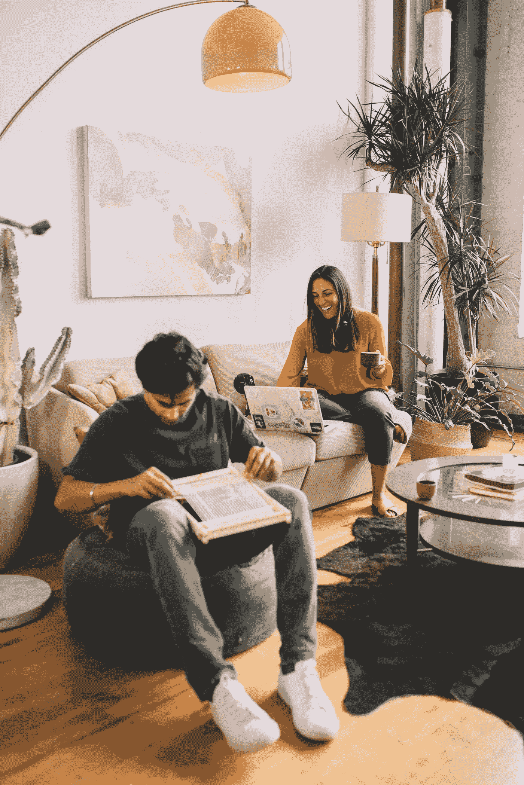

# 为什么创造力不仅仅是被隔离的东西。

> 原文：<https://medium.datadriveninvestor.com/why-creativity-isnt-just-a-thing-of-the-quarantine-b54cad3c61d5?source=collection_archive---------9----------------------->

你的酸面团面包发酵剂能挺过来。

如果你像这个时代(隔离前)的大多数城市成年人一样，你可能在某个时候陷入了熟悉的例行公事:起床、锻炼、赶去工作、享受快乐时光(一到两个小时)、跋涉回家、边看《网飞》边吃晚饭、漫不经心地浏览手机、睡觉——第二天又要重复这一切。

听起来熟悉吗？如果是的话，你真的不孤单。

今天的成年人，尤其是那些在城市生活和工作的人，比以往任何时候都更加忙碌，成就感降低，而 T2 也更加孤独。自从工业革命以来，美国人(实际上是我们的整个社会)一直在[工作更长时间](https://equitablegrowth.org/research-paper/overworked-america/)，休假更少。但是，即使我们更加致力于我们的事业，我们中的大多数人——接近 70%的人——感觉我们甚至没有发挥出我们的创造潜力。

另一方面，我们继续优化生活的方方面面。以至于我们拥有满足所有基本需求(甚至更多)的送货服务。从狩猎采集到超级食物的规模来看，我们做得相当不错。人们可能会想象，随着所有这些技术的进步——我们大多数人都不再用手洗衣服了——我们会比前几代人拥有更多的自由时间来享受。

 [## 数据驱动始于数据素养|数据驱动的投资者

### 光是听到“数据”这个词就令人生畏。老实说，只有 21%的全球员工对自己的工作充满信心

www.datadriveninvestor.com](https://www.datadriveninvestor.com/2020/03/22/data-driven-starts-with-data-literacy/) 

但是，在我们确实拥有的“空闲”时间里——我们选择花在我的联合创始人[**、杜皮和我所说的“低质量休闲”上更具体地说，我们每天花近**](http://www.daydreamerspace.com)**[11 个小时](https://www.portada-online.com/2018/08/13/nielsen-total-audience-report-us-adults-spend-over-11-hours-a-day-online-2/)消费媒体(字面上)。而且，超过 60%的人在起床后 5 分钟内开始浏览手机。**

但是，这不是一个关于技术成为万恶之源的故事。其实是人的问题。我们人类已经集体失去了享受闲暇时间的能力，为了简单的创造而创造……同时享受乐趣。

# 创造力是我们 DNA 的一部分——毫不夸张地说。

## 根据本书的作者安东尼·勃兰特和大卫·伊格尔曼的说法， [*【失控物种】*](https://www.amazon.com/Runaway-Species-human-creativity-remakes/dp/1936787520)*创造力是我们生物的使命。我们人类的历史充满了天马行空的想象力……我们让自己置身于前所未有的事物之中，而猪、羊驼和金鱼则不然。”*

*不管我们是否意识到，我们每天都在创造。每当我们想象一种尚不存在的可能性时，我们都在挖掘大脑中具有创造性的部分，也就是让我们成为人类的那部分。*

*而且，这种创造能力不仅仅是一件“有趣”的事情。它实际上帮助我们活得更长，更快乐。临床研究发现，当我们进入[创造性心流状态时，我们的皮质醇水平会降低，反过来，我们会有更高的免疫力和更低的心脏相关疾病。我们也感觉更快乐，联系更多，更少孤独。](https://www.scientificamerican.com/article/open-mind-longer-life/)*

*但是，我们在现代社会中已经忘记了创造力的主要方面？正如亚里士多德曾经说过的，它是帮助我们感受“内在快乐的源泉”的能力。当我们只是为了创造而创造的时候——无论是厨房里随意搭配的香蕉面包还是拼图——我们都会慢下来。我们不再想我们的副业或成就奖杯，或者莎莉在 Instagram 上比我们做得更好。*

*我们可以简单地存在——没有过滤器或花哨的工具。*

*这个可怕、混乱的时代迫使我们世界上的许多人都这样做了。没有理由。只是为了好玩而创作。用我们手头的“工具”制作东西。感觉很好，对吧？*

*我们已经看到了酸面团面包实验者和新画家的崛起。我们见证了抖音舞者和社区(尽管是数字化的)读书俱乐部的成长。我们都在写日志、装饰和制作东西——不管我们是否向我们的社交媒体关注者展示。*

*当我们发布机器人般的时间表时，我们都自然而然地被这种与生俱来的人类行为所吸引，没有压力。*

*我在《商业与生活》的合伙人杜皮和我 [**在检疫隔离前几天创办了一家公司**](http://www.daydreamerspace.com) 完全改变了我们的生活，当然是在不知不觉中，叫做[白日梦者](http://www.daydreamerspace.com)。我们的目的是帮助日常生活中的成年人更频繁地接触创造力，做更多的白日梦。我们自己经历了工作-健身-睡眠仓鼠轮，最后，不知何故，设法摆脱了。*

*但是，我们也想帮助其他人这样做。我们的使命是“重新定义自由时间”，并通过这样做，让世界更有活力。*

*当我们都在经历这个正在改变我们集体行为的重大、艰难和强迫性的社会实验时，我们希望确保我们所有人在被允许离开公寓很长时间后仍能继续创造。*

# *那么，当我们再次进入“现实世界”时，我们如何保持这种创造性的(人类)心态不变呢？*

*当我们在漫长的一天工作后，无意识地浏览网飞或手机时，我们该怎么办？我们如何按下生产力转盘上的暂停键，给自己创造的空间，只是为了好玩？*

## *好吧，首先要做的是:把创造变成一种习惯。*

*当你每天出现的时候，你不需要做太多，或者真的，做任何有益的事情。但是，承诺评估你如何度过你的空闲时间，理解它给你带来的感受，并出现在那些让你开心的事情上，这是重要的第一步。*

## *其次(也是最重要的):降低该死的门槛。*

*你的目的不是成为一名绘画大师或者在 Etsy 上出售你的雕塑(或者你可能会这样做——除非你想这样做)。在我们今天的世界里，把我们的爱好变成副业已经变得异常普遍。将我们对纸杯蛋糕的热爱发展成一项价值数十亿美元的生意。每当我们开始一个创造性的爱好时，我们经常会听到这样的评论:“哦，你真擅长这个！你什么时候把它变成生意？”*

*但是，正如我们所看到的，并不是所有的创造习惯都需要——或者应该——成为除了我们休闲时间的发泄渠道之外的任何东西。我们无所事事的空间，去尝试，去感受内在快乐的源泉。*

*变回人类，而不是每天在机器仓鼠轮子上跑来跑去。*

# *那么，你愿意和我们一起成为一名休闲员吗？*

## *如果是这样，我们迫不及待地想和你一起开始(并保持)创作。*

*如果这个故事引起了你的共鸣，给它一颗心，这样更多的人可以阅读它！此外，查看我们公司的更多信息，[白日梦者](http://www.daydreamerspace.com)([@白日梦者空间](http://www.instagram.com/daydreamerspace))，他们的使命是改变我们所有人度过空闲时间的方式，让我们感觉更有活力。加入我们吧！*