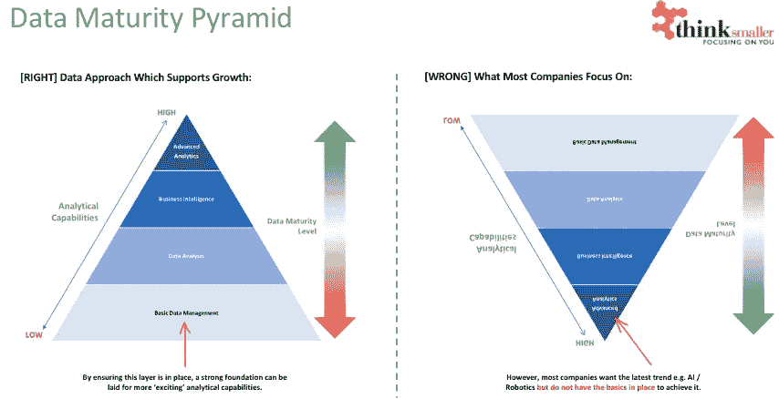

# 为什么数据不是新的石油。

> 原文：<https://medium.datadriveninvestor.com/why-data-is-not-the-new-oil-de1e5fbac6e8?source=collection_archive---------12----------------------->

我们该进行一次诚实的谈话了。

在过去的几年里，以太中有太多的噪音，导致了兴奋、困惑和幻灭。

原因？数据。

杰出人物发表的重大声明影响深远，这让我们中的一些人生活非常艰难。

使用“数据是新的石油”这样的点击诱饵标题造成了歇斯底里，以至于每个人都加入了“数据潮流”。世界经历了一个时代，一切都围绕着数据，它被宣称是这个新的闪亮的东西，将解决我们所有的问题。

每个供应商都转向提供数据服务，要么是通过咨询，要么是推出特定的软件。没有什么比让“ ***数据的重要性*** ”一周 7 天 24 小时向你灌输更糟糕的了。

它只会激怒人们。

我应该知道。我在野外工作。

我的不满不在于我们现在所处的位置，而在于带领我们来到这里的方法。

你可能想知道这是为什么？

**很简单，我认为数据不是新的石油；远非如此。事实上，数据是任何企业的生命线。**

它比石油更完整。

需要油来润滑发动机，使它们运转。但是从可持续发展的角度来看，血液服务于身体。

 [## 领导力。赢得|数据驱动型投资者需要更广阔的视角

### 不管他们愿不愿意，领导者都是快速运转的机器中的齿轮，这就要求他们夹住自己的爪子…

www.datadriveninvestor.com](https://www.datadriveninvestor.com/2020/02/07/leadership-it-takes-a-wider-perspective-to-win/) 

发动机可以靠油生存(尽管效率低且痛苦),但身体不能没有血液。在身体各处携带氧气，提供血浆中的营养物质来治愈和再生周围的细胞。

血液远比石油更完整。

Photo by [LuAnn Hunt](https://unsplash.com/@luannhunt180?utm_source=medium&utm_medium=referral) on [Unsplash](https://unsplash.com?utm_source=medium&utm_medium=referral)

数据也是如此。

问题是，长期以来，企业忽视了这一事实。

而不是选择关注收入和销售，使用(潜在的)过时或不正确的信息来推动业务决策。更糟糕的是，关键决策是基于“直觉”做出的——在我看来，这被美化为赌博。

那么，发生了什么？

突然之间，世界被数据请求轰炸。

**脸书是第一个意识到我们作为消费者就是产品的人。我们为他们提供决策所需的数据。接下来增加哪些功能，瞄准哪个收入流，公司应该战略性地向哪个方向发展？**

所有这些都来自于我们作为用户输入的数据。主动放弃。免费的。

我们没有意识到，所有这些信息最终会将哈佛宿舍里的一个想法变成世界上最大的科技公司之一。

全靠数据的力量。

马克·扎克伯格很早就意识到，数据将推动他的业务进入他以前只梦想过的领域。

他的公司每天都在获取大量的数据，这为他提供了丰富的资源来帮助假设下一步该何去何从。快进一二十年，地球上至少每三个人就有一个脸书账户(据说是活的)。

天啊，真令人印象深刻。

所有这些都是通过鼓励我们把我们的信息免费放到他的平台上。

随着互联网时代以惊人的速度发展，越来越多的公司意识到需要利用数据来获得优势。一些公司做得比其他公司好*，例如 Airbnb 和优步*，而一些公司不太成功*，例如百视达、伍尔沃斯*。

不管怎样，数据成了交易的破坏者。游戏改变者。竞争优势。

**这就是我的挫败感所在，因为个人和公司一直都知道数据有多重要，只是被忽视了。**

Photo by [Stephen Dawson](https://unsplash.com/@srd844?utm_source=medium&utm_medium=referral) on [Unsplash](https://unsplash.com?utm_source=medium&utm_medium=referral)

我为什么这么说？

你所需要做的就是看看会计师或税务顾问公司……他们是如何代表客户做出商业决策的？

他们获得当时所有可用的信息，并利用这些信息来确定最佳的可能结果。

## 这是正在运行的数据。

而且已经有几十年了！

有钱能使鬼推磨，最近看了一部关于 20 世纪 50 年代黑帮的电影，即使他们也知道数据的力量。他们的会计是组织中最有权势的人之一…知道如何隐藏、洗钱或清洗黑钱。

这不是一个次要项目，而是主要活动。

保存在小黑本子上的数据是这个组织的命脉。没有它，该组织将很难通过贿赂警察、贿赂县官员或其他方式来保持这种影响力。

提到黑帮的日子可能有点不合时宜，但我希望你能明白我的想法。毫无疑问，数据的重要性已经存在多年了。

是我们错过了。

这就是令人沮丧的地方。

突然间，世界被告知数据是自切片面包以来最重要的东西。切片面包已经存在很长时间了！

在数据领域，技术发展带来的创新进步非常令人兴奋。

使用人工智能(A.I.) /机器学习(M.L .)来帮助推动世界各地的疫苗研究，例如新冠肺炎，或者努力解决世界各地缺乏卫生设施的问题( **Google** : [*比尔盖茨请记住网飞！*](https://www.netflix.com/title/80184771) )既令人兴奋又令人谦卑。

但可悲的是，大多数公司无法利用这些见解，因为应用它们太难了。我们不是生物科学专家，甚至无法实现先进的分析模型来帮助决策，因为这是方孔中的圆钉。

我可以补充说，不是因为不想尝试！

相反，我们都应该确保我们的基本数据管理绝对可靠；高效、稳健地工作，提供经营企业所需的管理信息。

这可能是一个跨国公司或一个家族经营的企业，无论哪种方式，如果你不能调用你需要的信息，当你想，知道它是高质量的，其余的只是一个白日梦。

我希望这个世界能接受这个事实。

如果你把基础打好了，其余的就会跟上。我保证。

没有坚实的基础，你将一事无成。对火箭来说不是科学；这是创建一个数据支持(而不是驱动！)组织。

如果你一开始就追求机器学习或预测分析，我祝你一切顺利。但是，如果它不像预期的那样工作，请不要感到惊讶&迎接它的是那四个神奇的词…“我告诉过你了。”

Data Maturity Pyramid by Think Smaller Limited

现在我不是一个扫兴的人，远远不是。

事实上，我热爱技术，并对利用数据造福组织充满热情。但是我们需要把基本的东西做好。

理解和使用数据应该是整个组织特有的，就像语言推理和数字素养一样。整个组织需要有一个基本的理解水平。

> **数据不应该被束之高阁，留给少数人。**

这样做，你是在使问题变得更糟，制造分裂。

没错，和任何职业一样，也有专业领域，但让每个人将数据编织进组织的 DNA，这一点至关重要。正如机器人流程自动化(RPA)一样，数据科学家也有自己的位置，但顺序和时机将决定成败。

请想一想，我过去谈过的一家重要的人工智能/人工智能公司已经为不同的公司进行了大量的试点，但没有一家投入生产。一个都没有。

*这告诉我们什么？*

要么试点项目没有针对需要解决的问题，要么企业没有为此做好准备。

在一个组织中安装机器学习机器人的成本和努力可能没有你想象的那么多，但如果结果不是实质性地改善员工的生活或减少特定流程中的努力，那还有什么意义呢？

是的，它们是很酷的项目，确实有它们的位置，但不能代替老式的基本数据管理。

如果您可以从一个(或几个)对其质量有高度信心的黄金来源调用信息，同时它符合相关的标准和协议(读取 GDPR、保留策略等)，那么您就有可能利用数据领域中更令人兴奋的部分。

请不要因为对你数据的管理不到位，就否定高质量 M.I .的首席执行官。

如果他或她根据次优数据做出重大商业决策，但你有一个机器人执行一些概念验证任务，我会掩护他。

## 奇妙的是，我们都有机会对一个组织产生重大影响。

理解数据如何工作，最重要的是，理解数据如何应用于业务，即现实世界的应用，是一项非常需要的技能。

**在技术世界和高管之间搭起桥梁是我最擅长的。**

如果你做对了，制定愿景和战略，使一个组织具备数据素养和数据能力，将会获得数倍的回报。

*你是怎么做到的？*

通过解决考试问题…也就是对你的利益相关者来说最重要的问题。

如果是首席风险官，那就把重点放在让他/她远离监管者的交叉火力上；例如，如果是首席财务官，就要集中精力让营运资本更加清晰。

无论在什么情况下，你都需要根据听众的需求来设计问题。最重要的是，倾听利益相关者的意见，确保准确简洁地抓住问题。

Photo by [Ivan Aleksic](https://unsplash.com/@ivalex?utm_source=medium&utm_medium=referral) on [Unsplash](https://unsplash.com?utm_source=medium&utm_medium=referral)

我们在这里有点跑题了，但是快速准确地确定可以通过数据缓解的业务难题的能力被大大低估了。

就像医生可以通过抗生素来减轻病人的痛苦一样，数据办公室也可以通过数据改进来减轻组织的痛苦。

> *确认症状，诊断问题，然后解决根本原因——通过这样做，我向你保证，患者(或业务的一部分)将会 a)心存感激，b)询问你还能做些什么。*

从这里开始，它变得非常令人兴奋。

直接解决组织内部的痛苦和挫折是非常有益的；了解到您的团队已经将创建报告的时间从 2 周减少到不到 1 天，或者重写代码以便在不到 10 分钟的时间内执行操作，而以前这需要几个小时，这就是我们去工作的原因。

会有多个场景，很多痛点，你只需要找到它们在哪里。

解决方案极不可能是最先进的、令人兴奋的新技术，只有量子物理学家才能实现。

相反，对问题应用实用主义和逻辑，知道成功是什么样子意味着你在为未来努力——朝着愿景努力，实现战略。

毕竟，你只需要记住三个词:

*   ***目标、战略、战术***……对不对阿利斯泰尔达林？

随着血液在病人体内流动，组织的数据也在流动。

尽你所能去忽略它，但最终你将无法做到。

# 即使你是该领域的领导者，你也会发现竞争优势被侵蚀的速度比你想象的要快。问问百视达他们表现如何就知道了。

*如果你现在被问到这个问题，“数据是新的石油吗”？你的答案会是一样的吗？*