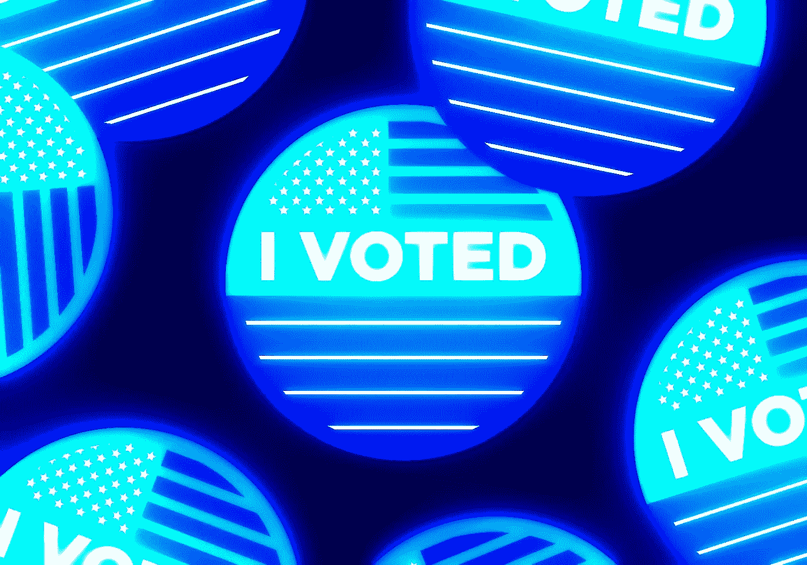
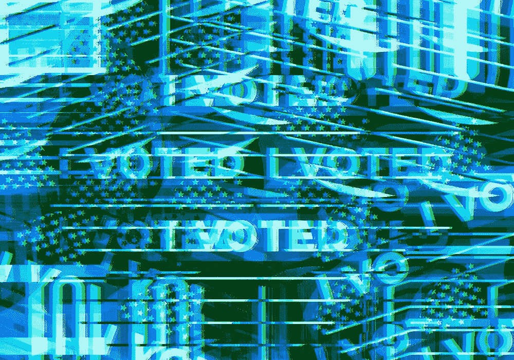
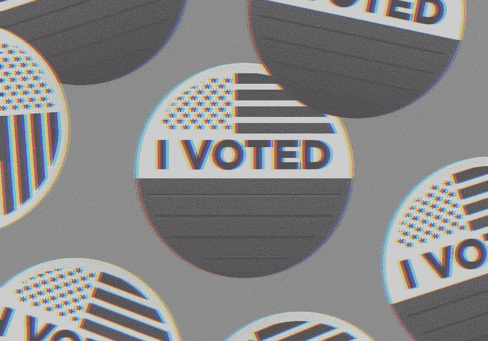

# 为什么数据科学是新十年最性感的工作

> 原文：<https://medium.datadriveninvestor.com/why-data-science-is-the-new-sexy-35ef32f747e6?source=collection_archive---------19----------------------->

它知道这一点。

Photo courtesy of Unsplash

如今，个人、企业和软件平台正在创造出数量惊人的数据。拍了数百张自拍并拒绝删除的青少年，或在 iPhones 上无限量截图的成年人。想象一下地球上每个人每天产生的数据量。在接下来的几年里，所有这些都会变得更大。它只是坐在那里。 ***Data-geddon*** 肯定是未来值得期待的东西。在这一点上，这是不可避免的。以后我们会多讲这个话题！无论如何，你的设备里还有更多的数据。在最近的十年里，计算机科学家已经想出了利用闲置数据的新方法。大多数企业将使用数据科学家来分析数据并获得有用的见解，从而获得竞争优势。数据科学将对人们变得更加重要，不仅仅是对企业。

> 计算机科学+数据挖掘= **数据科学**

*数据科学就是利用收集到的数据得出关于特定环境的有用见解。《出埃及记》脸书用户，媒体作家。*

在遥远的未来，数据科学将会产生一系列机会，展现无限的潜力。毫无疑问，这个领域没有任何进展缓慢的迹象。数据科学将是那些未来的职业之一，将享有高需求和光明的生态系统。

为什么数据科学是一个性感的行业/领域/职业，原因如下:

*   **数据科学本身可以预测未来，通过分析数据，您可以得出能够非常准确地预测事件或行为的结果**
*   **数据科学被证明能够提供关于某一特定主题范围的详细知识，只需要很少的数据点**
*   **公司的运营依赖于人工智能或基于数据的解决方案，这为有抱负的数据科学家带来了更多机会。**
*   **数据驱动已经成为研发的新标准**

## **数据科学可以帮助世界上的任何人做出更好的决策**

Photo courtesy of Unsplash

人工智能将与人类已知的各种行业重叠。没有幕后的数据，人工智能本身就不是人工智能。人工智能的伟大之处在于它与数据科学的结合。
将产生巨大影响的人工智能+数据科学用例:

## **1。生物黑客**

运动员植入监测身体健康和项目的整体表现。每当人们处于心脏病发作的边缘时，他们都会得到警告。可以智能调节血糖水平的糖尿病患者。

## **2。自动驾驶或自动驾驶车辆**

特斯拉主要是自动驾驶汽车标准的驱动力。无人驾驶汽车无疑是下一个大创意，不仅在交通领域，在许多其他领域也是如此。这是一个由互联汽车和基于人工智能的技术组成的网络，该系统将允许道路上的大量车辆像人类一样相互交流。

## **3。福音战士或超级战士或电子人**

想象一下像终结者或者美国队长一样有超级士兵血清。我们人类的身体是有极限的。升高温度，我们无法生存，降低温度，你不得不整个星期都呆在床上。机器人技术和人工智能的结合将迎来人类历史上最激进的时代之一。我们会像终结者一样，我们不必担心我们的身体限制

这些只是**人工智能+数据科学**正在兴起的几个用例。令人惊讶的事实是，有许多公司的成立只是为了研究人工智能+数据科学可以在哪些方面产生重大影响。这些新兴技术需要大量的数据或所谓的“大数据”，这些数据将由数据科学家小心处理。数据即科学毫无疑问是未来十年的热门职业。如你所见，不要落后！

 [## 将定义 2020 年就业前景的五大数据科学和机器学习趋势|数据驱动…

### 数据科学和 ML 是 2019 年最受关注的趋势之一，毫无疑问，它们将继续发展…

www.datadriveninvestor.com](https://www.datadriveninvestor.com/2020/02/19/five-data-science-and-machine-learning-trends-that-will-define-job-prospects-in-2020/) 

*感谢您花时间阅读这篇文章！欢迎让我知道你的想法，如果你对这个故事有任何意见或反馈，请随时联系我。所有的观点都是我自己的，并不反映任何上帝(耶稣基督)的观点。*

## 下一个阅读建议👇🏻:
[***为什么 AI 是新互联网***](https://medium.com/swlh/ai-is-the-new-internet-5ea3316e14dc)