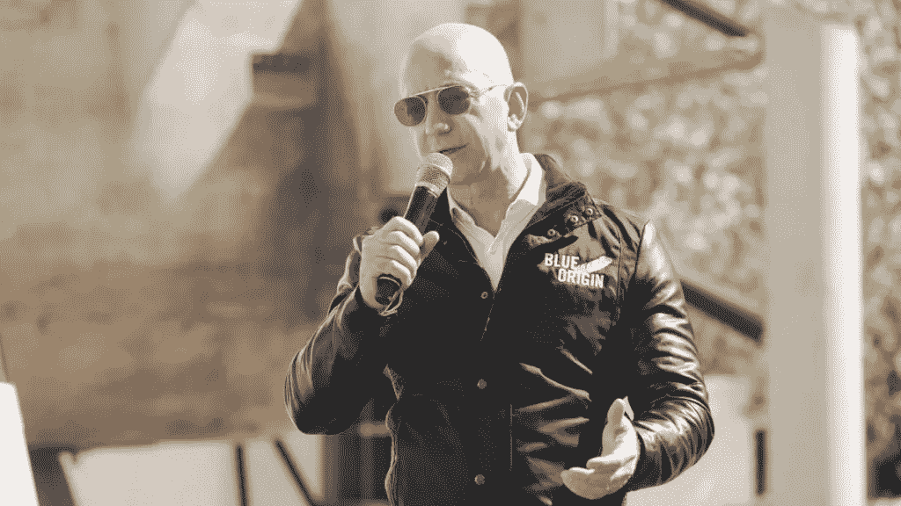

# 贝佐斯为什么要买《华盛顿邮报》？

> 原文：<https://medium.datadriveninvestor.com/why-did-bezos-buy-the-washington-post-bffb2e957477?source=collection_archive---------2----------------------->

亚马逊首席执行官杰夫·贝索斯在 2013 年收购了《华盛顿邮报》,三年之内，该报的网络流量翻了一番并开始盈利；对于一家在金融危机中苦苦挣扎的媒体公司来说，这是一个令人印象深刻的壮举。据《华盛顿邮报》的前任老板唐纳德·格拉汉姆(Donald Graham)称，这不是杰夫快速取得成果的天赋，而是他的**【极端长远的想法】**导致了这一成功。格雷厄姆还表示，当他为《华盛顿邮报》寻找新老板时，他一直是“亚马逊的大客户”，在与贝佐斯的最初对话中，他的第一印象是“这家公司运转得多好”。格雷厄姆将亚马逊的成功归功于贝佐斯长期思考的“惯常特征”。

那么，这位技术巨头希望从这次收购中获得什么呢？

当被问及此事时，唐纳德·特朗普(Donald Trump)总统没有帮助弄清真相，最近他断言(没有任何证据支持)贝佐斯收购该报是为了为亚马逊“游说”，从而污染了这个话题。然而，当贝佐斯本人被问及他的动机时，他试图解释他的理由，贝佐斯评论道，“某些机构在确保有光方面发挥了非常重要的作用，我认为华盛顿邮报有一个席位，一个重要的席位，因为我们恰好位于美利坚合众国的首都。”

这是任何人能给出的最完美的外交回答。

根据一些知名记者的说法，比如《T4 时报》的大卫·斯特雷特菲尔德和克里斯汀·豪格尼，他不会对新闻业或记者进行所谓的照明和照明，只在他即将在亚马逊推出新产品或服务时才会联系他们，然后仍然严格遵守信息。

 [## 创业公司的顾问？与他们合作的 4 种最佳方式|数据驱动型投资者

### 顾名思义，顾问能给你的建议对一个人来说是成功还是失败的关键

www.datadriveninvestor.com](https://www.datadriveninvestor.com/2020/09/27/advisors-in-your-startup-4-ways-to-best-work-with-them/) 

他玩了一个秘密的策略，在 6 年后的今天，这个策略被公之于众。据博客作者 Jay Baer 称，杰夫购买《邮报》的一个潜在原因是:

**吉列剃须刀网**
吉列通过赠送剃须刀卖刀片赚了一大笔钱。杰伊认为贝佐斯在《华盛顿邮报》和 Kindle 上做了同样的事情。亚马逊的电子阅读器在电子书领域取得了巨大的成功，但他没有在期刊领域看到类似的优势。他确信他们就在那里——也许是你——但是他不知道有谁会经常在 Kindle 上阅读报纸。贝尔的预感是，这是贝佐斯将购买的许多廉价印刷品中的第一个，并将转变为免费订阅…..仅适用于 Kindle 用户。因为这样做会从媒体公司那里抢走支付给亚马逊的钱，贝佐斯亲自进行了收购，以防止媒体方面的赤字拖累亚马逊的财务状况。

我认为这非常有意义，否则，为什么被称为技术先锋的杰夫会愿意涉足垂死的报业。

另一个不太可信的原因可能是:

**白骑士戏**
也许贝佐斯是出于文化原因而非商业原因进行此次收购，以保护《邮报》的传统和庄严，使其免受其他所有者的控制，他们可能会以更少的尊重和更锋利的刀子对待它。鉴于受人尊敬的格雷厄姆家族——他们永远拥有该报——出售给贝佐斯可能表明他们完全同意他提出的轨迹。

这似乎不太可信，因为贝佐斯一直被认为是一个残酷的商人，尽管 2.5 亿美元对他来说是微不足道的，但他不会仅仅为了保护文化而浪费它。

不言而喻，买报纸传达了一种新的身份。一些报纸所有者的自我意识因精神收入而泛滥。像 MLB 和 NFL 的特许经营者一样，他们成为他们所在地区的直接球员。他们打给政客的电话不仅会得到回复，政客们还会打电话给他们，寻求批准、支持和认可。如果他们拯救了一份被折叠的报纸，他们将被视为公民英雄。当他们的观点在一夜之间变得有价值时，邀请他们在团体面前讲话和出现在电视上就成为现实。拥有一份报纸的回报如此之大，难怪不是每个千万富翁都买一份报纸。报纸可以是一个很好的玩具。这是当地社区和《邮报》等报纸利用权力的工具，甚至可以通过朗朗上口的标题斥责唐纳德·特朗普(Donald Trump)等候选人来左右全国大选。

最好认为《华盛顿邮报》的收购可以归因于杰夫·贝索斯对华盛顿特区进行的改造中的一部分。2017 年初，他买下了华盛顿最大的住宅，这是两座合并的大宅邸，以前是纺织博物馆的所在地，大概是为了用奶酪和葡萄酒款待有权有势的人。最近几年，他通过参加 Gridiron 俱乐部和苜蓿俱乐部主办的内部事务，将自己与华盛顿的权势集团更紧密地联系在一起，这些俱乐部是行业领袖和政治家社交的场所。如果他选择北弗吉尼亚或马里兰郊区作为亚马逊 HQ2 的总部，他在华盛顿的形象将变得不朽。

贝佐斯在收购*邮报*后接受采访时说，“报纸的职责是对读者，而不是所有者。”传递得很好。我们应该让贝佐斯永远坚持下去。

# 行动呼吁

如果你想读更多这样的东西，请跟我来，[帕什·贾恩](https://medium.com/u/e4ab0aa14174?source=post_page-----aa0367297436--------------------------------)

欢迎批评。

## 访问专家视图— [订阅 DDI 英特尔](https://datadriveninvestor.com/ddi-intel)