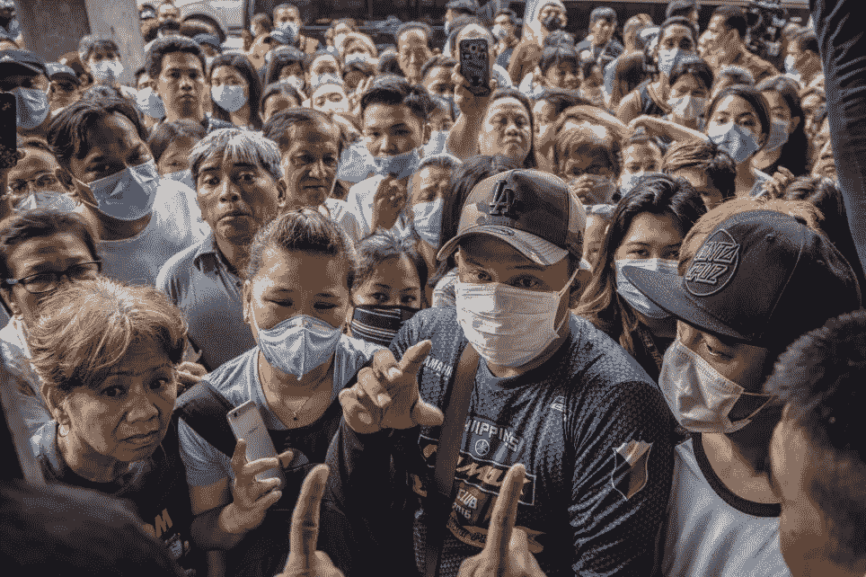

# 新冠肺炎为什么离开中国？

> 原文：<https://medium.datadriveninvestor.com/why-did-covid-19-come-out-of-china-27a5094a98d6?source=collection_archive---------4----------------------->

Picture from Metro.co.uk

为什么新冠肺炎没有出现在瑞典、澳洲或叶门？为什么会出中国？

我在这篇文章中认为，像新冠肺炎病毒这样的危险病毒已经出现在中国，并将继续出现，因为那里人与动物之间的关系。

尽管中国可以说是罪魁祸首，但西非，事实上，正如我在这里所说的，西方大部分国家本身也是有罪的。我们所有人都应该重新思考我们与动物、土地以及彼此之间的关系。

首先，让我用一个类比来解释病毒。

**肥皂泡 mac-soapface**

想象你经营一家肥皂厂。你有一群不同的顾客，他们都想为各自的企业生产不同种类的肥皂。制作肥皂的说明在总公司。每天，你的经理都会收集说明，并让工厂工人认真遵守，以便始终如一地为正确的零售商生产含有正确成分的正确肥皂。

一切似乎都在正常进行。但是有一天你的经理跑进你的办公室。“老板”，他喊道。“我们被军队包围了！他们威胁要向我们开火！”

“军队？到底是怎么回事！”你惊呼。“我们只是在做肥皂。我会跟他们说的，一定有什么误会。”

“他们指控我们制造武器，老板。他们说，如果我们不马上停下来，他们会向我们所有人开火。他们会摧毁一切，整个工厂，每个人。”

“这太荒谬了。他们怎么知道我们在制造武器？说说假新闻！去工厂看看，确保一切正常。我们将开放这个地方进行检查，军队的人可以自己看，我们没有什么可隐瞒的。”

你的经理跑开了，过了一会儿又回来了，浑身发抖。“老板，我有一些坏消息。我不知道该怎么告诉你……通常运送肥皂块的普通传送带。它带着……手榴弹。”

你跑到工厂车间。你的目光立刻扫向传送带。数以千计的手榴弹正沿着它移动。你冲向一名工人，使劲摇晃他们。"你他妈的为什么要做手榴弹，你这个白痴！"

“老板，我们只是按照指示办事。”

“说明？到底是谁给你这些指示的？”

工人拿出一张纸。里面有制作手榴弹的说明。“你的总公司。”

你冲向你的经理。"你到底在做什么给手榴弹而不是肥皂发指令？"

“嗯，有一位先生，格利先生，他昨天带着一个公文包来了，他说他有一般的肥皂，只是做了一些小的改动，这是他的新零售店所需要的。他像往常一样把说明书留给了我。根据标准惯例，我们今天早上把它们分发到了工厂车间。”

"你到底是怎么让一个手榴弹制造商通过安全门的？"

“嗯，老板，他以一名肥皂特工的身份登记，戴着一顶“让肥皂再次伟大”的帽子，有一辆标有“肥皂麦克肥皂脸”字样的汽车。我们怎么知道？”

“我该怎么跟军队说？哦，对不起，某某将军先生，我们正在做自己的事，做肥皂，突然有人把肥皂说明书换成了手榴弹说明书？谁会相信呢，”“我们死定了，西姆金斯，我们都死定了，”"

在上面的类比中，肥皂工厂代表一个人类细胞。总公司的说明书代表了细胞的 DNA。生产线代表将遗传指令翻译成细胞物质的核糖体机器。狡猾的特工(将手榴弹指令偷偷带进总部)就是病毒。工厂安全门代表允许(或排除)异物进入的细胞受体。手榴弹本身代表了病毒蛋白质。军队是免疫系统。

 [## 保护主义、政治和经济动荡|数据驱动的投资者

### 美国股市昨日出现 400 多点的大幅反转，为未来的事情发出了警告信号。市场…

www.datadriveninvestor.com](https://www.datadriveninvestor.com/2018/06/28/protectionism-politics-economic-turmoil/) 

是的，军队正准备向工厂开火。

但是我们的故事并不完整。回到我们的类比:如果军队没有出现，工厂工人收到的最后一组指令应该是:

> 第十一步。制造 10，0 00 辆汽车，每辆车的侧面都有醒目的大字，写着“肥皂麦克肥皂脸”。
> 
> 第 12 步:制作一张工厂通行证，上面写着“可信的肥皂推销员”，并贴上一张格利先生咧着嘴笑的照片。
> 
> 第 13 步:制造一个机器人，看起来就像 Glee 先生，编程说:“嗨，我是最佳肥皂无限公司的代表，我需要你制作我的特殊肥皂。”
> 
> 第 14 步:把格利先生放进标有“肥皂麦克肥皂脸”的车里。

最后一步完成后，Glees 先生会向窗外发射手榴弹，摧毁工厂，然后开车去寻找新的工厂。

**病毒重组**

想象一下，现在加拿大和美国都有许多不同的工厂。加拿大工厂只生产肥皂。但是美国工厂既生产肥皂又生产手套。

想象一下，有许多秘密特工一直试图闯入工厂。加拿大经常被试图进入其肥皂工厂的秘密特工包围。然而，幸运的是，门口的安全措施很好，绝大多数秘密特工出示声称是手套代表的身份证件，并立即被拒之门外。

但是现在想象一下，在美国，一个特定的工厂车间正在生产手套和肥皂。这家工厂已经被格里先生打入内部，开始制造手榴弹和肥皂盒汽车。但不幸的是，它也被斯迈思先生渗透了，他正在秘密制造 AK47s 和标有“手套反斗城”的汽车

两名特工同时向总部下达指令，造成混乱。在生产车间里，肥皂麦克肥皂脸汽车开始冒出来，装的不是手榴弹和欢乐合唱团的克隆人，而是 AK47s 和斯迈思的克隆人。斯迈思先生通常只能进入手套工厂，但现在他偶然开了一辆上面写着“肥皂麦克肥皂脸”的车。斯迈思先生开车去加拿大，肥皂厂第一次让他通过安全门。

上面的故事说明了病毒重组的问题。这两个国家代表两个不同的物种。加拿大代表了能够被单一病毒感染的单一物种。美国代表了一个“混合容器”,能够成功地被多种病毒混合感染。

在美国代表的病毒汤里，来自一种病毒的遗传物质交叉污染了另一种病毒的遗传物质，产生了新的弗兰肯斯坦病毒。随着时间的推移，这种剪接过程的多次重复有利于众所周知的斯迈思先生的产生，即跨物种感染。

这种病毒基因混合的实际机制是复杂的，并且知之甚少。重组机制被认为是遗传物质在宿主细胞核中制造出来后，在被包装成完整的病毒包膜时发生的意外事件造成的。在这一阶段的某个时候，两种病毒的基因片段在细胞周围漂浮，并可能意外地被集中到一个衣壳中，带来来自父母双方的特征。

**混合容器**

作为混合容器的动物具有两种特性:

1.  与人类有一定程度的基因相似性
2.  生活在人类和其他动物附近

因此:鸡、猪、狗、骆驼、蝙蝠和野生鸟类是高风险混合容器。

其中，猪可以说是罪魁祸首。它们容易受到人流感和禽流感的感染，并经常从中产生新的病毒组合。[例如，中国科学家](https://www.tandfonline.com/doi/full/10.1038/s41426-018-0088-z)在最近 2018 年的一篇论文中报告称，他们在 2013 年至 2015 年间从猪身上分离出了 14 份病毒样本。其中，10 种被发现是人、猪和鸟病毒的混合体。更令人担忧的是，其中一些细菌的表面标记表明它们可能会感染人类细胞。

蝙蝠同样危险。它们是多达 60 种感染人类的病毒的宿主。它们数量众多，密集成群，通常生活在人类和其他动物共享的区域。它们在人类使用的水源中大便和小便。由于具有流动性和迁移性，它们迅速将新病毒传播到更远更广的地方。

在西非的部分地区，人类生活在蝙蝠附近，并以它们为食。蝙蝠是伊波拉病毒、马堡病毒、尼帕病毒和非典病毒的天然宿主，这绝非巧合。

目前的新冠肺炎病毒与马蹄蝙蝠冠状病毒有 96%的相似性。但是病毒遗传物质的片段也显示出与穿山甲冠状病毒的显著相似性，特别是在负责感染宿主细胞的区域。

> 蝙蝠病毒如何与穿山甲病毒混合感染人类，并在人类之间传播？

蝙蝠病毒如何与穿山甲病毒混合感染人类，并在人类之间传播？

**野生动物和牲畜交易市场的危险**

[武汉一个典型的市场](https://www.youtube.com/watch?v=T1Y5SJR5wKM)在死蟒蛇旁边摆放着死狗。活鸡旁边放着死蝙蝠。死鱼旁边的活猪，以及更令人困惑的生物组合，它们彼此之间以及与人类之间都很接近。

像这样的市场是病毒重组切尔诺贝利正在形成。危险成分的整个环境都存在:来自多个物种的多种病毒，彼此混合在一起，在不同的宿主上，非常接近，大量存在，在潮湿的环境中，日复一日，数十年如一日。

在这样的生物实验区，穿山甲接触蝙蝠，结果出现新的弗兰肯斯坦病毒也就不足为奇了。同样很有可能的是，最终的弗兰肯斯坦蝙蝠-穿山甲病毒是在另一种动物如猪的细胞中完成的。

**结论**

新冠肺炎很可能起源于中国，因为那里的人们花时间在挤满家畜和野生动物的高密度市场上。在不卫生和拥挤的公共屠宰场和市场中持续的病毒交叉污染保证了令人担忧的病毒混合水平。

西非依赖于丛林肉，其不断增长的人口与蝙蝠、灵长类动物和家养动物的距离越来越近，是即将出现的新的贪婪疾病的第二大竞争者。我们已经在埃博拉病毒(起源于蝙蝠)和艾滋病毒(起源于灵长类动物)中看到了这一点。

发达国家的猪、牛和鸡的产量令人垂涎三尺，仅略好于亚洲和非洲的高风险国家。美国自己也报道了养猪场的人感染了混合病毒。

随着人口的增长，我们越来越多地与动物生活在一起(或与动物为邻)，我们现在观察到的疾病爆发将越来越有可能发生。

新冠肺炎疫情敲响了警钟，让我们重新思考我们与土地、动物以及彼此之间的关系。值得庆幸的是，到目前为止，这种病毒相对温和，健康人群的死亡率约为 1%。

但是在我们的历史上还有更糟糕的灾难。例如，黑死病的死亡率接近 50%。我们应该做得更好，以避免那个时代可能重演的情况。

**参考资料和进一步阅读:y**

 [## 节段 RNA 病毒的重配:机制和结果

### 在这篇综述中，McDonaldet 等描述了三种已被充分研究的病毒重配的机制和结果。

www.nature.com](https://www.nature.com/articles/nrmicro.2016.46)  [## RNA 病毒重配:宿主跳跃和免疫逃避的进化机制

### 丽贝卡埃利斯荷兰，编辑重配是一种进化机制的分段 RNA 病毒，发挥着重要的…

www.ncbi.nlm.nih.gov](https://www.ncbi.nlm.nih.gov/pmc/articles/PMC4497687/)  [## 病毒遗传学

### 病毒是简单的实体，缺乏能量生成系统，生物合成能力非常有限。的…

www.ncbi.nlm.nih.gov](https://www.ncbi.nlm.nih.gov/books/NBK8439/)  [## 蝙蝠传播埃博拉病毒是因为它们已经进化到不抵抗病毒

### 蝙蝠为一些已知的最致命的病毒提供了避难所，包括伊波拉病毒、马尔堡病毒、尼帕病毒和非典病毒。现在我们可以…

www.newscientist.com](https://www.newscientist.com/article/2161942-bats-spread-ebola-because-theyve-evolved-not-to-fight-viruses/)  [## 2005-2009 年美国人类感染的三重重组猪流感 A (H1)。

### 英国医学博士。2009 年 6 月 18 日；360(25):2616-25.doi: 10.1056/NEJMoa0903812。Epub 2009 年 5 月 7 日。

www.ncbi.nlm.nih.gov](https://www.ncbi.nlm.nih.gov/pubmed/19423871)  [## 中东呼吸综合征冠状病毒进化树的特征分析…

### 人类冠状病毒(HCoVs)属于亚科中的α冠状病毒属和β冠状病毒属

www.ncbi.nlm.nih.gov](https://www.ncbi.nlm.nih.gov/pmc/articles/PMC4178802/)  [## 甲型流感病毒在哺乳动物中的宿主适应和传播

### 在过去的十年里，猪和鸟的大范围甲型流感病毒感染了人类，有时严重…

www.ncbi.nlm.nih.gov](https://www.ncbi.nlm.nih.gov/pmc/articles/PMC3944123/)  [## 猪作为流感病毒的混合容器:对人类和兽医的影响

### 人类流感大流行的历史为未来事件提供了重要信息。疫情发生人类流感…

www.ncbi.nlm.nih.gov](https://www.ncbi.nlm.nih.gov/pmc/articles/PMC2702078/)  [## 蝙蝠携带 60 多种感染人类的病毒

### 当谈到携带病毒，可以跳转到其他物种-所谓的“人畜共患”病毒-蝙蝠可能在一个…

www.livescience.com](https://www.livescience.com/26898-bats-host-human-infecting-viruses.html)  [## 蝙蝠来源的冠状病毒将其宿主范围扩大到猪

### 蝙蝠来源的冠状病毒感染通过“宿主跳跃”在人类中引起严重疾病。最近，小说…

www.sciencedirect.com](https://www.sciencedirect.com/science/article/pii/S0966842X1830060X)