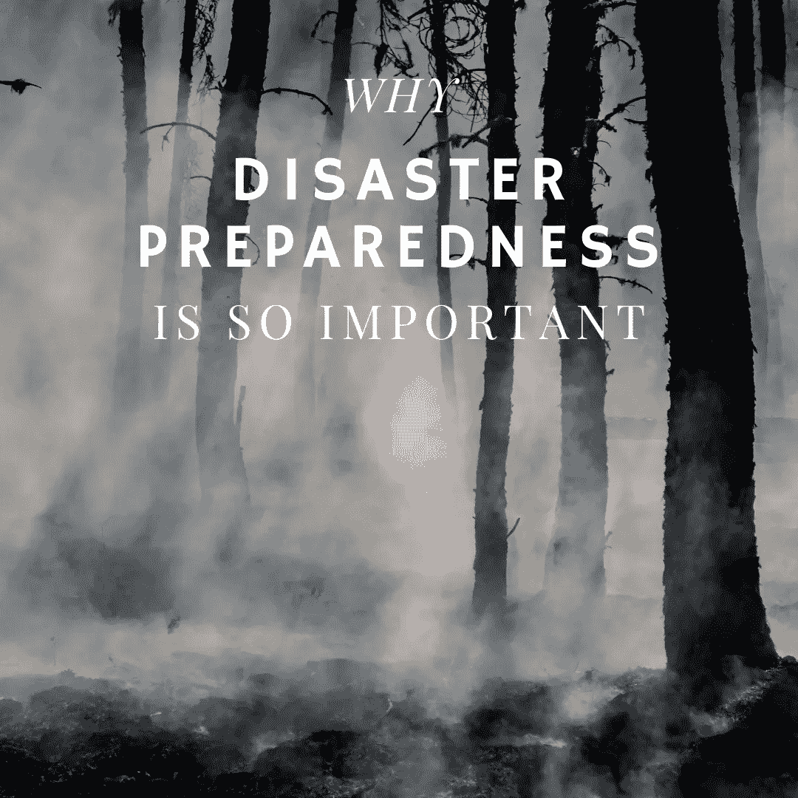

# 为什么备灾如此重要

> 原文：<https://medium.datadriveninvestor.com/why-disaster-preparedness-is-so-important-61c639324204?source=collection_archive---------5----------------------->

# 政府需要清醒过来

如果说我们从冠状病毒中学到了什么，那就是世界各国政府对灾难毫无准备。中国对冠状病毒的最初反应是压制感染的消息，这最终导致了它的传播。冠状病毒现在已经感染了全球各地的人，并正在杀害美国公民。政府没有优先考虑备灾，我们现在正在付出生命和财政的代价。但愿这场灾难能迫使政府清醒过来，为下一场灾难做好准备。我将分享为什么灾难准备如此重要，以及我们可以做些什么来提高我们在下一次灾难中幸存的机会。

# 全球化正在制造更多的风险

随着世界变得越来越一体化，它变得更加复杂。复杂性会带来风险。早在 2002 年， [SARS 疫情](https://www.who.int/ith/diseases/sars/en/)影响了 26 个国家，感染了大约 8000 人。恐惧以比病毒本身更快的速度在世界居民中传播。有人丧生。市场进入调整区域。然而，病毒在相对较短的时间内被控制住了。市场反弹，生活继续。大约二十年后，情况就不一样了。

 [## 气候变化、ESG 和对更好数据的追求|数据驱动的投资者

### 在地球上许多地方经历了另一个令人难以置信的炎热夏季后，来自 S&P 的最新发现…

www.datadriveninvestor.com](https://www.datadriveninvestor.com/2018/08/24/climate-change-esg-and-the-quest-for-better-data/) 

这种新型冠状病毒最初被与 SARS 冠状病毒相比较。市场价格依然居高不下，因为投资者认为这一切都会过去。投资者错了。2020 年，[中国](https://bunkerbasics.com/us-china-cold-war/)成为全球制造业中心。供应链依赖于中国的产能。如果产能受到影响，全球各地的公司都会遭殃。此外，中产阶级自 2002 年以来已经扩大。更多的人可以进行旅行，这使得病毒的传播更有可能。事实证明，这是新冠肺炎与疫情的潜力调情的情况。在全球化社会的时代，备灾必须成为最高优先事项。未能做好准备导致未能遏制冠状病毒。

# 全球协调是必要的

中国隐瞒冠状病毒的真相是一个重大的早期失误。事实上，这可能是冠状病毒在武汉省之外传播如此之远和迅速的原因。话虽如此，中国切断武汉与全国其他地区联系的艰难决定，在遏制疫情蔓延方面既是一项大胆又有效的措施。该地区很少出现新病例。世界其他地区现在正在与大范围感染的可能性(如果不是现实的话)作斗争。需要采取果断行动。透明度至关重要。是的，短期的痛苦将是巨大的。但是如果早期采取预防措施，我们就不会濒临疫情。

应对全球化带来的风险的唯一方法是协调。备灾需要全球努力。各国政府必须就遏制下一次疫情疫情蔓延的最佳方式达成一致。无论下一个新型病毒是在美国、中国还是其他国家出现，应对措施肯定是一样的。即时隔离、对遏制工作的大量投资以及透明的报告。更重要的是，我们需要开始投资于抗击下一个疫情所需的物资和基础设施。还应该拨出资金来帮助发展中国家抗击致命的疾病爆发，因为它们遭受的痛苦将不成比例地更大。

# 备灾是我们继续生存的关键

事实是，我们很幸运。新冠肺炎的死亡率不高。尽管其毒性和潜伏期存在问题，但新冠肺炎病毒的致命性远不如 SARS 或 MERS。下次我们还会这么幸运吗？还会有其他新型病毒感染人类。瘟疫和西班牙流感出现在冠状病毒之前，其他病毒将不可避免地随之而来。如果我们不做好准备，人类可能无法生存。如果说新冠肺炎还有一线希望的话，那就是我们对镇压疫情的准备不足已经昭然若揭。我们需要吸取教训。下一次威胁可能是最后一次。

最初发布于:[https://bunkerbasics.com/disaster-preparedness/](https://bunkerbasics.com/disaster-preparedness/)