# 为什么客户不再与银行做生意？

> 原文：<https://medium.datadriveninvestor.com/why-do-customers-stop-doing-business-with-a-bank-86f4a0c18673?source=collection_archive---------3----------------------->

## 本文旨在简要描述如何使用银行数据集，通过可视化、统计分析和主成分分析来探索和聚类数据，以开发一个全面的分类模型，准确预测银行的客户是否会流失，从而产生有意义和有趣的见解。

# 银行业的简要概述

Photo by Pixaby on Pexels

有必要提一下 2008 年的金融危机如何改变了银行业对客户的策略。在金融危机之前，银行只专注于投资以获得越来越多的客户。然而，在市场崩溃后，银行很快认识到，获得新客户的成本比保留现有客户的成本高 7 倍，这意味着失去客户可能会造成非常严重的财务损失。

很快，今天的全球银行业市值达到 7.6 万亿美元，技术和立法使得在不同银行之间转移资产和资金比以往任何时候都更容易。此外，它还为银行带来了更多可供选择的竞争形式，如开放银行、新银行和金融科技公司。总之，这种丰富的选择让今天的消费者比以往任何时候都更容易转换或离开银行。

 [## 一个企业在肚子上移动:如何照顾直觉|数据驱动的投资者

### 事实证明，直觉不仅仅是一种感觉。科学很清楚:你的直觉比你知道的更多…

www.datadriveninvestor.com](https://www.datadriveninvestor.com/2018/11/09/a-business-moves-on-its-stomach-how-to-make-allowances-for-gut-feelings/) 

研究还表明，回头客可能会在银行的产品和服务上多花 67%,这进一步凸显了理解客户流失原因的重要性，以及不同国家、年龄、信用评分等因素之间的差异。

# 解决办法

对于希望成功应对当今动荡环境的银行来说，数据被视为一种无价的资产。通过更好地了解客户，分析可以帮助银行脱颖而出，重获竞争优势。

# 资料组

我们将使用一家银行的数据集，该数据集由来自法国、西班牙和德国的 10，000 名客户组成，包括以下变量:

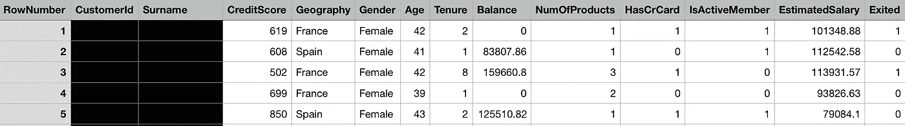

Banking Dataset’s Variables: CreditScore, Geography, Gender, Age, Tenure, Balance, NumOfProducts, HasCrCard, IsActiveMember, EstimatedSalary, Exited

# 探索性数据分析

总的来说，我们的最终目标不仅是通过可视化更好地了解我们银行的数据集，而且还要挑选和创建新的预测器来优化我们的分类模型。

## 银行业的客户流失

> "当客户通过转到另一家银行而结束与我们的关系时."

# 预言者

**年龄**

年轻客户似乎不太可能离开一家银行，因为他们仍然没有像中年人那样受过良好的教育或拥有同样多的选择，因为他们还没有时间建立自己的信用评分。

此外，年轻客户似乎不太需要转换，因为银行为这一年龄段提供的大多数便利设施在整个行业都是一样的。而年长的顾客可能会开始考虑他们的养老金、遗产、税收等等。这意味着他们将强调寻找最佳交易，而不考虑银行。

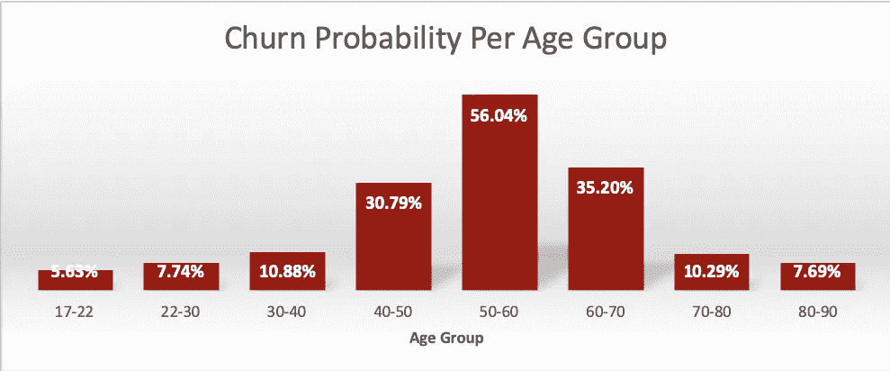

最后，这也可能是因为老一代人比年轻一代更重视客户服务和现实生活中的互动，而年轻一代则完全相反，他们更喜欢尽可能少的现实生活中的互动，这是当今银行走向数字化的方向，这意味着如果这意味着找到更好地提供传统价值和服务的银行，老一代人将离开他们的银行。

总而言之，客户流失率的峰值似乎出现在 50-60 岁、60-70 岁和 40-50 岁年龄段，依次为。

## 信用评分&给定年龄的信用评分

信用评分是衡量消费者信誉的指标。此外，那些信用评分较低的人通常被收取更高的利率、更高的保险费，以及更高的被拒绝抵押贷款、贷款和信用卡申请的机会，这在理论上应该意味着他们有更多的理由更换银行。

因此，我们根据 FICO 的评级系统将他们分为三组:差/一般[350–669]、“好”[670–739]和“优秀”[740–850]信用评分。

从逻辑上讲，信用评分差/一般的客户流失率更高，为 26.67%，而信用评分“好”和“优秀”的客户流失率分别为 20.59%和 15.38%。

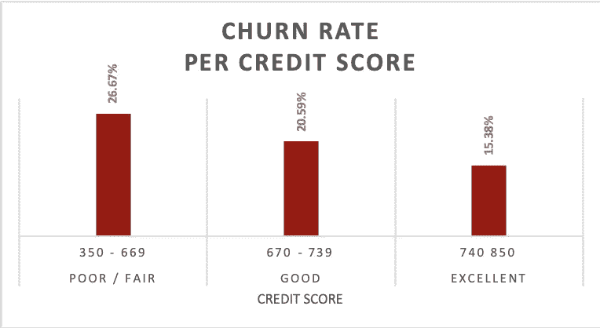

## 每个年龄的信用评分

然而，与美国不同，欧洲在计算信用评分方面没有标准做法，而且，鉴于我们的数据集由 3 个不同的欧洲国家组成，解决方案是强制性的。幸运的是，根据研究，15%的信用评分是基于客户信用历史的年龄。

因此，我们制作了一个新的预测器，它计算了每个年龄组的**信用评分**，并连续为每个年龄组的流失概率模式提供了完美的解释，更高的流失概率不仅仅是因为他们的年龄，而是因为他们的信用评分，因为他们的年龄组。即:根据他们的年龄统计，他们在经济上有多负责任。

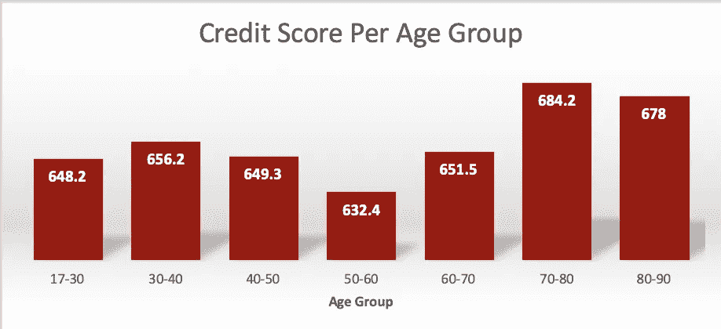

## 是活动成员

这是最重要的变量，因为它是一个二元指标，表明客户在参与银行服务和使用其渠道(无论是在线、电话还是预约)方面是否“积极”。

非活跃会员离开银行的可能性比活跃会员高 30%。此外，不活跃成员的信用评分较低，在财务上似乎也不太负责。

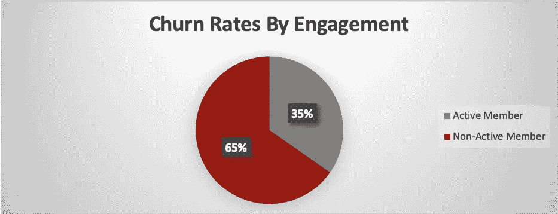

## 平衡工资比率

由于差异很大，我们决定尝试用一个新的比率来整合活动，这个比率叫做**余额工资比率**，以更准确地反映他们的余额相对于工资的情况。一个很好的全球基准是 80/20 规则，即将你工资的 80%存入你的银行账户，这样平衡工资比为 5。

我们的数据集的活跃成员与非活跃成员的比率为 4.54 比 3.17，这表明非活跃成员的资金可能流向了不止一家银行，因为他们的可信度低，无法在一家银行获得某些产品，或者他们只是拥有糟糕的资金管理技能。

## 产品数量

此外，信用评分为“优秀”和“良好”的人在银行拥有一种以上产品的几率分别高出 15.36%和 7.14%。看起来拥有两种产品的客户是理想的客户，因为他们拥有最高的留存率和流失率。尽管拥有 1 种产品的客户比拥有 2 种产品的客户风险更大，但就客户保持率而言，大多数客户仍然是安全的。

然而，任何超过 2 种产品几乎总是意味着他们是贪多嚼不烂的客户，因此更有可能离开银行。

## 任期、余额和工资

我们创建了一个名为“按年龄划分的保有权”的新变量，并可视化了按年龄划分的保有权以及产品数量的平衡。我们的发现表明，客户拥有的产品数量越多，根据年龄和余额预测其使用期限的差异就越小，这是基于我们之前对这些变量之间相互作用的理解。一般来说，年龄越大，顾客拥有的产品数量越少。

此外，客户拥有的产品数量越多，其余额相对于普通客户而言就越有可能落在不太极端的范围内。这同样适用于估计薪金和平衡薪金比率，但程度较低。

# 创建我们的预测模型

我们需要通过运行随机森林算法来确认我们对数据的探索，以查看哪些预测因素在预测客户流失方面确实是最重要的。

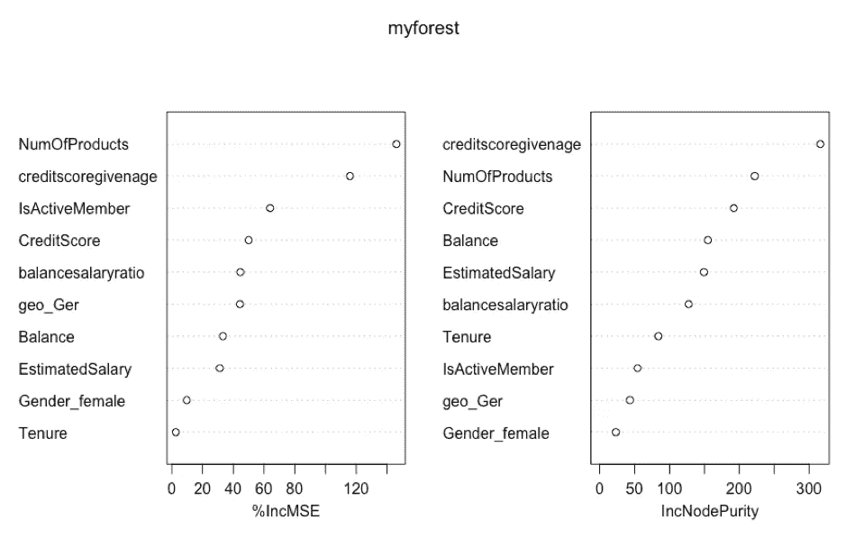

根据可变重要性图，产品数量是迄今为止最好的预测因素，紧随其后的是我们创建的预测因素:给定年龄的信用评分。此外，地理和性别似乎是我们可以更深入分析的两个预测因素。

## 反向消除:创建逻辑回归模型

我们为所有分类预测值创建了虚拟变量，排除了姓氏和客户 id 等机密变量，然后开始运行迭代，删除最不重要的预测值，并总共重建了 4 次模型，直到找到理想的组合。

然而，我们决定停止在平衡工资比率，因为与任何后续迭代相比，该模型具有更高的 AIC 和更低的剩余偏差。此外，行业标准规定这是客户对银行忠诚度的一个重要指标，关系越好，他们会将更多的工资委托给银行。

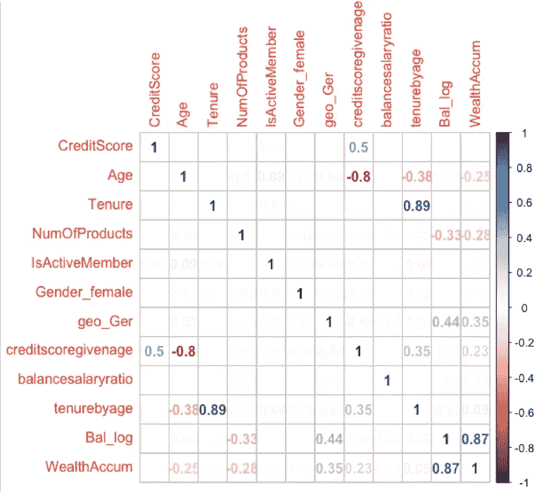

Correlation Matrix

# 使聚集

既然我们对数据及其相互作用的方式有了深刻的理解，那么使用主成分分析来直观地表示和确认变量之间的相关性就很重要了。因此，余额和产品数量似乎是负相关的，这证实了我们最初的怀疑，即任何超过 2 个产品都是为了弥补消费者信誉中严重缺失的东西。

此外，消费者的参与度、信用评分和给定年龄的信用评分与客户流失的可能性呈负相关，因此我们最初的发现似乎是正确的。

然而，从地理和性别导向的角度将一切联系起来仍然至关重要，主成分分析告诉我们，虽然法国和西班牙的表现相似，但德国以完全不同的方式聚集在一起，这就是为什么我们添加了 **geo_ger** 作为我们的关键预测指标之一。

## 地理

与法国和西班牙客户相比，德国客户往往信用评分更高，年龄更大，任期更长，平衡工资比率高得多，并且往往没有 3-4 种产品的“危险区”。

然而，他们是相对不活跃的成员，他们的流失率高达 32%，是法国/西班牙的 16%的两倍。

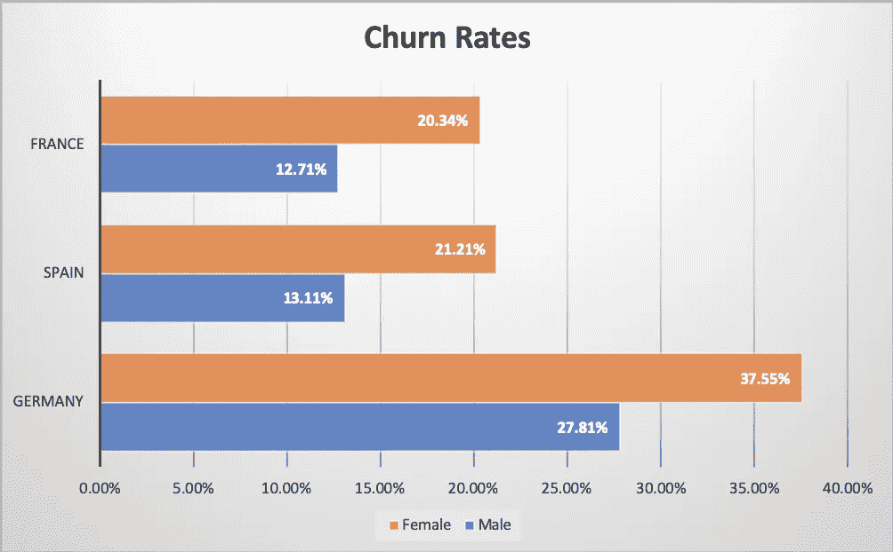

这是因为德国的人均 GDP 是 123 欧元，而法国是 104 欧元，西班牙是 91 欧元。此外，与世界其他地区相比，德国银行业有很大不同。他们为银行产品和服务提供最低的价格，低利率环境，以及最近收紧提供扩大消费者保护法的法规。

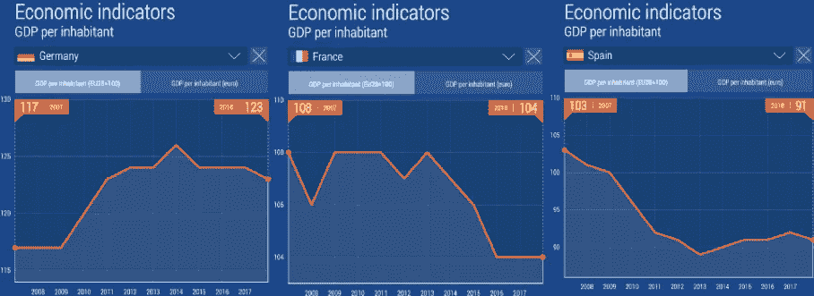

然而，这并没有阻止金融科技公司威胁在未来 5 年内夺取德国银行业收入的 15%,使竞争空前激烈。

然而，重要的是要明白，德国是我们数据中 3 个国家中唯一一个经常账户盈余为 1.9 的国家，而法国和西班牙的经常账户盈余为-2.5，这意味着德国消费者更有可能购买外国商品。此外，赤字经济体仍在推动对德国产品的需求，在西班牙等国造成资本错配。这似乎正在创造一种不可持续的大陆失衡，由于美国的贸易战，这种失衡现在开始瓦解。

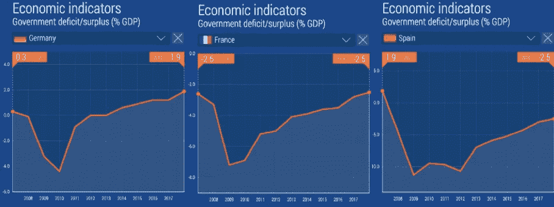

这在消费者信心指数、调查和预期的下降中显而易见。德国消费者信心中的恐惧感反映在他们更高的流失率上，根据世界银行的数据，他们的人均教育支出更高，在腐败指数和竞争力排名中的排名也更高，这使得德国客户比法国和西班牙的客户更有见识，因此更容易流失，以寻求更好的机会。

## 性别

平均而言，无论在哪个地区，女性都更有可能跳槽。然而，性别差异在西班牙和法国最为明显，女性跳槽的可能性高出 60%。然而，在所有性别/地域组合中，德国女性的流失率最高，达到惊人的 38%，但仅比男性高出 10%。

这归因于一个统计事实，即在风险和回报方面，女性比男性更保守，70%的女性认为自己是储蓄者，而不是投资者。这是一个完美的时机，因为德国经济和银行正处于激烈的投机之下，明智的做法是寻找替代品和较少依赖德国经济的银行。

其次，所有地区的女性都可能更注重关系，更重视银行提供的客户服务，也更容易根据强化这一类别的建议做出改变。

第三，根据女性 2.9 倍于男性 4.7 倍的低得多的平衡工资比率，她们可能是更大的支出者，并将寻求提供更有吸引力的信贷条款的银行。因此，我们增加了性别作为预测因素。

# 测试我们的预测模型

## Boosting 和 Logistic 回归分析

通过混合使用商业敏锐度、主成分分析、统计分析和反向选择，我们能够基于以下增强/逻辑回归模型生成一个预测流失率的模型:

**Exited ~ credit score+tension+Balance+NumOfProducts+is active member+estimated salary+Gender _ female+geo _ Ger+CreditScoreGivenAge**

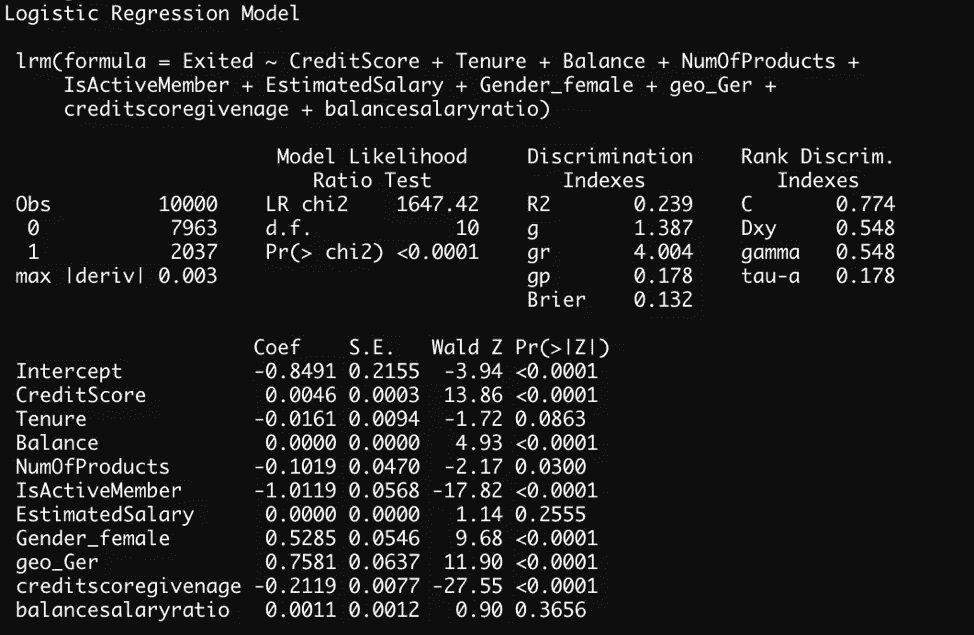

增强回归模型用于训练我们数据集的前 5，000 行，以预测后 5，000 行。我们获得了 0.2889 的均方误差，通过移除我们最不重要的预测因子 geo_Ger 和 Gender_female，有可能将误差降低到 0.2839，但是，我们认为，如果我们要在外部数据上测试我们的模型，这些预测因子的相对影响可能是正确和错误分类之间的差异。

无论如何，可以得出结论，给定年龄信用评分是我们最好预测因素，估计销售额，信用评分，余额，产品数量和余额销售比率总和远远超过了它们各自影响。

同样，我们的逻辑回归模型也被证明是成功的，因为它有 82%的准确率。然而，它在对留下来的客户进行分类方面比流失的客户好得多，这可能是因为不平衡的训练数据集，通过在我们的训练数据集中包括平均分布的性别、地理和流失份额，我们看到在解决后在对流失进行分类方面有所改进。

# 主成分分析

PCA 的数值结果表明，在翻炒的顾客中发现的大多数可变性可以由两个因素来解释:给定他们的年龄的他们的信用评分和他们的信用评分。在考虑了第一个主成分后，大部分的可变性来自于他们的余额和他们注册的产品数量。

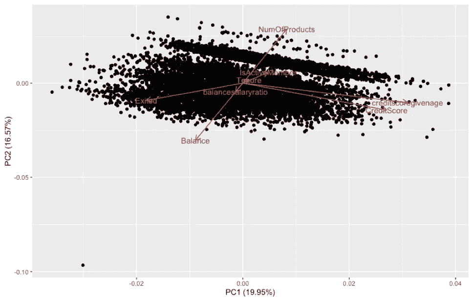

# 结论和建议

在创建了我们的模型并理解了数据之后，我们对试图留住客户的银行有了更好的了解。

我们的发现总结如下:

*   银行应制定忠诚度计划和保留活动，目标客户是那些仍然可以挽救的客户，即:不是那些年龄非常大的客户，不是那些给定年龄的信用评分差的客户，也不是任何信用评分低于 475 分的客户。
*   最有可能流失的年龄组是 40 到 70 岁的人，然而，为了终身客户价值，试图留住 40-50 和 50-60 岁的人似乎有更高的价值回报。
*   因此，银行了解他们的客户是至关重要的，他们需要建立更多的预测器，就像我们对这个数据集所做的那样，以创建和识别最终比原始变量更准确的模式。
*   包括男性和女性在内，德国客户的流失率最高，但西班牙和法国女性的流失率比男性高出 60%，这意味着法国和西班牙的银行需要分配更多资源来追求以女性为导向的促销，这可以通过提供奖励卡等方式实现，因为我们的数据明显显示她们是更大的消费者。
*   我们包括了一个分类树，任何经理都可以使用，不管是哪个地区，以便获得客户流失的可能性。分类树是一个简化版本，它更多地作为批准客户的先决条件，而不是分析现有的客户，因为它不够详细，但需要进行调查，以确定他们是否是其现有银行的活跃成员。

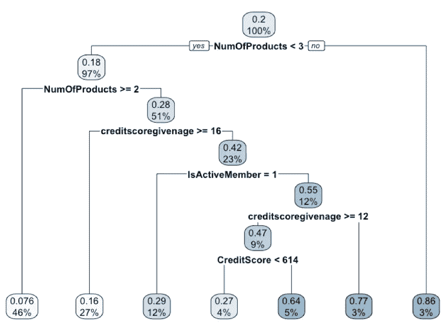

Classification Tree — Probability of Churn

*   最重要的预测因素是敬业度，我们的研究表明，女性更容易离开，去寻求更好的客户服务或咨询服务。

总的来说，我们的预测模型不应充当二元分类模型，而更像是一个预警系统和解释工具，可以帮助银行改进其营销工作，以更相关的活动、优惠等来瞄准客户。同时建立个人联系。

Photo by Pixaby on Pexels

最后，尽管与其他行业相比，银行业是流失率最低的行业之一，但失去一个客户对盈利能力的影响却远远高于大多数行业。

# 作者的 LinkedIn:

 [## 诺亚·穆赫塔尔-分析师- BDC |领英

### 未来的分析硕士毕业于麦吉尔大学的商业分析专业从…

www.linkedin.com](https://www.linkedin.com/in/nmukhtar/)