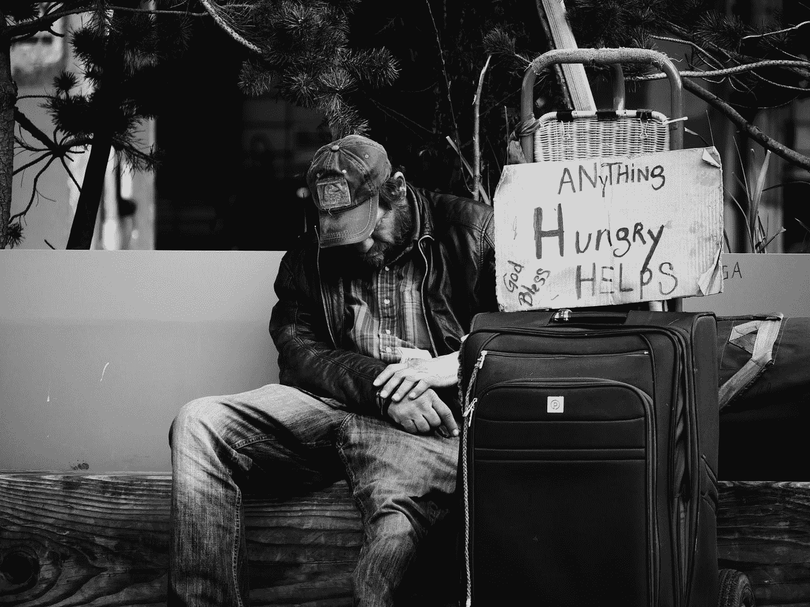

# 为什么我每个周末都给无家可归的人买食物？

> 原文：<https://medium.datadriveninvestor.com/why-do-i-buy-food-for-homeless-people-on-every-weekend-63755087b24b?source=collection_archive---------12----------------------->

我在土耳其的一个中产阶级家庭长大。我父亲是一名社会学家，在监狱里工作了超过 35 年。妈妈是幼师。我们是一个总是处于经济危机边缘的家庭。我们从未破产，但也从未致富。当我们想要什么的时候，我们的父母从来不会让我们失望，我和我的兄弟也从来不会想要他们无法提供的东西。

Photo by [Pablo Merchán Montes](https://unsplash.com/@pablomerchanm?utm_source=medium&utm_medium=referral) on [Unsplash](https://unsplash.com?utm_source=medium&utm_medium=referral)

从十几岁开始，我们学习并获得全额奖学金进入大学。从我的角度来看，在内心深处，我知道我最大的动机是体验我心目中的“富裕生活”。我有朋友有很多钱，豪车等等。我喜欢和他们一起生活。但是当我毕业的时候，事情发生了变化。

我独自一人。家人还在支持我，但我只能靠自己。我开始思考更多，认识更多。我看到不平等是现在人们的一种常态。富人知道他们很富有，但他们不在乎外面的穷人，因为他们活该贫穷。穷人知道他们很穷，而且外面有富人拒绝分享他们的收入，因为那些富人“应该”得到。

这让我想到了第一个问题:“我们如何知道一个人值得拥有什么？”。是他们给社会增加的价值吗？这是他们工作的时间吗？是他们冒的风险吗？是他们的需求吗？

所有这些问题的产生都有一个根源，那就是“私有财产保护”。财产是一个概念，指的是一切具体的和抽象的，可以由一个人拥有的东西。这可以是一栋房子，一辆汽车，一个想法，一个企业，一项专利等等。正如《为什么国家会失败？对私有财产的保护促使人们创新和发展。因为当人们拥有自己创造的东西，并且他们的权利受到保护时，他们会更有动力。

 [## 如果资本主义失败了，那么还有什么选择呢？数据驱动的投资者

### 在当前政治领域的修辞之旅中，我们都可以面对面地接触到流行词汇，如…

www.datadriveninvestor.com](https://www.datadriveninvestor.com/2020/03/16/if-capitalism-is-a-failure-then-what-is-the-alternative/) 

在成长中有创新和贡献的被授予。他们从馅饼中得到更大的一块，这激励他们和其他人进行更多的创新。这已经成为快速技术进步的试金石。

社会的发展还依赖于另一个事实，即资金流动。当钱从一个人流向另一个人时，这些钱就创造了价值。看起来这一句话没有逻辑上的原因。那么，让我们来解释一下。想象一下，你从银行贷款买房子。你把钱给建筑公司。建筑公司从销售中获利。这些利润被用来建造其他房屋。与此同时，你也在努力还债。当你工作时，你创造了价值。建筑公司建造的新房创造价值。给你贷款的银行用从你那里拿走的利率来获利。大家都赢了，耶耶。但是一个方程怎么可能只在一边增加。等式的另一边呢？在这个等式中谁失去了什么？答案是“时间”。你的生活，你花在工作上的时间是这个等式中创造的所有增长的提供者。银行工人和建筑工人也是这个等式的补充者。所以，时间，也就是劳动，是这个等式中的一切。你可能会说“嘿，等等，这个等式里的钱在哪里？”。货币存在于劳动的交换中，而不是直接存在于等式中。

当我们分配的钱不平等时会发生什么？如果一个 IT 工作者的收入是他/她老板收入的 1%，会发生什么？钱换的少。老板把钱花在奢侈品上，但甚至花不完，而 it 工作者只能支付房租和食物，并把 20%的钱存起来，在暑假里花掉每一分钱。分配给工人的钱全部流动，而分配给老板的钱部分流动。你还记得我上面说的话吗？这种增长是由资金流创造的。任何阻碍资金流动的东西都会降低经济增长。在资本经济中，增长就是一切。

但是老板冒险开始了他生意。他当然会赚得更多！是的，他冒了风险，所以他需要赚更多。但请记住，不平等程度越高，增长就越慢。你真的想让经济陷入瘫痪，把最初的风险回报给老板吗？老板承担唯一风险(不同于工人承担的风险)是老板一开始投入的劳动力和资金的初始风险。老板面临的持续风险和工人面临的风险完全一样。因为如果公司破产，所有人都会损失。

我希望人类有一天能理解现状，并做出改变。因此，每个周末，当我去商店买一周的食物时，我会买巧克力蛋糕、三明治、果汁和诸如此类的东西给坐在市场前面的人。因为这不是他们的职责所在。并不是所有的人都是不想工作的“白痴”或“懒惰的混蛋”。真正的“白痴和懒惰的混蛋”是那些坐在上面的人。他们逃避纳税。即使他们付钱，他们付的钱也比他们需要付的钱少得多。它们阻碍了资金流动。通过堵塞资金流动，他们减缓了经济增长。然后，他们推动员工创造更多的价值来促进增长。他们带来了 KPI 和指标等概念。我们需要衡量的真正指标是资金流量，该指标的真正 KPI 是资金的公平分配，即人们得到他们应得的。

Photo by [Steve Knutson](https://unsplash.com/@sknutson?utm_source=medium&utm_medium=referral) on [Unsplash](https://unsplash.com?utm_source=medium&utm_medium=referral)

出去，买些食物给无家可归的人。给生活在外面的动物食物。当你的邻居需要你的帮助时，帮助他们。当你帮助别人时，不要让你的左手看见你的右手。如果你在“老板社区”，问自己一次“当人们死于饥饿或当他们无法支付健康保险时，我真的需要所有这些东西吗？”。一生做一次同理心。你公司的工人不是你的奴隶或农奴。他们是你的同事。