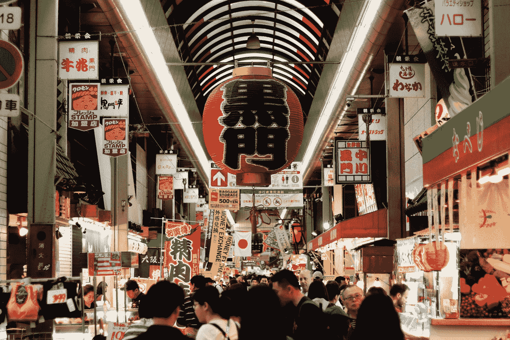
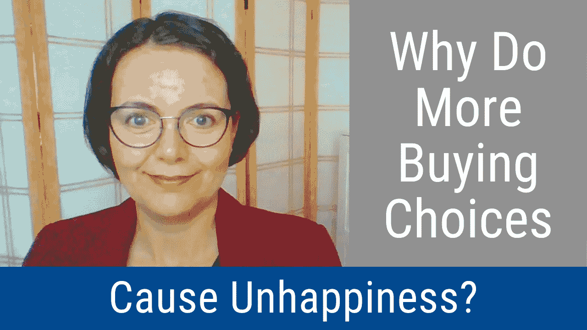

# 为什么更多的购买选择会导致不快乐？(视频和播客)

> 原文：<https://medium.datadriveninvestor.com/why-do-more-buying-choices-cause-unhappiness-video-and-podcast-12891f3568c2?source=collection_archive---------26----------------------->

Photo by [Cody Chan](https://unsplash.com/@cceee?utm_source=medium&utm_medium=referral) on [Unsplash](https://unsplash.com?utm_source=medium&utm_medium=referral)

更多的购买选择导致更少的快乐。为了做出更好的购物决定，满足并限制你的选择。寻找足够好的产品。这是本期《明智的决策者》节目的关键信息，它描述了为什么更多的购买选择会导致不快乐。

# 视频:“为什么更多的购买选择会导致不快乐？”

# 播客:“为什么更多的购买选择会导致不快乐？”

# 视频广播和播客中提到的链接

*   下面是文章[为什么更多的购买选择会导致不快乐？](https://disasteravoidanceexperts.com/why-do-more-buying-choices-cause-unhappiness/)
*   《永远不要跟着感觉走:先锋领导者如何做出最佳决策并避免商业灾难》一书*在这里[可以找到](https://disasteravoidanceexperts.com/nevergut)*
*   欢迎您注册[免费的明智决策者课程](https://disasteravoidanceexperts.com/subscribe/)

 [## React Native 如何提高移动应用开发者的生产力？数据驱动的投资者

### React Native 是一个有益的框架，可以帮助您使用 JavaScript 设计应用程序。这种结构包括…

www.datadriveninvestor.com](https://www.datadriveninvestor.com/2020/11/30/how-react-native-improves-the-productivity-of-mobile-app-developers/) 

# 副本

Hi, and welcome to another episode of the wise decision maker show where we help you make the wisest and most profitable decisions. I’m your host, Agnes Vishnevkin. In for Gleb zipursky today, and today we’re going to talk about why is it that more buying choices can cause more happiness? Have you ever made a buying decision that you regret? I know that a few years ago, I bought an armchair, and I spent so much time thinking about it. And you know, comparing different reviews and I went to a few stores and I sat in all the different chairs. And then when I finally bought it, I was disappointed. And I had it in my house for many years. And it was just so frustrating to have spent so much time looking for something and thinking about it. And I thought that I made the right choice, but I just wasn’t happy. So Has that ever happened to you? I hope I’m not the only one. Because of that kind of mistake. You know, now that I know more about behavioral science and psychology, I know that there are several things that caused these shopping mistakes to happen. And one of them is that it’s the way our brain is wired. We’re not really wired for making so many complicated choices. We’re not wired for living in the 21st century, we’re wired for the ancient Savanna. So that’s kind of something that leads to these difficulties. Another thing is that the shopping process is manipulated by retailers who want us to buy more stuff. And so they often, you know, take steps that make us buy more stuff, but not necessarily feel better. And this is especially true for online shopping. And we’ll talk about that in a moment. Now, when we talk about having lots of options and lots of choices, it’s intuitive, you know that that would help us be happier, right? But is that really so? So there’s some really interesting research that shows that really, that’s not what happens. For example, there was this one choice, one interesting study that I really was fascinated to learn about, where there was the split table setup for shoppers to taste different kinds of gourmet jam in a supermarket. And this was done on several different days. And one day, they had a setup with 24 different flavors of jam. On another day, they had a setup with six kinds of jam. And so what happened, it turns out that when they had 24 types of jam, they had lots of people coming and tasting. But when they had six kinds of jam, not as many people came to taste it, but a lot more people made choices. And so choice paralysis is something that happens when people this is the way the name for that phenomenon. When people have so many options, you know, they look at 24 flavors of jam, and they taste them all, but they kind of can decide. Whereas when they had six, they were much more ready to decide. And then there were many more sales made. So research shows. And that’s just one example that when we have more than a small number of options, we can be less happy. And it’s kind of harder for us, even though we think more options might be better. And so that’s just one interesting phenomenon. And the other one that I want to talk about is the fear of missing out, you know, FOMO, so to speak. And that’s something that, there’s a technical name for it, it’s called loss aversion. And many psychological studies have shown that we really want to avoid losses, much more than we want to make gains. So say, I’m afraid of losing $20 far more than I want to gain $20\. And that’s just kind of, you know, the way we are probably from our evolutionary background in the savanna, when you know, it’s very dangerous to lose. And we live in a very risky life. So basically now when we have a lot of options, that leads to anxiety about losing out on the best one, if we choosing a mind two things, you know, option, you know, maybe strawberry jam or blueberry jam, and I feel like okay, strawberry jam, I’m going to get it and maybe subconsciously, if I feel like I’m missing out, okay, I’m missing out on blueberry jam, okay, I miss out on one flavor. But if there’s 10 flavors, and I pick strawberry, I’m going to feel more anxiety just automatically intuitively inside that I missed out on nine other options. So speaking about unintuitive things, here’s another one, the opportunity to change your mind, which happens when we have the option to return or to get a refund or to exchange our purchase. And there’s, you know, a very technical name, but it also kind of explains what it means: it’s post purchase rationalization rationalizing after purchase. Another one is choice supportive bias. It’s another way to describe the same phenomenon. And it’s a psychology term that means, you know, we are biased towards something that supports the choice we already made. And what happens is that basically subconsciously, after we make a final decision, we try to justify to ourselves by focusing on the positives, because say, if I bought an armchair, and I can’t return it, and then I’m going to be, you know, kind of feel like, Oh, that’s a great armchair, I love this armchair. This is great. It’s so comfy. And you know, because subconsciously, I’m kind of like, I’m stuck with it, I can’t give it back. So just as well might enjoy it. Whereas if the choice can be reversed, then it’s very easy to keep thinking about whether this was the right decision. And so that will happen if there is a 30 day return. And you know, what happens? There’s a lot of direct to consumer mattress companies that say, you know, you can return your mattress within 100 days. So I’m going to spend those 100 days sleeping on that mattress wondering if you know, should you return it? Should you not to get a refund or not? Well, if there was no refund, you’d be much more likely to like it, you know, unless it’s obviously uncomfortable. So, there, there is a very counterintuitive lesson about returns and refunds, which I don’t know, I personally always appreciate. But I guess, no, since it doesn’t really make us happy. But something to reconsider. Now let’s talk about online shopping. And like I said, the retailers really do so much to make it more difficult for us, they just want us to buy more stuff. And so there are more choices. You know, there are only so many things that you can buy in a store. But there are so many more things that you can buy online, so many things that are more things that you can consider. And like we just talked about a moment before, the more choices we have, the less happy we are. Another thing that happens online is that often they’re very easy returns, you know, when we buy clothes, just you know, things like this, it’s often very easy to return, all you have to do, you don’t have to go to a store, you just put it in an envelope, drop it in the mailbox, or just you know, leave it in your mailbox outside your house, sometimes. That’s it, and it’s gone in ease. So basically, shopping decisions don’t feel so final. And that takes away from our happiness. So now that we talked about a few things, about a few of the challenges with our shopping experience, how can we use them to make it better, there are many things that we can do. And a big one is don’t maximize, is when we try to make a decision that’s as good as possible. as perfect as possible. Buy the perfect armchair, the perfect sweater, and don’t do it. We’re going to be much happier if we just satisfies and satisfies means to get something that’s good enough, something that meets your needs. And then you’ll be happy you won’t need to look, you won’t be subjecting yourself to all these difficult thoughts and automatic patterns that we just talked about. Limit your options, when you have fewer options to look at, you won’t have that loss aversion, you make the option the choice faster. So one thing that I like to do now, nowadays, when I shop for answers is I think beforehand, what is it that I want in my armchair? I think about it in advance, I make a list. Then when I’m scrolling online, you know, these days, I’m not really going to the store very often now that the COVID pandemic is COVID-19 pandemic is upon us. You know, I immediately pass on all the options that don’t meet my goals. So I set my goals in advance. And that does an excellent job of limiting my options. Another thing that I do to limit my options is say when grown at a grocery store just by the store brand. I don’t look at 25 kinds of yogurt, I just buy the store brand yogurt, and that helps a lot. And finally, you know another way to avoid maximizing is to remember that perfect is the enemy of good. And that’s you know, that’s just something to keep in mind. Another way to limit your options is very helpful for online shopping, is to look at credible product reviews. And finally, to do your best to ignore the option to have a free return to have a refund. Just remember that you know even though you might think that it’s good. The sooner you ignore it, the happier you’ll be with your decision. Because then you will just like your mind do its automatic work and rationalize the decision that you made and you’ll just feel so much happier. So that’s What I wanted to share. I hope these tips were helpful for you. Thanks for tuning in to this episode of the wise decision maker show. And I encourage you to check out the links in the description of the video below. There will be a link to a blog that describes this topic in detail. And most importantly, it has links to the different studies that were mentioned and a few others. There are also links to other blogs about decision making and using science based tools like what I just talked about. So check out the links, please share, like, subscribe, let us know what you think in the comments. Is this something you think will be helpful for you? Have you recently made a decision that you regret? Let us know what you think. And finally, I hope you check out our free eight module video course at disaster avoidance experts.com slash subscribe. That’s disaster avoidance experts comm slash Subscribe for our free video course and check out our book. Never go with your gut how pioneering leaders make the best decisions and avoid business disasters. Thanks again for tuning in. And I look forward to seeing you on the next episode of the wise decision maker show. And until then, I wish you only the wisest decisions take care

转录自 [http://otter.ai](http://otter.ai)

…

**Bio** :国际公认的思想领袖，被称为灾难规避专家，[Gleb Tsipursky](https://disasteravoidanceexperts.com/glebtsipursky/)博士的使命是通过制定最有效的决策策略来保护领导者免受被称为认知偏差的危险判断错误的影响。作为一名畅销书作家，他最著名的作品是《T4》*《永远不要跟着感觉走:先锋领导者如何做出最佳决策并避免商业灾难* (职业出版社，2019 年)、《我们之间的盲点:如何克服无意识的认知偏见并建立更好的关系 (《新先驱》，2020 年)和《韧性:适应并计划新冠肺炎冠状病毒疫情 (《变革者图书》，2020 年)他发表了 550 多篇文章，接受了 450 多个知名媒体的采访，如[*Inc .*](https://www.inc.com/entrepreneurs-organization/a-behavioral-scientist-explains-why-your-swot-analysis-is-dangerously-flawed.html)[*企业家*](https://www.entrepreneur.com/article/348115)[*CBS 新闻*](https://www.cbsnews.com/video/study-says-taking-a-small-break-from-facebook-might-be-good-for-your-mental-health/)[*时代*](http://time.com/4257876/wounded-warrior-project-scandal/)[*商业内幕*](https://www.businessinsider.com/disaster-expert-companies-should-face-coronavirus-with-pessimism-2020-3)[*政府官员*](http://www.govexec.com/excellence/promising-practices/2017/03/heres-why-your-gut-instinct-wrong-work-and-how-know-when-it-isnt/136104/)[他的专业知识来自于作为](https://disasteravoidanceexperts.com/NeverGut/)[避灾专家](http://disasteravoidanceexperts.com/)的 CEO，20 多年的[咨询](https://disasteravoidanceexperts.com/consulting/)、[辅导](https://disasteravoidanceexperts.com/coaching/)、[演讲和培训](https://disasteravoidanceexperts.com/speaking/)。这也源于[作为一名行为经济学家和认知神经科学家在学术界超过 15 年的](http://disasteravoidanceexperts.com/research)。通过 Gleb[at]DisasterAvoidanceExperts[dot]com、Twitter[@ Gleb _ tsipursky](https://twitter.com/Gleb_Tsipursky)、insta gram[@ dr _ Gleb _ tsipursky](https://www.instagram.com/dr_gleb_tsipursky/)、 [LinkedIn](https://www.linkedin.com/in/dr-gleb-tsipursky/) 联系他，注册他的免费[明智决策者课程](https://disasteravoidanceexperts.com/newsletter/)。

*原载于* [*避灾专家*](https://disasteravoidanceexperts.com/why-do-more-buying-choices-cause-unhappiness?-(video-and-podcast)/)

## 访问专家视图— [订阅 DDI 英特尔](https://datadriveninvestor.com/ddi-intel)