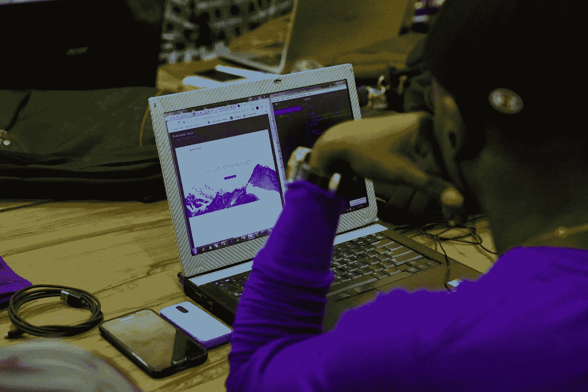

# 为什么我们在现代劳动力中仍然存在技能差距？

> 原文：<https://medium.datadriveninvestor.com/why-do-we-still-have-a-skills-gap-in-the-modern-workforce-b56323194704?source=collection_archive---------8----------------------->

Photo by [NESA by Makers](https://unsplash.com/@nesabymakers?utm_source=medium&utm_medium=referral) on [Unsplash](https://unsplash.com?utm_source=medium&utm_medium=referral)

最近，我向 25 名大学生介绍了 2020 年的 10 大技术趋势和 10 项 T2 技术技能，并征求他们的意见。我必须说，我对他们的一些反应感到非常惊讶。对一些人来说，这是他们第一次听说这些话题。

Photo by [You X Ventures](https://unsplash.com/@youxventures?utm_source=medium&utm_medium=referral) on [Unsplash](https://unsplash.com?utm_source=medium&utm_medium=referral)

你可以看到这 25 名学生来自不同的年级，包括大学的每个年级。学习的专业包括计算机科学，通信，公共关系，心理学，商业分析或会计。这些趋势和技能中的许多将在这些学生未来的职业生涯中以某种形式相关。然而，一些学生不这么认为，甚至回答*“我不打算使用这些技能，因为对于我的专业和职业来说，我不知道它们将如何融入我的领域。”*

很抱歉告诉任何有疑虑的人，这些科技趋势将不仅仅影响你的大学专业或职业生涯:它们将极大地影响你生活的方方面面——从自动驾驶汽车、[智能供应链、](https://blog.abbyy.com/7-ways-process-intelligence-enhances-the-supply-chain/)、智能助手、[到你如何从肯德基订购一桶鸡肉](https://dzone.com/articles/can-ai-change-the-way-we-order-food)。我的猜测是，如果你从事的职业/业务关注人(更好的客户体验)、数字化(OCR、NLP、AI、过程智能、机器学习、RPA 等)。)、合规(数据隐私、安全、云存储等。)、流程(提高效率)和利润(降低成本和提高质量)，那么这些话题就是今天在您的会议室中发生的许多讨论的焦点。

对于任何专注于技术的人，或者如果你是负责企业改进或 IT 效率和有效性计划的团队的一员，那么你几乎经常会处理一些话题。如果这是你，那么你可能正迫不及待地寻找技术工人来帮助你在 2020 年取得成功。

Photo by [Austin Distel](https://unsplash.com/@austindistel?utm_source=medium&utm_medium=referral) on [Unsplash](https://unsplash.com?utm_source=medium&utm_medium=referral)

我的希望是，大学水平的教育将上升到参与，并开始让学生为现代劳动力做准备，而不是让学生为过去的工作做准备。然而，我有我的怀疑，但有正当的理由。从表面上看，根据经济合作与发展组织的一项研究，我在《研究生生存指南:工作的未来——学生们没有做好准备》中写的一份报告*，39%的青少年想做的工作在未来几年内有被机器取代的风险。年轻人似乎仍在从少数传统职业中选择职业，如律师、教师或经理。*

* [## 使用谷歌搜索趋势预测首次申请失业救济人数|数据驱动的投资者

### 几年来，我的重点一直是使用多种替代数据来预测宏观经济统计数据…

www.datadriveninvestor.com](https://www.datadriveninvestor.com/2020/03/25/using-google-search-trends-to-predict-initial-jobless-claims/) 

现代数字工作场所所需的技能和员工必须提供的技能之间的差距越来越大。在经济学中，我们称之为高需求，低供给。经济学 101:这些短缺往往会推高价格，因为购买产品的竞争——也就是那些有足够技能承担这项任务的人获得更高的工资和福利！

以一个 AI 工作角色为例，**机器学习工程师**。

为什么是这个工作角色？因为根据一项研究分析 2015 年至 2018 年间的平均工资和职位发布增长，机器学习工程师是美国最好的工作。

根据 Indeed 的研究，机器学习的平均工资约为 146，085 美元，自 2015 年以来增长了 344%。毫不奇怪，机器学习工程师的平均工资远远超过了榜单上的其他技术职位。例如，“全栈开发人员”的职位排名第三，平均年薪为 114，316 美元，比过去三年增长了 206%。

Photo by [NESA by Makers](https://unsplash.com/@nesabymakers?utm_source=medium&utm_medium=referral) on [Unsplash](https://unsplash.com?utm_source=medium&utm_medium=referral)

## 揭竿而起的公民开发者

虽然公民开发者的兴起有助于带来如此多的机会，但我们没有理由不培养我们的员工为未来的工作做好准备。历史上，公司购买软件，然后编写定制代码来满足他们的需求。最大的缺点之一是费用，最初和每次新版本需要修改和更新时都是如此。最近，越来越多的业务线人员(相对于开发人员)开始学习如何改进甚至自动化流程。公民开发者将在技术和非技术的商业技能之间架起一座桥梁，让商业更高效、更顺畅地运行。现在，我们的教育合作伙伴和行业领导者应该开始为新的混合劳动力做准备，并将数字技能融入他们的员工要求中。

早在 2012 年， [Gartner 分析师宣布](https://adtmag.com/blogs/watersworks/2012/01/2012-predictions-from-gartner-analysti.aspx)“我们现在都是开发者”——指的是新生的公民开发者运动。快进到 2020 年，公民开发者事实上仍然是一个强大的增长趋势。公民开发者是问题的解决者。尽管他们缺乏传统的编码知识和计算机科学博士学位，但他们了解业务，在办公室里他们通常被称为 [*数据英雄*](https://towardsdatascience.com/do-you-have-a-data-hero-on-your-team-e4ddc318926e) 。

我们如何让学生和员工做好准备，成为未来的数据英雄？公民开发者很可能会继续崛起。如果学术、教育和劳动力仍然停滞不前，未来的工作对许多人来说将遥不可及。我们必须继续努力，教育学生和工人成为关键问题的解决者和独立思考者。随着越来越多的企业转型并实施人工智能、机器学习和超自动化生态系统，对公民开发者的需求只会越来越大。你和你的组织会在哪里？*