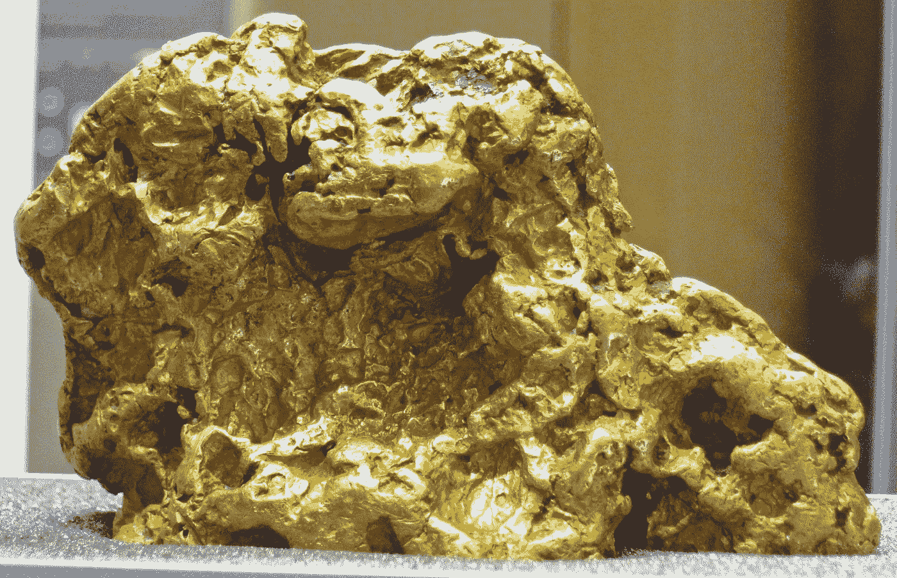
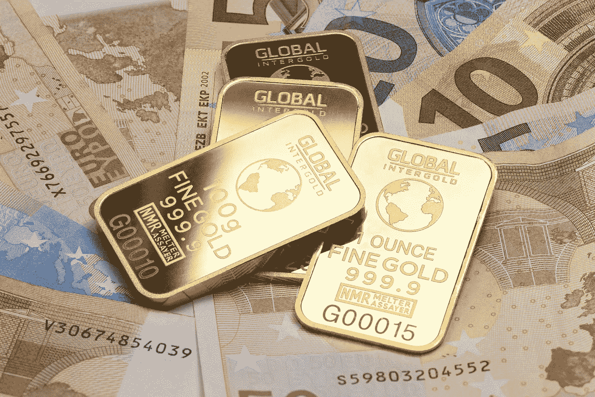
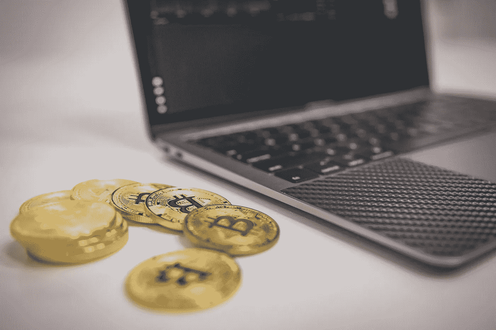
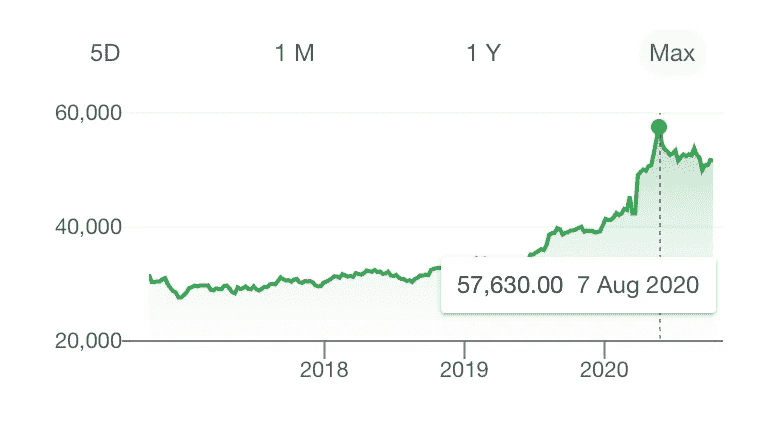
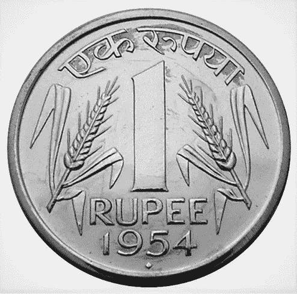

# 为什么我们如此看重黄金？—什么是数字黄金？—先从历史说起。

> 原文：<https://medium.datadriveninvestor.com/why-do-we-value-gold-so-much-whats-digital-gold-let-s-start-from-history-3dee5213ece5?source=collection_archive---------37----------------------->

## 而‘Au’有什么特别之处？为什么不是“生活”？

Photo by [Dmitry Demidko](https://unsplash.com/@wildbook?utm_source=medium&utm_medium=referral) on [Unsplash](https://unsplash.com?utm_source=medium&utm_medium=referral)

# 历史:实物黄金

## 黄金作为货币的起源:

尽管周期表中有数百种元素，但几千年来，我们一直只把符号为“Au”的元素视为一种货币形式。原因是—

你不会期望你的货币是一种易挥发、易爆炸或有放射性的元素，或者是一种气体，或者是一种气味难闻的东西，或者是当你把水泼在上面时会膨胀或爆炸的东西，或者是会导致你的手过敏的东西。

或者你在后院敲碎石头时会发现的东西，或者只有在火星上才会发现的东西，或者会溶于水的东西，或者类似于任何其他金属的东西……考虑到这些，古时候的人们已经决定将黄金作为可兑换货币。

## 最早的制造和使用。

[James St. John](https://commons.wikimedia.org/wiki/File:Gold_nugget_(Australia)_4_(16848647509).jpg), [CC BY 2.0](https://creativecommons.org/licenses/by/2.0), via Wikimedia Commons

我们在第一个小标题下所做的分析是由公元前 6 世纪的古吕底亚人完成的。他们找到了从天然合金“银金矿”中分离黄金的方法。已知的第一次使用金币作为货币是在公元前 560 年。第一个使用它们的国王是克罗伊斯。因此有了“富甲一方”这个短语。

从那时起，国王们就对黄金垂涎三尺，并声称黄金是他们财富的象征。当一个人获得一些金牌作为奖励时，这是一种荣誉…比如金牌，金杯。

## 货币进化了，但仍然是黄金在操纵它:

你不能去附近的商店，问一个巧克力，付给他一毫克黄金。因此，纸币和硬币货币已经演变。

一个国家的货币价值是由其黄金进出口决定的。

如果一个国家进口的黄金多于出口，那么它的货币就会下跌。同样，反之亦然。这就是为什么你观察到最大的黄金出口商有很高的货币价值。例如:中国、澳大利亚、美国。

一些经济状况良好的国家仍然存在货币贬值的缺陷。例如:印度。印度大量的黄金进口支持了珠宝行业的需求，以及人们在吉祥场合赠送黄金的特殊兴趣。

## “黄金标准”——被抛弃。但是让我们知道。

金本位是大多数国家在古代(可能是 1900-1971 年)遵循的规则。它指出，如果印度(例如)将黄金价格定为每克 25，000 卢比，那么一个印度卢比的价值是一克黄金的 1/25000。好处:黄金的稳定价值稳定了一个国家的经济。

它之所以被抛弃，是因为这些国家必须拥有纸币，并以等量的黄金作为储备。这限制了他们印刷更多的纸币。

 [## 这么说一家大型风投基金正在投资你的初创公司？4 实际考虑|数据驱动的投资者

### 首先，恭喜你。融资总是需要努力的，一个大的风险投资基金当然是一个大的…

www.datadriveninvestor.com](https://www.datadriveninvestor.com/2020/08/09/so-a-big-vc-fund-is-investing-in-your-startup-4-practical-considerations/) 

# 最新:数字黄金

## 为什么它获得了牵引力？实物黄金不好吗？

Gold Piggy Bank Image on [QuoteInspector.com](https://www.quoteinspector.com/images/investing/gold-piggy-bank-2/)

纳格斯瓦是 20 世纪 50 年代的一个富人，他有很多黄金。他以前把它藏在床底下。用来交换他所获得的商品和服务。一天，他发现他的金子被偷了。他很无助。

老人的儿子 Nagarjuna 在 1980 年代也赚了很多钱。他担心他会失去它。于是，他申请了黄金贷款，存入银行。黄金是安全的。但是他发现很难偿还银行的钱和利息。

老人的孙子 Naga Chaitanya 在 2010 年赚了很多钱。他不想像他父亲和祖父那样赔钱。于是，他买了数字黄金。他等待黄金价格上涨。他卖掉了它，赚了很多钱。

希望这个故事很好地解释了你。

## 虚拟黄金……不就是躺在这个星球某个地方的一些实物黄金吗？

**简答**:是

目前，有三家公司在印度进行数字黄金交易:

1.  奥格蒙特黄金有限公司
2.  MMTC-PAMP 印度有限公司
3.  数字黄金印度有限公司

像 Paytm，PhonePe，MobiKwik 这样的应用程序，以及像 HDFC 证券和 Motilal Oswal 这样的经纪商，为你提供了一个购买这些黄金的平台。他们不是卖家。他们只是给你提供一个买黄金的平台。

当你投资黄金时，这些交易商购买等量的实物黄金，包括印度 3%的商品及服务税，并将其储存在你名下的安全金库中。

当你卖掉它时，他们会把黄金拿回来，并在那一瞬间把黄金的价值还给你。如果它大于你购买的金额(包括商品及服务税)，那么你就享受利润。

## 数字黄金的优势:

没有人能偷你的金子，除非他们破解了你的密码。你的黄金在可靠的人那里是安全的。低至 1 卢比就能买到黄金。而且纯度很高。你也可以随时向任何人出售甚至赠送。

如果你向你的银行展示你有大量的数字黄金，你可以利用零信用评分贷款。

## 小缺点:

如果你想要你的黄金回家，你必须支付制造和运输费用。这是我能想到的唯一一个小缺点。然而，如果黄金价格上涨，费用是可以弥补的。

## 结论:

Screenshot from Google

冠状病毒疫情时期再次证明，在不确定时期，黄金会开花。尽管世界股票市场损失巨大，黄金投资者却获益匪浅，尤其是购买大量黄金的印度人。

所以，建议你不要每次都依赖你银行账户里的钱。你需要拥有一些资产，比如土地或黄金，它们永远不会贬值，也会增加你的地位。

## 附录:

**信不信由你**——制造一枚一卢比硬币的平均成本是₹1.11，这超过了它本身的价值！随着硬币价值的增加，政府不需要支付超出其价值的额外费用。

一枚钢硬币是根据上面的数字来估价的，而一枚金币是根据它的重量来估价的。这就是我们赋予黄金的价值！

## 访问专家视图— [订阅 DDI 英特尔](https://datadriveninvestor.com/ddi-intel)