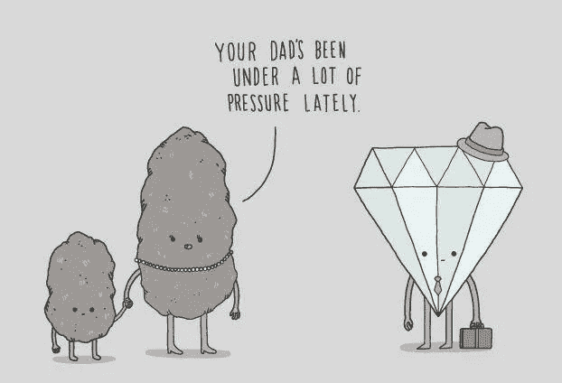

# “表达感激”

> 原文：<https://medium.datadriveninvestor.com/why-do-you-need-to-express-gratitude-94d05a879002?source=collection_archive---------18----------------------->

在这个动荡的时代感觉自己还活着，或者失去了一份工作，或者处于一个你觉得可以忍受的工作中？你是否一直伴随着一种失控的感觉？虽然你可能无法让你梦想的工作凭空出现，但你可以采取措施来限制你正在经历的压力的影响，甚至培养对它的免疫力。多个问题，一个解决方案。表示感谢！！

通过领先的研究工作表明，表达感谢不仅仅是说“谢谢”现在的研究表明表达感激能增加你的快乐。许多其他研究表明，体内的炎症可以减少，并为一个人如何改善他们的整体健康和福祉提供了见解。

不仅如此，表达感激能减轻压力，同时增加对生活的积极看法，改变你的大脑，让你看待和联想事情时减少恐惧和焦虑。

The health benefits of expressing gratitude are many, and some might even surprise you.

随着时间的推移，你如何用一种积极影响你幸福的方式来表达感激之情？

就像培养耐力需要定期锻炼和实践一样，培养感恩的习惯需要定期关注。在你说“我没有时间做那个”之前，让我向你保证这不需要花费时间，而且感恩节就要到了，所以这个技巧可能会派上用场。让我们来看看如何真正做到。

# 写一封感谢信。

从人类已知的最古老的表达感激的方式开始。信件！！表达感激能提高表达者和接受者的幸福感。写信者倾向于低估他们对收信人的积极影响，并阻止他们在日常生活中更多地表达感激之情。他们大大低估了收件人在收到一封充满感激之情的信时会有多惊讶和高兴。

 [## 我是如何成为经济发展资金纠结网的独立研究员|数据…

### 我很少发现自己处于一种看似独立的自由形式的身体抑郁状态，这种状态使人…

www.datadriveninvestor.com](https://www.datadriveninvestor.com/2020/10/23/how-i-became-an-independent-researcher-of-the-tangled-net-of-economic-development-funding/) 

# 写感恩日记。

每天花五分钟写下三件发生的或你感激的好事，随着时间的推移定期做，会改变大脑神经病学，使其专注于积极的事件，而不是令人担忧的事件。在困难的时候，尤其是像我们正在经历的这种时候，它帮助我们认识到几乎总是有值得感谢的事情。

# 对特别的人感恩。

花点时间想想你生命中那些特别的人，他们以积极而有意义的方式影响了你。这些人可以是家庭成员、老师，甚至是偶像。想想这些人对你的生活产生了怎样的影响和贡献。现在，花几分钟时间写下他们是谁，你和他们的关系是什么性质，为什么你如此感激在你的生活中拥有他们。

# 感恩冥想

在这个冥想中，你将探索感恩。坐在一个舒适的位置。闭上眼睛。放松身体，深呼吸。

现在想想你生活中让你感激的事情。在你的生活中选择一些让你充满感激的事情。这可以是一个人，包括你爱的人、父母、孩子、伴侣或朋友。也可能是你拥有的东西，你有能力做的事情，生活给你的教训，或者没有发生的事情。然后专注于感恩是什么感觉。注意你身体中感激的感觉。

总之，永远不要让现在的沉闷影响你性格中更美好的一面。记住，一艘船不会因为周围的水而下沉，它会因为水进入船内而下沉。试着不要让周围的压力影响你。建立一面感恩的盾牌，你将不断地被奖励处于比昨天更优越的境况，因为你生命中最轻松的一天就是昨天。

## 访问专家视图— [订阅 DDI 英特尔](https://datadriveninvestor.com/ddi-intel)