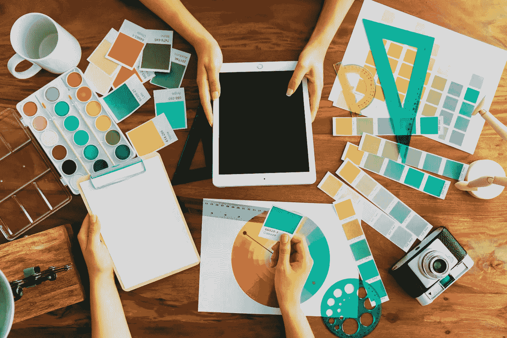
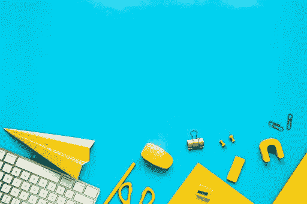

# 为什么每 5 年就需要更新 UI 设计？

> 原文：<https://medium.datadriveninvestor.com/why-do-you-need-to-update-ui-design-every-5-years-fbacff8744c7?source=collection_archive---------6----------------------->

如果你怀疑一次做出来的 UI 设计在很多年内都不够好，那么很可能你是对的。在这篇文章中，我们将告诉你如果你没有重新设计你的应用程序会发生什么，以及为什么定期更新 UI 设计很重要！

让我们从一个问题开始，如果你真的需要一个 UI 设计？你有一个好的，经过时间考验的 UX，用户熟悉，它的工作，并给出一个很好的转换。

 [## 2020 年最佳短期投资选择精选资源|数据驱动型投资者

### 投资是增加你净财富的一个好方法。如果你通过遵循一个严格的…

www.datadriveninvestor.com](https://www.datadriveninvestor.com/2020/03/28/handpicked-resources-for-the-best-short-term-investment-options-of-2020/) 

用户点击获取信息的按钮颜色不再时尚，app 的背景看起来也没有 5 年前那么酷，这有那么重要吗？你的旧 UI 设计的应用会比竞争对手的更有吸引力吗？重新设计的应用程序对用户友好吗？

# 用户界面重要的 5 个原因

让我们简单回忆一下为什么我们一般会做出漂亮的设计:

*   ***“永远为成功而着装。”*** 复杂或设计糟糕的应用导航会显著增加你的跳出率。
*   ***伟大的设计——伟大的事业。每个设计可能有三种用户反应:“是”、“否”和“哇”所有界面元素的组合会导致其中一个。对你的企业来说，最好有一个“哇”的回应。***
*   ***内容需要形式化。*** 有用的内容是你最好的营销工具。有了它，你就可以影响用户。然而，为了更好的感知，他们需要时尚、现代和高质量的设计。
*   ***方便 app 搜索。清晰一致的导航是用户界面的基本要求。如果事实证明它很难，大多数用户不会愿意浪费时间去弄明白它。***
*   ***形态和功能是一切的基础！*** 据专家称，用户界面的方便和简洁=优质的客户服务。

# 为什么 UI 重新设计对营销很重要

所以，也许做一个一劳永逸的优质设计就够了？要回答这个问题，我们先考虑一下界面重新设计的原因。

*   网站/应用程序是你公司的脸面。根据它，用户判断你的成功。过时的界面会对用户的信心产生负面影响，并把他们推向更现代的竞争对手网站。
*   **上一界面的错误修正。这包括:优化图形、简化导航等，所有这些都会显著影响交通。**
*   **引入新技术和新功能。**应用程序开发领域正在快速发展，不断为您的应用程序留住和吸引客户提供新的机会。值得使用它们来保持更新。
*   **在竞争应用中脱颖而出。**重新设计可以让你从竞争对手中脱颖而出，让你的应用比那些固守过时界面的人更有吸引力。
*   **收入增加。这一项是上一项的延续。你越努力升级你的用户界面，越多的入站流量，最终，你将获得更多的利润。**

> 在快速变化的技术世界中，人们对他们认为方便的 UI 应该如何工作有了新的期望。因此，重要的是不仅要满足他们的期望，而且要超越他们。

# 定期更新用户界面的其他优势:

*   你会意识到设计趋势和用户期望。要重新设计用户界面，你必须分析你的业务并在线提交，你将更好地了解你的目标受众，他们的期望和偏好。
*   降低开发应用程序的成本，因为通过正确的方法，UI 设计的所有元素将相互补充和加强。
*   逻辑和直观的界面。

> 独立信息技术研究公司 Forrester Research 的研究表明，平均而言，在设计上投入的每一美元都能带来 100 美元的利润。

# 久经考验的 UX 怎么样？

实践表明，界面过时的应用程序无法跟上现代的、充满活力的、直观的竞争对手。他们不再吸引新客户，并逐渐失去老客户。事实上，一个经过时间考验的 UX 的指导方针和忽视用户偏好如何变化关闭了新客户涌入你的渠道。

# 你需要多久更新一次用户界面？

最佳的用户界面更新率是 3-5 年。在这段时间里，有足够多的新发展来改进你的应用程序。

> 重要提示:重新设计并不意味着你的应用不成功。这只能表明该应用足够现代，能够满足不熟悉你的业务的新客户的当前需求。

如果你决定重新设计应用程序或网站，请记住:最好将[转向值得信赖的专业人士](https://geniusee.com/ui-ux-design)，他们会让你的项目变得更好，而不是相反。

*原载于 2020 年 4 月 21 日 https://geniusee.com**的* [*。*](https://geniusee.com/single-blog/why-do-you-need-to-update-ui-design-every-5-years)