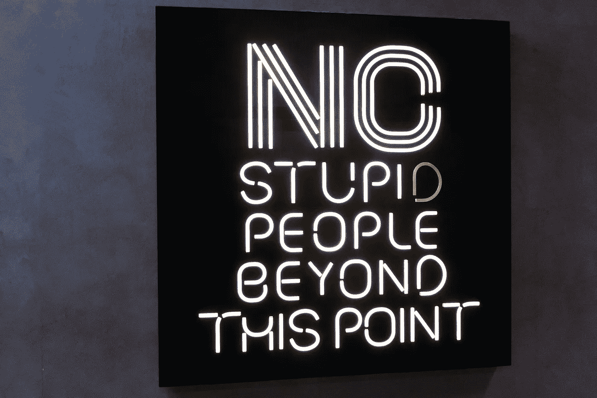

# 为什么会觉得自己知道的东西是“蠢”的东西？

> 原文：<https://medium.datadriveninvestor.com/why-do-you-think-what-you-know-is-a-stupid-thing-34b32869e791?source=collection_archive---------17----------------------->

## 请分享你的知识。我们都会非常感激！

Photo by [Nick Fewings](https://unsplash.com/@jannerboy62?utm_source=unsplash&utm_medium=referral&utm_content=creditCopyText) on [Unsplash](https://unsplash.com/s/photos/stupid-knowledge?utm_source=unsplash&utm_medium=referral&utm_content=creditCopyText)

# 我只是想到一些愚蠢的事情。

这就是我们大多数人对自己想法的看法:

*   它们对我们来说完全有意义。
*   它们是演绎过程的结果。
*   它们对我们来说只是常识。
*   它们是合乎逻辑的。
*   它们很简单。

你猜怎么着你的想法和知识对我来说并不容易。一点都不！

> 我们知道的一切对我们来说都很容易。因此，我们认为这对其他人来说也很容易。

这就是亨利·福特对制造汽车的想法。

或者爱因斯坦对他的相对论的看法。

我可以想象自己在和爱因斯坦对话:

> 嗨，艾伯特，伙计，你好吗？
> 
> 太好了，帕科，我在想相对论。
> 
> 哇，这是怎么回事？
> 
> 这很简单。想想这个质能关系:E = mc2
> 
> 哦，我明白了…

显然，我对艾伯特的“轻松想法”一无所知。

# 我们不需要成为爱因斯坦

不要认为这种推理只适用于复杂的思想，如物理、数学或哲学。

**这适用于我们自己的“简单”想法。**

*   由于我们的大脑可以很容易地将某些概念联系起来，我们确实认为其他人也可以做同样的事情。
*   由于我们有几十年每天做某事的经验，我们认为其余的应该很容易。

不要觉得自己想的很蠢。不要低估你的知识。如果你这样做，你会辜负你自己。

我给你举个我自己的例子。

**我根本不是一个杂工。**

> 我甚至有一次因为不能在墙上挂一幅画而生气，就把工具箱扔进了垃圾桶。

也许你是一个打杂的人，认为建造东西很容易，你的知识是“愚蠢”的。

我们都是不同的，我们都有长处和短处。这就是我们人类的本质。

 [## 取代你的风投？企业家的 5 条原则|数据驱动的投资者

### 在 Tau Ventures，我们建议所有企业家将融资过程中的勤奋过程视为双向的…

www.datadriveninvestor.com](https://www.datadriveninvestor.com/2020/11/29/replacing-your-vc-5-principles-for-entrepreneurs/) 

# 实验

向某人解释你知道的事情。看看反馈是什么。

你会惊讶地发现，你刚才所解释的甚至被认为是“深奥的知识”。

什么鬼东西！！！！

> 我几乎不加思考就做的事，叫“深识”？

现实就是这样。比我们拥有、考虑或分享的想法更不同的东西。

# 分享你的知识

现在是分享知识的时候了。

不要慌！让我们开始吧。看看能不能一起成长。

> 如果有些东西对你来说是愚蠢的，但对我来说是火箭科学，反之亦然，会发生什么？

以前，知识被认为是一种神秘的东西，是一种你必须小心对待并且永远不要分享的资产。

现在，事情完全变了。

*   分享是一种新时尚。
*   让每个人和我们自己成长的最新理念。
*   这是我们如何在生活中找到意义，我们如何获得满足感，这种满足感驱使我们走向幸福。

请不要犹豫分享任何东西。

*   没人会惹你。
*   如果他们不喜欢，他们就不会关注你。
*   但我很确定，大多数时候，每个人都会感到惊讶、高兴、感激和开心，因为你做到了。

不要认为你必须把你的知识传授给大师，那些对你的课题了解很多的人。

外面有很多人在等着它。不是大师的人，在他们的早期阶段谈论你的知识，值得你的帮助。

**没有什么比感觉自己在帮助他人变得更好、成长更好的了。**

*   他们会感激的。
*   他们的生活将会改善。
*   他们将能够给其他人带来更多的附加值(也许那就是你…因为你不是很多话题的专家…你知道的！).

> “你花了高于平均水平的时间学习的任何东西都可以转化为对普通人有价值的信息。”
> 
> 斯蒂芬·史密斯。

# 外卖食品

2002 年，我创建了自己的第一家公司。

那是一家空姐公司。

> 我本可以认为这是一个“愚蠢”的想法。一个“愚蠢”的梦，它将使我一事无成。

如今，它已经成为 3 家公司的控股公司，每年管理着 7 位数的收入。

生活中的一切通常都始于一个“愚蠢”的想法或步骤。即使是最重要的。

## 获得专家观点— [订阅 DDI 英特尔](https://datadriveninvestor.com/ddi-intel)