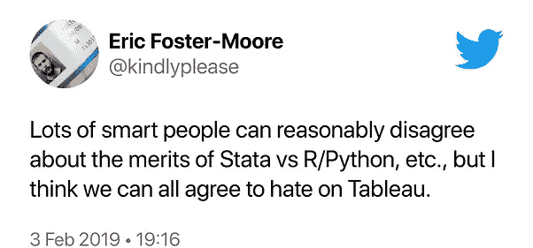
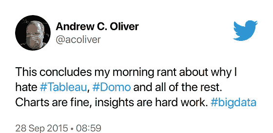

# 为什么大家都讨厌 Tableau？

> 原文：<https://medium.datadriveninvestor.com/why-does-everyone-hate-tableau-a9e797f97531?source=collection_archive---------2----------------------->

## GUH！


Photo by [ahmad gunnaivi](https://unsplash.com/@gunaivi?utm_source=medium&utm_medium=referral) on [Unsplash](https://unsplash.com?utm_source=medium&utm_medium=referral)

" Tableau 可以帮助任何人看到和理解他们的数据."他们这么说。

Tableau 等仪表板工具结合了分析和一些可视化功能，以及他们所说的商业“智能”或“洞察力”。他们经常混进 SQL 之类的编程语言。

问题是，他们没有那么“聪明”，也没有那么“有洞察力”编码语言肯定更聪明，但是它们真的很难用*。像制作饼图这样的基本事情会让你挠头。*

所以，你会发现很多人被类似 Tableau 的东西困住了。他们很沮丧。迷茫。也穷了很多。



推特用户总结得好:“我讨厌 Tableau。”[正如](https://community.infosecinstitute.com/discussion/134652/bait-and-switch)[※](https://www.fishbowlapp.com/post/hey-strategy-houses-have-you-used-business-intelligence-software-like-sap-or-tableau)[多了](https://www.reddit.com/r/tableau/comments/cmeuos/cheapest_way_to_embed_a_fully_interactive_viz/)[互联网](https://www.reddit.com/r/tableau/comments/c5ah5k/frustratedhelp_me_see_why_tableau_isnt_hot_garbage/)。

```
“I hate tableau and building reports. I just want to run them and get my data and not deal with the other stuff.”“I hate Tableau, it’s so sh!t”“Tableau sucks”“I hate Tableau for making [a simple function] so expensive.”“I f*cking hate Tableau and I make sure everyone I work with knows I won’t use it.”"It's the only piece of software I've used that makes things more difficult than it needs to be rather than easier.""I have PTSD from it""I have a passionate hate for Tableau"
```

我能理解。我在第一份工作中使用 Tableau，作为一名助理数据分析师处理学生数据，后来作为一名业务分析师处理 IT 销售数据。每次都很头疼。

当然，有些人喜欢画面。就像有些人喜欢在牛排上涂番茄酱一样。

有些人需要帮助——他们需要一种分析数据的方法，这种方法既要*智能，又要*有洞察力。即使没有编码印章。**

在 [Apteo](http://apteo.co) ，我们正在制作一个跳跃式数据分析工具。一个聪明，有洞察力，非常简单的人。重塑数据分析和见解并不容易。这是数百次对话和多年调整的结果。

它叫做[无代码分析](https://towardsdatascience.com/towards-no-code-analytics-making-everyone-a-data-scientist-f7693bd0abfd)，我希望你能和我一起用它来创造洞察力——不管你用什么工具！

这里有一个很好的例子，说明你可以用[无代码人工智能](https://medium.com/predict/why-no-code-is-the-future-of-ai-112d9bfde440)和分析来做什么。

[](https://medium.com/@frederikbussler/how-one-man-predicted-2020s-insanity-e79a2a95789b) [## 一个人如何预测 2020 年的疯狂

### 一个关于预测分析的令人难以置信的案例研究。

medium.com](https://medium.com/@frederikbussler/how-one-man-predicted-2020s-insanity-e79a2a95789b) 

为了获得更多的灵感，这里有一些我在 Medium 上写过的其他分析。

```
* [Analyzing NYPD allegations](https://medium.com/analytics-vidhya/bad-cops-analyzing-33-358-allegations-against-nypd-officers-280ff0f1645f)* [Predicting mushroom toxicity](https://medium.com/towards-artificial-intelligence/deadly-or-delightful-ai-to-predict-mushroom-toxicity-2aaa81c98f7a)* [Analyzing YC startups](https://medium.com/datadriveninvestor/a-fifth-of-yc-startups-fail-data-analysis-1f909d0b4a64)* [Predicting customer churn](https://medium.com/dataseries/how-to-build-a-dataset-to-predict-customer-churn-c4bc2984a83c)
```

当人们说仪表板让他们头疼时，他们不是在开玩笑。这叫做“压力性头痛”

[](https://www.datadriveninvestor.com/2020/07/02/how-data-analytics-can-inform-real-estate-finance/) [## 数据分析如何为房地产金融提供信息|数据驱动的投资者

### 数据是 21 世纪的热门商品。因为它能够推动和通知几乎所有行业…

www.datadriveninvestor.com](https://www.datadriveninvestor.com/2020/07/02/how-data-analytics-can-inform-real-estate-finance/) 

创业公司的存在是为了解决痛点，更好的数据分析解决了字面上的问题。

**访问专家视图—** [**订阅 DDI 英特尔**](https://datadriveninvestor.com/ddi-intel)