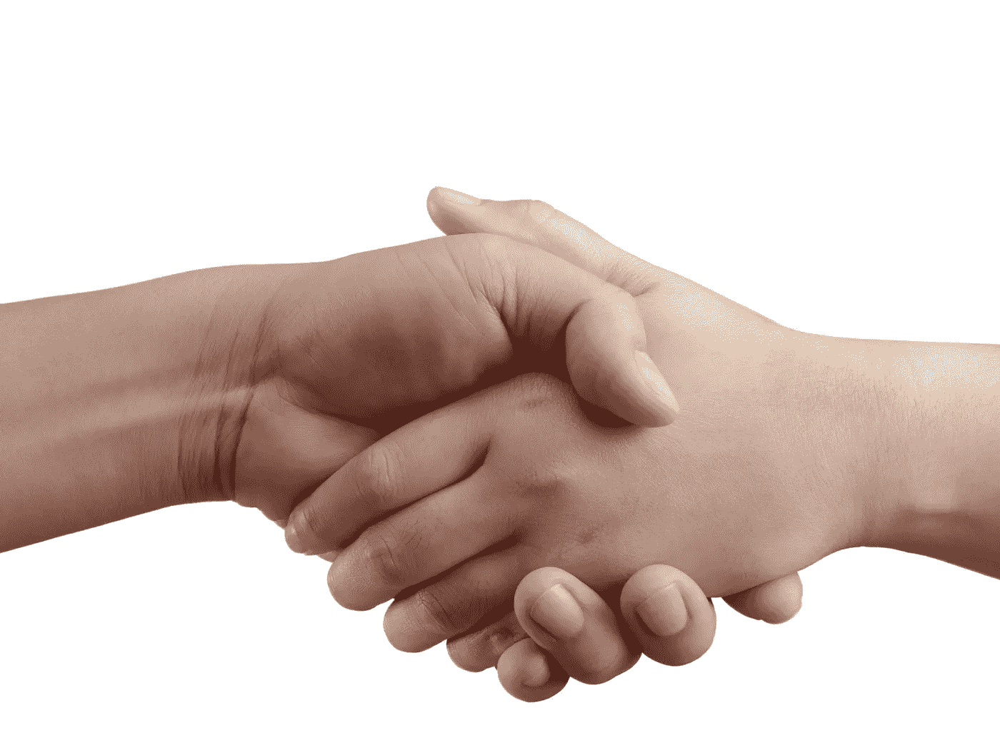

# 为什么 2020 年孤独的感觉如此糟糕

> 原文：<https://medium.datadriveninvestor.com/why-does-loneliness-feel-so-bad-in-2020-2bdd21b85673?source=collection_archive---------21----------------------->

“一个孤独的人是一种寂寞的东西，一块石头，一块骨头，一根棍子，一个吉尔贝杜松子酒的容器，一个坐在旅馆床沿上的佝偻的身影，像秋风一样发出长长的叹息。”约翰·契弗的期刊

人类强烈需要与他人联系，并获得不同社会群体的认可。我们是一个非常社会化的物种，我们与他人联系的驱动力根植于我们的生物学和进化史中。

它始于出生，你与照顾你的人的第一次关系似乎会影响你的一生。如果你小时候被照顾，当你长大后，你更有可能拥有健康、安全的依恋。或者，也许不是？在我们的人类历史上，肯定有许多案例证明了这个理论有一些漏洞，不公平地被遗弃的孩子能够很好地拥有绝对了不起的家庭，尽管发生了一切…

但是，人际关系的重要性有一些非常真实的东西，一些提出合理问题的东西。

为什么感觉与他人联系更紧密的人抑郁或焦虑程度更低，自尊、同理心和信任程度更高？

科学家认为，我们基本上有一种与他人联系的**倾向**，因为自然选择偏爱那些更倾向于关心后代和组织成群体的人类。

“在某种程度上，我们可以将进化描述为设计我们的现代大脑，这就是我们的大脑生来的目的:与他人接触和互动，”利伯曼写道。"这些社会适应是我们成为地球上最成功物种的关键."

我们对痛苦的体验会因为我们所爱的人的存在而减轻，我们的价值感与我们的社会地位联系在一起。

但是也许最重要的是要意识到**我们的社会关系对我们的幸福和健康有多么重要**

“我们都需要人们去爱和尊重，我们都需要爱和尊重我们的人，”利伯曼写道。两千年前，马可·奥勒留在他的日记中指出，关爱所有人符合人性。

 [## 如何通过使用 SCENARIO | Data Driven Investor 实现数字化，在新冠肺炎经济衰退中茁壮成长

### 如果数字化是避免新冠肺炎破产的解药会怎样？一百万人死亡，三十八…

www.datadriveninvestor.com](https://www.datadriveninvestor.com/2020/11/13/how-to-thrive-in-the-covid-19-recession-by-going-digital-using-scenario/) 

目前的情况影响我们的精神和身体健康吗？我们如何对待——**社交距离**？…

社交距离也称为“物理距离”，意思是在你和其他非家庭成员之间保持一个安全的空间。

但是，有太多的人把社交距离拉得太远，导致社交孤立——缺乏社交互动、接触，以及与家人和朋友、个人层面上的邻居和“整个社会”的关系。很简单，因为许多人太害怕关于新病毒可能带来的后果的所有信息，因为没有正确的方法来应对未知的情况…

目前，还不清楚我们应该遵循这些指导方针多久，以及隔离中的人们的恐惧将主导他们的日常生活多久。

我们真的没有太多的选择，但尽量避免太多的接触…不幸的是，我们中的许多人不得不独自呆着。

但是为什么孤独如此痛苦？而且，为什么我们那么在意别人怎么对待我们？

科学家认为，在社会排斥和身体疼痛时，大脑的相同部分被激活。由加州大学洛杉矶分校的谢莉·泰勒领导的另一项最新研究表明，由于人际关系中的冲突而产生的压力会导致体内炎症水平上升。无论是生理上还是心理上，我们对社会联系的体验是积极的，而对拒绝或孤独的体验是消极的。

美国的一项研究调查了超过 1000 万次谷歌搜索，并评估了在家措施后精神健康搜索查询的变化。毫不奇怪，与焦虑、消极思想、睡眠障碍和自杀意念相关的话题急剧增加。

这种隔离对那些低薪或无保障就业的人的心理健康和福祉造成了严重的负面影响。社会交往减少、经济损失和日常变化导致心理和情感影响，如消极情绪、失去意义和自我价值降低。

新冠肺炎疫情预计将对个人、家庭和社区产生悲剧性的影响，但社会距离干预也不应被忽视，因为它们似乎对控制病毒至关重要…

当然，你不能简单地对一个抑郁、孤独的人说——不要抑郁，不要再孤独了，因为指望它会神奇地改变局面是很可笑的。

但是……经常发生的是，我们通过过度思考把自己稍微复杂的情况变成了极端的情况。对一个人来说，把任何生活状况变得无法承受和难以忍受是非常容易的。这一切都发生在我们的脑海中

我们人类有把一切都发挥到极致的倾向。尽管疫情极具破坏性，恢复正常将是令人惊叹的，但我们不能通过放弃维持我们所需的必要活动来改变这种状况，而花费我们的时间抱怨和痛苦将使情况变得更糟……我们将自己与世界隔离开来肯定没有任何好处。

我们意外地发现，快速的变化可以从任何地方冒出来……我真的不想悲观，但也许在新冠肺炎疫情之后，一场新的颠覆会随之而来。我们已经塑造了无数个世纪的世界，更有可能时不时给我们带来新的不愉快的惊喜…

尽管我们别无选择，只能学习、适应和寻找自身的力量，但我们还是会陷入自己的方式。我们抵制变革。我们希望一切保持不变。事实上，我们竭尽全力避免改变。

而所有这些行为都让我们变得极其脆弱。

脆弱的人会怎么样？占主导地位的人、大公司和他们的营销人员利用他们的弱点来赚大钱。

订阅，了解更多关于产品的信息，购买产品，并采取行动！

他们承诺，一旦你买了东西，一旦你成为“快乐社区”的一员，你就会感到不那么孤独，快乐得多。

奇怪的是，巨大的说服风暴从不同的地方向我们袭来，直到我们做出决定……这个决定并不总是对我们有利。

还能做什么…感觉世界末日要来的时候。

我相信总有办法让自己不再如此软弱……

别这么戏剧化！

又不是世界末日！也许，这是一个新时代的开始…如果我们都设法维持并度过艰难的时光。无论如何，不知何故我们设法做到了很多次…

你要么每天锻炼，要么什么都不做。你要么每天工作，要么什么都不做。你要么买你不需要的东西，要么就别买了。

为什么这么严肃？

你可以做任何你想做的事。这是你的生活。当遇到不确定和困难的时候，最好有一个轻松的方法。

挣扎是没有用的。别挣扎了！

如果你在过去的几个月里感到孤独和挣扎…在生活中，你过去做了什么并不重要。

一切都取决于你今天决定做什么！

每一天都是新的一天，与你之前的所作所为无关。

关键是永远不要放弃努力变得更好。

总有办法不感到孤独…

视频:

**访问专家视图—** [**订阅 DDI 英特尔**](https://datadriveninvestor.com/ddi-intel)