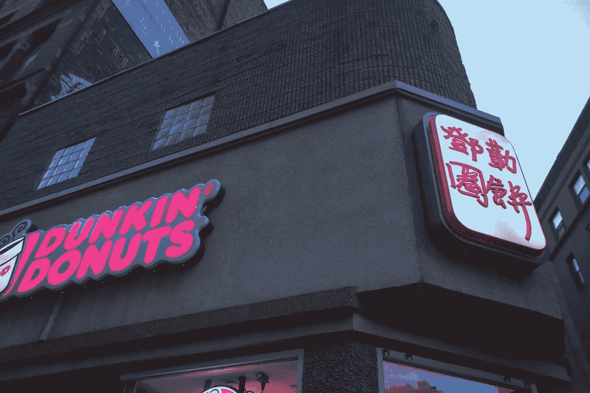
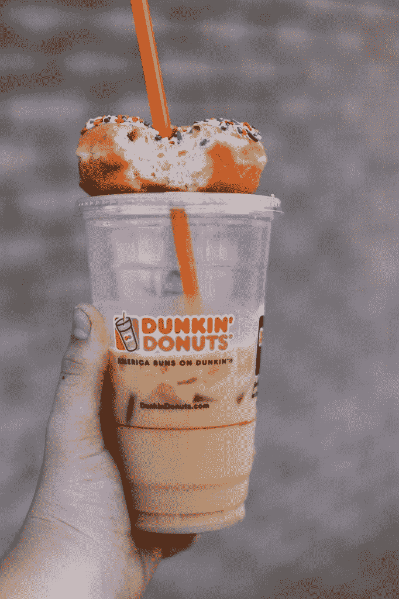
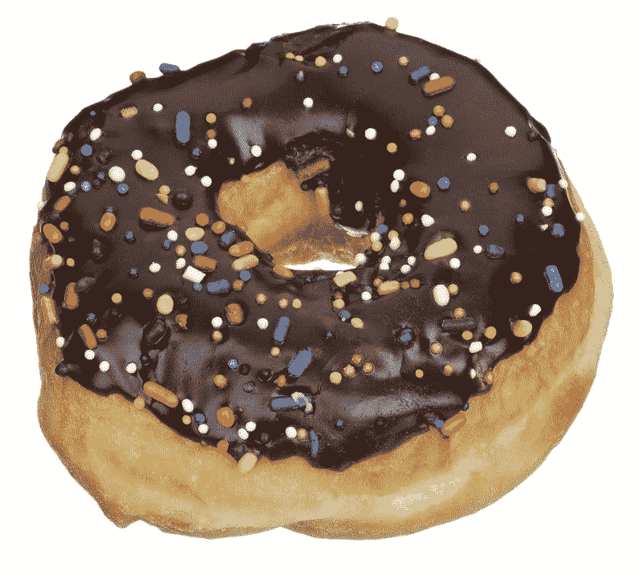
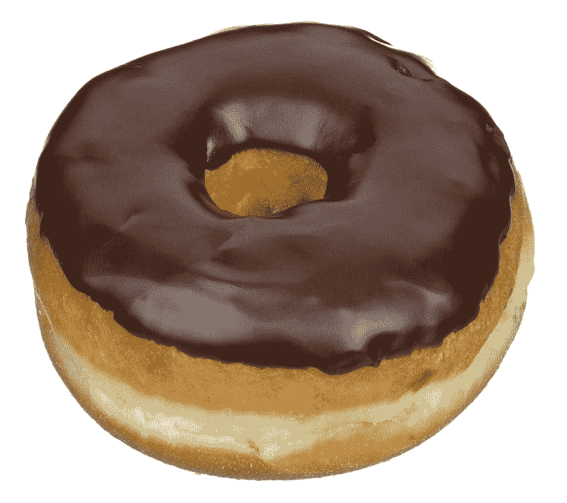
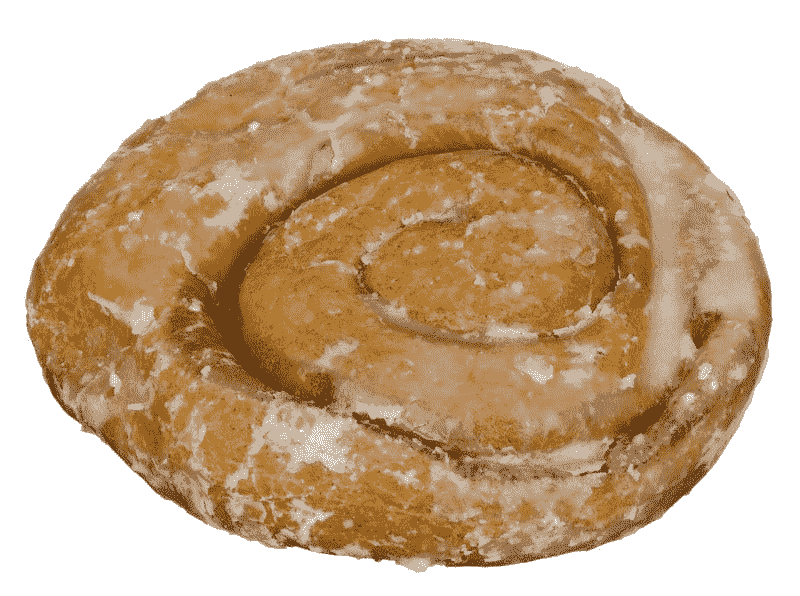

# 为什么市场先生喜欢邓肯甜甜圈？—市场疯人院

> 原文：<https://medium.datadriveninvestor.com/why-does-mr-market-love-dunkin-donuts-market-mad-house-203cc92d4b9?source=collection_archive---------27----------------------->

**Dunkin' Brands (DNKN)** 是 2020 年最奇怪的股票成功。Dunkin Donuts 母公司的股价从 2020 年 1 月 2 日的 76.46 美元上涨到 2020 年 11 月 11 日的 106.17 美元。

这个标志性的咖啡店品牌，还拥有冰淇淋传奇芭斯罗缤，在疫情很有吸引力。即使其他快速服务图标遭受或停滞不前。例如，**星巴克(SBUX)** 股价从 2020 年 1 月 2 日的 89.35 美元，到 11 月 8 日的 90.65 美元，再到 11 月 11 日的 106.17 美元。

同时**，餐饮品牌国际(QSR)** 从 2020 年 1 月 2 日的 64.70 美元跌至 2020 年 11 月 8 日的 53.82 美元，再跌至 2020 年 11 月 11 日的 57.41 美元。**餐饮品牌(纽约证券交易所:QSR)** 拥有 Dunkin' Donuts 最接近的竞争对手 Tim Horton's。

# 为什么市场先生爱 Dunkin 品牌？

持怀疑态度的投资者会想，为什么市场先生喜欢 Dunkin Brands Group Inc .(纳斯达克代码:DNKN)。

一个显而易见的解释是，在恐怖和混乱的时期，人们渴望舒适的食物，如油炸圈饼和冰淇淋。冠状病毒、经济崩溃和政治混乱让 2020 年变得可怕而混乱。

另一种可能是，人们想要一种比星巴克更便宜的替代品。Dunkin 的咖啡比星巴克的便宜。一些愤世嫉俗者会怀疑，当人们离开办公室时，推动人们购买星巴克等知名品牌的社会压力是否会消失。

解释一下，有些人喝星巴克是因为他们想让人们看到他们在喝一种精致或上流社会的咖啡。如果那些人不在办公室，那些人可能会选择工薪阶层的 Dunkin。

因此，我们需要问 Dunkin Brands 是在赚钱还是在增长。

# Dunkin Brands 赚钱了吗？

**邓金品牌(DNKN)** 于 2020 年 9 月 30 日报告季度营业收入为 1.2891 亿美元，季度毛利为 3.2336 亿美元。

Dunkin 的季度毛利从 2020 年 6 月 30 日的 2.5126 亿美元和 2020 年 3 月 31 日的 2.8550 亿美元增长。然而，Dunkin 的季度营业收入从 2020 年 6 月 30 日的 8162 万美元增长到 2020 年 3 月 31 日的 1.0131 亿美元。

此外，Dunkin 的季度收入从 2020 年 3 月 31 日的 3.2314 亿美元增长到 2020 年 6 月 30 日的 2.8738 亿美元，再到 2020 年 6 月 30 日的 3.6154 亿美元。因此，Dunkin Brands 赚了更多的钱，创造了更多的收入。

然而，邓金的增长率微乎其微。Stockrow 估计，在截至 2020 年 6 月 30 日的季度中，Dunkin 的收入增长率为 1.59%。值得注意的是，在截至 2020 年 6 月 30 日的季度，Dunkin 的收入增长下降了 20.03%。

# 邓肯甜甜圈能产生多少现金？

Dunkin' Brands 的业务产生了一些现金。Dunkin 报告 2020 年 9 月 30 日的季度运营现金流为 1.31 亿美元。该季度运营现金流从 2020 年 6 月 30 日的 4898 万美元。

Dunkin Donuts 报告称，截至 2020 年 9 月 30 日，季度末现金流为 9223 万美元。季度末现金流从 2020 年 6 月 30 日的-6358 万美元上升至 2020 年 3 月 31 日结束的季度的-67504 万美元。

诱人的是，Dunkin Brands 正在偿还债务。Dunkin 报告的季度融资现金流在 2020 年 6 月 30 日为-1.0847 亿美元，在 2020 年 9 月 30 日降至-3426 万美元。因此，Dunkin Brands 在疫情期间偿还了债务。我认为债务偿还吸引了一些投资者购买这只股票。

Dunkin Brands (DNKN) 持有一些现金。截至 2020 年 9 月 30 日，Dunkin 拥有 7.0327 亿美元的现金和短期投资。

# Dunkin 品牌有什么价值？

Dunkin 在 2020 年 9 月 30 日的总资产为 38.89 亿美元，价值不大。

Dunkin Brands 声称在全球经营[11000 家 Dunkin Donuts 店](https://www.dunkindonuts.com/en/about/about-us)。具体来说，Dunkin 声称在美国 41 个州经营着超过 8500 家 Dunkin Donuts 餐厅。该公司声称在 36 个国家经营着另外 3200 家咖啡和甜甜圈店。

此外，Statista 估计 2019 年美国有[2524 家芭斯罗缤冰激凌店](https://www.statista.com/statistics/291474/distribution-points-baskin-robbins/)。Statista 估计全球有超过 20，000 家分店出售芭斯罗缤冰淇淋。

因此，冰淇淋比甜甜圈和咖啡更能增加邓肯的价值。

# Dunkin Brands 是好股票吗？

我认为 Dunkin Brands 对普通人来说是一只糟糕的股票，因为该公司几乎不产生现金。

相反，Dunkin 将在 2020 年 8 月 31 日支付 40.25₵的高额股息。总体而言，Dunkin 在 2020 年 11 月 6 日提供了 1.50 美元的年化股息和 1.41%的股息收益率。

我的建议是，在 Dunkin Brands 的股价跌至合理价位之前，避开它。我认为市场先生在 2020 年 11 月 11 日将 Dunkin 的价格定在了 106.17 美元。我认为邓肯甜甜圈的现实价格是 50 美元。

在今天的市场上，远离 DNKN 等产生少量现金的高价股票是一个小小的举动。

*原载于 2020 年 11 月 11 日 https://marketmadhouse.com**[*。*](https://marketmadhouse.com/why-does-mr-market-love-dunkin-donuts/)*