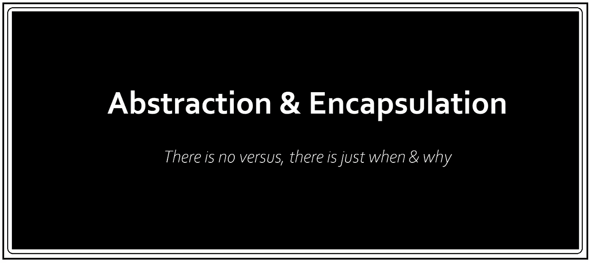

# 特斯拉为什么要藏东西？

> 原文：<https://medium.datadriveninvestor.com/why-does-tesla-hide-things-6c63ff1b78bd?source=collection_archive---------11----------------------->

一个无代码版本，来自一个 Tesla 粉丝，旨在解决面向对象软件设计中抽象与封装的两难问题。

为什么面向对象编程如此受青睐？除了几十年来被广泛接受和高度需求之外，它还是首选，因为它对人脑有意义！有道理，因为更贴近现实生活。

抽象和封装是任何使用 OOP 的人可以利用的主要工具。由于非常相似，它们在概念上如此接近，但在意图上又如此不同，以至于混淆不清。只有当我们知道如何使用它们，但不知道何时以及为什么使用它们时，问题才会出现。如何用代码来回答，我们将使用特斯拉的例子来看看什么时候和为什么，抽象和封装使事情超越。

# **行动中的抽象**

Photo by [Bram Van Oost](https://unsplash.com/@ort?utm_source=medium&utm_medium=referral) on [Unsplash](https://unsplash.com?utm_source=medium&utm_medium=referral)

你刚才看到的是特斯拉 Model X 的内部，这是地球上最快的 SUV，在 2.8 秒内从 0 到 100 公里/小时(已经令人惊叹)，从不需要燃料，空中更新和功能添加，生物武器防御模式，使用强大的过滤系统来提供*医院级*室内空气质量，5000 磅牵引能力，自动驾驶导航，自动变道和坡道操纵。

 [## Neuralink:未来还是终结？数据驱动的投资者

### 见见 Neuralink，埃隆·马斯克的新宝贝。一个微小的大脑植入物，可以将脑电波实时传送到你的手机上…

www.datadriveninvestor.com](https://www.datadriveninvestor.com/2020/09/01/neuralink-future-or-the-end/) 

最精彩的部分；您访问所有这些独特功能的唯一途径是仪表板上的 17 英寸触摸屏。你不知道这些是如何运作的，也不需要知道。特斯拉没有传统的笨重的面板和恼人的旋钮，而是简约的方法使它独一无二。

这本质上就是抽象；只显示基本信息，隐藏其余信息，选择性显示的唯一目的是使用户体验简单有效。简单，因为他们只能看到他们需要的东西；有效，因为显示器完全独立于背景中发生的任何事情。如果一个书呆子特斯拉家伙在一夜之间改变了软件中的一些东西，特斯拉所有者仍然可以在早上使用相同的界面。这就是我们在软件术语中所说的解耦，这是抽象的甜蜜果实。

# 实际封装

Photo by [CardMapr](https://unsplash.com/@cardmapr?utm_source=medium&utm_medium=referral) on [Unsplash](https://unsplash.com?utm_source=medium&utm_medium=referral)

特斯拉配备了可升级的软件锁定功能。其中最突出的是电池容量升级和自动驾驶功能启用。这意味着，特斯拉销售的基本版本，比如说，型号 S 的电池组为 75 千瓦时，但软件锁定为 60 千瓦时的容量。它允许该公司降低 Model S 的入门价格，但也导致特斯拉运输 15 千瓦时的未付费电池容量。为了通过无线更新释放额外的电池容量，您需要支付额外的费用。与此类似，autopilot 功能可以免费试用 30 天，30 天之后就会被锁定，只有付费订阅后才能解锁。

如果我们看下引擎盖，抽象仍然存在。有些信息或功能是隐藏的，但只是这一次意图不同。这一次的重点不是简化用户界面，而是首先执行身份验证和确认，基于此，您可以获得选择性访问。此外，访问是依情况而定的，可能因每个用户而异。

这就是封装；抽象的许多可能实现之一。每当我们在任何地方看到封装，抽象都是默认的。不同的是，我们的关注点从用户转移到了系统。现在的目的是数据完整性和受控访问。在某种程度上，你是在与隐藏域进行交互，但是它是有约束的，这些约束只能通过封装来维持。

# 它们为什么相同，为什么不同

关于特斯拉的赞美已经说得够多了，让我们看看所有这些是如何应用于面向对象的软件设计的。下面列出的几点，我认为可以让我们理解什么时候&为什么我们应该选择抽象和封装。

**—关注—**

抽象地说，我们关心的是用户。我们隐藏了细节，因为目的是简化用户的体验。

在封装中，关注的是系统。您可以获得对数据的选择性/受控访问，但是适当的封装有助于身份验证和确认。

**—动机—**

抽象遵循一个*‘不需要’*的动机。我隐藏信息是因为用户不需要看到它。只是提供他所需要的，不多不少。

封装遵循一个*‘不应该’*的动机。我隐藏信息是因为你不应该看到它，因为它对我的数据完整性/隐私至关重要，也有助于我在授予你选择性访问权之前进行验证。

**—决策边界—**

抽象是一个设计决策。如果我选择不使用它，我的产品设计会受到最大的影响。

封装是一个实现决策。不使用封装可能会损害数据完整性，并可能导致逻辑和功能错误。

**—触发器—**

为了看到一个抽象的动作，我们必须看到有人如何使用你的产品或者与你的产品交互。

当事件发生时可以看到封装，例如访问需要受控访问的功能或数据。

**—范围—**

抽象地说，因为隐藏的目的是隐藏复杂性，所以提供的访问点服务于利用底层隐藏功能的目的。

在封装中，目的是授予选择性和可变的访问权限，并维护数据的安全性和有效性，因此所提供的访问点不仅仅是提供访问权限。您可以来回发送数据，并在系统执行维护检查所需的操作时利用底层功能。

总之，抽象和封装是非常不同但高度相关的概念。我认为封装是抽象的子集。只是意图不同而已。只有当我们恰当地使用它们时，我们才能真正受益于面向对象编程范例的力量。

## 获得专家视图— [订阅 DDI 英特尔](https://datadriveninvestor.com/ddi-intel)