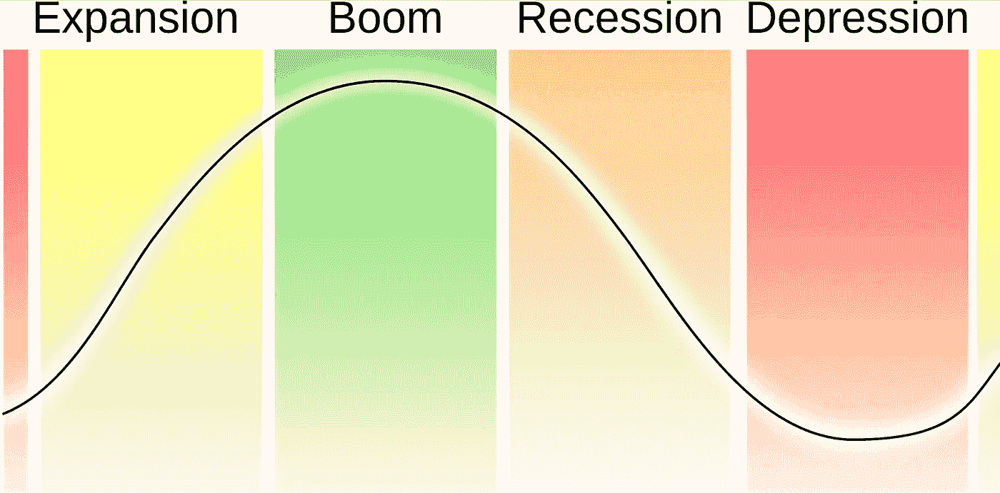

# 为什么经济会周期性运行？

> 原文：<https://medium.datadriveninvestor.com/why-does-the-economy-run-in-cycles-c0fbcfde663a?source=collection_archive---------17----------------------->

我们经常听到经济学家谈论经济周期，但它是什么，为什么经济运行在周期中？经济可能看起来很复杂；然而，它的工作原理简单而机械。

一个需要回答的基本问题是，什么导致了周期？我们为什么要在乎？

**概要:**

*   决策者，他们是谁，他们在经济中扮演什么角色
*   经济周期。是什么引起的？
*   知道这些有什么意义？我*只是*想投资金融市场！

一般意义上的政策制定者是指负责制定新的规则和法律的组织。在金融和经济中，决策者通常指**央行**和**政府**。

# 政府的作用

政府可以购买商品和服务，在困难时期把钱交到人民手中。他们实施刺激计划来增加支出和刺激经济，帮助失业者和重新分配财富。然而，政府受到预算的限制，需要另一个决策者的帮助:中央银行。

> **-是中央银行和人民之间的纽带
> -受到预算的限制，不能印钱
> -需要中央银行的帮助来资助他们的刺激计划**

# *中央银行的角色*

*中央银行(如美联储或欧洲央行)是经济中的主要参与者，尤其是在危机和衰退期间。通过做好他们的工作，他们可以大大降低经济周期的强度。他们通过平衡利率来影响信贷的流动；他们也可以印钞票，购买金融资产和政府债券。*

*政府不能印钱；央行可以。央行只能购买金融资产，无法触及民众。政府和央行必须合作:通过购买政府债券，央行借钱给政府，并允许政府出现赤字和增加支出(为刺激计划融资)。*

*下面我们来详细看看**信用**和**印钞**是如何工作的。*

## *信用*

*要开立信用证，您需要两个相关方:*

*   *想赚更多钱的贷款人*
*   *想买自己买不起的东西(买车、买房、创业)的借款人*

***信用帮助双方各得其所。它还通过赋予借款人购买其无力支付的东西的权力来增加支出。***

*因此，信贷刺激了支出和投资。*

*中央银行通过提高利率来引导经济:*

*   *如果他们降低利率，信贷就会放松，支出和投资就会增加。*
*   *如果他们提高利率，就会发生相反的情况，经济就会放缓(他们利用这一点来降低通胀)。*

## *印钞*

*如果降低利率还不够，央行就被迫印钱。**新鲜的现金(凭空创造)被用来购买金融资产和政府债券以刺激经济。**它主要惠及那些拥有金融资产的人(参见[经济中的赢家和输家](https://thenextwave.substack.com/p/i-dont-have-enough-money-good))。*

*最近的例子:*

*   *2008 年:美联储印刷了超过 2 万亿美元*
*   *2020 年:美联储印刷了超过 6 万亿美元*

> ****关于央行的关键要点:*** *——平准(提高或降低)利率
> ——印钱
> ——通过购买政府债券为政府融资**

*一个周期是经济在扩张期和收缩期之间的波动。尽管这些循环是由以一定模式重复出现的一系列逻辑事件驱动的，但它们并不是注定要以相同的方式重复或花费相同的时间。**他们背后的关键因素是债务。***

*你每次借钱都是在创造一个循环。每次你买你买不起的东西，就意味着你花的比你挣的多。你不仅仅是从贷款人那里借钱；你在借用未来的自己。你创造了一个未来的时间，在这个时间里你需要花的比你挣的少来偿还。因此，这种模式是(I)借款+入不敷出(ii)入不敷出+报销。*

*信用不是只会制造循环的坏事；当它为未来无法偿还的东西融资时，这是非常可怕的。借钱买电视并不能产生收入来偿还债务。然而，如果你借钱去资助那些能提高你的生产力和赚更多钱的工具。可以更快的偿还债务，提高生活水平。*

***信贷/债务起初促进生产/增长，后来又抑制生产/增长。当经济增长缓慢时，中央银行给它加油，当经济快速增长时，限制它踩刹车。***

> ****关键要点*** *:
> -信贷提供购买力，刺激支出和投资
> -信贷产生必须偿还(在未来)的债务，减少支出和投资**

*一个周期通常分为四个阶段:(一)扩张阶段，(二)繁荣阶段，(三)衰退阶段，(四)复苏阶段。*

# *膨胀阶段*

*扩张阶段的特点是快速增长、低利率和增加生产。它由贷款推动，贷款创造了自我强化的上行运动，支持支出和投资，支持收入和资产价格。这造成了通胀压力。*

> ****扩张阶段的关键要点:*** *-快速增长/产量增加
> -信贷唾手可得:低利率→高贷款利率
> -通胀压力(物价上涨)**

# *危机或繁荣阶段*

*当我们接近*扩张阶段*的尾声时，中央银行不希望有太多的通货膨胀，因为它会引发问题(比如基本商品价格的飙升)。因此，随着通胀压力的增加，他们最终会收紧货币政策。*

*高峰是鲁莽放贷导致高违约率的临界点。泡沫即将到来的一个经典警告信号是，越来越多的钱被用来偿还债务，这当然会加重借款人的债务。*

> ****繁荣期的关键要点:*** *-证券交易所崩盘
> -多家公司破产**

# *衰退阶段*

*在这个阶段，利率很高，借钱的人越来越少，因此，支出和投资放缓:经济活动显著下降。*

> ****收缩阶段的关键要点:*** *-高利率
> -贷款利率放缓
> -物价和生产下降**

# *底部或恢复阶段*

*低廉的价格使得消费和生产再次回升。中央银行降低利率来刺激经济复苏。*

> ****复苏阶段的关键要点:*** *-低价格
> -证券交易所复苏
> -央行降低利率**

*经济是市场的集合体。要理解金融市场上正在发生和可能发生的事情，就必须理解金融市场和经济之间的关系。整个系统是一个永无止境的寻找平衡的过程。看到哪些部分失衡，可以让我们预测将会发生什么样的货币政策转变，以及这些转变将对金融市场产生什么影响。下周，我们将看到我们今天学到的东西将如何帮助我们做出更好的投资决策。*

**原载于 2020 年 7 月 28 日*[*https://thenextwave . blog*](https://thenextwave.blog/why-does-the-economy-run-in-cycles/)*。**