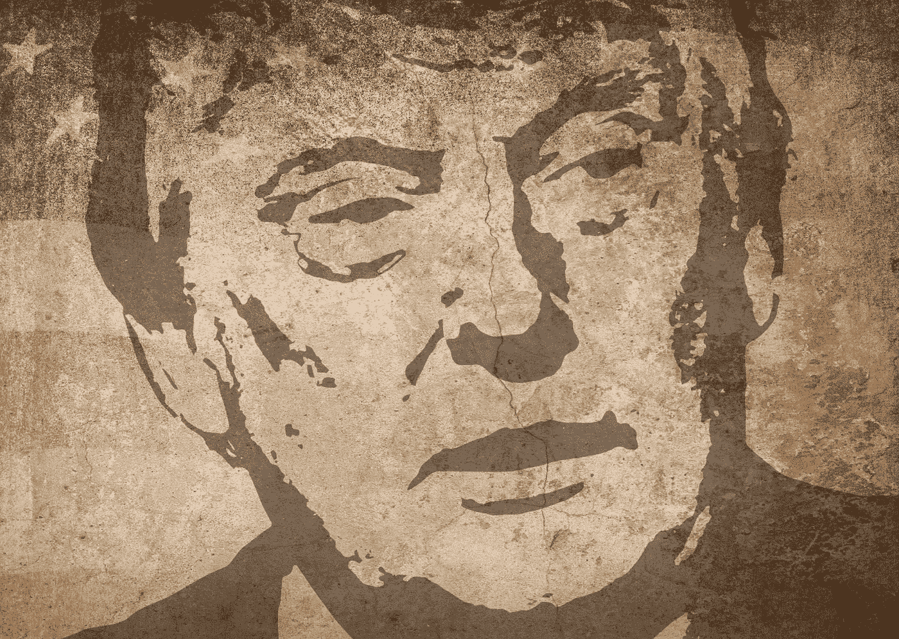

# 为什么唐纳德·特朗普是人生游戏中的最终赢家

> 原文：<https://medium.datadriveninvestor.com/why-donald-trump-is-the-ultimate-winner-in-the-game-of-life-50defcabb6c5?source=collection_archive---------9----------------------->

## 当特朗普成为美国第 45 任总统时，他赢得了人生的游戏

Image by [M. H.](https://pixabay.com/users/mih83-464187/?utm_source=link-attribution&utm_medium=referral&utm_campaign=image&utm_content=1822121) from [Pixabay](https://pixabay.com/?utm_source=link-attribution&utm_medium=referral&utm_campaign=image&utm_content=1822121)

用唐纳德·特朗普(Donald Trump)的话说，他的“一生都在争取胜利。我不常输。我几乎从没输过。”特朗普会辩称，他对生活的“赢家”态度意味着他注定会伟大(或臭名昭著，取决于你的观点)。

2016 年末，唐纳德·特朗普成为美利坚合众国第 45 任总统。只有另外 44 个人能够获得这一殊荣。爱他或讨厌他，没人能否认 T2 成为总统的事实。如果你将这一成就与他的亿万富翁身份和他的花瓶妻子相提并论，那么你所拥有的，与他为实现这一目标而部署的不择手段的策略无关，就是资本主义最终的成功故事。特朗普赢得了人生的游戏。

你可能会问自己，这一切到底是怎么发生的？好吧，要理解特朗普之流如何以及为什么如此引人注目地赢得了人生游戏，一个有用的方法是将人生视为同名的棋盘游戏。

在棋盘游戏“生命的游戏”中，多达八名玩家可以旋转生命之轮。这个游戏的最终目的是在你的“一生”中积累尽可能多的财富。赢家是游戏结束时最富有的人。

棋盘游戏有很多种玩法，人们对它的反应也各不相同。你会看到无情的玩家，有策略的玩家，有些人会为了胜利不择手段。然后是骗子，爱哭的孩子，那些因为失败而愤然离去的人。

生活的游戏实际上是一场游戏。但是，这也是一个微小生命的隐喻。玩游戏的目的是赚尽可能多的钱，这唤起了我们在日常生活中经历的同样的情绪，只是它们以一种更原始的形式表达出来。玩家变得贪婪、嫉妒、报复、嫉妒，所有这些都是系统中常见的情感特征。

因为《生活游戏》*是*资本主义的一面镜子，两者的最终目标是一样的，尽可能多赚钱。

棋盘游戏是对整个系统的一个有用的比喻，因为这个系统本质上是一个巨大的棋盘游戏。棋盘游戏和现实生活中的游戏的区别在于，你看不到棋盘，因为你身处其中，除了玩别无选择。

## 最终的赢家

在现实生活中，法律体系(规则)支配着我们每个人。在这些规则的范围内，你可以随心所欲地玩游戏。

那么，唐纳德·特朗普(Donald Trump)是如何“玩游戏”的呢？唐纳德·特朗普已经并将尽一切努力赢得胜利。在棋盘游戏上，他是不按规则玩的人。他上前时数错了，从银行偷钱，趁你不注意拿走你的钱。特朗普以他的方式玩游戏。正是他的冷酷无情、自恋和对其他球员缺乏同理心让他如此成功。

生活的游戏鼓励人们变得贪婪、自私，并且对其他玩家毫无同情心。特朗普的人格在所有这三个方面都名列前茅。

要在资本主义中取得成功，你必须展现出无情的一面，让你在竞争中领先。在游戏结束时，你获得金杯的最好机会是击败你的对手。竞争越少，你就越有可能赢。

## 作弊的游戏

唐纳德·特朗普的个性使他成为“游戏”中一名出色的玩家。不管你是否觉得他令人厌恶，也不管你是否不喜欢我们被迫玩的游戏，他都是最终的赢家。他会告诉任何人和每个人他玩得有多好。

棋盘游戏和现实世界的显著区别在于，在棋盘游戏中，规则不会改变，每个人都必须遵守相同的规则。如果比赛进行到一半时规则突然改变，将会造成一场混乱。

在现实世界中，游戏规则(法律)是不断变化的。问题是一些玩家有责任改变规则。你认为规则会改变以更好地服务于每个球员吗？或者你认为规则可能会改变，以确保一些精选的玩家继续脱颖而出？

规则制定者也玩这个游戏，意味着这个游戏是腐败的。俗话说，如果权力导致腐败，绝对的权力导致绝对的腐败，你可以肯定[规则是为了确保有钱有势的人仍然有钱有势而制定的。穷人仍然是穷人。](http://www.transformatise.com/2020/08/why-breaking-the-law-can-destroy-the-age-of-fossil-fuels/)

在生活的游戏中，你所知道的，或者你有多聪明或多有能力，并不一定会让你领先于其他人。你认识谁，你可能继承多少财富，这些都是游戏规则的改变者，提供了游戏中其他人永远得不到的机会。

你成功的机会取决于你出生在哪里，你出生在哪个家庭。因为我们并不是所有人都在一个公平的环境中开始游戏，否则，富人继续富下去，穷人继续穷下去的现状就不会存在。

在英国，公立学校的男生主导着某些工作领域。例如，超过一半的记者都上过公立学校。他们的父母每年不为学校教育本身支付数万英镑。他们花钱把孩子送到这些学校来建立人脉。

裙带关系盛行，通过有钱有势的人给他们的朋友和家人工作(有趣的是)导致同样的家庭保持富有。

## 按照游戏规则玩游戏

但是等一下，你可能会问，最近不是有消息称唐纳德·川普欠了[10 亿美元的债务吗？是的，这又有什么错呢？他只是在按照游戏规则玩游戏。毕竟，这个世界正被债务淹没。全球债务现在已经](https://www.forbes.com/sites/danalexander/2020/10/16/donald-trump-has-at-least-1-billion-in-debt-more-than-twice-the-amount-he-suggested/#71b8a33b4330)[达到了令人难以置信的 258 万亿美元](https://uk.reuters.com/article/us-global-debt-iif/global-debt-hits-record-high-of-331-of-gdp-in-first-quarter-iif-idUKKCN24H1V5)，超过了全球 GDP 的 300%。

因此，如果整个系统都深陷债务之中，那么它最成功的玩家深陷债务之中有什么问题呢？为什么他受到质疑，而整个系统的债务却不受质疑？

特朗普和许多像他一样的人按照自己的规则玩游戏。通过这样做，从游戏的角度来看，他没有做错任何事情。他没有违反任何规定(好吧，反正他也没有因为违反任何规定而被当场抓住)。你不能责怪特朗普的为人；你必须责怪鼓励和奖励特朗普的制度。因为他的身份让他拥有了财富，得到了他的战利品妻子，让他成为了总统。

## 特朗普的成功揭示了资本主义的缺陷

资本主义需要特朗普这样的人物，就像特朗普需要资本主义的制度一样。一个依赖于另一个。

不要质疑唐纳德·特朗普是赢家。质疑创造这个人的制度，并允许他运用自己的人格力量成为胜利者。特朗普的成功揭示了更多关于游戏本身的东西；那就和这个人有关。

毕竟，特朗普只是一个非常精明的球员，知道如何“玩”这个游戏。毫无疑问，他越线了，违反了规则。但是对于一个没有道德结构的人来说，如果这样做能让他得到他想要的，那么从他的角度来看，回报超过了他的行为可能带来的任何痛苦。

虽然棋盘游戏对每个人来说看起来都一样，但我们玩的规则和每个玩家的起始位置会根据你的出生地而发生根本的变化。

现实是，在现实生活的游戏中，大部分玩家连转转轮的机会都没有。这就是他们在世界上第一次呼吸时的不利条件，他们赢得比赛的机会在他们开始之前就已经结束了。他们在棋盘上，但他们没有机会玩游戏。他们是棋子，用来帮助那些能玩的人变得更富有。

特朗普获得了人生中最好的开端。我的意思是这个家伙从他的父亲那里得到了超过 4 亿美元。这并不是说这笔财富使他注定成为一个'赢家'，但它肯定不会损害他的机会。因此，当特朗普说他的一生都是为了胜利时，当然是这样。因为，在人生的游戏中，他从一开始就被赋予了成为赢家的所有工具。

除了他自己，特朗普无法从任何其他角度看世界。当他看到一个“失败者”时，他看到的是被他打败的人。无法理解这个游戏总是为他设置的，以击败其他玩家。

在人生的游戏中，尽管感觉很艰难，但不要责怪玩家，要怪就怪游戏。因为问题不在于谁在玩游戏，问题在于游戏本身。

【transformatise.com[*阅读原文，订阅更多文章*](http://www.transformatise.com/)