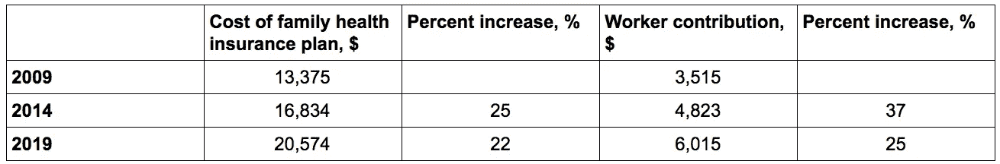

# 为什么雇主赞助的健康保险对美国人不起作用

> 原文：<https://medium.datadriveninvestor.com/why-employer-sponsored-health-insurance-is-not-working-for-americans-4221934a280f?source=collection_archive---------8----------------------->

如果你是一家拥有 50 多名全职员工的公司的全职员工，你很可能通过你的雇主获得保险。三分之二的美国人参加了私人健康计划，其中 15%的人直接在交易所购买，其余的人(美国的一半)直接从雇主那里领取。

雇主赞助的健康保险是第二次世界大战遗留下来的制度。政府强制的工资控制迫使公司寻找新的方法来吸引人才。所以他们提供免费的健康保险，健康保险从一个利基行业变成了一份工作。1940 年，130 万美国人有健康保险，而 1945 年只有 3200 万。

 [## 大笔资金和尖端技术:人工智能/人工智能投资将如何革新医疗保健…

### 在过去几年人工智能(AI)和机器学习(ML)的显著发展中…

www.datadriveninvestor.com](https://www.datadriveninvestor.com/2018/03/22/big-money-and-cutting-edge-technology-how-investment-in-ai-ml-will-revolutionize-the-healthcare-industry/) 

1984 年，美国国税局通过允许医疗保险费免税来支持雇主赞助的模式。根据布鲁金斯学会的数据，雇主赞助的保险税收豁免是税法中最大的豁免——使美国政府损失了 2500 亿美元的税收。这些损失的收入不仅是一笔巨款，而且这种免税有利于富人，他们可能从雇主那里获得慷慨的计划，并处于高税收等级，而不是大公司的全职员工和低税率的低收入美国人。

此外，如下表所示，保费一直在大幅上涨。鉴于美国平均家庭收入约为 6 万美元，雇主赞助的医疗保险约占总工资的三分之一。保费的上涨使得现金工资在几十年内很难出现任何实质性的增长。即使有了这些增长，公司也在转向更高的免赔额计划，这意味着病人需要自掏腰包，有时高达 7000 美元，然后健康保险才会支付账单。

还有一个很大的问题是，一半的美国人没有被雇主赞助的保险覆盖。少于 50 名雇员的小公司的工人或被指定为兼职或独立承包人的工人无权享受雇主赞助的保险。65 岁以上的人有资格享受医疗保险，超过联邦贫困线 38%的人有资格享受医疗补助。其他人要么没有保险，要么必须从交易所购买，他们可以根据自己的收入水平获得补贴。但是这种补贴是由政府支付的，而不是他们工作的公司。

因此，我们在这个奇怪的混合系统中运作——全职员工有雇主的贡献，但没有选择，而其他员工有充分的选择，但没有雇主的贡献。政府越来越多地为其无力支付的医疗保险费买单(医疗保险信托将于 2025 年破产)。

那么答案是什么呢？对于某些人来说，不应该直接购买雇主赞助的保险，而应该强制缴纳 30%的费用(雇主为保险支付的总薪酬的比例)到工人的专用账户[健康报销账户](https://www.peoplekeep.com/blog/what-is-a-health-reimbursement-arrangement) (HRA)中。为了实现这一点，HRA 缴款的雇主津贴需要增加，因为他们在 2019 年的上限是每个家庭 10，600 美元。无论员工的分类状态如何，都应该缴纳这些费用，每个收到任何类型纳税申报表的人都应该缴纳这些费用。

员工可以去交易所购买最适合他们家庭的健康保险，而不是雇主遗留的健康保险。航空公司将被迫降低个人计划的保费，这明显高于团体计划，因为逆向选择问题已经不复存在，因为现在所有人都在参与交换。前面提到的 HRA 和 IRS 第 125 条下的自助计划已经允许一些选择，已经允许一定程度的员工选择——但我们需要扩大范围，允许更多的选择，并将雇主的贡献扩大到所有人，而不仅仅是一些努力工作的美国人。这样，我们就能建设一个更健康、更公平的美国。