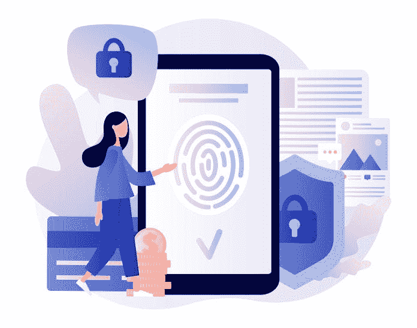

# 为什么加密对日常生活至关重要？

> 原文：<https://medium.datadriveninvestor.com/why-encryption-is-critical-to-everyday-life-data-driven-investor-a6a48a24feba?source=collection_archive---------17----------------------->

你几乎每天都要输入密码，这是你生活中使用的最基本的加密形式。然而问题依然存在:这个密码有多安全？如果你碰巧使用了一个可以从社会工程学中获得的密码，比如你的狗的名字后面有一些数字，那么它一点也不安全。

 [## 人们对隐私的不理解是什么？数据驱动的投资者

### 你知道那种感觉。无论是访问应用程序、订阅还是你最喜欢的运动鞋。你按下…

www.datadriveninvestor.com](https://www.datadriveninvestor.com/2019/04/11/privacy-and-convenience/) 

世界上最强的密码之一是 AES-256 位加密密码，如下所示:

4986 de 8 c 6 b 2c 0407 ebb 8832784 ded 21 b 0461521 CD 4 e 7 FD 4b(这翻译过来就是:DDIIsTheBest)。

据 [CNN](https://www.cnn.com/2019/04/22/uk/most-common-passwords-scli-gbr-intl/index.html) 报道，2019 年世界上最常见的密码是 123456(我没开玩笑)。

事实是，没有人真的会使用 AES-256 位加密密码，而是会使用通用密码，并在许多不同的网站上重复使用(我永远不会建议这样做，因为它会让你陷入数字噩梦)。

[个人数据加密](https://www.datadriveninvestor.com/glossary/encryption/)很重要，因为它允许任何人在你不希望其他人看到或获得的文件和敏感信息周围放置一个数字保险箱。

然而，普通公民如何进一步加密他们的数据，以保护他们的隐私，让自己有更多的隐私？让我们开始吧:

# 全面加密硬盘(内置或外置)

像 BitLocker 这样的工具是 Windows10 系统自带的，用来加密硬盘，然而它最多被认为是一个平庸的工具。其他加密方法，如 VeraCrypt，允许用户完全加密驱动器，并创建所谓的*似是而非的可否认性*，或防止将密码交给敌对势力的能力。当涉及到你不想让任何人看到的数据时，这是至关重要的，更重要的是让你落入坏人之手。

# 在智能手机上安装密码存储应用程序

像 LastPass 这样的应用程序允许用户以数字方式保存他们的密码(而不是便利贴或日志)。如果在 iPhone 上使用 LastPass，您可以使用该应用程序直接将密码复制粘贴到表单中。这允许登录应用程序的简化过程，并允许用户在加密环境中保留所述密码。

# 不买亚马逊 Alexa 或谷歌主页

据透露，这些设备会被动地记录你在它们周围说的话(即使没有直接与它对话)，并将它们存储在云服务器上。

在《华盛顿邮报》最近的一篇文章中，一个 Alexa 在没有得到主人明确允许的情况下录制了一段私人对话，并将该对话转发给了一个随机联系人。这被证明是 Alexa 所有者的一个听错的命令，然而一家研究公司发现了一个漏洞，允许 Alexa 被动记录对话，亚马逊在得知后迅速修复了这个漏洞。

这不是智能设备这样做的唯一情况。如果你在基于安卓系统的设备上启用了谷歌助手(这个功能可以让你通过说“嘿谷歌”来与谷歌对话)，并在当地的潜水点与你的朋友讨论飞往澳大利亚的廉价航班，那么如果你开始在互联网浏览器上看到飞往澳大利亚的廉价航班广告，不要感到惊讶。Google Assistant 将使用您的广告 ID(您的广告 ID 卡)来更好地宣传与您相关的服务。

# 使用 2FA(双因素认证)

现在，假设您非常喜欢 123456 这个密码(同样，我不会建议您使用这个密码)，但是您想让它更安全。然后你可以给那个账户添加一个 2FA [令牌](https://www.datadriveninvestor.com/glossary/token/)。Google 通过 Google Authenticator 应用程序提供 2FA 服务，该应用程序要求在尝试登录时输入不断变化的令牌。这将增加额外的一步，如果你的帐户受到损害，因为上述网络罪犯将不得不物理访问您的手机，以便登录。

我碰巧在我有账户的几乎所有东西上都使用 2FA。这确实是为您需要登录的帐户提供额外加密层的最常见方法。

# 不保存任何登录信息(“记住我”或“让我保持登录状态”按钮)。

虽然这不是一种真正的加密，但如果你的智能手机、台式机或笔记本电脑被盗，这是一种保护措施。如果罪犯获得了你电脑的密码，并且你保存了所有的登录信息，他们就可以访问你所有的账户。

正是因为这个原因，每当我需要使用我的账户时，我都会经常登录它们。如果你丢失了你的设备，如果你重视你的数字隐私，这是最终的保障。

# 创建 BIOS 启动密码

BIOS 是主板的用户界面。把主板想象成你电脑的身体，大脑的处理器。如果你为你的计算机设置了 BIOS 启动密码，那么在任何人打开它之前，他们需要输入一个密码。虽然这不是防止登录的保证方法(因为它可以被物理重置)，但这是防止不太懂技术的人在您的计算机被盗时访问您的计算机的基本方法。

最后，如果您实施强密码，在日常生活中使用加密(如 2FA ),并练习安全的密码管理和生成，那么您可以帮助自己在一个不断遭到入侵和网络威胁的世界中过上更快乐、更有成效的生活。

*原载于 2020 年 2 月 10 日*[*【https://www.datadriveninvestor.com】*](https://www.datadriveninvestor.com/2020/02/10/why-encryption-is-critical-to-everyday-life/)*。*