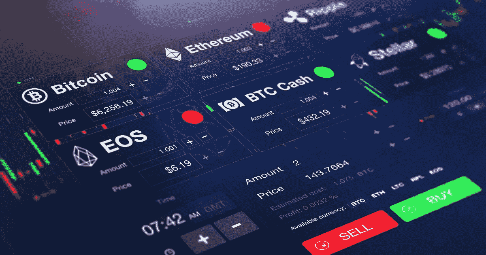
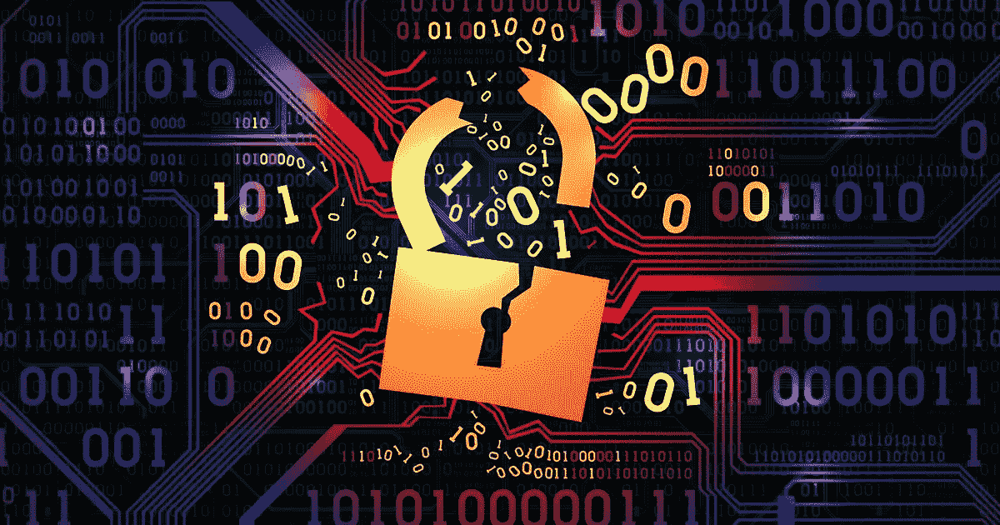

# 为什么参与正确的加密交换至关重要|数据驱动型投资者

> 原文：<https://medium.datadriveninvestor.com/why-engaging-with-right-crypto-exchange-matters-data-driven-investor-dc6bfa7815f5?source=collection_archive---------18----------------------->

为什么加密交换易受攻击？当加密交易所破产时会发生什么？最后，如何选择合适的交易所？

与黄金和美元相比，加密货币，特别是比特币，迄今为止表现出巨大的增长。2020 年 6 月，[比特币](https://www.datadriveninvestor.com/glossary/bitcoin/)的价格[同比增长 27.8%](https://www.coindesk.com/bitcoin-cryptocurrency-up-27-2020-dismal-june-performance) ，而黄金和美元分别增长 16%和 5.4%。投资者对加密货币的兴趣与日俱增。越来越多的投资者开始交易密码及其衍生品。可悲的是，不仅是投资者对加密市场感兴趣，黑客和欺诈者也是如此。最近的骗局包括[DeFi 协议平衡器](https://cointelegraph.com/news/defi-protocol-balancer-hacked-through-exploit-it-seemingly-knew-about)黑客和丑闻。巨大的交易量使得秘密交易对骗子来说非常有利可图。有时，这些被滥用的交易所最终会申请破产。

 [## 稳定币会危及比特币在加密领域的地位吗？数据驱动的投资者

### Stablecoin 是一种加密货币，主要用于维持稳定的市场价值。它可以通过…

www.datadriveninvestor.com](https://www.datadriveninvestor.com/2020/06/08/can-a-stablecoin-jeopardize-the-position-of-bitcoin-in-the-crypto-space/) 

因此，在投资之前了解加密交易中涉及的风险对投资者和加密公司都有好处。为什么加密交换易受攻击？当加密交易所破产时会发生什么？最后，如何选择合适的交易所？

# 为什么加密交换易受攻击？

技术风险、价格波动和法律地位是加密货币的三大长期风险。交易量、安全性不足以及智能合约的缺陷是交易所易受黑客攻击的原因。退出骗局和贪婪的员工搅乱了投资者的信任，导致加密交易所破产。围绕加密货币的模棱两可的法律程序加大了对破产案件进行抗辩的难度。将比特币这种通过解决一些神秘谜题而变得无形的东西，确立为投资者拥有的资产或财产，是一项挑战。

# 当加密交换失败时会发生什么？

在这种情况下，加密公司会宣布无力偿还债务。但是，当加密公司倒闭时，客户的资产会怎么样呢？他们会拿回他们的加密资产，还是不得不永远忘记它们？对于加密公司和他们的客户来说，情况有多困难？

加密公司可以通过出售资产、借钱或被其他公司兼并或收购来克服破产。如果所有这些都失败了，他们可以申请破产，并与法律系统合作解决债务。

另一方面，顾客的困境更加复杂。当公司破产时，破产法和财产法决定了消费者的权利。但是适用的法律有哪些呢？—识别这些是相当复杂的。

首先，许多国家不认为加密货币是一种资产或财产。最近俄罗斯法院[反对比特币](https://cointelegraph.com/news/russian-court-theft-of-100-btc-isnt-a-crime-because-bitcoin-isnt-property)就是这样一个案例。其次，很少有国家有专门为加密货币量身定制的法律。第三，没有一个单一的国际法被称为后备。最后，加密货币的分散性质使得难以对破产案件确立管辖权。

例如，在[臭名昭著的 Mt. Gox 破产案](https://www.law.ox.ac.uk/sites/files/oxlaw/mtgox_judgment_final.pdf)中，日本法院排除了比特币作为财产的可能性，因为客户无法建立专属所有权。但是，在意大利的 Bitgrail 案件中，意大利法院认为 altcoins 是公司拥有的投资者资产，因此命令公司首席执行官将资产归还给合法所有者。

在裁定秘密破产案件时，有两个方面很突出。第一，这些案件的管辖范围，第二，加密资产是否是财产。

# 管辖权

存在若干国际法来确定秘密案件的管辖权。一些人主张客户-托管人协议优先，另一些人强调托管人的注册地至高无上。在某些情况下，破产案件和客户可能与密码交易所发生的其他纠纷之间的管辖权有所不同。

建立正确的法院对于确定加密货币是财产还是纯粹的合同义务至关重要。

# 确定加密货币是否是财产

一些国家将加密货币视为合同义务，当投资者要求时，托管人有义务归还这些资产。在这种情况下，公司有权以破产为由拒绝客户的索赔，这使得投资者可以向密码交易所提出损害索赔。

另一方面，如果法院认为加密货币是财产，那么客户将有权要求破产公司收回它们。但是是什么让加密货币成为一种财产呢？。

财产一词在一些国家被广泛解释为有形的东西，其拥有者被视为其所有者。但是，这个定义并不适合加密货币。

第二，许多财产法要求对财产的排他性占有以确立所有权。但是，当客户作为其加密资产的保管人进行交易时，他们最终要么共享私钥来操作他们的帐户，要么将其资产转移到保管人的帐户。因此，总是存在对加密属性的共享所有权。

最后，许多交易所使用一个帐户来存储所有客户的加密资产，从而使所有权声明变得复杂。由于加密货币是可替代的，当所有持有物都在同一个[地址](https://www.datadriveninvestor.com/glossary/address/)时，交易所倾向于用另一个客户的资产来结算一个客户的[令牌](https://www.datadriveninvestor.com/glossary/token/)请求。例如，加密交易所可能会选择接受一个客户 0.5 比特币的请求，而另一个客户 0.3 和 0.2 比特币的 [UTXOs](https://en.wikipedia.org/wiki/Unspent_transaction_output) 。代币转手越多，就越难确定所有权。

由于加密货币的法律不太明确，有时也很模糊，解决纠纷可能很困难，也很耗时。

# 如何审查加密公司？

因此，潜在投资者在决定进行加密交易时，必须进行严格的研究。这里有几个问题，回答这些问题将有助于选择合适的公司。

# 目的是甚麽？

有必要定义为什么要从事加密业务——购买、出售、交易加密？长期投资？对于那些直接投资于加密资产交易的人来说，现货交易所是他们可以购买、出售和交易比特币、 [ether](https://www.datadriveninvestor.com/glossary/ether/) 和其他替代货币的地方。对于那些寻求额外投资选择的人来说，一些交易所提供加密货币的衍生品——期货和期权——其价值由基础现货加密资产的价格决定。

# 密码公司有多安全？

由于交易量巨大，加密交易所是黑客最有利可图的目标。加密资产和敏感的客户数据都容易受到黑客攻击。注重安全性的交易所采取了一些措施，比如只能通过安全协议访问网站。这些交易所将要求使用一个以上的因素登录到他们的网站。他们使用[冷库](https://www.datadriveninvestor.com/glossary/cold-wallet/)储存客户存款，并为客户的交易提供定期和实时的提醒。

# 加密交易所是否与第三方合作？

一些加密公司与第三方合作进行交易的各个方面。潜在客户必须知道第三方参与的程度。一些公司与其他公司合作提供[钱包](https://www.datadriveninvestor.com/glossary/wallet/)服务，而像币安这样的一些交易所允许用户通过他们的赌注服务在第三方股份网络中下注他们的资产。

# KYC/反洗钱检查有多彻底？

[KYC](https://www.datadriveninvestor.com/glossary/know-your-customer/) 每一位客户也会偏爱 KYC 工艺。尽管耗时，但有些人更喜欢彻底的检查，而其他人会选择“易于操作”而不是复杂彻底的验证过程。一些公司在创建账户时需要 KYC 证明，而一些公司在转移资金时需要这些证明。一些公司甚至禁止来自某些国家的客户。

# 这些加密公司声誉好吗？

在投资之前评估公司的声誉是至关重要的。一些公司可能经常成为黑客攻击的受害者，或者卷入退出骗局。谨慎的做法是从各种来源了解该公司的声誉——新闻文章、可信的加密网站、与其他加密爱好者的交谈。

# 这些公司有多透明？

透明度和不隐瞒信息对建立加密公司的信誉大有帮助。了解加密公司在提供公司信息方面的公开程度是至关重要的，这些信息包括所有者、注册地、经营地点、持有的资产。

# 加密业务有保险吗？

如果加密公司被保险，当公司破产时，它进一步向潜在客户保证他们的赔偿。

# 该公司提供哪些加密货币？

大多数加密公司都处理比特币等流行货币。但是，当谈到替代硬币时，他们变得更加挑剔。因此，了解加密公司提供的资产选择是至关重要的。在决定加密交易时，检查交易的替代硬币、特定的交易对等是必要的。投资前。

# 交易费用是多少？

一些加密公司对取款收费，并且对取款也有限制。其中一些提供便捷的加密货币购买选择，并要求存款费作为回报。加密交易所还收取交易金额的一定百分比作为交易费用。因此，提前检查交易费用符合客户的利益。

# 使用 fiat 和 crypto 有多容易？

如果使用法定货币买卖密码是至关重要的，那么看看交易所提供的进出通道是值得的。一些平台要求只能通过银行账户进行支付。允许多种[支付](https://www.datadriveninvestor.com/glossary/payment/)方式的公司可以根据支付方式收取不同的交易费用。了解一些国家禁止与菲亚特进行密码交易也是至关重要的。

除了这些，检查**交易所的交易量，他们的货币价格相对于其他人的差异，以及他们是否提供** [**杠杆交易**](https://www.investopedia.com/articles/forex/07/forex_leverage.asp) 是有益的。仔细阅读这些交易所的用户和托管协议，将让潜在客户了解他们的资产将如何存储——存储在共用地址还是隔离地址。此外，合同应该明确规定客户是加密资产的所有者，而交易所仍然是保管人。

顺便说一下，客户服务，易于使用的网站，快速的存款和取款周转时间也是密码交易所的一个巨大卖点。

然而，尽管进行了细致的研究，但谨慎的做法是不要在交易所长期存放大量加密货币。含糊不清的加密货币法律使得加密交易所破产案件中的赔偿变得困难。最终，投资者在选择加密交易所时，必须辨别与收益相关的风险，并进行尽职调查。

*原载于 2020 年 7 月 16 日*[*【https://www.datadriveninvestor.com】*](https://www.datadriveninvestor.com/2020/07/16/why-engaging-with-right-crypto-exchange-matters/)*。*

**访问专家视图—** [**订阅 DDI 英特尔**](https://datadriveninvestor.com/ddi-intel)