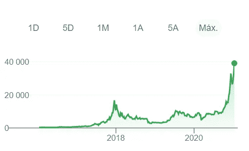

# 为什么流行恐惧阻止你购买比特币

> 原文：<https://medium.datadriveninvestor.com/why-epidemic-fear-is-blocking-you-from-buying-bitcoin-c6af5eedeeeb?source=collection_archive---------9----------------------->

## 你无法做出决定的五大原因

Photo by [Ярослав Хорищенко](https://medium.com/u/dfd60cd5a6fe?source=post_page-----c6af5eedeeeb--------------------------------) on [Unsplash](https://medium.com/u/2053395ac335?source=post_page-----c6af5eedeeeb--------------------------------)

在投资界，有[**担心错过**——即所谓的 FOMO，是很常见的。](http://bit.ly/3qwZ86Y)

一些研究表明，FOMO 经常源于不快乐。对能力、自主性和人际关系满意度低的人往往更害怕错过。

> “…一种不安的、有时是完全被消耗掉的感觉，那就是你错过了你的同龄人正在做的、知道的或拥有的比你更多或更好的东西”。在 FoMO 的框架下，近四分之三的年轻人报告他们经历了这一现象。”——[sciencedirect.com](http://bit.ly/37h6a8m)

这种现象被经纪公司所知。在某种程度上，正是在这个基础上，整个算法导致了购买股票、期权和衍生品的无限制消费。这是一种赌场业务，为那些了解赌博科学的人所使用。

另一方面，我们有一些人，他们的个人资料往往非常保守。人们根本不买任何东西，因为他们害怕失去一分钱。这些人倾向于不进入任何与危险环境相关的行业。

管理员害怕处理损失。一般来说，这些人倾向于强烈批评游戏中的人。为了让自己感觉更好，他们一丝不苟地研究这些主题，让游戏玩家认为他们站在理性的一边。所以，他们总是在游戏之外。这让管理员感到问心无愧。

[那么，关于退出比特币购买的问题，让你成为 FOMO 人还是保护者？](https://medium.com/the-price-of-tomorrow/bitcoin-a-free-market-flag-vs-a-suffisticated-marketing-brand-846a86892a78)

这里有 5 个管理员通常会争论退出游戏的原因。

# 1)内在价值

> **布雷顿森林货币管理体系**确立了 1944 年布雷顿森林协定后[美国](https://en.wikipedia.org/wiki/United_States)、[加拿大](https://en.wikipedia.org/wiki/Canada)、[西欧](https://en.wikipedia.org/wiki/Western_Europe)、[澳洲](https://en.wikipedia.org/wiki/Australia)和[日本](https://en.wikipedia.org/wiki/Japan)之间的商业和金融关系规则..Wikipedia.com。

这一条约的前提是将其货币与黄金挂钩。而且对国际货币基金组织(货币基金组织)弥补暂时收支不平衡的能力也是如此。

然而，1971 年 8 月 15 日，美国单方面终止了美元与黄金的可兑换性，实际上结束了布雷顿森林体系。并使美元成为法定货币。

自 1971 年以来，美元没有内在价值，因为它与黄金没有关联。

人们常说**比特币没有内在价值**的原因之一是正确的。但美元也没有。

> “比特币单位没有内在价值……美元、欧元和瑞士法郎也没有内在价值。”——[美联储](https://www.stlouisfed.org/open-vault/2018/april/three-ways-bitcoin-regular-currency)

# 2)比特币是泡沫

通常，图形中出现的泡沫是大幅快速攀升，然后令人眩晕地跌落——所有这些都发生在相对较短的时间内。

比特币有过一些大幅攀升，但从未长时间保持较低水平。13 年，比特币年均增长 200%。

Image from Google.com

我们观察到在过去的几个月里有显著的上升。[像特斯拉、Microstrategy、对冲基金和不同机构这样的公司开始建立比特币头寸。](https://medium.com/the-price-of-tomorrow/how-early-adopters-always-win-use-massive-advantage-to-earn-first-52330c409be1)

根据[计划 B](https://twitter.com/100trillionUSD/status/1361313873140269063) ，比特币可以达到 28.8 万美元的价格。

随着 S&P500 公司对最佳加密货币的信任，风险开始降低，货币的弹性肯定会增加。

如果图形会大幅下跌而不上涨，比特币就不会这么强劲。但是为什么 2017 年不跌，比如？因为相信 BTC 的人在深度买入，稳定了图表。所以，比特币长期保持上涨。

# 3)洗钱和毒品

> 联合国毒品和犯罪问题办公室(UNODC)估计，全球一年洗钱的金额是“全球 GDP 的 2%到 5%，或 8000 亿美元——相当于现在的 2 万亿美元。”维基百科。

今天，任何人都可以在比特币区块链上看到脏衣服。

通过比特币洗钱是一个坏主意，因为它会留下永久的痕迹。

> 致命毒品战争的利润，从发展中国家盗用的财富，庞氏骗局中窃取的血汗钱都流经金融机构[，尽管银行员工发出了警告](https://www.buzzfeednews.com/article/jasonleopold/fincen-files-8-big-takeaways)。(……)因此，非法资金继续通过银行流入从石油到娱乐到房地产的各个行业，进一步将富人和穷人分开，而我们逐渐信任的银行使这一切成为可能。- [塔蒂亚娜·考夫曼在福布斯](http://bit.ly/3aqyXJu)

据估计，所有加密货币交易中只有 1.1%是非法的。

比特币的总市值约为 9160 亿美元。其中 1.1%无法与洗钱的数字相比。大多数 20 美元的钞票上都有可卡因的痕迹。

所以，这个争论似乎不再是关于比特币的问题了。

# 4)波动性

像苹果、亚马逊、脸书或 Alphabet 一样，市场上的顶级股票在创业初期非常不稳定。这是所有公司开始一个新趋势或新商业模式时的常规周期。

如果你看到一张过去 100 年的黄金图表，它看起来就像一个独特的过山车。然而，黄金有 4000 年的储存价值。

不稳定的资产不会让它们成为糟糕的投资。相反，从长远来看，这让它们对长期投资者具有弹性。

[从长远来看，从投资者的角度来看，投资不受央行控制的资产总是更好](https://medium.com/the-price-of-tomorrow/central-banks-looming-assault-to-manipulate-bitcoin-350bb703cf2f)，比如黄金，或者最近的比特币。与避险资产相比，法定货币仍然更加不稳定。

# 5)能源消耗

> 比特币网络的全球功耗估计为每年 [22 太瓦时](https://www.economist.com/the-economist-explains/2018/07/09/why-bitcoin-uses-so-much-energy)——大约相当于爱尔兰全国的功耗。同时，金矿开采每年消耗 [132 太瓦时](https://www.coindesk.com/microscope-true-costs-gold-production/)。那离[波兰](https://en.wikipedia.org/wiki/List_of_countries_by_electricity_consumption)更近一点。杰里米·希尔波特

这些数字不是任何人的借口。当然，作为人类，我们迫切需要投入更多的时间、金钱和 R&D 来改变我们应对气候变化的能源解决方案。

上周，我们目睹了一场具有讽刺意味的运动。特斯拉首席执行官埃隆马斯克购买了 15 亿美元的比特币。

一些憎恨者可能会投身于社交媒体，来对待这位再次革新汽车和能源行业的企业家。

但常识告诉我，这对比特币市场来说是最好的事情。

有人即将用清洁能源解决方案去物质化能源产业，这是再好不过的预兆了。

马斯克最近为能够从大气或海洋中提取二氧化碳的发明提供了 1 亿美元。[因此，在比特币世界中拥有埃隆·马斯克是我们拥有更高效能源消耗解决方案的最佳机会。](https://medium.com/the-price-of-tomorrow/this-is-what-happens-when-you-have-tesla-buying-bitcoin-14ce2b3836b8)

渗透投资管理公司的首席执行官本·迪尔说:

> “我们希望，当特斯拉的比特币项目结束时，他们将专注于测量并向市场披露他们的全套环境因素，如果他们继续购买或开始开采比特币，他们将在这些披露中包括相关的能源消耗数据。”

如果我们将比特币的能耗与其他任何行业进行比较，我们很快得出结论，没有可比性。

重金属提取行业，如黄金，甚至军工行业的能源消耗比地下采矿者的污染更大。

甚至在美国，圣诞灯的年消耗量也远远超过了采矿业的消耗量。

因此，尽管这对我们热爱的地球是个问题，但我不认为这是任何害怕投资比特币的人的理由。

# 最终想法

我讨厌赔钱。真的。我的亲身经历告诉我，金融盲会让生活变成噩梦。31 岁时，我破产了。所以，我知道我在说什么。

[我阅读关于货币、金融和投资的最重要的书籍。我从一开始就知道，如果我退出了“投资游戏”，我将永远无法实现财务独立。](https://medium.com/the-price-of-tomorrow/how-to-become-a-staggering-money-expert-7403ba8f39fe)

然而，直到我开始投资，我才知道自己是一名投资者。原来我发现我是一个小神风队。我喜欢深入了解风险市场，并努力去做。

让我搞清楚，我不做卖空，期权或衍生品。但我购买高度不稳定的资产，比如科技公司。我热爱创新。[幸运的是，我们正面临一个巨大的破坏性十年。](https://medium.com/the-price-of-tomorrow/the-absolute-power-of-disruptive-technologies-d608e316967e)

我说我是一个小型的神风特攻队，不是一个彻头彻尾的自杀式炸弹袭击者。

我的投资组合是这样分配的:

*   45%现金；
*   股票占 34.5%；
*   S&P500 指数基金 11.5%；
*   9%的比特币。

为什么是这个投资组合？

我几乎有 50%的现金，不是因为这是一笔很好的资产，而是因为我们过着奇怪的日子。我们有很多基本面分析师对这些估值和市盈率感到疯狂。还因为全球经济正受到宽松货币政策的人为推动。

当这种情况持续一段时间时，有些事情确实会走向歧途。

**股票占 34.5%**，特斯拉占 20%。这可能是我未来 10 年唯一会继续买入的股票。但是我也有 Square(我爱杰克·多西——男人摇滚)、数字涡轮和 Opendoor。仅此而已。

复制 S & P500 指数的 ETF 的 11.5%，因为这是一个多元化的押注。这是一篮子世界上最好的公司。这一小块奶酪将永远是我的支柱。我在我看好的公司中获得的所有收益都将进入标普 500 基金。从长远来看，如果你不是投资行业的专业人士，这是让你的船不沉的最好方法。

这条路将被延长。今天，我们有一个技术突破的黄金机会，但我们不知道明天会怎样。我们只知道，总有一天，黑天鹅会出现。

当那一天到来时，你不得不借用美国队长的盾牌，因为撞击会伤到你的骨头。

因为世界正在数字化。我一直在分析像[凯茜·伍德](https://medium.com/the-price-of-tomorrow/why-the-supreme-version-of-warren-buffett-will-be-performed-by-a-woman-a8c1750fba75)和迈克尔·塞勒这样的人说的话，对我来说，这非常有意义。

所有顶级公司都将整个行业非物质化。谷歌用视频和图书馆做到了这一点。亚马逊用前店行业做到了。脸书将我们的社交网络非物质化了。网飞和迪斯尼正在使电影业非物质化。特斯拉正在让汽车和能源行业非物质化。

他们都在使用人工智能和深度学习等强大的技术。因此，世界将会发生深刻的变化。新的产业会崛起，其他的会没落。

我想做正确的投资。总是相对被保护，但还是在右边。记住，我是个小神风队。

也许我完全错了。我不知道，你不知道，没人知道。

这是一种信仰的飞跃，夹杂着深刻的思考。

这是我看待事物的方式。这就是我相信比特币的原因。我相信它，因为我希望有一个更好的世界。不受央行操纵。一个更加平等和自由的世界。

我们都有自己的乌托邦。这才是做人的真谛。

当我深入思考这些主题时，我从未忘记一句话，这句话在我生命的早期就伴随着我。

> 我有一个梦想——马丁·路德·金。

*本文仅供参考，不应视为财务或法律建议。在做任何重大财务决定之前，先咨询财务专家。*

[**注册我的邮件列表**](https://mailchi.mp/104ad9e5f4d9/nuno-fabiao) ，加入 Medium 上最快乐的读者。
*(在这里你可以独家访问我的日常活动、经历和日常想法)*