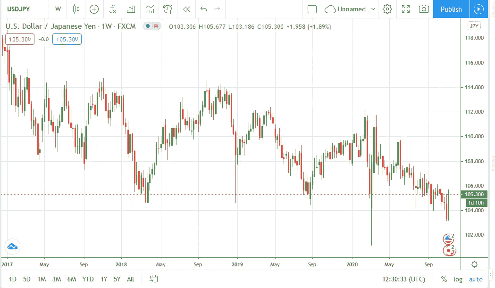

# 为什么每个交易者都应该至少练习一次裸交易

> 原文：<https://medium.datadriveninvestor.com/why-every-trader-should-practice-naked-trading-at-least-once-1d41d42bf0d9?source=collection_archive---------2----------------------->

Photo by [Mark Fletcher-Brown](https://unsplash.com/@boab?utm_source=medium&utm_medium=referral) on [Unsplash](https://unsplash.com?utm_source=medium&utm_medium=referral)

裸交易——通常被称为价格行为交易——是指交易者根据实际发生的价格变动来分析和预测市场未来。不借助任何技术指标。

在裸交易中，你的交易图是空的，没有任何技术指标，你应该根据这个图来了解市场在做什么和走向。

大多数交易者发现裸交易难以置信地困难、乏味，甚至是巨大的时间浪费，因为一些人认为市场运动完全是随机的——因此不可能预测他们接下来会走向哪里。

但是——市场不是随机的。

裸交易最基本的原则之一是学习**市场**(人)**心理**。

裸体交易者认为所有价格变动的核心是人类心理(情绪)在起作用。市场运动受人类情绪的影响。既然人类的行为是可以预测的，那么市场运动也是可以预测的。

坦白地说，不管你是不是裸交易者，学习市场心理学和人类情绪如何影响市场运动是你应该学习的交易的最重要的方面之一。

外汇交易简单来说是什么？

这基本上就是问一群有电脑和互联网的人，一种货币是否被高估或超卖。

这正是比特币正在发生的事情。

比特币最初开始交易时，没有图表或交易者可以参考的历史。

这些图表展示了人们对硬币的反应。

同样，在外汇交易中，一开始很可能就像现在的比特币一样。

但是外汇现在已经成熟了。波动性比比特币低。交易员现在有了过去市场在各种情况下反应的记录。

看看任何市场图表。比特币、外汇、股票等。

看跌或看涨曲线的潜在原因可能不同，但人们对事件的反应永远不会改变。

市场衰退，疫情恐慌，选举争议，强劲的经济，低失业率，你的猫的生日…人们会对自己的情绪做出反应。而人类的情绪是有限的，要么积极，要么消极，要么中性。

就像 200 年前一样。因为很可能还要再过 300 年。

市场对人类行为做出反应。(情绪)

## 为什么你应该学习裸交易

大多数新交易者在拿到交易账户后，会立刻被迷人的技术指标所吸引。认为他们有圣杯工具来驱使他们致富。

更糟糕的是，他们在分钟和小时的时间范围内做所有这些事情。

问他们在做什么，或者那些五颜六色的乱七八糟的指示器在做什么，他们不知道。

他们只是挑选了一些免费的指标，他们被承诺分析市场，他们所要做的只是在指标发出新信号时买入或卖出。

这不是惩罚。我去过那里，做过那个。也许更糟。

但问题是——一旦你进入这个指标周期，你会花太多时间猜测和恐慌指标信号是否正确。或者浪费更多的时间从一个指标转到另一个指标。

你甚至对指标都没有信心。这就是为什么大多数指标交易者在交易变红时会恐慌。他们不知道自己在做什么。

事情是这样的。大多数指标基于过去发生的事情来分析未来的价格变动。他们没有给出一个明确的指南来说明现在正在发生的事情。以及这将如何影响未来。

这就是为什么它们有时被称为*滞后指标。*

他们在告诉你市场在做什么方面进展缓慢，基于这些信息的交易通常意味着你使用了不准确的信息。

更重要的是，你使用的指示器越多，传递给你的准确信息就越慢。

这是因为所有这些指标一开始都很慢，现在你有了更多的慢指标。

同时，裸交易意味着你在实时观察市场反应。

图表几乎没有指标，这意味着你的图表没有被沉重的指标系统拖后腿。因此，它能够在市场事件发生时进行转播。

你甚至可以知道为什么市场会在某个区域盘整。以及某日开市后出现跳空的原因。

这给了你预测当前新闻和市场反应如何影响未来市场走向的优势。

作为一个更美学的原因，裸价格图表是光滑的，只是看起来令人惊叹。

没有 1000 个指标的污点阻碍一切，包括你的价格栏。

Clean Price Action Chart Without Indicators

## 技术指标没用吗？

不是…是…不是。

好吧…

坦白说，不，他们不是。

技术指标有其用途。它们并不是完全没有用，但是你可以什么都不用。

很多裸交易者使用 1 到 3 个技术指标来补充他们的价格行为分析。

由于上述原因，他们避免大量使用指标。

即使你不是价格行动交易者，学习如何交易裸图也是有帮助的。

指标会一直在那里。但是他们永远不会给你像完整的裸体图表一样准确的信息。

我是神秘主义者的崇拜者之一。有一句名言“你在寻找的所有答案都潜伏在你的内心”，大致意思是你已经知道了你想知道的一切。不要再从朋友和家人那里寻找答案和指导，直接走进内心。

引用这句话，你想知道的关于交易市场的一切都已经在那里了。你可以在没有指标或其他外部顾问的情况下学习你需要知道的一切。你不问，市场什么都不会告诉你。

所以完全拥抱市场，让自己沉浸其中。它会告诉你你需要知道的。

这就是为什么我认为没有指标也是可行的。专家价格行动交易者可以在没有指标的帮助下分析市场，做出准确的预测。

你可以知道你真正需要的是什么，并询问你的朋友和家人对这个问题的看法。同样，一个专业的价格交易者可以参考指标进行分析，尽管他知道市场的走向。

学习裸交易就像掌握了市场的脉搏。

或者说，我是这样认为的。