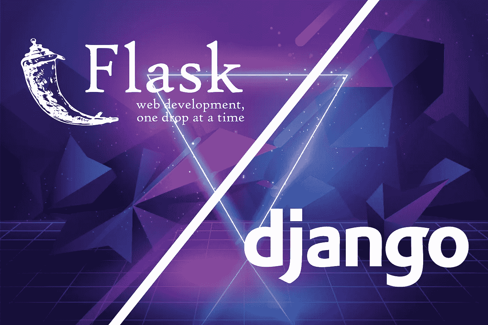
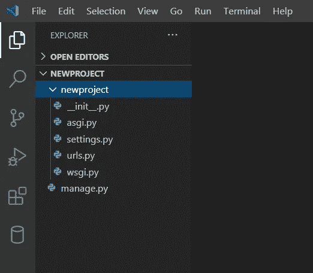
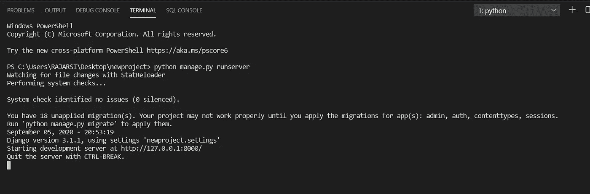
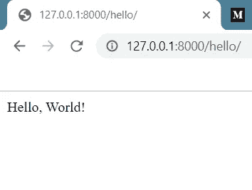
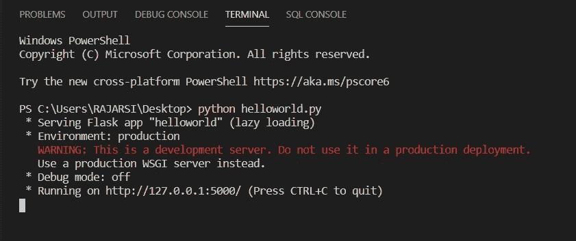
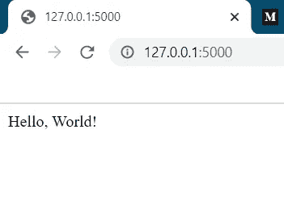

# 为什么你应该选择 Flask 而不是 Django

> 原文：<https://medium.datadriveninvestor.com/why-flask-could-be-a-better-choice-than-django-c3f018edb963?source=collection_archive---------2----------------------->



Flask vs Django (Image by author)

作为我们都知道或者可能从别人那里听说过(只有当你进入[](https://en.wikipedia.org/wiki/Web_development)****)**有两个非常流行的 [**web 框架**](https://en.wikipedia.org/wiki/Web_framework) 。当然，一个是最著名的 [**Django web 框架**](https://en.wikipedia.org/wiki/Django_(web_framework)) ，另一个是我认为在 web 框架的名气排行榜上仅次于 Django 的，即 [**Flask**](https://en.wikipedia.org/wiki/Flask_(web_framework)) 。当然市场上还有其他的，但是现在，我只谈这两个。我将讨论一些你在选择 Django 或 Flask T21 时应该记住或考虑的要点。**

# **框架到底是什么？**

**你们当中那些对[编程](https://en.wikipedia.org/wiki/Computer_programming)感兴趣的人，你们编写的程序需要编译器或解释器将源代码转换成字节码，因此你们编写命令行应用程序。然后，用户将通过一个 shell 运行您的脚本**(**[**Python**](https://en.wikipedia.org/wiki/Python_(programming_language))**)**，并且可能会也可能不会通过 [stdin](https://en.wikipedia.org/wiki/Standard_streams#Standard_input_(stdin)) (标准输入)传递参数和/或输入。现在，这对于用户来说是一项乏味的工作，因为用户必须再次安装适当的[解释器](https://en.wikipedia.org/wiki/Interpreter_(computing))或[编译器](https://en.wikipedia.org/wiki/Compiler)来运行这些程序。几年前，人们觉得有必要构建[独立的应用程序](https://en.wikipedia.org/wiki/Standalone_software)，它不需要用户安装额外的程序或编译器，因此被称为**桌面应用程序**。如今，随着互联网连接的普及和可供选择的操作系统的增多(桌面和移动)，构建 [**网络应用**](https://en.wikipedia.org/wiki/Web_application) 而非**基于操作系统的应用**已经成为一种普遍的做法。web 应用的主要优势是用户不需要在他们的设备上安装应用就可以使用。他们可以从 web 浏览器直接访问该应用程序。**

**如果您希望构建一个 web 应用程序，那么您会希望使用 Python 来开发您的应用程序，并使用所谓的 web 框架。构建 web 应用程序有许多任务。两个主要任务是构建[后端](https://en.wikipedia.org/wiki/Front_end_and_back_end)和[前端](https://en.wikipedia.org/wiki/Front_end_and_back_end)以及适当的用户界面。接下来是把所有东西连接在一起，[将](https://en.wikipedia.org/wiki/Web_hosting_service)托管在[网络服务器](https://en.wikipedia.org/wiki/Web_server)上，这样用户就可以在他们的浏览器中轻松导航到你的应用程序。web 框架的功能来了。web 框架基本上实现了 web 应用程序的所有功能，比如将 URL 映射到某些 python 代码块，这样当用户路由到特定链接时，就会完成与该应用程序路由相关的相应工作。在本文后面，我们将看到更多这种所谓的' [**路由**](https://en.wikipedia.org/wiki/Routing) '。**

# **Flask 和 Django 实现的区别**

**Flask 实现了 web 应用程序实际工作所需的最低要求。所有的前端和后端实现需要由用户来完成。但这并不是缺点，相反，最好是将大部分工作留给 [**开发人员**](https://en.wikipedia.org/wiki/Web_developer) 去做，因为每个应用程序都有自己的实现方式，而且每个应用程序都各不相同。同样，作为开发人员，如果您的应用程序因为不需要的文件和代码而变得太大，那么它肯定不是一个好的实现。因此，Flask 可以让你创建你所需要的 web 应用程序。**

**另一方面，Django 给予的不仅仅是最低限度。它创建了一个项目结构，并创建了一些文件，这些文件当然是需要的，但是包含了大量不需要的代码和数据。你可能认为现成的文件会让你的生活更轻松。不，你必须根据你的需要和要求编辑这些文件，设置的改变会对你的应用程序有好有坏的影响。与 Flask 相比，用 Django 框架创建的 ***应用肯定会为你提供更多的额外特性，但是这些特性是有代价的。你的项目规模增加了，如果你决定让这些特性也在你的产品中运行，那么你肯定会有一个大的应用程序，这反过来会花费你额外的托管空间。*****

# **你如何对比弗拉斯克和姜戈？**

## **瓶**

*   **Flask 是一个微型的轻量级 web 框架**
*   **Flask 框架简单、灵活，并为您提供细粒度的控制**
*   **它是非个人化的，也就是说，作为开发人员，它让您决定您想要实现什么以及如何实现各种东西**
*   **它可以用来构建相对简单的 web 应用程序**

## **姜戈**

*   **Django 是一个全栈 web 框架**
*   **Django 在开发过程中提供了一个包中的所有东西**
*   **在项目创建时，你会得到一个管理面板，数据库接口，一个 [**对象关系模型(ORM)**](https://en.wikipedia.org/wiki/Object-relational_database) ，最重要的是你会得到一个预定义的项目/目录结构**
*   **它可以用来构建大型复杂的 web 应用程序**

# **我来说说现实生活中的场景怎么样？**

****Flask** 和 **Django** 都用于使用各自的框架构建基于 web 的应用程序。两者都大规模用于几个高流量网站。**

**以下 [Quora](https://www.quora.com/) 链接告诉你一些使用 Flask 的网站。你一定会惊讶的，因为我也是！**(当我分享此内容时，我不以任何方式声明此内容的所有权。)****

**[](https://www.quora.com/What-is-the-largest-site-created-using-Flask) [## 使用 Flask 创建的最大的站点是什么？

### 回答(5 个中的 1 个):#1(编辑 2015):好像最大的大概是 Pinterest！，参见:史蒂夫·科恩对什么的回答…

www.quora.com](https://www.quora.com/What-is-the-largest-site-created-using-Flask) 

下面是一个链接，点击它你会被重定向到一个网站，那里显示了所有使用 Django 框架的主要和著名的 web 应用的列表:**(当我分享这些内容时，我不以任何方式声明这些内容的所有权。)**

[](http://www.allaboutweb.biz/some-of-the-best-websites-developed-using-django-framework) [## 使用 Django 框架开发的一些最好的网站

### 除了强调代码的可读性之外，Python 还使程序员能够表达各种概念，而不需要…

www.allaboutweb.biz](http://www.allaboutweb.biz/some-of-the-best-websites-developed-using-django-framework) 

# 以下文章中的一些统计数据:

这个统计数字来自 iflexion.com。这也包含进一步的信息。(当我分享此内容时，我不以任何方式声称对此内容的所有权。)

下面是链接:【https://www.iflexion.com/blog/python-flask-vs-django


[S](https://www.iflexion.com/files/styles/width-1920px/public/content/research/3_percentage_of_stack_overflow_questions.png)ource: [https://www.iflexion.com/blog/python-flask-vs-django](https://www.iflexion.com/blog/python-flask-vs-django) (Image by iflexion)

# Flask 和 Django 的技术比较

## 模板引擎

Flask 是基于 [**Jinja2**](https://en.wikipedia.org/wiki/Jinja_(template_engine)) 模板引擎开发的，给你的信息其实是受 Django 的模板系统启发。它使开发人员能够用表达性语言编写 web 模板，从而加快应用程序开发过程。另一方面，正如您可能已经猜到的，Django 有一个内置的模板引擎，这实际上让开发人员在模板构建过程中花费更少的时间和精力。Django 提供了一个叫做 [**的东西，Django 模板语言(DTL)**](https://docs.djangoproject.com/en/3.1/ref/templates/language/) 用于为你的应用程序创建定制模板。

## 项目布局

在 Flask 中，开发人员需要创建单独的项目来构建单独的应用程序。但是开发人员可以选择将多个模型和视图添加到他们正在开发的同一个应用程序中。但是 Django 让开发者把一个项目分成多个应用。然后，开发人员可以编写单独的应用程序，并通过将小应用程序添加到项目中来为他们的主 web 应用程序添加功能。

## 数据库支持

Django 开发人员一般使用 ORM 系统。为了实现像 Oracle T1、T2、SQLite T3、T4、MySQL T5 和 PostgreSQL T7 这样的数据库，ORM 是必不可少的。ORM 系统帮助开发人员避免编写冗长的 SQL 查询。这个内置的 ORM 系统不像 Django，不是 Flask 提供的。它需要像 [**SQLAlchemy**](https://en.wikipedia.org/wiki/SQLAlchemy) 这样的库来使用 Flask 中的数据库功能。开发人员可以通过编写和执行普通的 SQL 查询来执行常见的数据库操作，如**选择、插入、更新和删除**。

## 灵活性

Django 的高级特性允许用户在不使用任何第三方工具和库的情况下构建各种 web 应用程序。但是开发人员缺乏对 Django 提供的内置模块进行修改的必要选项，这是一个主要的缺点。如你所见，这些模块是不可定制的。因此，开发人员必须使用 Django web 框架提供的内置特性来创建 web 应用程序。另一方面，Flask 作为一个微型但可扩展的 web 框架，允许开发人员通过使用开源的 web 开发工具和库以更灵活的方式创建 web 应用程序，并且可以根据需要添加或删除。相信我，当我开始 web 开发的时候，我发现 Flask 要容易和舒适得多，我仍然在小项目中使用 Flask。

# 那我们接下来要不要动手体验一下？

## 先用 Django 编码吧！(所有命令都可以在 shell 或 cmd 中执行)

1.通过运行以下命令安装 **Django** :

```
pip install Django==3.1.1
```

2.成功安装后，我们需要创建一个项目。运行以下命令:

```
django-admin startproject newproject
```

这使用在 django 安装期间安装的 **django-admin** 命令创建了一个名为 **newproject** 的新项目。成功创建后，您的目录结构将如下所示:



Project directory structure (Image by author)

3.接下来，我们需要使用 Django 创建一个 app。请注意，一个项目可以包含多个应用程序。从外层的 **newproject** 目录运行以下命令:

```
python manage.py startapp helloworld
```

这将创建 helloworld 应用程序，并使其成为 newproject 的一部分

4.接下来，我们将配置 URL 路由。打开创建的 **helloworld/views.py** 并添加以下内容:

5.现在我们将为这个应用程序创建一个 **urls.py** 文件。我们将创建 helloworld/urls.py 并添加以下内容:

6.以上是我们的 **helloworld** 应用程序的 URL 配置。我们将需要为我们的项目配置一个网址。我们将编辑自动创建的文件**new project/new project/URLs . py**。这个属于整个项目，前一个属于单独的应用程序。在该文件中添加以下内容:

7.现在回到包含 **manage.py** 的外部目录 **/newproject** ，运行以下代码:

```
python manage.py runserver
```

这将在 **localhost** 运行 Django 开发服务器。从终端输出可以看到，我们的服务器运行在[**http://127 . 0 . 0 . 1:8000/**](http://127.0.0.1:8000/)(注意是 **http** 而不是 **https**



Successful server run (Image by author)

我们现在可以访问[**http://127 . 0 . 0 . 1:8000/Hello**](http://127.0.0.1:8000/hello)查看我们的**“你好，世界！”**。( **/hello** 很重要，因为这将是对服务器的 **GET /hello** 请求)



Browser output (Image by author)

## 现在让我们来看看在 Flask 中完成这整个工作有多容易！(所有命令都可以在 shell 或 cmd 中执行)

1.通过运行以下命令安装**砂箱**:

```
pip install Flask== 1.1.2
```

2.成功安装后，创建一个名为 **helloworld.py** 的 python 文件，并插入以下内容:

这首先完成了几乎所有的工作，它创建了一个名为 **app** 的应用程序，然后它配置了一个 URL 路由**"/**，它实际上是一个索引，即当浏览器在网站 IP 或资源名称(Example: example.com)处发送一个 **http** 请求时，将有一个 **GET /** 请求被发送到服务器。因此，从我们上面的应用程序它会返回一条消息**“你好，世界！”**中的**文本/html** 文档类型。这也被称为应用程序的**默认根**。最后，我们看到在运行 python 脚本时，它将触发 main，因此， **app.run()** 将被执行，这将依次启动应用程序。

3.运行以下命令启动 web 应用程序以查看结果:

```
python helloworld.py
```

这将在**本地主机**运行 Flask 服务器。从终端输出可以看到，我们的服务器运行在[**http://127 . 0 . 0 . 1:5000/**](http://127.0.0.1:5000/)(注意是 **http** 而不是 **https** )



Successful server run (Image by author)

我们现在可以访问[**http://127 . 0 . 0 . 1:8000/**](http://127.0.0.1:8000/)查看我们的**“你好，世界！”**。



Browser output (Image by author)

正如你所看到的，让一个服务器在你的本地主机上运行并显示“Hello，World！”在 Flask 实现的例子中，用了大约 **7 个好步骤**让 Django 服务器运行来做同样的工作。请注意，默认情况下，**烧瓶**运行在端口 **5000** 上， **Django** 运行在端口 **8000** 上。

现在真正的问题来了，你应该选择哪一个？弗拉斯克还是姜戈？两者都有各自的优势和局限。如果你想更好地控制哪些组件该用，哪些组件不该用(比如数据库等等),那么选择 Flask。)并且，如果你有需要或者想开发基本的简单应用，比如博客、电子商店等，选择 Django。在那里你会想以最明显的方式使用所有标准的东西。整个代码和项目分别上传在 [Github](https://github.com/) 的 [**链接**](https://github.com/RajarsiGit/Flask-vs-Django) **上。**

# 结论

在本文中，我试图提供框架、Flask 和 Django 框架的基本介绍，然后对这两个框架进行了很好的比较，然后我试图向您解释如何在这两个框架上创建基本的应用程序。

简而言之，我认为 Django 是一个沉重的框架，如果你试图通过开发一个小应用程序来学习框架和做一点 web 编程，如果你对 web 框架没有基本的理解，有时会变得非常困难。但是是的，另一方面，Django 为你做的额外工作会非常有用，可以节省很多时间。

> 还在困惑用哪一个？使用 Flask 掌握整个 web 应用程序开发过程，你不会在 Flask 中找到对你没有用的东西。如果你是第一次做，姜戈会让事情变得复杂。**