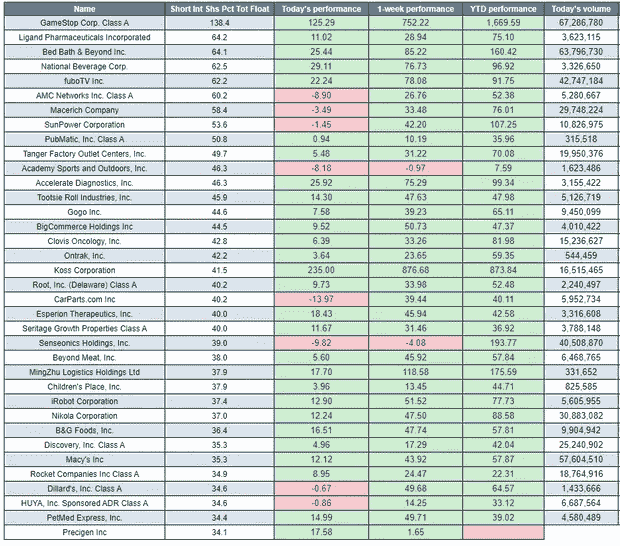

# 为什么 GameStop 和 AMC 不一样！

> 原文：<https://medium.datadriveninvestor.com/why-gamestop-and-amc-are-not-the-same-7f3d01a74f87?source=collection_archive---------11----------------------->

投资者小心…

在过去的几周里，GameStop (GME)的股价就像坐过山车一样。在我写股票“交易”(在最近的一次市场操纵后，我现在很少使用这个术语)的时候，价格是 [$3](https://www.google.com/finance/quote/GME:NYSE?sa=X&ved=2ahUKEwiaq-qpz8DuAhVMSsAKHdcUBR8Q_AUoAXoECAoQAw) 25。

对一些人来说，这已经意味着巨额收入。浏览 Reddit(这一切都是从那里开始的),你会学到一些成功的故事，并对它们微笑。大学毕业生挣首付买房，朝九晚五的人提前退休。

这是一个大卫对抗歌利亚的故事。散户投资者坚持让对冲基金的亿万富翁买单。

许多人已经在寻找下一个机会，AMC 娱乐公司(AMC Entertainment)已经被认为是下一个机会。但是是一样的吗？

如果你不知道 GME 股价在过去几周飙升的确切原因。这完全是因为太多的投资者“做空”股票，最终导致“做空挤压”。我很快解释一下…

**空头头寸**是一种当投资者预期**股票**的价值将在**短期**内下降时使用的技术，可能在未来几天或几周内。…

其意图是借入**股票**以高价出售，然后以较低的价格买回并归还给股票经纪人。

从股票市场的角度来看。比方说，现在买一个橘子要花 1 美元。如果我相信桔子的价格会在短期内下降，我可以向水果商借一个桔子。我立刻以 1 美元的价格卖掉橘子。

如果我是正确的，在接下来的几天/几周内，一个橘子的价格下降到 0.5 美元，那么我可以用这 1 美元买一个橘子，把它还给水果商(谢谢水果商先生)，而我的口袋里仍然有 0.5 美元。

当投资者买买买，使股价居高不下时，就会出现“空头挤压”。

卖空者被要求在某个时候回购他们借入的股票。导致这种情况的原因有三个:

-当他们平仓时

-当他们的保证金被追缴，他们被迫

-当他们的空头头寸到期时

当触发机制激活时，借入的股票数量将按市场价格回购。如果股价比卖空股票时高，你就亏了，如果股票不容易买到，价格就会上涨。时间很快！

这种挤压会持续多久，你是否还能从中受益，这确实是一个百万美元的问题。已经很高的 GNE 股价让投资者开始寻找下一个机会。

随着 GME 的成功，数百万人寻找下一个快速致富的机会是很自然的。

有很多关于 AMC 娱乐公司(AMC)是它的噪音，但它是不同的。

尽管其真正的 AMC 也有大量空头头寸，但与 GME 相比，这根本不算什么，见下文。

Dow Jones Market Data — source MarketWatch

GME 的空头比例约为 130–140%。这意味着卖空者没有地方回购他们在触发点持有的股票。

AMC 持有大量空头权益，但其比例约为 70%。这意味着，当卖空者必须归还借入的股票时，他们可以选择更容易地归还。

因此，关键的区别在于，GME 的卖空者没有地方回购他们的股票，而 AMC 却有！

AMC 明智的卖空者将接受亏损，并已经平仓。

然而，像 AMC 这样的公司可能仍有一些快速赚钱的机会。随着卖空者平仓，他们将不得不回购大量股票，这将导致价格短暂上涨。

这也是媒体关注的一个因素。许多受教育程度较低的投资者仍可能被诱惑去赌 AMC，这将导致短期价格上涨。不幸的是，尽管我担心许多人会不知所措。

因此，尽管 AMC 肯定不是一文不值，但它与 GME 不一样。

免责声明-这不应被视为投资建议。