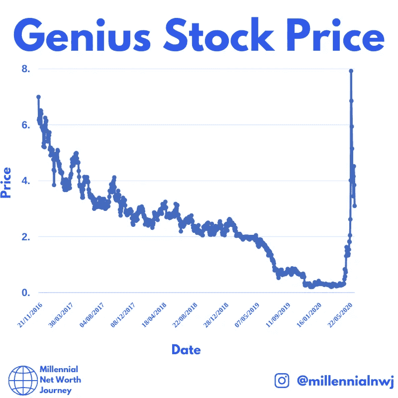
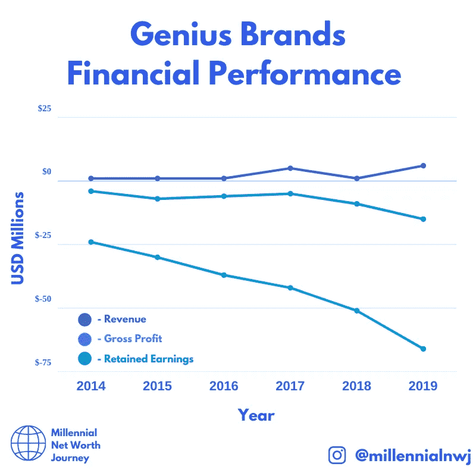

# 为什么天才品牌的股票不值钱

> 原文：<https://medium.datadriveninvestor.com/why-genius-brands-stock-is-worthless-22f715b960e7?source=collection_archive---------10----------------------->

罗宾汉的交易者已经被天才品牌的股票搞疯了。该股的成交量非常惊人，在 3 月份将价格从 0.30 美元推高至 8 美元。巨大的 2600+%。

Reddit 和脸书的留言板上有数百个热情买家的帖子，吹捧这只股票是第二次到来。

由于越来越多的关注，我决定调查一下，看看炒作是否有什么关系。我想，也许这是一个绝佳的机会。

可悲的是，我的发现相当令人震惊。

# 大肆宣传

Genius Brands Stock Price Chart on [@millennialnwj on Instagram.](http://www.instagram.com/millennialnwj)

自 2016 年首次公开募股以来，该股经历了漫长的下滑。如果没有重大消息，如此持续的价格下跌通常不会吸引这么多投资者。

我从未见过这样的股价图，这是有原因的。一只持续下跌的股票通常不会引起很多人的注意。

三月份，价格突然飙升，似乎不知从何而来。

罗宾汉交易者已经进入游戏。

如果你在 0.30 美元进场，在最高点出场，那么恭喜你，你的赌博成功了。价格的突然上涨与新闻事件无关。我已经通过网站进行了梳理，看看是否有任何新的发展导致了这一估值，我什么也找不到。

 [## 使用谷歌搜索趋势预测首次申请失业救济人数|数据驱动的投资者

### 几年来，我的重点一直是使用多种替代数据来预测宏观经济统计数据…

www.datadriveninvestor.com](https://www.datadriveninvestor.com/2020/03/25/using-google-search-trends-to-predict-initial-jobless-claims/) 

可能是互联网上的少数人决定投资一支股票来快速获利。但我的问题是，我仍然在这些留言板上看到人们对这只股票“FOMO”，认为它会涨到 20 美元就买入。对于任何投资，你都应该明白你买的是什么。

# 现实

Post from [@millennialnwj](http://www.instagram.com/millennialnwj) on Genius Brands Stock.

## 财务绩效

这张图表基本上说明了一切。这家企业的财务状况不佳。

如果一个企业不赚钱，你也不赚钱。

自 2014 年以来，该公司一直在努力增加收入，并努力保住从投资者那里筹集的资金。虽然 2019 年收入略有增长，但亏损仍高达收入的 245%以上，令人瞠目。

对于一家公司来说，要开始成为一个好的潜在客户，图表上的那些线需要显示出改善的迹象。在不久的将来，这种情况似乎不会发生，也没有任何改变的迹象。也许他们会扭转局面，但目前来看，前景并不乐观。

从基本面来看，这只股票是一个明确的避免，其股价的唯一方式是回到公允价值，即 0.30 美元。

## 妄想的增长预测

通过查看该公司的新闻稿，出于某种原因，他们预测今年的收入为 5000 万美元。第二年的收入达到了 2 . 47 亿美元。点击这里查看。

谁也不知道这些数字是从哪里来的。

让我们来分解一下:

*   2020 年收入增长 10 倍。
*   2021 年收入增长 25 倍。

除非他们知道一些我们不喜欢的东西，否则他们计划发布一个网飞竞争对手的流媒体服务，并有数十亿美元来尝试和竞争。

也许他们在办公楼下找到了一口油井。*支票票据*哦，他们也租了，也不可能。

我很想知道在这篇充满前瞻性陈述的新闻稿中，这些数字是从哪里来的。

## 结构性现实与估价相冲突

有一件事是这家公司无法逃避的。正如 WeWork 标榜自己是一家科技公司一样，不管有多少人相信它是这样，它不是。

天才也有同样的问题。这是一家制作公司。不管有多少人认为他们重新发明了轮子:他们生产儿童电视。

Genius 与主宰这个行业的运转良好的内容机器相比，没有任何竞争优势。(网飞、迪斯尼、尼克等)。它制作内容，然后授权给其他人在他们的平台上展示。无论是电视还是流媒体频道，他们可能会出售一些与产品相关的商品，但远不足以证明其目前的估值。

## 内容风格进一步侵蚀收入

纵观 Genius 提供的所有内容，主要类型似乎是涉及某种名人的内容。

*   沃伦·巴菲特的秘密百万富翁俱乐部
*   斯坦·李的超级英雄幼儿园
*   托马斯·爱迪生秘密实验室

这些可能都是很棒的节目，人们可能会喜欢。但是他们带来的任何收入都会有很大一部分来自参与这个项目的名人的许可。

> 具有讽刺意味的是，世界上最伟大的投资者之一从最差的公司那里拿钱投资。

甚至他们的许多商品都是特许商品。亚马逊上出售的是天才制作的沃伦·巴菲特的玩偶。[查看这里](https://www.amazon.com/dp/B07618PSPC)。没有“没有迹象表明什么时候会有货”的。

天才要卖出多少沃伦·巴菲特玩偶才能弥补今年的亏损？

## Youtube 观看数字

他们的 Youtube [频道](https://www.youtube.com/channel/UClaiZadeWKgPDWFLqeHaDyQ/videos?view=0&sort=p&flow=grid)似乎没有多少浏览量。他们观看最多的视频有 220 万次观看，其中许多人有大约 1 万次观看，即使是两年前上传的视频。

作为背景，Youtube 上的儿童内容是海量的。Cocomelon 是世界上观看人数最多的 Youtube 频道，他们制作童谣视频。他们有八个视频，点击量超过 10 亿次。仅从 Cocomelon 在 Youtube 上的收入来看，他们每月就能带来约 1400 万美元的收入。

Genius 在过去六年才获得这么多收入。这就是他们面临的情况。

没有实际的观察数据，很难判断，但粗略一看，这不像是一个崭露头角的创业公司的巧妙运作。这似乎是一个地方，他们上传内容，并希望最好的。

## 离别的思绪

这只股票我可能看错了。但根据我所做的研究，我很高兴我没有持有它的股份。如果它能变成椰子的十分之一，我会为他们和所有的天才持有者感到高兴。然而，我高度怀疑这将是结果。

**访问专家视图—** [**订阅 DDI 英特尔**](https://datadriveninvestor.com/ddi-intel)