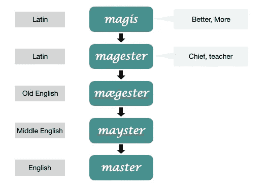

# 为什么 Github 由主变主不是解决之道

> 原文：<https://medium.datadriveninvestor.com/why-githubs-change-from-master-to-main-is-not-the-solution-a3ac38cc48dd?source=collection_archive---------0----------------------->

## 这只是转移了问题

Photo by [Markus Spiske](https://unsplash.com/@markusspiske?utm_source=unsplash&utm_medium=referral&utm_content=creditCopyText) on [Unsplash](https://unsplash.com/s/photos/racism?utm_source=unsplash&utm_medium=referral&utm_content=creditCopyText)

让我首先声明我谴责任何形式的奴隶制。我真心诚意地谴责种族主义！我在这篇文章中的意图不是鼓励任何形式的歧视或种族主义。

现在，我们回到正题。对于那些可能不知道的人来说，' **master** '分支是任何 git 的新存储库的默认分支名称。因此，许多人经常把它作为一个稳定的分支**。**受美国各地种族主义案件上升的刺激，GitHub 最近将其“ *master* 分支机构”更名为“ *main* ”。

> 2020 年 10 月 1 日，您创建的任何新存储库都将使用 main 作为默认分支，而不是 master

该公司表示。

我已经在软件/技术行业工作了十多年。我曾与不同种族、不同出身、不同宗教的人共事过，从来没有人暗示过 Github 的“ *master* ”关键字是出于种族动机。我从未在互联网上遇到过任何暗示' *master* '关键字会让人心烦意乱、伤害人的事情。

那么，为什么这家科技公司试图通过从他们的字典中删除一个单词来解决种族歧视问题呢？老实说，不仅仅是 Github，其他一些公司也有类似的想法。说真的，我不知道这有什么好处。

# 这只是另一个词

但是在我们深入探讨之前，让我们先来看看 Master 这个词的起源。

Image by author, Inspired by [etymologeek](https://etymologeek.com/eng/master)

master 一词来源于拉丁语"*法师*"，意为首领或老师。如你所见，这个词本身并没有贬义。

> 这只是另一个词

在 git 的上下文中，“主”一词的用法与“*主/从*”不同。我从来不知道分支被称为“奴隶”或任何类似的东西。当这种变化发生时，我记得我的朋友 Sid 告诉我这种变化，

> 嘿 Cinto，你知道 GitHiub 把它的默认分支从 master 改成 main 了吗

停顿了几秒钟后，我回答道

> 好吧…但是为什么呢？

老实说，我想不出这种变化的理由。即使在希德解释了这背后的原因后，我仍然无法说服自己这种改变会以任何方式帮助减少种族歧视。

 [## 用 PyTorch 训练数字识别器，用 ONNX Runtime | Data Driven 在 CPU 上进行推理…

### 在任何机器学习问题中，我们的神经网络的目标是在新的未知数据上做得很好，训练一个深度…

www.datadriveninvestor.com](https://www.datadriveninvestor.com/2020/09/16/training-a-digit-recognizer-using-pytorch-and-inferencing-on-cpu-with-onnx-runtime/) 

根除一个不存在的问题不是解决办法。去掉一个本身没有贬义的词不会有任何好处。关键字“主人”并不是 17 世纪和 18 世纪奴隶制出现的原因。我们今天看到像 George Floyd 和 Breonna Taylor 这样的事件，不是因为有人将他们的代码签入到'*主*分支，而不是'*主*分支。

这是当时人们的心态，也是现在人们的心态。我很失望和沮丧地说，但简单地删除一个或多个单词不会有任何好处。这是一个很好的姿态，仅此而已。

# 解决问题的权宜之计

我在许多关于头痛的社交媒体页面中的一个页面上看到，许多人都在提供如何治疗头痛的建议。解决方案包括使用阿司匹林和肉毒杆菌。现在，这些解决方案可能会暂时缓解头痛，但是，如果你不解决原因，头痛会继续回来。

非常重要的是，我们要把重点放在解决根本问题上，而不是用创可贴和阿司匹林来解决问题。创可贴方法的问题在于，它让我们暂时感到快乐。我们觉得我们已经为自己做得够多了，为社会做得够多了。这将我们从更大的实际问题上引开。

下一次我们有一些这样的种族驱动的事件，万事达卡将改变它的名字，也许像 Chiefcard，或者也许 Headcard。我们将沐浴在这一变化的光辉中。作为一个社会，我们将感到自豪。

理解这一点非常重要，没有简单的方法可以摆脱它。没有绷带能解决问题。我们需要不断提醒自己这一点。社会需要净化，深入清理心态。它始于教育你的孩子，成为你想成为的人，教育你周围的人平等待人。

每个人都有自己的角色。但这是一场艰苦的战斗。如果我们从今天开始，我们的下一代将会有更好的性格，更好的心态。仅仅换个名字并不能解决问题。

# 他们真的想解决问题吗？

我可能完全错了。而 GitHub 可能真的想做出改变。但在大多数情况下，这些只是公关噱头，以从困境中获得一些利益。

几年前，我的项目经理在一个周末打电话给我。我们有很好的工作关系，我认识他很久了。我明白这是对他管理的另一支球队的咆哮。所以他打电话说

> 辛托，这些人真让我生气。他们太懒了，不想努力工作来推进这个项目。他们会迟到早退。我不知道我能做什么。

我回答的第一件事是:

> 是的，我认识约翰。我每天工作将近 12 个小时，还有这么多工作要做。

我的经理正经历一段艰难的时期，管理着两个项目，尤其是其中一个项目进展不尽如人意的时候。但我的回答一点也不进步，它无助于事业。如果你仔细看，这是一个简单的公关噱头。我利用这种情况来推销我的道德和努力。

现在，让我们看看手头的问题。看起来相似吗？

清理代码的工作实际上始于 2014 年，当时 Drupal 项目首次将“主/从”术语替换为“主/副本”。后来 Chromium、PostgreSQL 和其他公司尝试实施这些实践，但是多年来清理软件语言的努力并没有被广泛接受。

> 如果是这么大的问题，为什么 GitHub 不早点这么做，尤其是之前有其他公司尝试的时候？
> 
> 为什么要等到这样的事件发生？

老实说，我对此没有答案。

我个人不反对将“main”作为默认分支，但是我认为其背后的推理是错误的。正如我前面提到的，这只会转移问题。

我相信，从长远来看，以下做法会更有帮助:

→经常举办研讨会和课程，对歧视进行教育。在接下来的 100 年里，这些需要定期发生

→建立种族和宗教多元化的团队。这可能会在开始时造成一些尴尬的局面，但从长远来看，这将是有益的

→学校应该定期开设关于任何歧视的课程

→讲授无意识偏见

→作为一个团体、一个公司和社会，不断致力于平等主义(即所有人都是平等的，都应该享有平等的权利和机会的学说。)

→承认并欣赏差异，**但平等对待所有种族**。

最后，我重申，我不支持种族主义或任何种类的歧视。如果 Github 的改变会减少对特定种族的攻击，我很高兴被证明是错误的。

**访问专家视图—** [**订阅 DDI 英特尔**](https://datadriveninvestor.com/ddi-intel)