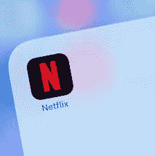

# 为什么谷歌和脸书应该感谢网飞！

> 原文：<https://medium.datadriveninvestor.com/why-google-and-facebook-should-thank-netflix-c184db0db14f?source=collection_archive---------6----------------------->

Photo by [Thibault Penin](https://unsplash.com/@thibaultpenin?utm_source=medium&utm_medium=referral) on [Unsplash](https://unsplash.com?utm_source=medium&utm_medium=referral)

[Source](https://images.barrons.com/im-142040?width=1280&size=1)

网飞是谷歌和脸书遇到的最好的事情。

认为内容流(NF)可能与搜索和社交媒体(分别为 GOOG 和 FB)有任何关系似乎很奇怪。

NF 最初如此成功的原因就在于此。NF 颠覆了付费电视的商业模式&让人们观看没有广告的视频。尽管谷歌在搜索和社交媒体领域开展业务，但广告仍占谷歌/FB 收入的大部分。

 [## 苹果会成为新的网飞吗？数据驱动的投资者

### 有可能。然而，该公司肯定会与大公司竞争。许多人不得不看到这一天的到来…

www.datadriveninvestor.com](https://www.datadriveninvestor.com/2019/02/15/will-apple-be-the-new-netflix/) 

多亏了 NF，电视现在已经从双重收入(加盟费+广告)转变为单一收入模式，即订阅。这释放了与电视相关的广告收入。

广告商现在何去何从？

当然，他们会上网，因为谷歌和 FB 是双头垄断的。NF 单枪匹马摧毁了美国的付费电视商业模式。事实上，2018 年，超过 50%的 22 岁和 45 岁的美国人没有观看任何付费电视。

不出所料，2016 年，GOOG & FB 占数字广告增长的 99%。虽然这些数字在过去十年的末期有所下降，但双头垄断的收入仍然令所有其他公司相形见绌。

事实证明，NF 是 Google/FB 需要的巧妙的企业杀手&可以说，NF v/s the cable bundle 的最大赢家是谷歌和脸书。

— — — — — — — — — — — — — —

这里表达的观点是我自己的，并不反映我的任何雇主的观点，无论是现在还是过去。