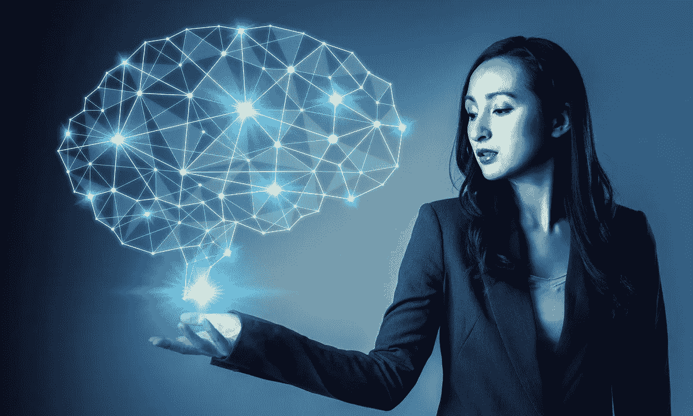
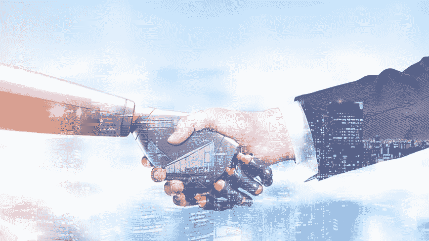

# 为什么人力资源必须利用人工智能的力量

> 原文：<https://medium.datadriveninvestor.com/why-human-resources-must-leverage-the-power-of-ai-c222a6fea73d?source=collection_archive---------3----------------------->

谈到商业世界，技术并不是最近才出现的。它可能并不总是显而易见的，但技术总是有助于实现业务成果、提高效率和优化运营。并且随着🔗 [**【人工智能】**](https://www.tmi.org/blog/applying-artificial-intelligence-for-talent-management) 即将到来，人类与技术的交互方式必将发生突飞猛进的变革和改善。

样本如下:

**2018 年，32%的工作者在工作中以某种形式使用 AI；这一比例在 2019 年上升至 50%**

**一些国家的工人对人工智能的使用是其他国家的两倍**

# 👉**人力资源的期望已经发生了变化。**

不久前，人力资源还被认为是一个文书、行政领域。记录保存是主要重点，而战略与其功能格格不入。然而现在，人力资源实践已经发展到帮助组织实现其战略目标——因此命名为“战略人力资源”。重点是绩效管理、团队合作和其他高绩效人力资源实践，这些都是**人才管理专业人士**的领域。

 [## 人工智能和监督资本主义|数据驱动的投资者

### 大科技，总是现在:人工智能推动的大科技，已经使购物，搜索，在你的…

www.datadriveninvestor.com](https://www.datadriveninvestor.com/2020/03/04/on-artificial-intelligence-and-surveillance-capitalism/) 

# 👉**寻找合适的人才很有挑战性！**

有效的**人才获取**是发展一个组织并帮助其为行业做出贡献的关键。然而，有几个问题出现了。这一过程非常耗时，审批、筛选和决策平均花费 26 天。面试是高度主观的，经常带有偏见，可预测性很强，而且在招聘合适的人方面效率很低。虽然积极主动有助于在战略上保持领先，但招聘往往只对过去的事件做出反应。糟糕的招聘可能会造成巨大的经济损失(高达第一年收入的 30%)，也会降低生产力和士气。

🔗 [**人才管理专业人士**](https://www.tmi.org/professional-certifications/talent-management-practitioner) 也面临着吸引和留住员工的挑战。员工队伍由不同代人组成，他们的职业发展期望不同，对学习的期望和要求也不同。鉴于技术的不断进步以及适应时代的需要，技能的获取尤为重要。当员工离职时，不充分的继任计划会让组织陷入困境，而棘手的薪酬预期会让员工继续寻找更好的工作机会。

# 👉**人工智能非常有用**

人力资源负责人每天都要应对许多挑战，人工智能可以成为他们的盟友，让他们走得更顺畅。

人工智能通过寻找最符合工作要求和他们的技能和经验的候选人，使用机器学习(ML)算法来学习简历中的常见关键词，从而促进**人才获取**。基于人工智能的解决方案可以发布更好的职位，接触到更多样化的候选人。潜在的候选人可以被提醒新开放的职位，人工智能可以预测他们被接受的可能性，他们的表现和预期的任期。提醒和资源审查建议有助于更好的面试，而人工智能和基准数据有助于个性化工作机会和乐队角色。入职的管理负担也可以减轻，当考虑到 75%的人员流动源于无效的入职时，这是很有用的。

**人才领导者**可以通过满足员工的需求，利用人工智能来提高员工的忠诚度。个性化的职业发展建议最大限度地发挥员工的职业潜力，同时使其与业务活动同步。职业道路可以围绕特定的学习经历来构建，以满足提升技能的要求。如果一名关键员工选择离职，留下一个可能阻碍公司成功的缺口，人工智能可以通过查看薪资历史和其他因素来帮助预测这种离职和流失率，发现那些在文化契合度、能力和成就方面可以提升的优秀候选人。

当谈到通过学习和发展弥合技能差距时，人工智能对人才管理专业人士非常有帮助。学习可以根据个人习惯，兴趣和风格进行个性化，并以协作方式进行，这也有助于跨职能学习。通过观察与学习者的互动和结果，管理学习机会也变得更加容易。

# 👉**AI 对 HR 的潜在影响是广泛的！**

人工智能正在改变工作的方方面面——从商业模式到客户体验和劳动力人口统计。当与战略洞察力结合在一起时，人工智能可以改变**人才领导者**如何帮助一个组织瞄准新的商业机会并提高其竞争优势。

人工智能对人力资源的影响将是显著的，并随着时间的推移而上升:13%的🔗 [**人力资源主管**](https://www.tmi.org/professional-certifications/global-talent-management-leader) 证实了它已成为人力资源工作的一个常规组成部分，55%的人预计其影响将在五年内扩大。

人工智能如何帮助人力资源符合技术如何帮助任何任务:以更高的速度和效率，更低的成本做同样的事情。例如，这种差异可以从以前的技术化身如何加快基于互联网的招聘，以及人工智能如何评估技能匹配，估计招聘时间，以及预测候选人成功的可能性来看。人力资源绩效不仅可以逐步提高，还可以成倍提高！

对人力资源主管来说，重要的是迅速理解人工智能可能产生最大影响的领域，并相应地做好准备。Gartner 的首席分析师 sey da Berger-b cker 表示:“在决定人力资源流程改进计划时，**人力资源主管**必须将基于人工智能的解决方案作为一个主要考虑因素。”

对员工透明是人工智能在人力资源领域取得成功的关键。他们是关键的利益相关者，必须理解它的好处，不要担心它可能会夺走一些以前由人类处理的任务。近三分之二(61%)的员工认为，未来计划的透明度会让他们更舒服，并减轻他们对技能提升计划的不确定性。利益相关者方法还必须吸收不同水平、专业知识和地理位置的人，因为这将加强共同的愿景，使人工智能为企业带来巨大的成果。

# [📫](https://usejournal.typeform.com/to/P5eS4U?=&utm_source=machine_learnings&utm_medium=blog&utm_content=accepting_post_submission&utm_campaign=team_post&source=post_page---------------------------)我关于人力资源的其他故事:

1.  [*超越*](https://medium.com/@amelia.jackson743/how-ai-will-revamp-hr-industry-in-2020-beyond-3f506f1be935)2020 年人工智能将如何改造人力资源行业&
2.  [*大数据——人力资源的未来*](https://medium.com/swlh/big-data-the-future-of-hr-19ba4cf0dea2)
3.  [*数据科学在现代人力资源实践中的作用*](https://medium.com/datadriveninvestor/the-role-of-data-science-in-modern-hr-practices-c1000f5f9cad)
4.  [*技术和人力资源的演变*](https://medium.com/@amelia.jackson743/technology-and-the-evolution-of-hr-bd13de0088a7)