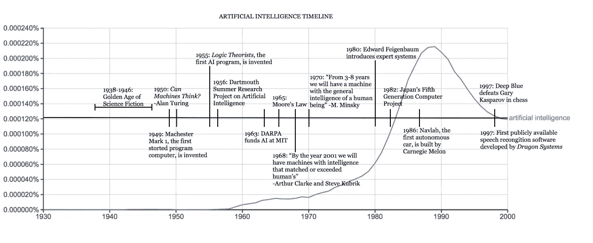
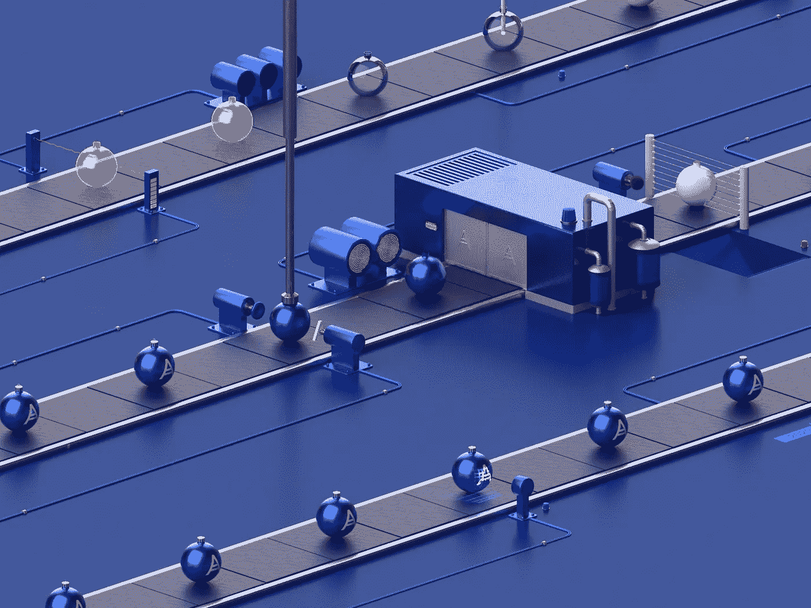

# 为什么在人工智能驱动的世界里，人仍然是最有价值的资产

> 原文：<https://medium.datadriveninvestor.com/why-humans-are-still-the-most-valuable-asset-in-an-ai-powered-world-a5f0f9708b70?source=collection_archive---------5----------------------->

## 讽刺的是，人工智能对人类的依赖，至少现在是这样。

**艾历史入门**

“人工智能”于 1955 年由约翰·麦卡锡创造，他与艾伦·图灵、马文·明斯基、艾伦·纽厄尔和司马贺等创始人一起探索了人工智能的数学可能性。他们在 1956 年夏天召开了一次著名的达特茅斯会议，由于缺乏更好的术语，会议正式介绍了人工智能作为一个研究领域。

图灵尤其重要，因为他对人工智能和一般计算的贡献。他的开创性工作[计算机器和智能](https://www.csee.umbc.edu/courses/471/papers/turing.pdf)讨论了如何建造智能机器以及如何测试它们的智能(例如[图灵测试](https://en.wikipedia.org/wiki/Turing_test))。

 [## 人工智能预测能力的神话|数据驱动的投资者

### AI(人工智能)最有前途的优势之一似乎是它预测未来的能力…

www.datadriveninvestor.com](https://www.datadriveninvestor.com/2019/03/01/the-myth-of-ais-predictive-power/) 

然而，在那个时候，计算机缺乏智能的关键先决条件。例如，他们不能存储命令；他们只能处决他们。此外，计算是一项极其昂贵的活动。在 50 年代，租赁一台计算机的平均费用可能高达每月 20 万美元。这意味着只有著名的学术机构或大公司(特别是科技公司)才有能力在这个新领域进行实验。

快进到 20 世纪 70 年代。到现在，计算机肯定可以存储更多的信息。处理能力显著提高。平均成本也开始下降。随着人们越来越了解哪种类型的算法适用于哪种类型的问题，机器学习算法开始得到改善。

又过了十年左右，到了 20 世纪 80 年代，人工智能开始重新引起人们的兴趣，因为两个因素开始发挥作用:1)更多的研究和开发导致算法工具箱的扩大，以及 2)投资于一般计算的资金量的增加。

到 20 世纪 90 年代和 21 世纪初，人工智能领域的重大里程碑已经实现。1997 年，IBM 的深蓝在国际象棋比赛中击败了加里·卡斯帕罗夫。如果你和我一样从事自动语音识别(ASR)工作，你可能会关心这家当时名为 Dragon Systems 的小公司，它使用微软的 Windows 操作系统实现了第一个语音转文本软件。

2017 年，谷歌的阿尔法围棋击败了人类围棋冠军柯洁。

## **AI 的商品化**

人工智能的商品化是指人工智能在两个方面变得更加普遍:1)可访问性和 2)可负担性。

它是由另外两件事直接驱动的:1)通用计算的商品化，以及 2)数据的可用性。

1.  **计算能力。**考虑这样一个事实，一部“旧”的 iPhone 5s 有足够的能力每秒执行数百万次计算。凭借 1GB 的内存，它可以存储整个 6 Mb 的代码，这些代码是 NASA 在 1969 年开发的，用于监控其航天器和宇航员的状态。NASA 每台大型计算机(IBM System/360 Model 75)花费高达 350 万美元，他们不得不购买几台。但如果我没看错的话，现在一部 iPhone 5s 只要 50 美元就能买到。你可能熟悉[摩尔定律](https://en.wikipedia.org/wiki/Moore%27s_law)——密集集成电路中的晶体管数量大约每两年翻一番的概念。以飞兆半导体公司(Fairchild Semiconductor)的联合创始人戈登·摩尔(后来成为英特尔的首席执行官)的名字命名，这一观察在过去 50 到 60 年中或多或少得到了证实。它是否会继续保持真实是一个不同的故事，但它的影响是重要的:**随着平均成本急剧下降，更高功率的计算变得更加容易获得**。
2.  **数据可用性**。和往常一样，互联网产生了巨大的影响。随着更大的带宽、众包能力和公共数据库的使用，今天收集和共享数据的能力比使用有线电话拨号上网的时代有了显著的提高。随着模型训练数据的访问变得更加普遍和便宜，这使得人工智能产品的开发和使用也更加便宜和快速。(尽管在数据方面，我确实对商品化持温和的观点——考虑收集高价值、因而昂贵的专有数据的概念。

简而言之，**计算和一般数据采集成本一直在下降，而计算能力和数据可用性一直在提高。**

## 随着技术商品化，人工智能服务会有价值吗？

换句话说，如果越来越多的 AI 服务开始**向质量和价格**靠拢，那么我们可以期待 AI 技术变得司空见惯。各种人工智能产品之间的差异可能较小，或者至少有细微差别。

在技术领域，这种情况屡见不鲜。在流媒体视频的早期，网飞是王者。随着流媒体技术的商品化，我们看到更多的新参与者，如 Prime Video、Hulu、Disney Plus 等。坦率地说，他们的流媒体服务都很好，至少在保真度(视频质量)和延迟(无延迟体验)方面的技术可用性方面是如此。突然间，差异化不再出现在技术堆栈中。相反，战斗已经转移到内容生成和质量上。

在电子游戏中，我们看到了类似的趋势。拥有一台 XBox 和一台 Playstation 真的有很大区别吗？当然，也许在品牌忠诚度方面。但除非内容分布不同，否则游戏玩家不太可能关心技术性能，只要他们能运行现代游戏。计算位数的日子已经过去了(还记得任天堂字面上给它的系统和所有带 64 后缀的游戏命名为 N64，像… Mario64 等。).这就是为什么独家游戏(如内容策略)占据了蛋糕(PS4 一直在碾压 XBox One，因为它的高质量游戏，如《神秘海域》、《合金装备》和其他特许经营)。尽管运行在本质上是去年的技术上，但任天堂 Switch 游戏机表现如此之好的原因正是因为它对《塞尔达传说》、《马里奥》、《粉碎兄弟》等 1P 特许经营拥有独家内容控制权。

## AI 注定是无差别的吗？

那么 AI 的差异化策略是什么？按照上面的类比，相当于 AI 的“内容”是什么？是数据吗？也许吧。我认为拥有**独家训练数据将是差异化战略**的一部分，最终允许一个人工智能厂商生产潜在的高度不同的人工智能产品和服务。

但我不相信你可以仅仅基于专有数据建立一个具有防御护城河的人工智能服务。**拥有数据优势固然重要，但还不够。**

## **科学天赋的力量**

最终的区别是你的人工智能人才库。至少目前是这样。通过了解木工，我的一个爱好，你可以更好地理解我的立场。

在某个时候，人工智能工具和技术将高度商品化，就像任何木匠可用的工具通常都是负担得起的和可用的(只需点击 Lowe's 或 Home Depot)。你可能还会认为，用于开发人工智能模型的高质量训练数据类似于采购高质量的木材。用同样好的工具做的两把椅子，可能是非常不同的产品，取决于一把是橡木做的还是压缩刨花板做的。但是，像木材一样，仍然可以获得高质量的数据，而且可能足够丰富。数据卖家，很像木材商，通常不喜欢独家销售。虽然你可以培育自己的森林，就像你可以从零开始收集专有数据一样，但这可能需要很长的时间和投资。

在这一点上，你可能明白我的意思。**差异化一定在构建者。在木工行业，那就是木匠。在人工智能中，那是应用科学家。**

现在任何人工智能产品开发的最大瓶颈是找到高质量的应用科学家。我们面临的一些最困难的问题无法解决，只是因为我们有更多的数据、更好的算法和更便宜的价格的强大计算。那是因为就目前而言，人们不得不应用这样的资源来解决问题。如果你的应用科学团队很糟糕，那么你给他们什么工具或数据都没关系。他们倾向于滥用资源，生产低劣的人工智能模型，导致蹩脚的人工智能产品。就像缺乏想象力或只有几年经验的木匠不太可能做出令人惊叹的木制品。

今天更可怕的是 AI 框架、工具包、课程作业等的丰富。可能会误导人们认为现在成为一名合格的数据科学家或应用科学家比以往任何时候都容易。我不是在开玩笑——我走过的每个角落，都有人自称是“人工智能专家”或“人工智能科学家”。在很大程度上，我认为真正优秀的人工智能科学家仍然是那些来自非常严格的教育背景的人。虽然我并不排斥那些能够快速掌握工具和概念的人的天赋，但我确实认为，仅仅因为你可以运行模拟并将数据抛入模型以产生结果并“调整它”并不完全相同——记住，**工具大师并不总是工艺大师**。

我真的不想对此感到势利。我想实际一点。在计算机科学中，我们经常区分“程序员”和“程序员”，因为前者知道如何编写代码来完成工作。但是他们缺乏基本的计算机科学知识，这经常导致他们产生低效的代码，这些代码被错误破坏，并且以高技术债务为特征。然而，程序员通常都有扎实的计算机科学背景，能够解决安全性、体系结构、数据库等基本概念方面的知识。从长远来看，他们的软件可能更具可持续性。我觉得 AI 科学家和 AI 产品也是如此。

我希望从长远来看，在人工智能科学家的质量上也有一个**的趋同。但是现在，我们还没有完全破解我们教育系统的公式。我再次转向木工。有些树木需要很长时间才能生长，因此成为一些最受欢迎和最有价值的木材。还有一种通过基因工程“加速”这些树木生长的现代方法。这是一种捷径，将一棵树的成熟时间缩短了近 10 倍或 20 倍。现在你可以有更多的那种木材了。但是仔细观察就会发现，这两种生长方法的木材密度和其他特性有很大的不同。同样，我不认为你可以压缩一个拥有博士学位的应用科学家的知识和经验，就像你可以雇用一个在简历上快速列举一长串经验和熟悉人工智能框架和数据库经验的人一样。它们可能仍然很锋利。但他们也可能不是你真正想要招聘的人。**

我的观点是，就目前而言，虽然我们仍然严重依赖人工智能科学家来训练和设计人工智能模型，但投资真正高质量的人工智能人才可能最有利于你的业务(这不一定局限于科学；可以横跨产品经理、程序员、营销等。).**在计算能力、算法、数据和资金唾手可得的地方，把人视为你差异化和创新的决定性资产。**