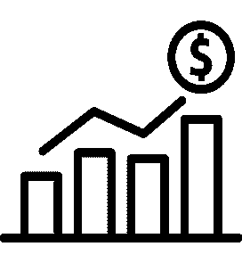

# 为什么我为股市投资者开发了一个回溯测试软件

> 原文：<https://medium.datadriveninvestor.com/why-i-built-a-backtesting-software-for-stock-market-investors-ca8734f4f00d?source=collection_archive---------2----------------------->

你好。我叫伊万，是 PyInvesting.com 的创始人。我对技术和金融充满热情，曾在一家对冲基金担任软件开发员。我建立了 PyInvesting 来管理我的个人投资组合，使用数据驱动的投资方法。

当我考虑如何投资时，有三个关键因素对我很重要。

1.  **强劲的业绩**，高风险调整回报
2.  **来自折扣经纪人的低费用**
3.  **易于实现**和全自动化

# Web 应用解决方案

这是一款简单下载金融数据并使用我的投资策略进行回溯测试的应用。然后，该应用程序会给我发一封电子邮件，告诉我投资组合的当前头寸以及我需要在个人账户上交易的订单。

**Invest Profitably**

**Simply Fill in a Form**

**Personal Solution**

这个应用程序让我能够利用历史数据对我的投资策略进行回溯测试，而不必在做研究的时候在市场上冒险。这让我可以根据技术和基本面分析测试数百种不同的策略，从中选择我最满意的最有利可图的策略。

该应用程序使用起来也非常简单。回溯测试是一个高度计算密集型的过程，专业基金通常依靠软件开发团队来构建他们的交易系统。我已经简化了这个过程，您只需要填写一个表格，其中包含您的回溯测试详细信息。PyInvesting 处理其余的计算，并为您呈现漂亮的图表，以及您投资策略的绩效分析。

最后，该应用程序允许投资者创建高度个性化的投资策略。没有两个投资者是完全一样的。谈到投资，每个人都有自己的偏好。与机器人顾问强迫你使用他们的投资策略不同，PyInvesting 允许你定制自己的投资策略以满足你的需求。

你是日内交易者还是摇摆交易者？查看我们的[移动平均线回溯测试](https://pyinvesting.com/backtest/moving-average/)，它允许你在交易前计算你的进场点和出场点。如果你是一个长期投资者，请查看我们的[基本面回溯测试](https://pyinvesting.com/backtest/fundamentals/)，我们提供基本面数据，如市盈率、股本回报率和利润增长。

# PyInvesting 概述

该网站有 4 个主要部分。

1.  **筛选工具**，用于根据一定的标准筛选股票，如选择市值最高的前 100 只股票，形成你的投资宇宙。
2.  **回溯测试软件**，它允许你使用已经通过你筛选的股票来模拟你过去 15 年的量化投资策略。
3.  在**回溯测试结果**中，PyInvesting 分析了你的策略的表现。
4.  最后是 **live 部分**，在这里用户可以使用他们的策略进行交易，并收到每日更新的电子邮件，其中包含来自他们策略的实时订单，他们可以在自己的个人账户上进行交易。

# 结束语

像大多数人一样，我一直被经济独立的想法所吸引，因为这让我不必依赖全职工作就能养活家人。这为我提供了经济保障，因为我总是有失业的风险。

为了尽快实现我的财务目标，仅仅依靠我的积极收入是不够的。我也需要通过投资股票市场来增加我的被动收入。

然而，糟糕的投资决策会导致一个人失去一生的积蓄。为了解决这个问题，我开发了一个回溯测试软件，让你可以轻松地创建一个投资策略，并测试它是否有效，而不用在股票市场上冒任何风险。

我希望 PyInvesting 能让你采用数据驱动的方法进行投资，并在你走向财务自由的旅程中支持你。