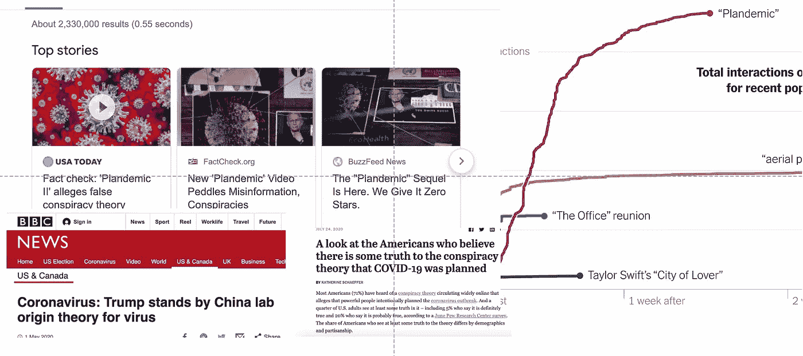
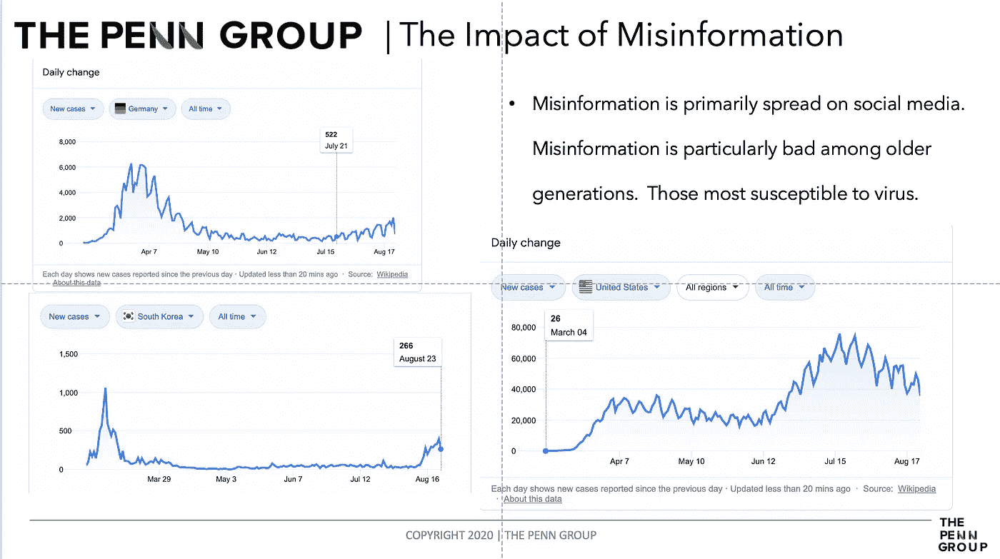
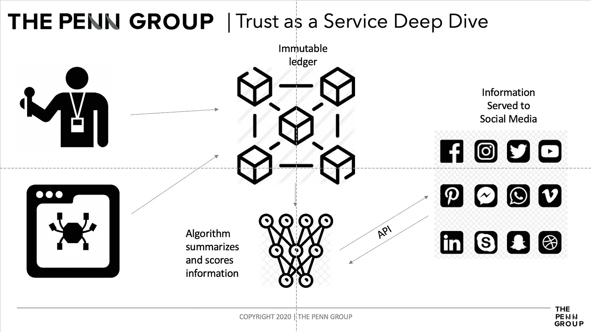

# 为什么我设计了一个系统来战胜错误信息

> 原文：<https://medium.datadriveninvestor.com/why-i-designed-a-system-to-defeat-misinformation-a6b44ab9ca54?source=collection_archive---------10----------------------->

The Misinformation Problem

# 误传问题

以我在网络安全方面的深厚背景，错误信息的规模和深度是最令人担忧的。2020，作为一个选举年，不是一场为了利益或理想而发动的战争，而是操纵和分裂。在我们国家的历史上，把事实歪曲成谎言，把谎言变成事实从来没有像现在这样容易。我们的领导人、我们的对手和我们的财富已经注意到了。通过利用现代技术，如脸书和推特，以及更传统的技术，如电视和广播，选举的战场不再是在各州，而是在我们醒来时看到的屏幕上。作为[佩恩集团](http://www.thepenn.group)的[总裁&首席执行官](https://www.linkedin.com/in/austin-harman-7040199a/)，我不断挑战自己，不仅要发现问题，还要解决问题。误传问题是一个多代人、多文化的不和谐声音，有一个共同的潜在问题。为了解决这个问题，我们采用了现代技术，设计了一个动态系统来消除错误信息。我写了大量关于误传的文章，并拒绝用俚语“假新闻”来称呼它。你可以在这里阅读这些文章:

 [## 最强大的操纵者

### 恐惧被用作终极操纵者。对美国信任的攻击。

medium.com](https://medium.com/datadriveninvestor/the-most-powerful-manipulator-8598439852e4)  [## 误传的代价|冠状病毒和总统

### 历史不会善待那些乱了轻重缓急的领导人。

medium.com](https://medium.com/swlh/the-price-of-misinformation-coronavirus-and-the-president-b105244f1f76) 

# 错误信息的根源

误传的有效性等于信任的导数。信任的变化率刺激可信的谎言，从而助长了错误信息。错误信息不成比例地影响了老一代美国人。根据纽约时报引用 T2 科学进展研究的报道，美国老年人更容易受到错误信息的影响。我认为这相当于两个关键事实。第一，老一代美国人对新闻的接触比当今社会要少得多。对于老一代人来说，获取新闻需要阅读报纸、NPR 上市，甚至在电影院观看新闻更新。这种单向度的方法确保了呈现给美国人的主流观点被顶级报纸所控制。其次，政府的秘密有点像民间传说。1971 年,《纽约时报》以[五角大楼文件](https://en.wikipedia.org/wiki/Pentagon_Papers)投下了令人难以置信的重磅炸弹。随着多位总统向公众撒谎的曝光，对政府的信任度直线下降，对美国老年人的不信任一直持续到信息时代。

快进到 2020 年，你被推进到信息时代，这实际上可以被称为*假信息时代。在新冠肺炎危机最严重的时候，一部名为《计划》的纪录片上映了。Plandemic 是一个非常不准确，充满阴谋，以一位前分子生物学家为特色的剪辑集。在社交媒体上发布后的 24 小时内，该视频的浏览量超过了 800 万。当被告知视频的道德标准时，导演说他试图做一个有争议的声明。普兰德米克试图诋毁安东尼·福奇博士，传播关于戴面具的错误信息，并提出一个阴谋，即疫情旨在丰富精英阶层。*

Misinformation Impact

该视频能够呈现一个看似可信的来源，同时利用感觉商品，并挖掘到民粹主义的理想。结果是毁灭性的。下面的幻灯片显示了美国新冠肺炎病例数急剧上升。色彩并不是因果关系，但案例数讲述了一个真实的故事。

# 解决错误信息

为了解决错误信息的问题，我的团队首先求助于支撑错误信息问题的技术。为了有效，错误的信息必须被传播。无论是左派还是右派，始终如一地说同样的事情比声明背后的真相更重要。如果你能阻止这种一致信息的传播，那么你就能阻止错误信息。为此，我们设计了一个利用区块链的系统。区块链是不可变的账本。一旦您的信息被提交到分类帐，设计特征就会强制执行*完整性的安全目标。*诚信是信任形成的根本。如果你能加强诚信，你就能建立信任。

Introducing Trust as a Service

# 引入信任即服务

在区块链基金会内部，我们从合法的、经过审查的来源获取真实的新闻。然后，这种新闻与一种网络爬行系统相结合，该系统“寻找”与特定主题相关的文章。这是用一种算法结合起来的，这种算法对信息的可信度进行“打分”。这些信息然后通过 API 提供给相应的社交媒体公司。然后，该公司为验证信息支付“费用”。这笔费用的很大一部分被转嫁给了最初从事这项工作的人，而不是导致报纸面临财务困境并从中获利。公司可以使用这个系统来验证帖子，或者为潜在的虚假或误导的故事提供相关的、*准确的*来源。

虽然我们不能完全击败错误信息，或解决所有的边缘情况，我们相信这个系统有一个真正的机会来解决一个真正的社会问题。在错误信息被击败之前，它的传播能力将继续削弱人们对美国选举、政治家和机构的信心。正如美国面临的挑战一样，这是一个技术挑战，可以由最初制造这个问题的聪明人来解决。

*奥斯哈曼是* [*宾集团*](https://thepenn.group/about/) *的总裁&首席执行官。他目前拥有梦寐以求的 CISSP 认证，以及分别来自 ISC2 和 CompTIA 的 CCSP、CAP 和 Security+认证。他住在俄亥俄州的哥伦布市。*