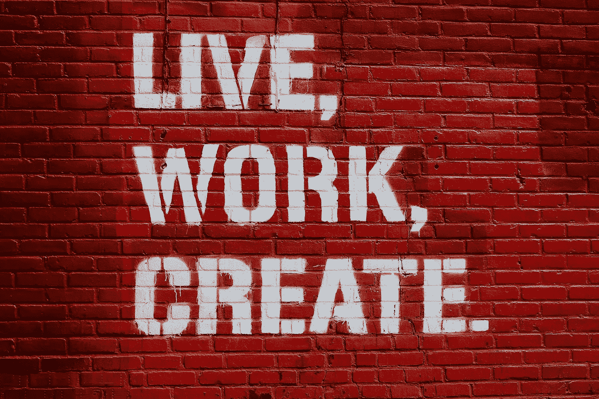

# 为什么我认为软件可以改变你的生活

> 原文：<https://medium.datadriveninvestor.com/why-i-do-think-notion-software-can-change-your-life-3f09f22af91b?source=collection_archive---------0----------------------->

## 我对我的工作效率如何提高感到非常兴奋！

Photo by [🇨🇭 Claudio Schwarz | @purzlbaum](https://unsplash.com/@purzlbaum?utm_source=unsplash&utm_medium=referral&utm_content=creditCopyText) on [Unsplash](https://unsplash.com/s/photos/lego-bricks?utm_source=unsplash&utm_medium=referral&utm_content=creditCopyText)

> 重要建议:这里没有任何联盟营销链接，我也没有从我在这篇文章中提到的公司或个人那里收到任何东西。

# 这周我顿悟了。

我将与你分享它，以防它可能帮助你。

我不想显得那么玄学，我会称之为人生的拐点。我可以预见，从现在开始，这一周将是我生命中的决定性的一段时间。

上周，我写了一篇关于 Roam Research 的文章，这是一款随处可见的笔记软件。

很长一段时间，我对我的生产力系统和我用来设定目标和(尝试)实现目标的软件感到不舒服。

**现在，我有所有这些软件的组合:**

## 由于

作为我不想忘记的简单事情的快速提醒。

> 我不得不说这个软件令人印象深刻，因为它的简单，因为它有一个我喜欢的功能。

每当你创建一个提醒时，软件就会开始提醒你，直到你将其标记为完成(或者你扔掉了你的 iWatch、iPhone、iPad 或电脑……我不会说 Mac，尽管它就是这样……)。

此警报在您之前设置的时间间隔内重复。

## 全聚焦

作为一个苹果极客，我终于有了这个软件。

25 年多来，我尝试过各种任务管理软件。

在过去的几年里，我和 Todoist，Things 和 2Do 一起工作。

> 我不得不说我对 2Do 感到很舒服。

我喜欢软件足够开放，可以根据我的过程进行配置，而不是你必须适应你的方法的更静态的软件。

2Do 有一个奇妙的数据库模型，它允许你用许多不同的方式来组织它。

我真的很喜欢 2Do，它甚至为我工作了好几年。

我最终选择了 Omnifocus，因为我开始观看视频，阅读大量关于这个“经典”解决方案的文章(甚至书籍)。

正如你可能知道的，这不是一个“开放的系统”，但有一样东西总是让我对 2Do 感到不舒服:它的图形用户界面。

> 我喜欢开发具有漂亮用户界面的应用程序。

也许这听起来很愚蠢，但是当我投入这么多时间，持续工作，使用一个应用程序时，我需要一个干净、漂亮、实用、舒适的图形用户界面…我看到它会马上说:

> “哇，我想在那个环境下工作”

> 这就是为什么我承认我是一个“苹果信徒”，尽管我被它的硬件环境绑架了。斯德哥尔摩综合症是你不相信的东西，直到你开始生活在它上面。

 [## 软件工程就是分享|数据驱动的投资者

### 当我开始我作为软件工程师的第一份工作时，我从来没有意识到我对技术的世界观有多么狭隘…

www.datadriveninvestor.com](https://www.datadriveninvestor.com/2020/09/11/software-engineering-is-all-about-sharing/) 

我说这些是因为 2Do 图形用户界面有点像“回到未来”，一个我从未感到舒适的环境，但我打赌它是因为它的功能性(有时你必须牺牲设计和舒适的感觉，因为实用主义原则)。

我只是说他的桌面应用程序，因为如果你尝试它的移动应用程序，在我看来，体验甚至更差。

> Omnifocus 虽然没有 2Do 开放，但也是另一个层次。

这是一个非常严肃的软件:重要、可靠，是其领域的经典，有很多年的历史、用户和文档。

我和一些很棒的人订婚了，他们创造了非常有趣的流程。

我不得不承认它的图形用户界面非常适合我，不管我是在 iPad、iPhone、iWatch 还是 Mac 上使用它。

# 事实上，在过去的几年里，它一直是我最重要的生产力软件。

## 空想的

我在个人生活和工作中都会使用 Gmail。

我一直很喜欢谷歌，尽管它的设计总是把功能放在设计之前。我不得不承认，他们在谈论这个功能时有了一点改进。

无论如何，我需要将几个 Gmail 帐户合并到一个独特的日历中，在一个更“漂亮”的图形用户界面中查看所有内容。

> 我赌幻想。

我不仅为我的事件使用 Fantastical，还作为任务管理器实现了一个时间阻塞管理系统。

我非常相信这种方法，因为当你考虑任务管理时，你并不真的必须管理你的任务。

> 你需要管理你的时间，以及你要花多长时间来完成这些任务。

这就是为什么时间阻塞方法完全适合我，我强烈推荐给任何需要管理数百项任务的人，因为这是我的情况。

## 草稿

# 作为一个无纸化十几年的家伙，我爱这个应用程序快速进入。

它很棒，因为你一打开它，就会出现一个空白屏幕，你可以直接在上面写下你的想法，你的灵感，一些你无法忘记的东西…

对我来说，它就像一个巨大的桶，可以吃掉你扔进去的任何东西。

稍后，我处理它并在系统中创建我需要的项目。顺便说一下，它的 iWatch 应用程序允许我在旅途中口述东西。

## Evernote

我的一个亲人。

> 这个软件改变了我的生活。

它让我变得无纸化，这是我永远感激的事情。

> 无纸化办公是我经历过的最有成效的特征之一。它给我安全感、安心、省时、有条理、清晰……

我可以整天列举关于无纸运动的美丽词汇，我是一个盲目的信徒。

## 戴安

日记的经典。

优秀的图形用户界面和惊人的功能。句号。

祝贺这些人，因为他们做到了！

## 尤利塞斯探测器

和戴安一样，我也得出同样的结论。这些人太棒了。

> 他们有一些我一直认为令人印象深刻的东西，一个美丽的应用程序之间的完美结合和平衡，谈论它的图形用户界面，以及你如何在应用程序内工作。

一切都很简单，直观，充满常识。

作为一名计算机科学工程师，我完全知道做到这一点有多难。所以，为你们的产品感到骄傲吧，伙计们！

## 特雷罗

> 在我的生活中，有些项目或时刻看板是必不可少的。

我喜欢从图形的角度看问题(我喜欢 MindNode 这样的思维导图应用程序)，Trello 给了我这一点。完美看到一个状态系列的机会。

> 我并不是在所有的项目中都需要它，但在一些项目中，这是必须的。

或多或少，这是我创建的数字生态系统，用来管理我的生活，包括个人生活和职业生活。这听起来有点复杂，但这是我生命中很长一段时间都在做的事情，而且很有效。

但是，正如我在文章开头所说的，在过去的几年里，我一直感到不舒服，主要是因为，随着我的数据量增加，这个系统不那么有效了。

**我需要一个系统，其中:**

1.  **我可以将我的高层次目标与我的日常任务联系起来**，能够鸟瞰我的整个系统，还能看到每个任务的“微观”细节。能够知道你每天所做的事情正在推动你朝着人生的大目标前进，这是一种很棒的感觉。你不这么认为吗？
2.  **我能捕捉和组织我接触到的所有知识。**我读了成吨的书，成吨的文章，我听播客，我和人进行有趣的对话，我看 YouTube 视频，我有快速的思考，我有深度的思考，我看电影……各种数据，随时随地。
3.  我能回忆起所有我收集和组织的知识，每天使用它们，以这些知识作为我行动的基础。

> 我知道我要求的很多，但这就是生活的全部:要求很多，然后看看你得到了什么。

回到本文开头，当我上周调查 Roam Research 时，另一个名字开始频繁出现:**概念**。

我很久以前就听说过这个概念，三四年前。在那一刻，我把这个应用程序放到了笔记区，由于我对 Evernote 的使用非常满意，所以我忽略了它，直到这个星期。

> 我发现有两个人可以归类为观念的大师:玛丽·普林和奥古斯特·布拉德利。

他们都在观念上创造了显著的发展。

我访问了玛丽·普林的网站，发现她的系统基于 T2 的 PARA 方法论。我将写一篇关于这种 PARA 方法论的文章，这是一个由生产率大师[蒂亚戈·福特](https://medium.com/@fortelabs)创造的系统，我很钦佩他并追随他，因为我认为这是一个迷人的话题。

Marie 有一门付费课程，将 PARA 方法应用到 idea 中。似乎不可思议，但是…

…当我访问 [August 的 YouTube 频道](https://www.youtube.com/channel/UCfqj2oq6LVmR3ybC2nfjqKg)并观看他的第一个视频时，我震惊了！

> 我总是说，我们必须为好的内容付费，这样内容生产者才能生存(在许多情况下生存)并改善他们的内容。

事实上，我全年都在课程、时事通讯和付费内容上花了很多钱。

> 但是，在这个初始点，在付费课程(600 美元)和震惊 August 的免费视频之间做出决定，我打赌是后者(我很抱歉，Marie，因为你的内容和作品太棒了！).

我从周二开始看奥古斯特的观念系列视频，昨天晚上，也就是周四，我看完了所有的视频。

我说的是 **38 个视频之间的 15'-30 '持续时间每**。我不会告诉你我这个星期睡了什么…但是这个家伙太棒了！

> 我作为网飞系列订婚了。我只是无法停止观看一个又一个视频。

很快奥古斯特将推出一个基于这个视频系列的课程，老实说，我不知道这个人会在里面展示什么。我给他写了一封电子邮件，但他仍然没有回复。

**在这些视频中，这位天才给了我前面 3 点的解决方案。厉害！**

现在我知道概念是怎么回事了，远远不只是在这个话题上做笔记。这就更进一步了！

**concept 使得无需一段代码就能创建自己的系统成为可能。**

> 这让我想起了(小心，这只是一个简单的对比)80 年代和 90 年代我用 Dbase 软件创建迷你 ERP 的时候。

**观念是基于两个“愚蠢”的词:**

1.  **页面:**显示信息的地方。
2.  **块:**页面的每一部分。

就这么简单。

关键是，块可以是任何东西:从一个简单的带有字母的文本框到一个巨大的关系数据库。

> 亲爱的朋友们，我对此感到震惊。这对我来说是一个发现，我不知道我以前是怎么忽视这家公司的。生活中发生的事情…

现在，根据奥古斯特的明智建议，这是基于一个令人难以置信的(对我来说非常可靠的)方法，称为 PPV(支柱、管道和拱顶)，我会写一篇文章，每当我更习惯它时，我可以将我所有的系统转移到概念，集中我所有的知识，并能够用一个系统管理我的生活。

> 可怕的时刻:把我的生命交给一个软件？

我把生命献给了伟大的玩家(亚马逊、谷歌和苹果)，但是……观念？

我尊重并钦佩概念项目，但它是一家成立于 2016 年的公司。总之，去年 4 月 1 日，[它从 Index Ventures 和其他投资者那里筹集了 5000 万美元。**上一次 1000 万美元的融资使他们的估值达到 8 亿美元。**](https://techcrunch.com/2020/04/01/notion-hits-2-billion-valuation-in-new-raise/?guce%5C_referrer=aHR0cHM6Ly93d3cuZ29vZ2xlLmNvbS8&guce%5C_referrer%5C_sig=AQAAABHdg6fOCvyorFCHoC188lGpLfdPfCh2bH5%5C_iBk61KTwzH1F5HEjfsW9-gbxZlkSbh8UJFFu9Mewvr-Shli2aE9eGvhaslRqcpVWqVy5RzvRaBhiDIvPnYXwdP9zYatkhZBk-5tyPc7vOj2X2MsgoiNUAmCVAQczee-UUf2aWppG&guccounter=2)

人生很多时候是有风险的。

> 作为 2002 年以来的一名企业家，我明白了生活并不总是非黑即白。它充满了细小的灰色细线，有时你不得不相信它们。除此之外别无他法。

我认为 concept 是一个很棒的平台，它允许用户不用编码、使用大量模板来创建他们的软件，并且有可能不根据固定软件告诉你的来调整你的过程。

在测试了这么多系统后，我相信这是我的方式，我会努力的。

如果观念消失了，我希望能够将我的数据库导出到一个 CSV 文件中，并导入到我可能找到的任何其他系统中。

# 生活是一种冒险！生活是一场冒险！生活是有趣的！

## 获得专家观点— [订阅 DDI 英特尔](https://datadriveninvestor.com/ddi-intel)