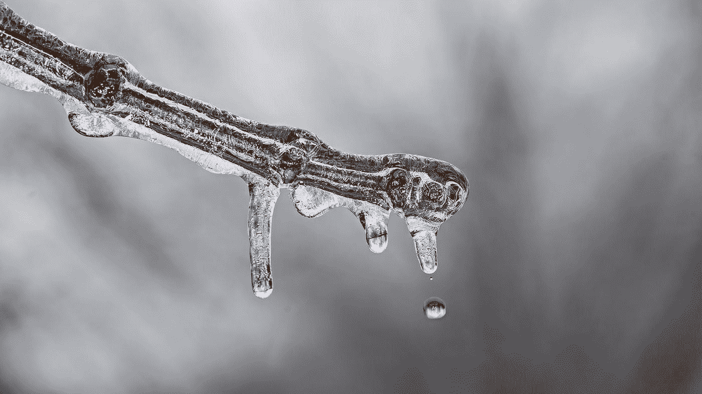

# 为什么我为特朗普的支持者感到难过

> 原文：<https://medium.datadriveninvestor.com/why-i-feel-sorry-for-trump-supporters-c772c09a3647?source=collection_archive---------4----------------------->

## 政治

## 他们似乎不明白特朗普并不关心他们

Photo by [Jorge Guillen](https://unsplash.com/@intellixis?utm_source=medium&utm_medium=referral) on [Unsplash](https://unsplash.com?utm_source=medium&utm_medium=referral)

我隔壁的联排别墅是租来的。房客的流动性很大，有好有坏。最新的房客是一个好人，他的女朋友周末会来看他。我们见面时互相寒暄。

几个月前，当他在家门口挂了一面特朗普旗，并在他的车和他女朋友的车上都贴了特朗普的保险杠贴纸时，我有点失望。

HOA 不允许政治标志。一定有人投诉了，因为他上周把旗子拿走了。保险杠贴纸仍然存在，所以他没有改变主意。

朋友问我是不是因为他是特朗普的支持者而生他的气。我的回答是不。我为他感到难过。和所有特朗普的支持者一样，他似乎没有意识到特朗普并不在乎他。

特朗普只关心亿万富翁和独裁者。他渴望成为那些精英群体中的一员。他尊敬他们，而不是瞧不起他的支持者。

我的邻居中没有亿万富翁，所以我知道特朗普不在乎我的邻居。

特朗普不关心他的支持者的事实令人震惊地清楚，昨晚他乘坐他漂亮、温暖、舒适的飞机离开了内布拉斯加州奥马哈的集会，而他身后的人群在严寒中花了几个小时试图乘坐交通堵塞的班车。

确切的数字因新闻来源而异，但许多人，包括老人和有孩子的家庭，因体温过低被送往地区医院。

特朗普一点也没露出来。在这个时间点上，我想没有人指望他会道歉。他从不为任何事道歉。但是你可能会想，如果他有一点人性的话，他会说什么把人留在寒冷的地方几个小时。

人群中没有亿万富翁或独裁者，所以他们不值得他注意。

我同情人群中的每一个人。他们愿意不顾寒冷支持他们的总统候选人。他们相信他。相信他想给他们最好的，他会解决他们生活中的任何问题，带领他们过上更好的生活，建设一个更好的国家。

他来了，做了演讲，然后离开了。他抛弃了他们。在内布拉斯加州的选票统计出来之前，他可能不会再去想他们。即使在那时，他所记得的那次集会是他在人群面前讲话有多冷。

我为特朗普的支持者感到难过。他们已经陷入了特朗普骗局。在 2016 年和现在的 2020 年，他站在他们面前，告诉他们他们想听的话。然后，就像他一生所做的那样，他离开，做他想做的事情。什么会对他有利。

真正可悲的是，这些被他利用和虐待的人会投他的票。他们被他的谎言蒙蔽了。被他的谎言和夸大迷住了。

当他拿走他们的健康保险时，他们会不再相信吗？他们的社会保障？他们的粮票？这就是消除他们的失明并最终看清他真实面目的代价吗？