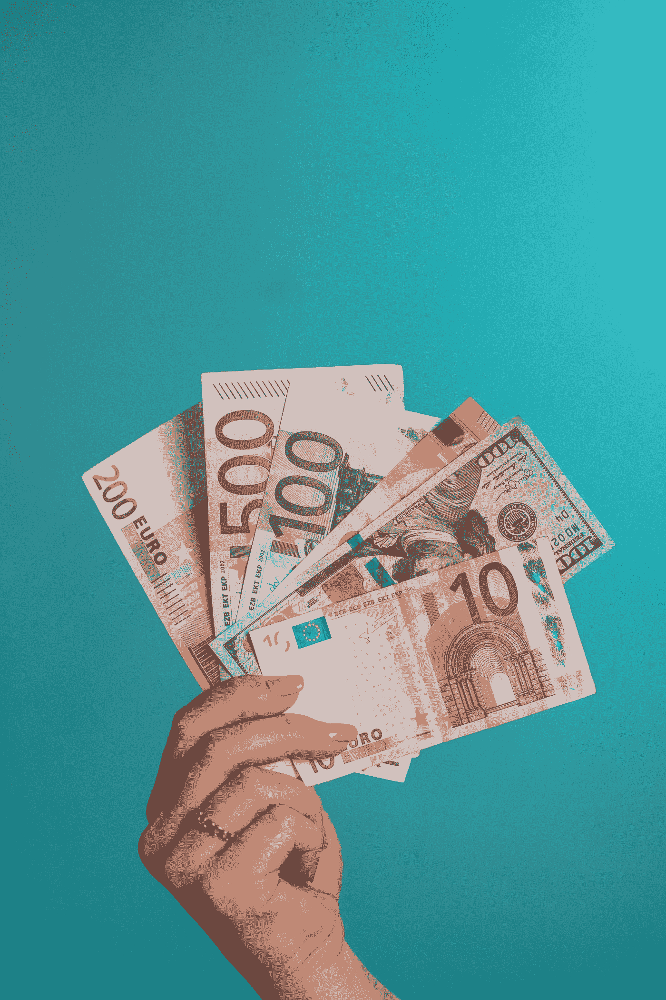
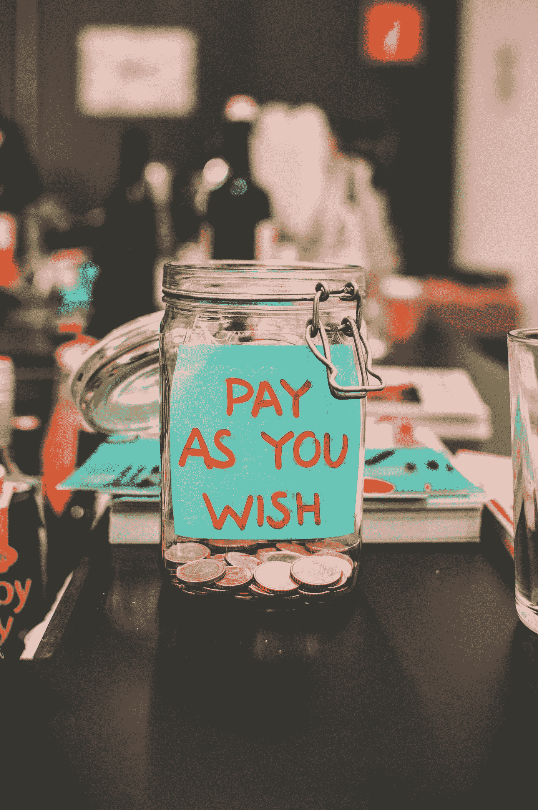

# 为什么我会爱上 Crypto？为什么你也应该？-第一部分

> 原文：<https://medium.datadriveninvestor.com/why-i-fell-in-love-with-crypto-and-why-you-should-too-part-1-b63d5028760c?source=collection_archive---------7----------------------->

Photo by [Icons8 team](https://unsplash.com/@icons8?utm_source=medium&utm_medium=referral) on [Unsplash](https://unsplash.com?utm_source=medium&utm_medium=referral)

今年对每个有这个小疫情的人来说都是过山车，你可能听说过它，叫做 Covid 19。对我个人来说，这一年不仅仅是过山车，而是加速的一年。

去年年底，我的生活转向了未知的领域。我抛弃了一切确定的东西。我离开了 6 年的感情和在科技行业的严肃管理生涯，买了一张去泰国的单程票。

三月初，当疫情开始在泰国兴风作浪时，我发现自己在一个热带岛屿上，这听起来像是一个度过禁闭的完美地方。实际上，是的。但是我担心的是其他事情。

住在一个岛上，大部分的食物供应和其他商品都来自大陆。这使得帕岸岛相对简单，也让我远离了不久前我所追求的资本主义生活。这个事实让我担心如果疫情严重袭击泰国会发生什么。那么食物将如何到达岛上？岛上的几台自动取款机会怎么样？生活在一个你甚至都不是公民的国家，在危机时刻，你总是被放在第二位，这绝对是其中之一。我没有泰国银行账户，也没有便捷的方式在需要的时候把钱取出来。

我和我在岛上的一个朋友谈过这个问题，他是一个密码爱好者，他给了我一个清晰的解决方案。在 2017 年之前，我被介绍到了密码行业。我对这项技术非常着迷，但对整个行业相当不情愿。我主要听说了骗局和 ico 是一种欺诈。我听说有人在价格下跌前入市，导致他们失去存款。所以我有意识地决定远离炒作。

我告诉他所有这些，但他是那些原教旨主义者之一。然后他告诉我，加密不仅是我的问题的解决方案，也是我们面临的经济危机的解决方案。我们多么需要一个模式的转变，我们的钱每天都被我们的政府和银行偷走。他下定决心要说服我，对此我非常感激。

这是我爱情故事的开始

加密货币处于经济学、计算机科学、政治学和数学的交汇点。作为一名软件工程师，我的数学和计算机知识以及所有那些无聊的东西足以让我理解技术部分，但我还没有全面的了解。像每一段爱情一样，你从表面的爱开始，探索表面，但如果你看到了一些火花，这就是你真正想深入的地方。

点燃我的火花的是我在网上找到的一篇文章，声称我们知道所有东西的价格，但我们不知道任何东西的价值。而我们最高估的东西就是钱的价值。我觉得这很傲慢，但也很有趣。为了解释这一点，我将带你一起踏上货币历史的旅程。我保证在这篇文章结束的时候，你也会坠入爱河。

在货币被创造出来之前，交换价值的方式是使用商品。如果你有一个养羊场，但你想做一道海鲜大餐，你必须去渔民那里买三条鱼、一袋鱿鱼和一些牡蛎。你必须带一些羊，用一两只羊来支付你美味海鲜的价格。这种易货方法有几个问题:

1.  这些羊实在放不进你的钱包，所以无论你去哪里，你都必须带着一群羊。
2.  你不得不希望渔夫需要你的羊，但是如果渔夫实际上是素食主义者呢？
3.  你想得到的海鲜的价值至少应该是一只羊，因为你不能用半只或四分之一只羊来支付。
4.  说起来很难过，但总有一天羊会死，你会失去购买力。
5.  小羊比大羊值钱，肥羊比瘦羊好。考虑到所有这些特征，今天的 stripe“square”paypal 世界将变得更加复杂。

Photo by [Dibya Jyoti Ghosh](https://unsplash.com/@dj_ghosh?utm_source=medium&utm_medium=referral) on [Unsplash](https://unsplash.com?utm_source=medium&utm_medium=referral)

所以我们必须找到一种不同的支付方式。这种新的支付媒介必须是:

1.  交换的媒介
2.  轻便的
3.  持久耐用
4.  可分割——我可以用半只羊或四分之一只羊付款
5.  记算单位
6.  可替换的—一个单元与下一个单元相同(我的羊与邻居的羊价值相同)
7.  价值储存库(Store of value)——我拥有的羊在几年后也会有同样的价值。

历史上有不同的交换媒介试图满足这些要求，如盐(这就是薪水一词的来源)和贝壳，但它们缺少一件事——它们不是价值储存手段。要进入这一类别，随着时间的推移，所获得的物品应该价值相同或更高。这通常适用于相对罕见的项目，还有什么比超新星核合成和中子星碰撞产生的物质更罕见呢？

然后在历史上的某个时候，我们开始使用金币。正是在世界上第一个民主国家雅典，黄金开始流行起来。贵金属仍然是完美的价值储存手段，在过去的 5000 年里，只有黄金和白银保持着购买力。

**但当一项资产如此稳定和有价值时，贪婪就会产生。**

雅典和斯巴达发生了战争。在城外作战的雅典士兵会得到金币。雅典城里的金币变少了，因为大部分的金币都被用来支付士兵的军饷。这意味着市民购买力下降，所以价格必须下降。但对雅典人来说更痛苦的是他们没有足够的钱来维持战争。

所以他们想出了一个“绝妙”的主意。既然黄金可以稀释硬币，为什么还要单独用黄金制作呢？所以他们开始了一个叫做货币贬值的过程。把他们从税收中得到的钱加入等量的铜中。结果是他们拥有的货币数量翻了一番。把 1000 枚金币和 1000 枚铜币混合在一起，就产生了 2000 枚混合币，现在它们的价值降低了——这就是所谓的赤字支出。

当一种货币贬值，并因此失去其价值时，公民迟早会明白，并开始要求他们出售的商品价格更高或他们的工作工资更高。这导致价格最终上涨，因为有同样数量的商品和服务，但有更多的货币流通。雅典人将他们的硬币与铜混合，直到只有铜，这导致了世界上第一次恶性通货膨胀。

历史肯定会重演。世界上大多数的货币曾经都是由黄金支持的。在过去，你口袋里的钞票只是一张收据，代表你在银行里的黄金。例如，在 20 美元的钞票上，写着“20 美元的金币，持票人见票即付”。所以你可以去你的银行，给他们你的钱的收据，你就会得到黄金-你真正的钱。

# 第一个骗局

在第二次世界大战期间，为了补贴战争，欧洲各国开始印制比实际数量更多的黄金收据。那么这些货币就不能兑换成黄金了。1923 年，德国发生了恶性通货膨胀，导致一条面包在 1 月份的价格为 250 马克，到 11 月份的价格为 2000 亿马克。**到 1923 年秋，印制一张纸币的成本超过了纸币的价值。**

在两次战争之间，他们进行了一种叫做金本位制的交易，在这种交易中，货币部分由黄金支持，准备金率为 40%。在美国，这意味着一张 50 美元的钞票突然只得到价值 20 美元的黄金支持。同样，流通中的美钞比黄金的实际价值要多。

**当更多的钱被印出时，这可能会对其价值产生负面影响，因为有更多的货币供应**

Photo by [Omid Armin](https://unsplash.com/@omidarmin?utm_source=medium&utm_medium=referral) on [Unsplash](https://unsplash.com?utm_source=medium&utm_medium=referral)

# 第二个骗局

1929 年美国经济大萧条后，大量黄金开始流出美联储银行的金库。这是因为在金融危机中，大多数人、公司和政府更喜欢实物资产，而不是银行存款或纸币，后者可能会突然贬值。不想让美元贬值的政府不得不收回私人手中的黄金，并禁止财政部用美元兑换黄金。

该命令要求所有的人、企业和银行向美联储交付他们的黄金和黄金证书，以换取 20.67 美元。这导致黄金价格上涨至近 35 美元。想象一下，现在你拥有一处房产，政府要求你的房产以特定价格出售，并从价格上涨中受益，允许你以更高的价格回购。通过这样做，财政部的黄金持有量增加了 28.1 亿美元。不到 100 年前。对于一个“自由”市场来说，这又如何呢？

# 第三个骗局

第二次世界大战后，一切都变了。在这两次战争中，美国直到很晚才参与其中。当所有其他国家将其经济转变为基于战争的经济时，他们的商品必须从美国进口。欧洲国家用他们的黄金支付给美国。战争结束时，世界上 2/3 的黄金掌握在美国手中。

世界货币体系即将崩溃。为了挽救这种局面，1944 年，一种被称为布雷顿森林体系的新货币体系被宣布成立，在这种体系中，每种货币都与美元挂钩，美元由每盎司 35 美元的黄金支撑。这是一个稳定经济的承诺，因为汇率是固定的。只有一个问题，准备金率不固定。

60 年代末，美国的经济和政治处境非常艰难。他们的经济疲软，越战的账单越来越多，由于新的福利计划，每年的支出负担显著增加，所以他们**再次**开始印刷没有黄金支持的货币。

法国总统查尔斯·德·戈尔意识到美国没有足够的黄金来支撑所有流通的美元。然后所有其他国家开始要求用他们的黄金来换取他们的美元，但是黄金的收入还是比黄金本身多。**这个比率大约是现存黄金的 12 倍。**

Photo by [Aneta Pawlik](https://unsplash.com/@anetakpawlik?utm_source=medium&utm_medium=referral) on [Unsplash](https://unsplash.com?utm_source=medium&utm_medium=referral)

# 第四个骗局

我们不得不再次脱离当前的货币体系，以避免一场重大危机。尼克松在 1973 年做出的被称为“尼克松冲击”的决定几乎解散了布雷顿森林协定，并允许美国随心所欲地印刷自己的法定货币，这是一种政府发行的货币，没有黄金等实物商品的支持。然后奇迹发生了，在 1973 年所有的货币都变成了法定货币。这是历史上的一个关键时刻，因为从那时起，政府就可以随心所欲地创造货币。我们从拥有一种具有真实价值的资产作为我们的货币，到仅仅拥有纸币，再到后来的数字和账户。

货币必须有支撑。以前是金的。现在，货币是由人民的信仰支撑的。**信仰赋予货币价值**。我们相信今天我们口袋里的钞票明天可以买到同样的东西。

Photo by [Jp Valery](https://unsplash.com/@jpvalery?utm_source=medium&utm_medium=referral) on [Unsplash](https://unsplash.com?utm_source=medium&utm_medium=referral)

# 第五个骗局

当你把钱存入银行时，你实际上并没有把它存入一个为你安全保管的账户。你基本上是在借钱给银行。银行被要求保留一定数量的存款人给他们的现金。如果你在账户上存 100 美元，银行不能贷出全部金额。银行也不需要保留全部现金。大多数银行被要求保留 10%的存款。这被称为部分准备金贷款。

让我们看看下面的例子

*   当你把 100 美元存入银行时，银行会在你的账户上保留 10 美元，并贷出 90 美元。
*   现在我去你的银行借那 90 美元。你的银行的资产负债表上会有 190 美元的资产，因为你仍然拥有 100 美元，而我从你的银行借了 90 美元
*   然后我把那 90 美元存入我的银行账户。我的银行将保留 9 美元，但可以贷出 81 美元。所以现在我的银行资产负债表上有 171 美元。

这个过程一直在重复着凭空创造金钱。货币被重新储蓄和借贷，一直在创造银行信贷。100 美元的初始存款最终会产生 1000 美元。这有 3 个主要结论:

1.  我们认为存在银行里的钱并不真的存在那里
2.  货币是由银行凭空创造出来的
3.  如果超过 10%的银行客户同时提取资金，银行将没有足够的资金支付他们。

# 第六个骗局

每当美国政府的支出超过其通过创收活动获得的收入时，就会产生预算赤字。然后，它创造国债产品，通过向投资者借款来为赤字融资，并在未来支付利息。所有预算赤字的总和就是国债的价值。

借我们孩子将来要还的钱不一定是坏事。把它想象成一家公司，它借钱是为了建立一个更好的业务，在将来当它足够富裕和成功时，偿还这笔债务。

由于我们将债务推给下一代，每一代人都必须变得更强大、更富有，才能还清上一代人的债务和利息。这是迄今为止的情况。然而，婴儿潮一代(二战后出生的人)的老龄化，以及预期寿命的增加，推动了全球老年人数量的增加。那么，当千禧一代不得不偿还实际上比他们多的一代人的债务时，会发生什么？

如果政府正在处理国家债务问题，这就不是问题了。因为创造债务会创造更多的货币(我们在第五个骗局中学到了)，停止创造债务就会停止创造货币。流通中的货币减少会导致严重的通货紧缩。美国总统限于连任两届，任期四年。这使得将债务问题推给下一任总统处理变得相当容易，毕竟，没有人希望在他的监管下处理金融危机。

# 第七个骗局

新冠肺炎疫情有望很快结束，但我们会在它消失后很久才感受到它的影响。中央银行正在印刷钞票来创造刺激方案。但是钱不会长在树上，那么它从哪里来呢？

Photo by [Micheile Henderson](https://unsplash.com/@micheile?utm_source=medium&utm_medium=referral) on [Unsplash](https://unsplash.com?utm_source=medium&utm_medium=referral)

这笔钱来自我们的未来。从我们的养老金，我们的财富，从下一代的财富，等等。

美国政府经常入不敷出，每年增加数十亿甚至一万亿的国债。美国保住了世界最大经济体的地位，这使得其国债成为一个全球性的经济问题。

疫情导致了大规模通货膨胀的货币政策和货币供应的积极扩张，同时由于封锁造成的供应冲击，诸如主食等某些关键领域的价格持续上涨。

然而，金融危机的发生并不仅仅是印钞的结果。由于货币没有任何东西支持，它们的价值来自于我们的信念，即明天它们会同样值钱。当人们不再相信一种货币时，这种情况发生在政治局势不稳定的时候(即公民不确定他们的政府是否有能力照顾他们)，这就是事情真正变得混乱的时候。

**我真诚地认为，如果你关心自己的未来，你需要了解自己的财务状况。金融机构和政府很难理解所有这些花哨的政策，这是有原因的。由于货币体系的复杂性，我们认为这是理所当然的，允许那些金融机构在我们眼皮底下实施欺诈。**

我们所处的金融泥淖导致了社会的不平等和混乱。泥沼如此之深，我们需要一个根本性的改变和范式的转变。对我来说，意识到这一切是令人震惊和恐惧的，我希望这篇文章也能引发你的好奇心。

那么，为什么我认为密码就是答案呢？跟随我系列的下一篇文章去真正地坠入爱河。