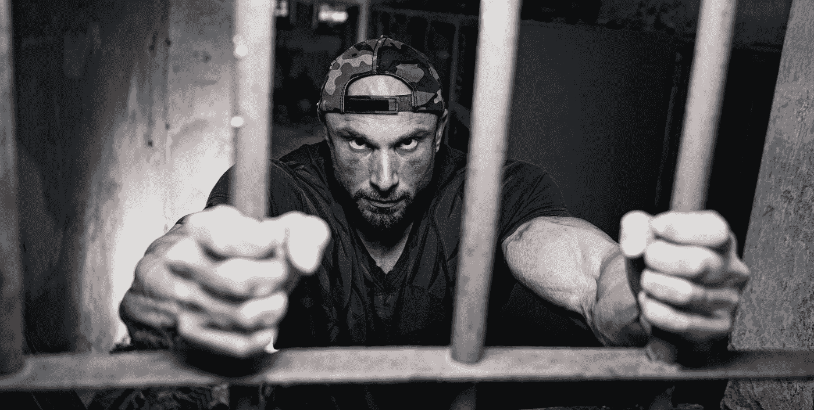

# 为什么我会爱上 Crypto，为什么你也会爱上她？-第二部分

> 原文：<https://medium.datadriveninvestor.com/why-i-fell-in-love-with-crypto-and-why-you-should-too-part-2-5d93f9d9eff4?source=collection_archive---------17----------------------->

如果你读过我之前的文章([如果没有，现在就去做吧！我在谈论世界金融的未来，这掌握在政府和中央银行手中，他们已经失控了。货币被大量印刷，导致我们辛辛苦苦挣来的钱贬值。我们的购买力下降是因为当前的货币政策，这只是一个“疯狂印钞”的花哨术语](https://medium.com/datadriveninvestor/why-i-fell-in-love-with-crypto-and-why-you-should-too-part-1-b63d5028760c)

# 为什么加密货币会有所不同？

加密货币是基于区块链技术的数字资产。区块链是一种分散的、分布式对等网络。这听起来像火箭科学，但实际上很简单。我们将研究每种希望将其定义为加密货币的资产的基本原理。当我解释这个将会改变你的世界的事情的时候，请跟我说实话。

Photo by [CHUTTERSNAP](https://unsplash.com/@chuttersnap?utm_source=medium&utm_medium=referral) on [Unsplash](https://unsplash.com?utm_source=medium&utm_medium=referral)

# **去中心化——杀死中间人**

在我们杀死它之前，我们首先需要明白为什么我们需要它。在每个网络或系统的第一阶段，都有混乱。在现有的司法系统中，没有法院、法官和陪审团之前，正义是如何实现的？在一个没有政客的民主社会里，决策是如何达成的？在银行存在之前，钱是如何处理的？我们不得不自己处理这些事情，这导致了一个大混乱。然后，在某个时候，我们开始授权。我们把这些任务委托给一个中间人来做决定，做出裁决，而**代表我们最大的利益。**

然后这个人获得控制权，他负责决策，每个人都很高兴，事情进行得很好。但是在某个时间点，这个中间人有太多的控制权和太多的权力，这就导致了腐败(即中央银行、政治家等等)。

举例来说，如果你认为这篇文章很棒，作为一种赞赏，你可以转一些钱到我的银行账户。幕后发生的过程不是你直接交易给我，也不是你的银行账户直接交易给我(假设我们的银行账户在不同的银行)。你的银行会向中央银行或另一个第三方发出请求，这个中央银行会向我的银行发出请求。

这使得央行成为一个单一的失败点。如果央行服务器瘫痪，会发生什么？如果世行决定禁止特定国家参与这些行动，会发生什么？或者你不能交易超过 100 美元？还是根本无法交易？纵观全球金融危机，这些情景并非遥不可及。

# **分布式——不受任何人控制**

把区块链想象成一个分类账数据库。顾名思义，这种分类账是一组块。一个区块就是一组交易，我们可以把它想象成分类账中的一页。

许多当事人持有分类账的副本。因此，没有一个权力机构可以拿走你的资产或改变“历史”来满足他们的需要。这是一个不变的审计线索，你不需要相信任何人是事实的来源。这些数字文件记录了加密货币网络上的每一笔交易，可供所有用户和公众查阅。

通过将交易记录分布在网络的节点中，只有在整个网络都同意该交易的情况下，新的交易才能被添加到那些分类帐中。**没有人控制网络，但网络是由自己的用户控制的。**人们不能突然改变规则，说“周日，我们不批准名字以 D 开头的客户通过 10K 进行交易”，因为这需要网络同意。

所以你能从一张假想的资产负债表上转移一百万美元吗？这就是矿工发挥作用的地方，他们验证并组织新的区块，作为回报，获得奖励。不同的挖掘者每次都要验证事务，这支持了去中心化方面。

# 透明但私密

消费者的身份是匿名的，就像他们希望的那样。公共分类帐只包含用于每笔交易的发送方和接收方的被称为加密货币公钥的加密数字。

例如，由于比特币区块链的去中心化性质，所有交易都可以通过个人节点或使用允许任何人查看网络交易的[区块链探索者](https://www.blockchain.com/explorer?utm_campaign=dcomnav_explorer)来透明查看。这意味着，如果你愿意，你可以追踪比特币的去向。

所有比特币都是可追踪的，但如果是匿名购买的，就不可能确定谁拥有比特币的所有权。如果比特币是在 KYC 交易所购买的，那么比特币就直接绑定在 KYC 交易所账户的持有者身上。

2008 年事件之所以能够发生，很大程度上是因为大型银行的财务状况缺乏透明度，以及公众对这些银行的无限信任。当然，尽管 2008 年危机可能挑战了社会对主要金融机构的信任，但总体而言，信任感仍然很高。然而，透明度仍然是一个主要问题。

这就是区块链技术可以帮助防止类似 2008 年危机的地方。如果每一项资产的价值和所有权都被安全地记录在一个完全透明且不可改变的共享账本中，那么让金融机构得以隐藏其斗争的腐败行为将不复存在。

Photo by [Jason Pofahl](https://unsplash.com/@jasonpofahlphotography?utm_source=medium&utm_medium=referral) on [Unsplash](https://unsplash.com?utm_source=medium&utm_medium=referral)

# 受控供应

没有人可以改变加密货币的预定和公开发布的流通时间表。政府不能凭空任意创造更多的加密货币，并像他们拥有美元一样将其贬值。加密货币与用于支持货币的贵金属具有相同的特征，它们很难开采，并且供应有限。因此，银行家们无法通过通货膨胀卷走你的财富。

法定货币的一个问题是中央银行可以在他们觉得有需要的时候印更多的钱。无论原因是启动经济还是帮助偿还国债，人为增加货币供应都会通过压低货币的整体价值来制造通胀。例如，比特币不受通货膨胀的影响，因为比特币的上限是 2100 万个硬币。

虽然比特币和黄金目前是通货膨胀的货币，但根据通货膨胀的传统定义，它们的通货膨胀率是可以预测的，并且不断降低。与黄金类似，比特币的年通胀率最终将达到零。

例如，委内瑞拉的恶性通货膨胀有望在年底达到 100 多万。委内瑞拉对比特币的使用正在急剧增加。这不应该让人感到意外。在崩溃的委内瑞拉，支付任何款项都极其困难。现金稀缺，传统支付网络超负荷运转，以至于在委内瑞拉向出租车司机支付相当于 4 美元的费用通常需要几个小时(运气好的话)。因此，越来越多的商家，从杂货店到餐馆和公用事业商店，都接受各种加密货币作为支付方式。

 [## 出土加密宝石蓄势待发|数据驱动的投资者

### 你并不总是有第二次早期发现的机会。无论是股票，加密货币，还是收藏…

www.datadriveninvestor.com](https://www.datadriveninvestor.com/2020/12/17/unearthed-crypto-gem-poised-for-resurgence/) 

# 无限交易——解决不平等

加密货币可以通过互联网即时发送给任何人，任何地方，任何时间，任何金额，费用非常低。你不需要依赖金融机构的善意来批准你的交易。

据估计，全世界有 20 亿人没有银行账户，他们只能用现金进行交易，这种交易只能在当地进行，或者交易金额相对较小。比特币使没有银行账户的人能够参与接受比特币的全球市场。比特币提供了一个稳定的银行系统，这个系统非常强大，每个人都可以使用。

[《非洲银行业》](https://youtu.be/_VT_zpHQzBE)是一部记录片，记录了比特币先驱的旅程，因为非洲大陆寻求利用加密货币来增加他们从令他们失望的银行系统中独立出来的能力。我强烈建议观看它，以真正了解发展中国家的银行不开放问题有多严重。

Photo by [Pawan Sharma](https://unsplash.com/@pawan9472?utm_source=medium&utm_medium=referral) on [Unsplash](https://unsplash.com?utm_source=medium&utm_medium=referral)

# **归社区所有**

如果我们以矿工为例，任何人都可以成为矿工。挖掘是验证交易的行为，同时获得奖励，因为挖掘的行为创造了新的硬币，我们称之为挖掘。

目前使用的采矿协议的常见类型是工作证明和利益证明。挖掘协议是网络选择一个矿工来验证交易并作为结果接收奖励的方式。举例来说，为了证明赌注，你赌你的硬币有可能被分配一个验证区块的机会——这个概率基于押的加密货币的数量。你不需要银行牌照或监管程序来积极参与网络并获得收益(尽管采矿存在成本障碍)。

另一个公共方面是开源代码。这意味着每个开发人员都可以阅读代码，并对网络同意的更改做出贡献，同样没有小写字母，只需阅读代码行，您就理解了游戏规则。

所有记录都是公开的。所有技术规范、白皮书和源代码文件都公开发布，供公众查看。问问美联储，他们为什么竭尽全力抵制公共审计？更不用说任何透明度了。

# 自由是真实的

《科罗纳·疫情》不仅展示了人性是多么脆弱，也强调了政府可以多么轻易地剥夺我们的自由，并以他们认为合理的任何理由来孤立我们。

我真的相信，这只是政府控制人口的方式需要改变的第一个迹象。金融体系只是需要被颠覆的领域之一。我们看到，当美元贬值时，推动全球大多数金融体系的美国经济急剧失去动力。

我认为，作为一个全球社会，我们把太多的信任放在了那些像大多数其他人一样，并不真正了解自己行为结果的人手中。然而，通过联合起来，创建一个基于社区的金融系统，我们都可以扮演我们想要的角色，并拥有平等的机会，这真的可以改变世界。

Photo by [Damir Spanic](https://unsplash.com/@spanic?utm_source=medium&utm_medium=referral) on [Unsplash](https://unsplash.com?utm_source=medium&utm_medium=referral)

# 还不算太晚吗？

对于所有问我的人，现在是真正进入比特币的时候了吗？价格已经上涨了这么多，我会说，加密货币和去中心化经济的长期愿景只是处于第一阶段。我个人看到了宏观的视角，看到了一个去中心化的系统可以发展到多大，因为它的无边界和无权限的本质。更详细的答案，[请在 medium](https://danielleshaul.medium.com/) 上关注我，阅读我下一篇关于我在加密货币领域的游戏的帖子。

## 获得专家观点— [订阅 DDI 英特尔](https://datadriveninvestor.com/ddi-intel)