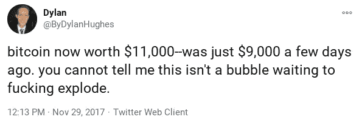

# 为什么我最终投资了比特币

> 原文：<https://medium.datadriveninvestor.com/why-i-finally-invested-in-bitcoin-ea832d210d50?source=collection_archive---------41----------------------->

## 并在两周内获得了 40%的回报

Photo by [André François McKenzie](https://unsplash.com/@silverhousehd?utm_source=unsplash&utm_medium=referral&utm_content=creditCopyText) on [Unsplash](https://unsplash.com/s/photos/bitcoin?utm_source=unsplash&utm_medium=referral&utm_content=creditCopyText)

我曾经是一个臭名昭著的比特币憎恨者。嗯，不是臭名昭著。没人知道我是谁。但几年前，我确实认为比特币(及其投资者)是愚蠢的。

为 2017 年的迪伦说句公道话，比特币是一个泡沫，在那条推文发布几周后就破裂了。比特币最高价为 19260 美元，下跌了一年，最低时为 3199 美元。它从那里开始再次攀升。

自从 3 月份 COVID 引发的经济崩溃达到顶峰以来，比特币已经从 5346 美元上涨到现在的 31600 美元以上——回报率接近 500%。

12 月中旬，我终于决定扣动扳机，以 22934 美元投资比特币。

我是如何从“讨厌”比特币(不懂)到投资比特币的？凯西·伍德当然帮了大忙。

伍德是专注于颠覆性创新的投资公司 ARK Invest 的首席执行官兼基金经理。

 [## 凯西·伍德如何投资未来

### 通过 ARK Invest，Wood 为下一代建立了一个投资组合

medium.com](https://medium.com/the-innovation/how-cathie-wood-is-investing-in-the-future-5afa9320c10) 

虽然大多数基金经理声称投资未来，但 ARK 实际上是这么做的。方舟着眼于非常遥远的未来，希望在 5 到 10 年的时间框架内看到巨大的回报。然而，方舟公司投资的公司期望产生更长久的影响。

Wood 和 ARK 已经谈论他们对比特币及其区块链的信念很长时间了，他们也把钱用在了他们所说的地方。ARK 一直通过灰度比特币信托基金(GBTC)接触比特币，该信托基金向公众提供其近 [55 万枚比特币](https://decrypt.co/resources/gbtc-everything-you-need-to-know-about-the-grayscale-bitcoin-trust)。

方舟公司一直在快速增加其在灰度信托中的地位，从 10 月份的[460 万股](https://www.youtube.com/watch?v=PgtVPizKV6g)到 2020 年底的[610 万股](https://ark-funds.com/arkw?__hstc=84851910.5a6b402157ed97f3366c53239ae3a2fa.1609800606977.1609800606977.1609800606977.1&__hssc=84851910.3.1609800606978&__hsfp=3245132956#holdings)。灰度级比特币信托占 ARK 下一代互联网 ETF(股票代码:ARKW)的 3.72%，该基金在过去一年的回报率为 150%。

伍德如此积极地投资比特币是有道理的:她认为，如果投资公司开始像过去投资房地产一样，将更多的资金投入比特币，比特币可能会涨到 50 万美元。

虽然达到这一水平需要很长时间，但越来越明显的是，富人(投资时你应该一直关注的人)相信比特币的未来。灰度的比特币信托基金，使用来自[私人富人池](https://decrypt.co/resources/gbtc-everything-you-need-to-know-about-the-grayscale-bitcoin-trust)的投资，价值超过[60 亿美元](https://finance.yahoo.com/quote/GBTC/)。

即使比特币主宰全球货币生态系统的未来还很遥远，但在它不可避免地爆炸到更高的平流层之前，现在就加入进来似乎是一个容易的决定——这就是为什么我现在是一名投资者。

虽然它现在可能感觉被高估了 31，000 美元，但伍德的乐观使这个价格看起来很便宜。

**访问专家视图—** [**订阅 DDI 英特尔**](https://datadriveninvestor.com/ddi-intel)